# Access Control Vulnerabilities and Privilege Escalation

## Kiểm soát truy cập là gì?

Kiểm soát truy cập (Access Control) là việc đặt ra giới hạn để quyết định ai hoặc cái gì được phép truy cập tài nguyên hay thực hiện hành động nào đó.

Để ứng dụng web an toàn, phải kết hợp 3 yếu tố:

- **Xác thực (Authentication):** Trả lời câu hỏi "Bạn là ai?"
- **Quản lý phiên (Session Management):** Nhận diện "Có đúng bạn đang tiếp tục thao tác không?"
- **Kiểm soát truy cập (Access Control):** Quyết định "Bạn có được phép làm việc này không?"

**Rủi ro và độ phức tạp:**

- **Mối nguy hiểm:** "Lỗi kiểm soát truy cập" là một trong những lỗ hổng bảo mật web phổ biến và nghiêm trọng nhất hiện nay.
- **Tại sao hay lỗi?** Vì cơ chế này do con người thiết kế và quyết định, nên rất dễ xảy ra sai sót hoặc thiết kế có kẽ hở về logic.

---

## Các mô hình bảo mật điều khiển truy cập

**Khái niệm:** Là bộ quy tắc kiểm soát quyền truy cập, độc lập với nền tảng công nghệ và được tích hợp vào hệ thống.

### 4 mô hình cốt lõi:

#### 1. Kiểm soát theo chương trình (Programmatic Access Control)

- Lưu trữ quyền dưới dạng ma trận đặc quyền (Database).
- Việc kiểm soát được thực hiện bằng cách lập trình (code) dựa trên ma trận này.
- **Đặc điểm:** Chi tiết và cực kỳ linh hoạt.

#### 2. DAC - Kiểm soát tùy chọn (Discretionary Access Control)

- Quyền quyết định thuộc về **chủ sở hữu**.
- Chủ sở hữu tài nguyên có quyền tự do cấp hoặc ủy thác quyền truy cập tài nguyên đó cho người khác.
- **Đặc điểm:** Chi tiết nhưng dễ trở nên phức tạp và khó quản lý khi hệ thống lớn.

#### 3. MAC - Kiểm soát bắt buộc (Mandatory Access Control)

- Quản lý tập trung, **cấm ủy quyền**.
- Hệ thống kiểm soát mọi thứ. Người dùng hay chủ sở hữu không thể thay đổi hoặc tự ý cấp quyền cho người dùng khác.
- **Đặc điểm:** Tính bảo mật rất cao, thường được dùng trong các hệ thống quân đội, chính phủ.

#### 4. RBAC - Kiểm soát dựa trên vai trò (Role-Based Access Control)

- Cấp quyền theo **vai trò**.
- Quyền được gán cho các vai trò (nhóm), sau đó người dùng được gán vào các vai trò đó.
- **Đặc điểm:** Dễ quản lý, đặc biệt khi có sự thay đổi nhân sự (chỉ cần đổi/xóa role). Cần thiết kế số lượng vai trò vừa đủ để tránh dư thừa.

---

## Các loại kiểm soát truy cập

### 1. Kiểm soát truy cập theo chiều dọc (Vertical Access Control)

- Là việc phân quyền dựa trên cấp bậc hoặc chức vụ của người dùng (VD: Admin vs Normal User).
- **Mục đích:** Ngăn chặn người dùng ở cấp thấp truy cập vào các chức năng nhạy cảm dành riêng cho người dùng ở cấp cao hơn.
- **Hai nguyên tắc bảo mật:**
  - _Đặc quyền tối thiểu (Least Privilege):_ Chỉ cấp quyền hạn thấp nhất, vừa đủ để thực hiện công việc.
  - _Phân chia nhiệm vụ (Separation of Duties):_ Chia nhỏ một quy trình quan trọng cho nhiều người/vai trò khác nhau thực hiện, tránh việc 1 người duy nhất nắm toàn quyền thao tác.

### 2. Kiểm soát truy cập theo chiều ngang (Horizontal Access Control)

- Là việc phân quyền để đảm bảo người dùng chỉ được phép truy cập vào dữ liệu thuộc sở hữu của chính họ, dù họ cùng cấp hay vai trò trong hệ thống.
- **Mục đích:** Ngăn chặn người dùng xâm phạm vào dữ liệu của người dùng khác ở cùng cấp độ.
- **Ví dụ:** A và B đều là tài khoản User bình thường, nhưng A chỉ xem được trang cá nhân/tin nhắn của A, B chỉ xem được của B.
- **Rủi ro bảo mật đặc trưng:** Nếu kiểm soát truy cập theo chiều ngang bị lỗi, nó sẽ dẫn đến lỗ hổng dạng **IDOR (Insecure Direct Object Reference)**.

### 3. Kiểm soát truy cập phụ thuộc ngữ cảnh (Context-Dependent Access Control)

- Là cơ chế cấp hoặc từ chối quyền truy cập dựa trên ngữ cảnh, tình huống và trạng thái hiện tại (VD: vị trí, thời gian đăng nhập, tiến trình hiện hành).

## Ví dụ về Broken access control

Lỗ hổng kiểm soát truy cập xảy ra khi một người dùng có thể truy cập vào các tài nguyên hoặc thực hiện các hành động mà lẽ ra họ không được phép.

### Leo thang đặc quyền theo chiều dọc

Nếu một người dùng có thể giành quyền truy cập vào các chức năng mà họ không được phép truy cập, thì đây là leo thang đặc quyền theo chiều dọc.

#### Chức năng không được bảo vệ

Về cơ bản nhất, leo thang đặc quyền theo chiều dọc phát sinh khi một ứng dụng không thực thi bất kỳ biện pháp bảo vệ nào đối với các chức năng nhạy cảm.

**Lab 1: Unprotected admin functionality**

Truy cập trên URL:

Trong một số trường hợp, các chức năng nhạy cảm được thiết kế ẩn đi bằng cách sử dụng một URL khó đoán. Tuy nhiên, việc chỉ che giấu giao diện không tạo ra cơ chế kiểm soát truy cập hiệu quả vì kẻ tấn công vẫn có thể khám phá ra URL đó.

**Lab 2: Unprotected admin functionality with unpredictable URL**

Bắt một gói tin tại trang chủ (hoặc dùng tính năng View Page Source) và kiểm tra phần response trả về:

Ta thấy trong mã nguồn có chứa sự kiện thiết lập đường dẫn đến trang quản trị: `adminPanelTag.setAttribute('href', '/admin-96d9j7');`

Lấy endpoint này và truy cập trực tiếp thông qua thanh URL. Kết quả là hệ thống đã cho phép truy cập thành công vào bảng điều khiển (Admin Panel):

Cuối cùng, tiến hành xóa người dùng `carlos` để hoàn thành bài lab:

#### Các phương pháp kiểm soát truy cập dựa trên tham số

Một số ứng dụng xác định quyền truy cập hoặc vai trò của người dùng tại thời điểm đăng nhập, và sau đó lưu trữ thông tin này ở một vị trí người dùng có thể kiểm soát được. Ví dụ:

- Một trường ẩn
- Một cookie
- Một tham số chuỗi truy vấn được thiết lập sẵn

**Lab 3: User role controlled by request parameter**

Thử nhập trực tiếp endpoint `/admin` trên thanh URL:

Hệ thống sẽ từ chối do ta chỉ đang ở quyền người dùng bình thường. Tiến hành đăng nhập bằng tài khoản cho trước, bắt gói tin (request) của phiên làm việc đó và gửi qua công cụ Repeater của Burp Suite:

Ta phát hiện ứng dụng quản lý vai trò thông qua một giá trị cookie/tham số. Thực hiện sửa giá trị `Admin=false` thành `Admin=true` trong request:

Thực hiện gửi request đã sửa này (hoặc hiển thị request này trên trình duyệt `Show response in browser`), giao diện trang quản trị sẽ được mở ra. Cuối cùng, tiến hành xóa người dùng `carlos` để giải quyết xong bài lab:

**Lab 4: User role can be modified in user profile**

Đăng nhập vào tài khoản được cấp và tiến hành cập nhật email cho user `wiener`:

Sử dụng Burp Suite để bắt gói tin thực hiện chức năng đổi email này, sau đó gửi gói tin sang công cụ Repeater:

Quan sát đối tượng JSON được gửi trong phần body của request, thử can thiệp vào chức năng cập nhật profile bằng cách bổ sung thêm trường `"roleid": 2` để nâng quyền cho user `wiener` (thường role ID của admin là 2):

Sau khi response trả về cho thấy việc đổi quyền thành công, ta quay lại trình duyệt, truy cập trực tiếp vào bảng điều khiển qua endpoint `/admin` và tiến hành xóa người dùng `carlos` để hoàn thành bài lab:

#### Lỗ hổng kiểm soát truy cập phát sinh từ việc cấu hình sai nền tảng

Một số ứng dụng thực thi các biện pháp kiểm soát truy cập ở tầng nền tảng. Chúng thực hiện điều này bằng cách hạn chế quyền truy cập vào các URL và các phương thức HTTP cụ thể dựa trên vai trò của người dùng.

Ví dụ: `DENY: POST, /admin/deleteUser, managers`
Quy tắc này từ chối quyền truy cập vào phương thức POST trên đường dẫn `/admin/deleteUser` đối với những người dùng thuộc nhóm quản lý (managers).

**Lab 5: URL-based access control can be circumvented**

Sử dụng Burp Suite để bắt một gói tin bất kỳ (như request lên trang chủ) và gửi tới công cụ Repeater:

Một số backend framework cho phép ghi đè đường dẫn URL bằng các HTTP header không tiêu chuẩn. Ta thử bổ sung header `X-Original-URL: /admin` vào request và gửi đi để xem ứng dụng có chặn truy cập hay không:

Ứng dụng phản hồi với mã `200 OK`. Ta hiển thị request ứng với response này trên trình duyệt (`Show response in browser`), giao diện trang quản trị sẽ hiển thị:

Kiểm tra chức năng xóa người dùng `carlos`, ta thấy đường dẫn là `/admin/delete?username=carlos`. Để thực hiện hành động này mà không bị chặn, ta cập nhật lại request trong Repeater. Đổi query trực tiếp trên request line thành `/?username=carlos` (hoặc tham số tương ứng trên URL chính) và sửa lại header thành `X-Original-URL: /admin/delete`:

Sau khi gửi request, tài khoản `carlos` bị xóa thành công. Quay lại phiên duyệt web để kiểm tra, bài lab đã được solve:

#### Tìm hiểu về header X-Original-URL

Trong các hệ thống web hiện đại, ứng dụng thường được chia thành nhiều lớp.

- **Mục đích:** Các header như `X-Original-URL` hoặc `X-Rewrite-URL` được thiết kế cho các hệ thống Proxy hoặc Load Balancer. Khi proxy viết lại một URL để gửi cho Back-end, nó dùng header này để "nhắc" Back-end nhớ rằng: "URL ban đầu mà người dùng thực sự gõ vào trình duyệt là gì".
- **Bản chất lỗ hổng:** Một số framework Back-end có tính năng tự động ưu tiên lấy giá trị trong `X-Original-URL` để làm căn cứ định tuyến thay vì lấy URL trên dòng yêu cầu (Request Line) thực tế.

**Cách bypass:**

- Cơ chế bảo mật (như Front-end/WAF) thường chỉ kiểm tra dòng Request Line. Thấy `/` là trang chủ, nó cho phép đi qua.
- Kẻ tấn công lén nhét thêm `X-Original-URL: /admin/delete` vào HTTP Header.
- Khi gói tin lọt được vào Back-end, framework Back-end đọc header `X-Original-URL` và tự động ghi đè đường dẫn, điều hướng luồng xử lý tới chức năng `/admin/delete` mà không hề kiểm tra lại quyền truy cập.

Một kỹ thuật tấn công khác liên quan đến phương thức HTTP được sử dụng trong request. Các cơ chế kiểm soát ở lớp frontend được mô tả trong những phần trước hạn chế quyền truy cập dựa trên URL và phương thức HTTP. Tuy nhiên, một số trang web lại chấp nhận các phương thức yêu cầu HTTP khác nhau khi thực hiện cùng một hành động. Nếu kẻ tấn công có thể sử dụng phương thức GET để thực hiện các hành động trên một URL bị hạn chế, chúng có thể bypass cơ chế kiểm soát truy cập được triển khai ở tầng nền tảng.

**Lab 6: Method-based access control can be circumvented**

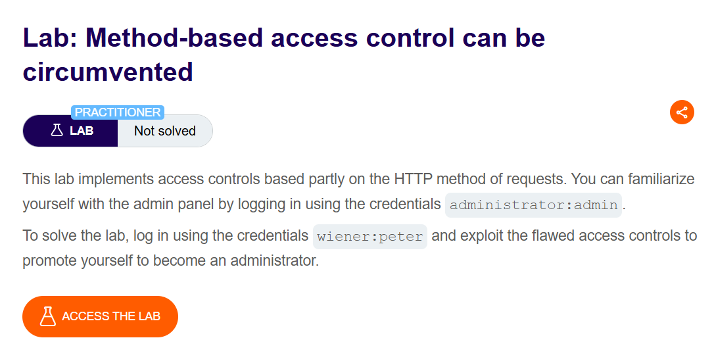

Gửi gói tin upgrade tài khoản carlos đến Repeater:

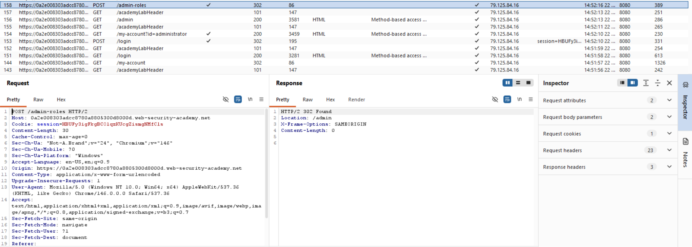

Thay đổi session request upgrade tài khoản carlos thành session của phiên đăng nhập wiener:

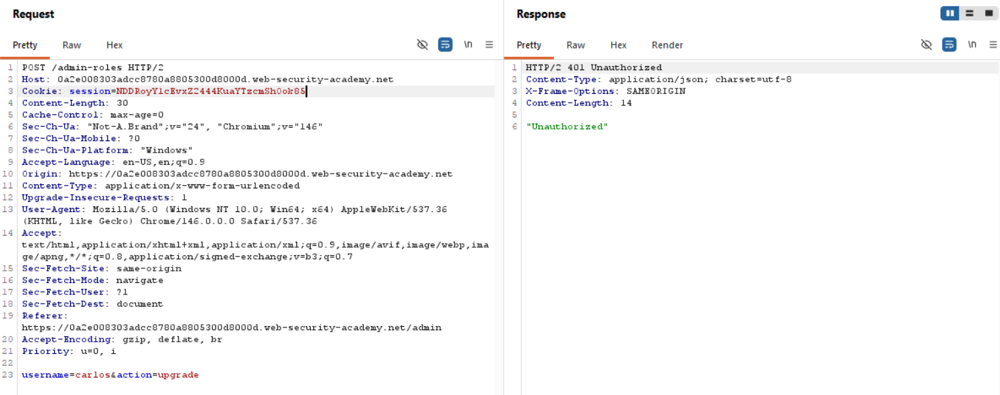

Tiến hành đổi phương thức sang GET và đổi username từ carlos sang wiener:

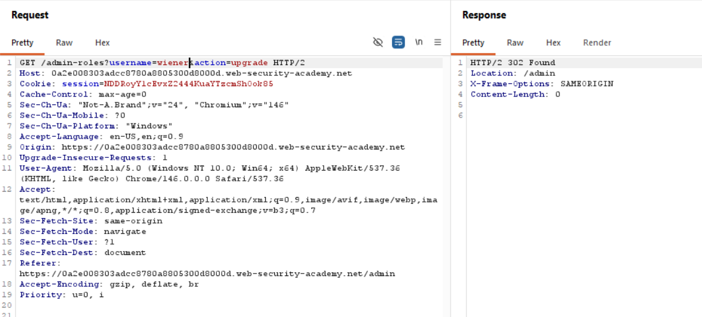
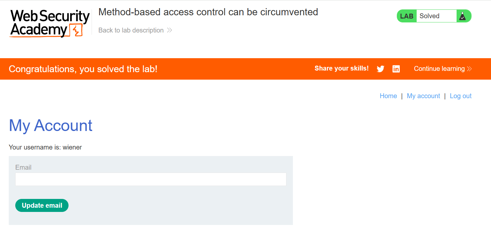

#### Lỗ hổng kiểm soát truy cập phát sinh từ sự sai lệch khi đối sánh URL

Xảy ra do sự bất đồng bộ trong cơ chế parse/match URL giữa lớp bảo vệ (WAF, Proxy, Front-end Filter) và Backend. Lớp bảo vệ áp dụng quy tắc cứng nhắc, trong khi Backend lại dễ dãi, tạo ra khe hở cho phép Attacker bypass các luật Access Control.

**Các kỹ thuật khai thác:**

- **Thao túng chữ hoa/thường:**
  - Bộ lọc phân biệt chữ hoa/thường nên chỉ chặn đúng giá trị được định nghĩa, nhưng Backend xử lý không phân biệt.
  - Trạng thái bảo vệ: `DENY /admin/deleteUser`
  - Payload bypass: `GET /ADMIN/DELETEUSER`
- **Bổ sung Suffix:**
  - Khai thác tính năng `useSuffixPatternMatch` của Spring. Tính năng này tự động cắt bỏ đuôi mở rộng trước khi điều hướng tới endpoint. Cấu hình bảo mật vòng ngoài không nhận diện được URL có gắn đuôi.
  - Trạng thái bảo vệ: `DENY /admin/deleteUser`
  - Payload bypass: `GET /admin/deleteUser.json` (hoặc `.anything`, `.xml`...)
- **Dấu gạch chéo cuối:**
  - Lớp bảo vệ xử lý nghiêm ngặt, coi `/path` và `/path/` là hai endpoint hoàn toàn khác biệt. Tuy nhiên, Backend framework lại tự động chuẩn hóa và gộp chung chúng thành một chức năng.
  - Trạng thái bảo vệ: `DENY /admin/deleteUser`
  - Payload Bypass: `GET /admin/deleteUser/`

### Leo thang đặc quyền theo chiều ngang

Leo thang đặc quyền theo chiều ngang xảy ra nếu một người dùng có thể giành quyền truy cập vào các tài nguyên thuộc về một người dùng khác, thay vì chỉ được truy cập vào tài nguyên của chính họ.

Các cuộc tấn công leo thang đặc quyền theo chiều ngang có thể sử dụng các phương pháp khai thác tương tự như leo thang đặc quyền theo chiều dọc. Ví dụ, một người dùng có thể truy cập vào trang tài khoản cá nhân của họ bằng URL sau:

`https://insecure-website.com/myaccount?id=123`

Nếu kẻ tấn công thay đổi giá trị của tham số `id` thành ID của một người dùng khác, chúng có thể chiếm quyền truy cập vào trang tài khoản của người đó, cùng với tất cả dữ liệu và chức năng liên quan.

**Lab 7: User ID controlled by request parameter**

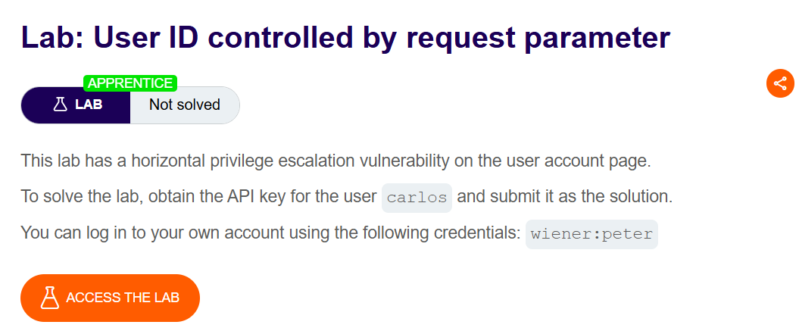

Bắt gói tin đăng nhập của user `wiener` và gửi đến Repeater:

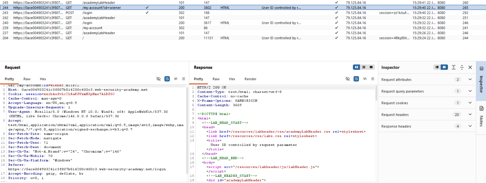

Thay đổi `id` thành `carlos` và gửi lại, ta thu được API key của người dùng `carlos`:

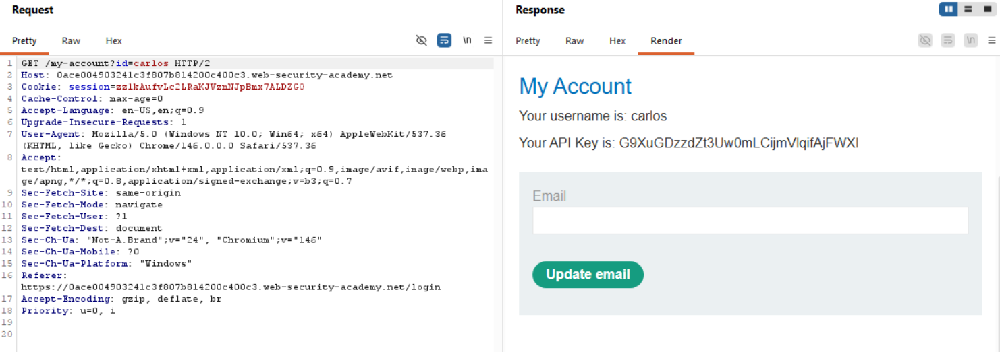

Submit API key ta sẽ solve được bài lab:

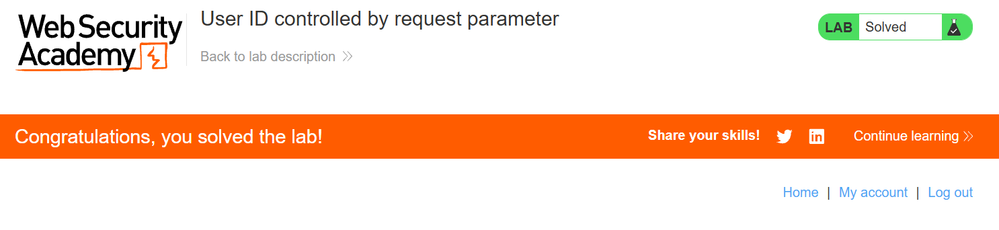

Trong một số ứng dụng, tham số có thể bị khai thác không có giá trị dễ đoán. Ví dụ, thay vì một số tăng dần, ứng dụng có thể sử dụng GUID để định danh người dùng. Điều này có thể ngăn kẻ tấn công đoán hoặc dự đoán định danh của một người dùng khác. Tuy nhiên, các GUID thuộc về người dùng khác vẫn có thể bị lộ ở những vị trí khác trong ứng dụng nơi người dùng được tham chiếu, chẳng hạn như trong tin nhắn hoặc phần đánh giá.

**Lab 8: User ID controlled by request parameter, with unpredictable user IDs**

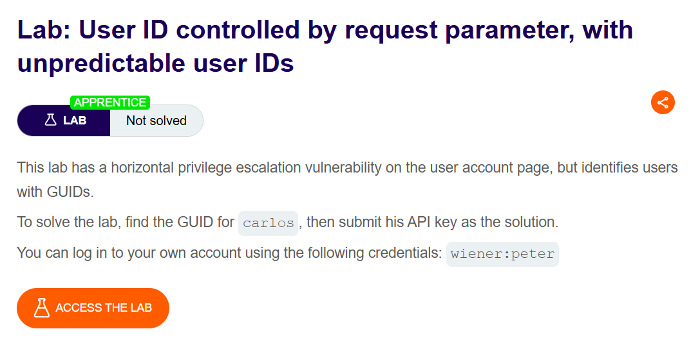

Tìm bài đăng bởi `carlos`, xem response ta thấy `id` của người dùng `carlos`:

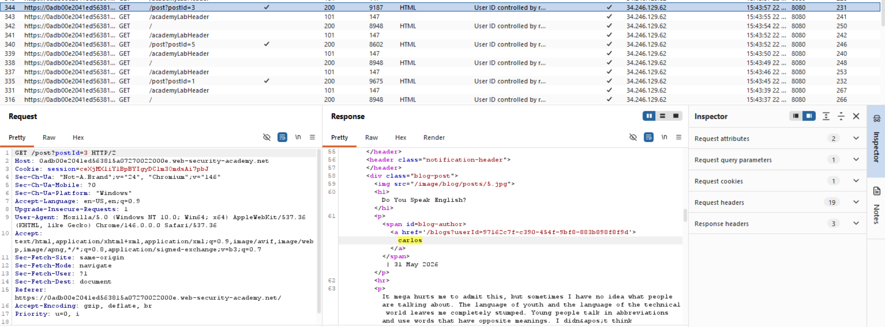

Sao chép `id` đó và gửi request login đến Repeater. Thay `id` của `wiener` thành `id` của `carlos`, ta thu được API key của `carlos`:

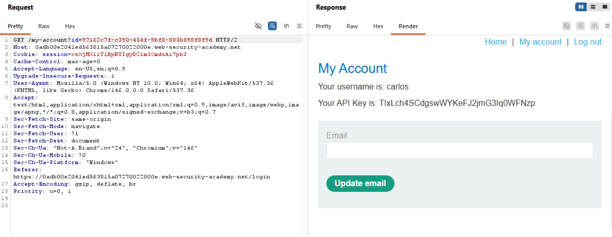

Submit API key ta sẽ solve được bài lab:

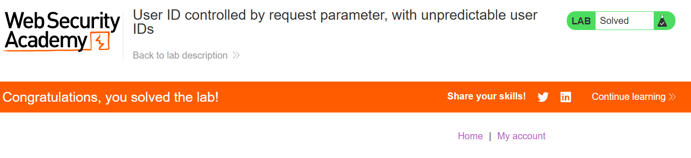

Trong một số trường hợp, ứng dụng thực sự phát hiện ra người dùng không có quyền truy cập tài nguyên và trả về một phản hồi điều hướng (redirect) về trang đăng nhập. Tuy nhiên, phản hồi chứa lệnh điều hướng đó vẫn có thể đính kèm một số dữ liệu nhạy cảm thuộc về người dùng mục tiêu, do đó cuộc tấn công vẫn diễn ra thành công.

**Lab 9: User ID controlled by request parameter with data leakage in redirect**

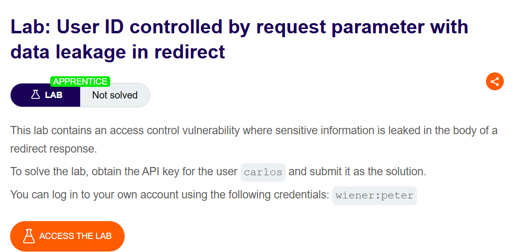

Thay đổi `id` từ `wiener` thành `carlos` ta thu được API key của `carlos`:

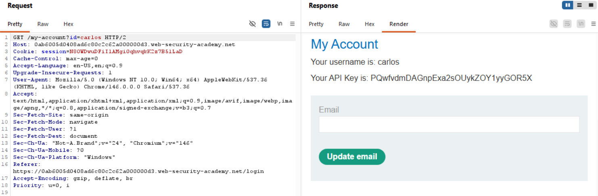

Submit API key của `carlos`, ta sẽ solve được bài lab:

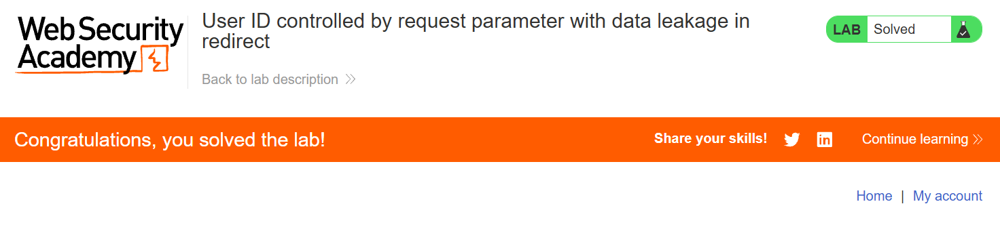

### Leo thang đặc quyền từ hàng ngang sang hàng dọc

**Mối liên hệ giữa hai loại leo thang:** Kẻ tấn công có thể lợi dụng lỗ hổng leo thang đặc quyền hàng ngang (truy cập tài khoản cùng cấp) để biến nó thành leo thang đặc quyền hàng dọc (truy cập tài khoản cấp cao hơn).

**Cách thức thực hiện:** Sử dụng kỹ thuật thao túng tham số để truy cập trái phép vào tài khoản của người khác. Nếu tài khoản mục tiêu bị thao túng vô tình (hoặc cố ý) thuộc về một quản trị viên, cuộc tấn công sẽ chuyển từ hàng ngang sang hàng dọc.

**Hậu quả:** Khi chiếm được trang tài khoản của admin, kẻ tấn công có thể biết được mật khẩu, đổi mật khẩu của admin, hoặc trực tiếp sử dụng các chức năng quản trị cấp cao của hệ thống.

**Lab 10: User ID controlled by request parameter with password disclosure**

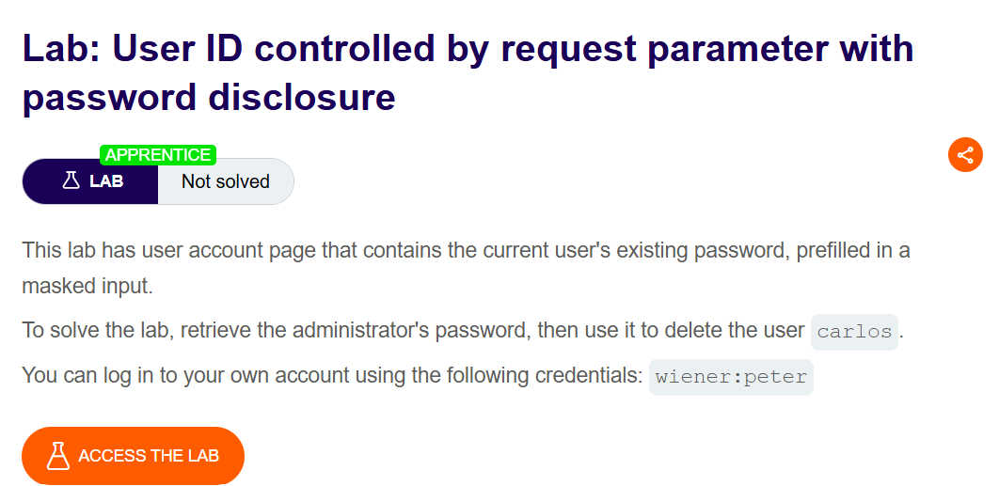

Bắt gói tin đăng nhập bằng tài khoản `wiener` và gửi tới Repeater:

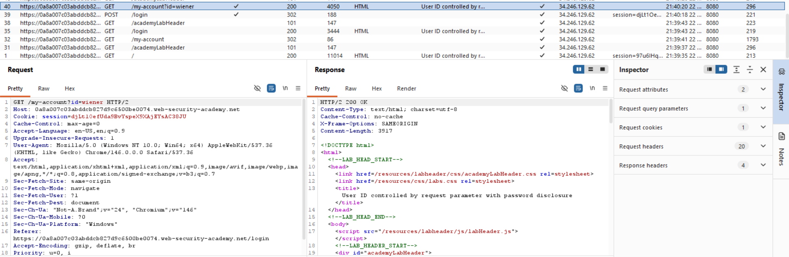

Đổi tham số `id` thành `administrator`:

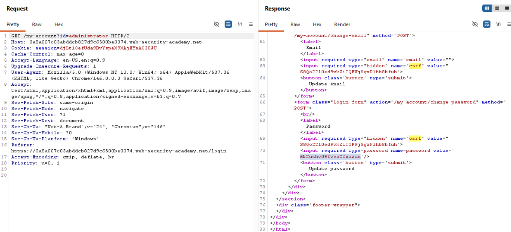

Quan sát trong response ta lấy được mật khẩu của tài khoản `administrator`, tiến hành đăng nhập và xóa người dùng `carlos`:

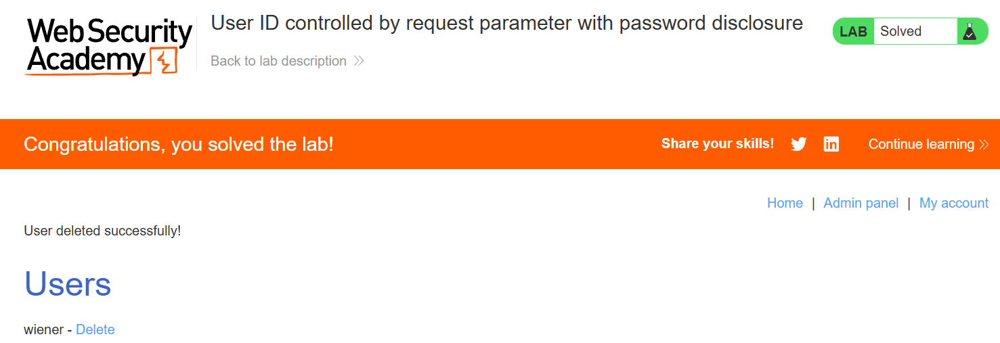

### Lỗ hổng tham chiếu đối tượng trực tiếp không an toàn

Là một dạng lỗ hổng thuộc nhóm Kiểm soát truy cập.

**Nguyên nhân phát sinh:** Xảy ra khi hệ thống cho phép người dùng nhập dữ liệu để truy cập trực tiếp vào các đối tượng hệ thống, nhưng lại thiếu bước kiểm tra quyền hạn. Kẻ tấn công chỉ cần thay đổi/sửa đổi dữ liệu đầu vào này là có thể xem hoặc can thiệp vào dữ liệu của người khác.

**Tầm ảnh hưởng:** Từng là một lỗ hổng kinh điển (được xếp vào OWASP Top 10 năm 2007) và là minh chứng điển hình cho việc sai sót trong lập trình dẫn đến việc các hàng rào bảo mật bị vô hiệu hóa hoàn toàn.

**Truy cập tệp tĩnh**: Hệ thống lưu file nhạy cảm (như lịch sử chat, hóa đơn) theo quy luật tăng dần (như 12144.txt). Đổi tên file => đọc trộm được file của người khác.

**Lab 11: Insecure direct object references**

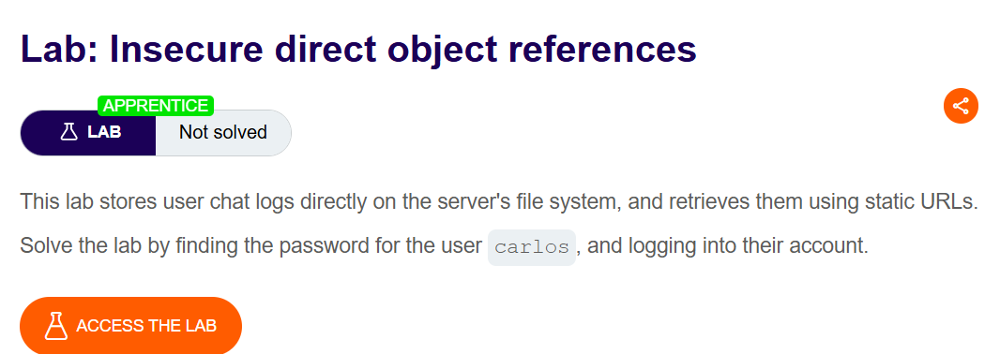

Bắt gói tin thao tác `view transcript`:

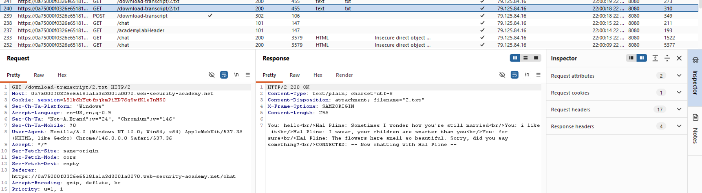

Gửi tới Repeater và thực hiện thay đổi đường dẫn tên file thành tên khác:

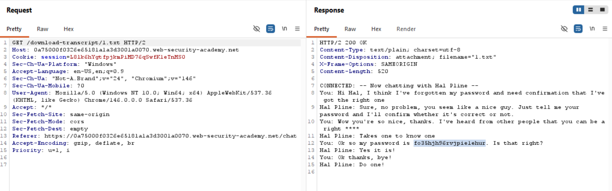

Trích xuất mật khẩu thành công, thực hiện đăng nhập để giải quyết bài lab:

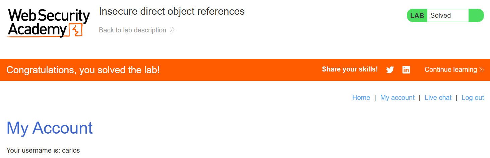

### Lỗ hổng kiểm soát truy cập trong các quy trình nhiều bước

**Bối cảnh:** Các chức năng phức tạp (như đổi thông tin, thanh toán, quản trị) thường được chia làm nhiều bước liên tiếp (Nhập -> Gửi -> Xác nhận).

**Sai lầm mang tính giả định:** Nhà phát triển hệ thống thường chỉ đặt rào cản bảo mật ở các bước đầu (bước 1, 2) và chủ quan thả lỏng ở bước cuối (bước 3), vì nghĩ rằng "phải qua được bước 1, 2 thì mới tới được bước 3".

**Cách thức khai thác:** Kẻ tấn công sẽ bỏ qua hoàn toàn các bước đầu tiên đã được bảo vệ. Chúng chế tạo một request gửi thẳng đến bước cuối cùng kèm theo các tham số cần thiết để thực thi lệnh trái phép mà không bị chặn.

**Lab 12: Multi-step process with no access control on one step**

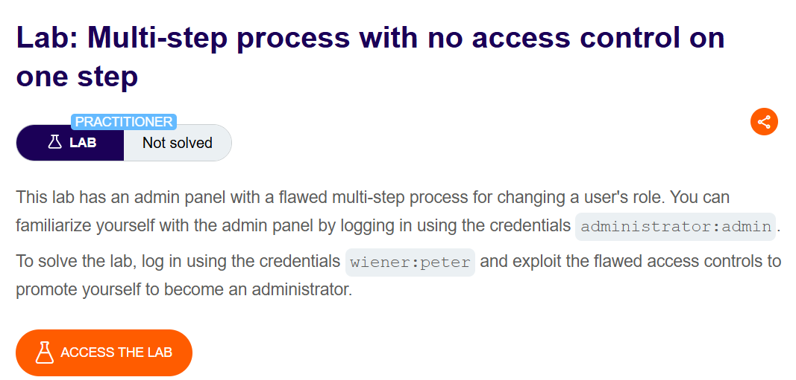

Đăng nhập vào tài khoản `administrator`, tiến hành upgrade tài khoản `carlos` và bắt gói tin đó:

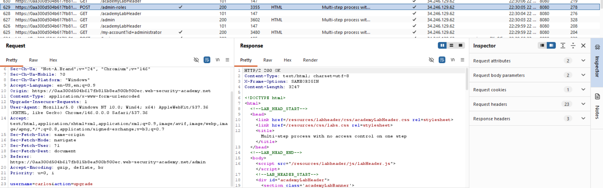

Gửi gói tin sang Repeater, thực hiện thay đổi `session` của `carlos` thành `session` của `wiener` và tham số `username=carlos` thành `wiener`:

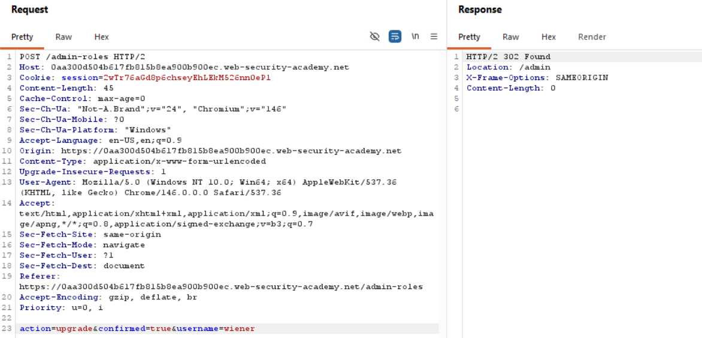

Gửi gói tin này, ta thấy phản hồi `302 Found` => Thành công upgrade tài khoản `wiener` lên quyền `ADMIN`:

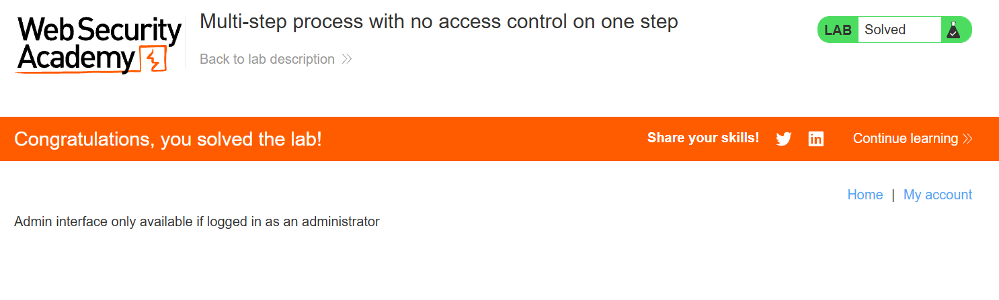

### Kiểm soát truy cập dựa trên tiêu đề Referer

**Bản chất của lỗ hổng:** Sử dụng tiêu đề `Referer` trong HTTP request làm thước đo để xác thực quyền truy cập của người dùng.

**Sai lầm trong triển khai:** Hệ thống chỉ bảo vệ nghiêm ngặt trang cấu hình chính (ví dụ: `/admin`), nhưng các tính năng con (ví dụ: xóa người dùng `/admin/deleteUser`) thì lại kiểm tra một cách hời hợt bằng cách xem "yêu cầu này có phải được bấm từ trang `/admin` sang hay không" thông qua header `Referer`.

**Cách thức khai thác:** Vì các tiêu đề HTTP (HTTP Headers) phía máy khách hoàn toàn có thể bị can thiệp và sửa đổi, kẻ tấn công chỉ cần tự tạo một yêu cầu đến thẳng trang con nhạy cảm và thêm thủ công/giả mạo dòng `Referer: https://insecure-website.com/admin` để đánh lừa hệ thống và thực thi lệnh trái phép.

**Lab 13: Referer-based access control**

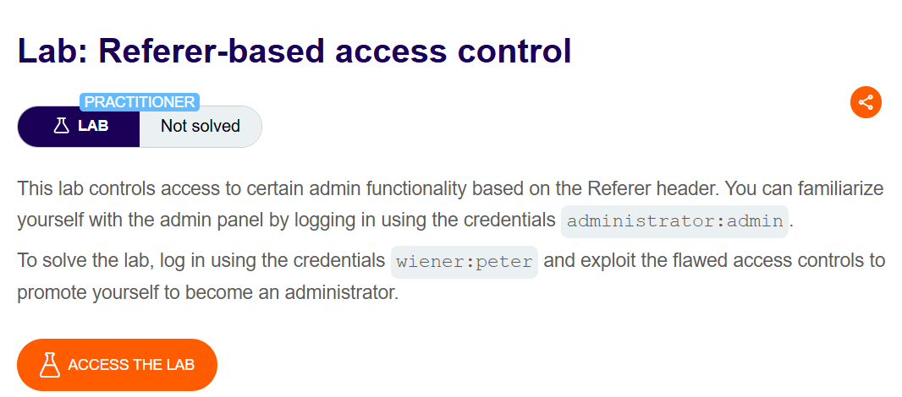

Đăng nhập vào tài khoản `administrator`, tiến hành upgrade `carlos`, tiến hành bắt gói tin này trên Burp Suite:

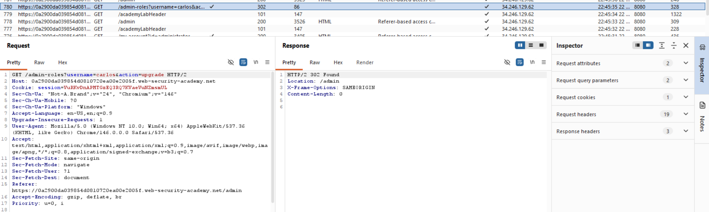

Đăng nhập vào tài khoản `wiener`, thực hiện việc gửi gói tin vừa bắt tới Repeater, tiến hành đổi `session` thành của `wiener`, và `username` là `wiener`:

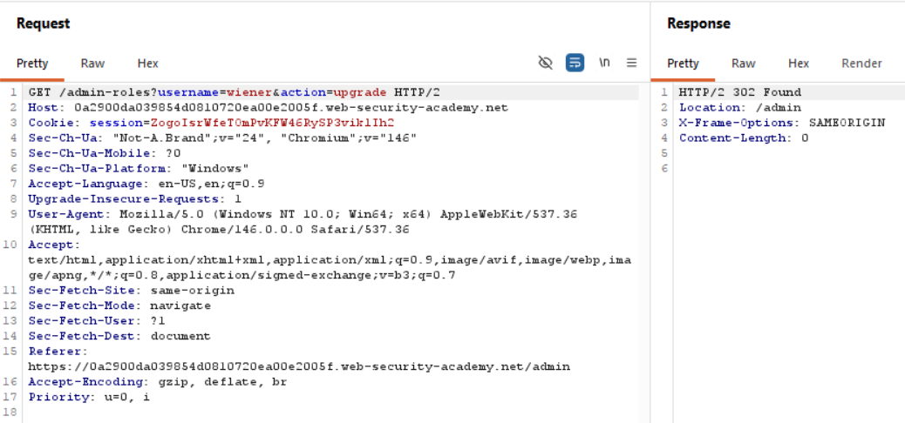

Request được gửi nhận được kết quả `302 Found` (hoặc `Found`), tức là đã upgrade thành công. Quay lại trang chủ thấy bài lab đã được giải quyết:

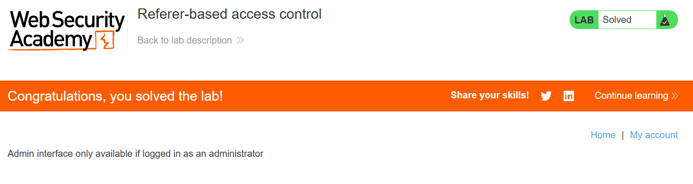
