# Access Control Vulnerabilities and Privilege Escalation

## Kiểm soát truy cập là gì?

Kiểm soát truy cập (Access Control) là việc đặt ra giới hạn để quyết định ai hoặc cái gì được phép truy cập tài nguyên hay thực hiện hành động nào đó.

Để ứng dụng web an toàn, phải kết hợp 3 yếu tố:

- **Xác thực (Authentication):** Trả lời câu hỏi "Bạn là ai?"
- **Quản lý phiên (Session Management):** Nhận diện "Có đúng bạn đang tiếp tục thao tác không?"
- **Kiểm soát truy cập (Access Control):** Quyết định "Bạn có được phép làm việc này không?"

**Rủi ro và độ phức tạp:**

- **Mối nguy hiểm:** "Lỗi kiểm soát truy cập" là một trong những lỗ hổng bảo mật web phổ biến và nghiêm trọng nhất hiện nay.
- **Tại sao hay lỗi?** Vì cơ chế này do con người thiết kế và quyết định, nên rất dễ xảy ra sai sót hoặc thiết kế có kẽ hở về logic.

---

## Các mô hình bảo mật điều khiển truy cập

**Khái niệm:** Là bộ quy tắc kiểm soát quyền truy cập, độc lập với nền tảng công nghệ và được tích hợp vào hệ thống.

### 4 mô hình cốt lõi:

#### 1. Kiểm soát theo chương trình (Programmatic Access Control)

- Lưu trữ quyền dưới dạng ma trận đặc quyền (Database).
- Việc kiểm soát được thực hiện bằng cách lập trình (code) dựa trên ma trận này.
- **Đặc điểm:** Chi tiết và cực kỳ linh hoạt.

#### 2. DAC - Kiểm soát tùy chọn (Discretionary Access Control)

- Quyền quyết định thuộc về **chủ sở hữu**.
- Chủ sở hữu tài nguyên có quyền tự do cấp hoặc ủy thác quyền truy cập tài nguyên đó cho người khác.
- **Đặc điểm:** Chi tiết nhưng dễ trở nên phức tạp và khó quản lý khi hệ thống lớn.

#### 3. MAC - Kiểm soát bắt buộc (Mandatory Access Control)

- Quản lý tập trung, **cấm ủy quyền**.
- Hệ thống kiểm soát mọi thứ. Người dùng hay chủ sở hữu không thể thay đổi hoặc tự ý cấp quyền cho người dùng khác.
- **Đặc điểm:** Tính bảo mật rất cao, thường được dùng trong các hệ thống quân đội, chính phủ.

#### 4. RBAC - Kiểm soát dựa trên vai trò (Role-Based Access Control)

- Cấp quyền theo **vai trò**.
- Quyền được gán cho các vai trò (nhóm), sau đó người dùng được gán vào các vai trò đó.
- **Đặc điểm:** Dễ quản lý, đặc biệt khi có sự thay đổi nhân sự (chỉ cần đổi/xóa role). Cần thiết kế số lượng vai trò vừa đủ để tránh dư thừa.

---

## Các loại kiểm soát truy cập

### 1. Kiểm soát truy cập theo chiều dọc (Vertical Access Control)

- Là việc phân quyền dựa trên cấp bậc hoặc chức vụ của người dùng (VD: Admin vs Normal User).
- **Mục đích:** Ngăn chặn người dùng ở cấp thấp truy cập vào các chức năng nhạy cảm dành riêng cho người dùng ở cấp cao hơn.
- **Hai nguyên tắc bảo mật:**
  - _Đặc quyền tối thiểu (Least Privilege):_ Chỉ cấp quyền hạn thấp nhất, vừa đủ để thực hiện công việc.
  - _Phân chia nhiệm vụ (Separation of Duties):_ Chia nhỏ một quy trình quan trọng cho nhiều người/vai trò khác nhau thực hiện, tránh việc 1 người duy nhất nắm toàn quyền thao tác.

### 2. Kiểm soát truy cập theo chiều ngang (Horizontal Access Control)

- Là việc phân quyền để đảm bảo người dùng chỉ được phép truy cập vào dữ liệu thuộc sở hữu của chính họ, dù họ cùng cấp hay vai trò trong hệ thống.
- **Mục đích:** Ngăn chặn người dùng xâm phạm vào dữ liệu của người dùng khác ở cùng cấp độ.
- **Ví dụ:** A và B đều là tài khoản User bình thường, nhưng A chỉ xem được trang cá nhân/tin nhắn của A, B chỉ xem được của B.
- **Rủi ro bảo mật đặc trưng:** Nếu kiểm soát truy cập theo chiều ngang bị lỗi, nó sẽ dẫn đến lỗ hổng dạng **IDOR (Insecure Direct Object Reference)**.

### 3. Kiểm soát truy cập phụ thuộc ngữ cảnh (Context-Dependent Access Control)

- Là cơ chế cấp hoặc từ chối quyền truy cập dựa trên ngữ cảnh, tình huống và trạng thái hiện tại (VD: vị trí, thời gian đăng nhập, tiến trình hiện hành).

## Ví dụ về Broken access control

Lỗ hổng kiểm soát truy cập xảy ra khi một người dùng có thể truy cập vào các tài nguyên hoặc thực hiện các hành động mà lẽ ra họ không được phép.

### Leo thang đặc quyền theo chiều dọc

Nếu một người dùng có thể giành quyền truy cập vào các chức năng mà họ không được phép truy cập, thì đây là leo thang đặc quyền theo chiều dọc.

#### Chức năng không được bảo vệ

Về cơ bản nhất, leo thang đặc quyền theo chiều dọc phát sinh khi một ứng dụng không thực thi bất kỳ biện pháp bảo vệ nào đối với các chức năng nhạy cảm.

**Lab 1: Unprotected admin functionality**

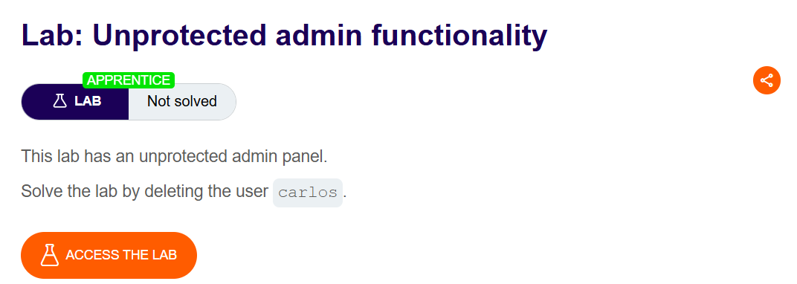

Truy cập trên URL:

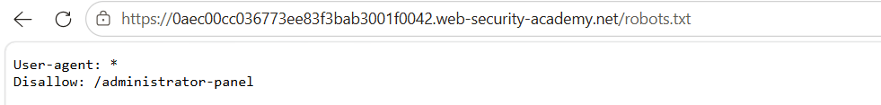

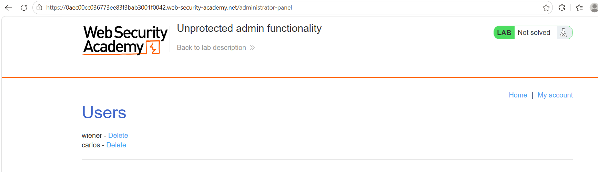

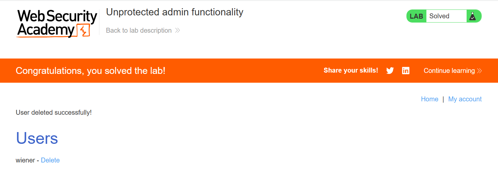

Trong một số trường hợp, các chức năng nhạy cảm được thiết kế ẩn đi bằng cách sử dụng một URL khó đoán. Tuy nhiên, việc chỉ che giấu giao diện không tạo ra cơ chế kiểm soát truy cập hiệu quả vì kẻ tấn công vẫn có thể khám phá ra URL đó.

**Lab 2: Unprotected admin functionality with unpredictable URL**

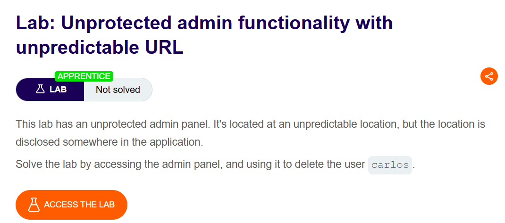

Bắt một gói tin tại trang chủ (hoặc dùng tính năng View Page Source) và kiểm tra phần response trả về:

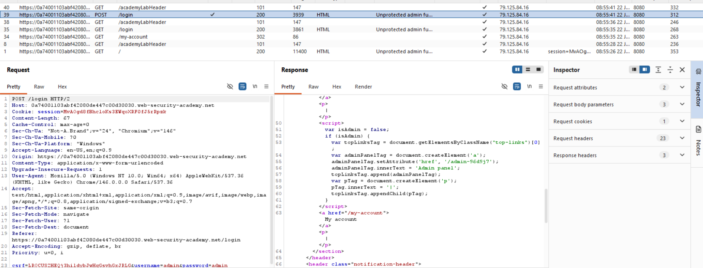

Ta thấy trong mã nguồn có chứa sự kiện thiết lập đường dẫn đến trang quản trị: `adminPanelTag.setAttribute('href', '/admin-96d9j7');`

Lấy endpoint này và truy cập trực tiếp thông qua thanh URL. Kết quả là hệ thống đã cho phép truy cập thành công vào bảng điều khiển (Admin Panel):

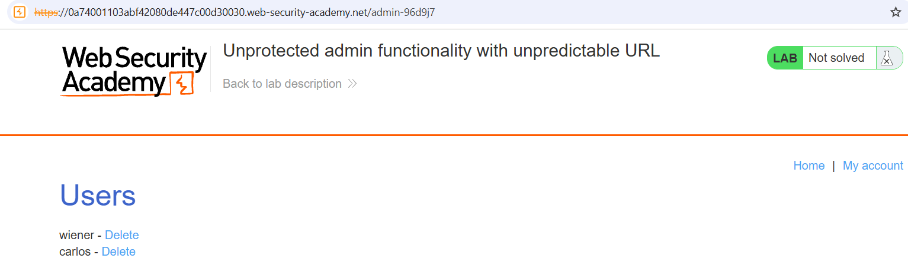

Cuối cùng, tiến hành xóa người dùng `carlos` để hoàn thành bài lab:

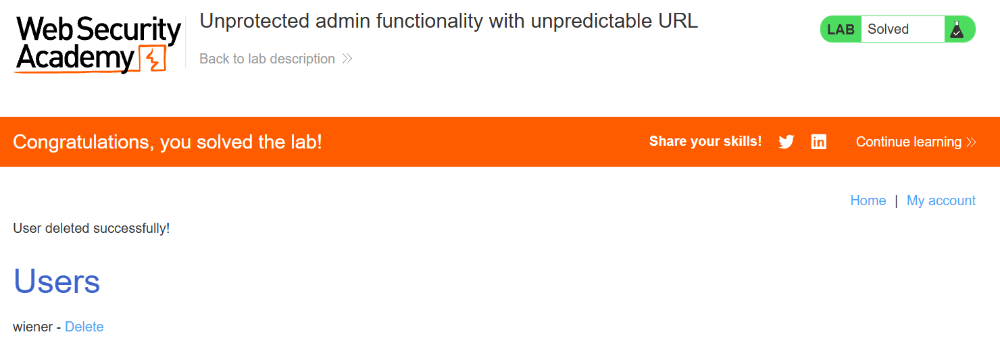

#### Các phương pháp kiểm soát truy cập dựa trên tham số

Một số ứng dụng xác định quyền truy cập hoặc vai trò của người dùng tại thời điểm đăng nhập, và sau đó lưu trữ thông tin này ở một vị trí người dùng có thể kiểm soát được. Ví dụ:

- Một trường ẩn
- Một cookie
- Một tham số chuỗi truy vấn được thiết lập sẵn

**Lab 3: User role controlled by request parameter**

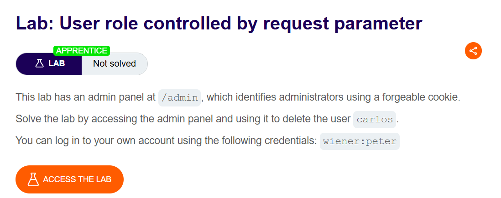

Thử nhập trực tiếp endpoint `/admin` trên thanh URL:

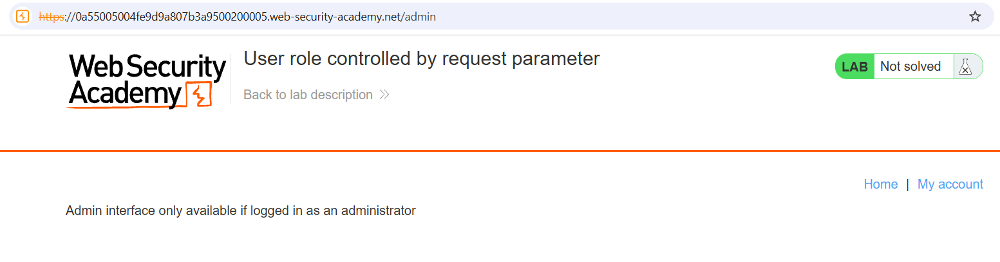

Hệ thống sẽ từ chối do ta chỉ đang ở quyền người dùng bình thường. Tiến hành đăng nhập bằng tài khoản cho trước, bắt gói tin (request) của phiên làm việc đó và gửi qua công cụ Repeater của Burp Suite:

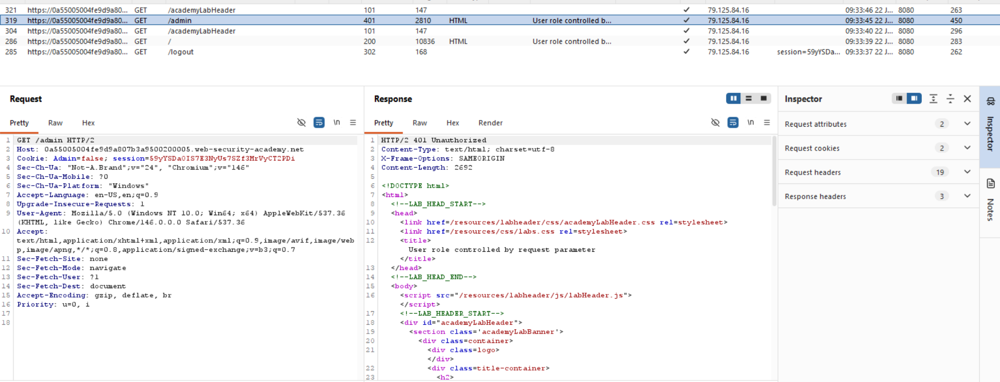

Ta phát hiện ứng dụng quản lý vai trò thông qua một giá trị cookie/tham số. Thực hiện sửa giá trị `Admin=false` thành `Admin=true` trong request:

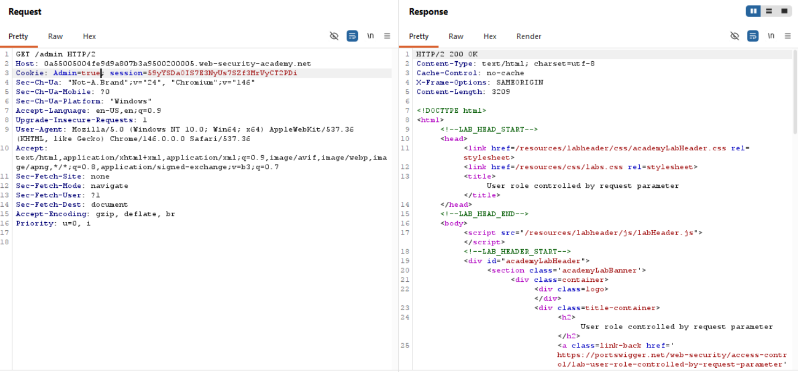

Thực hiện gửi request đã sửa này (hoặc hiển thị request này trên trình duyệt `Show response in browser`), giao diện trang quản trị sẽ được mở ra. Cuối cùng, tiến hành xóa người dùng `carlos` để giải quyết xong bài lab:

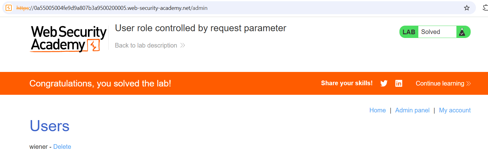

**Lab 4: User role can be modified in user profile**

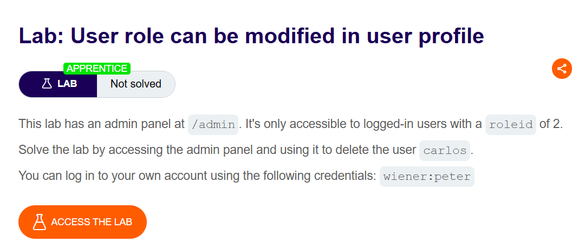

Đăng nhập vào tài khoản được cấp và tiến hành cập nhật email cho user `wiener`:

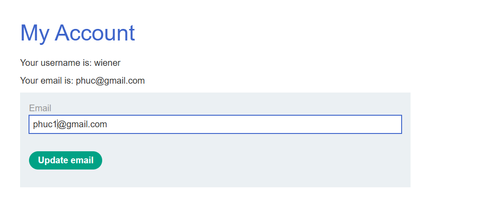

Sử dụng Burp Suite để bắt gói tin thực hiện chức năng đổi email này, sau đó gửi gói tin sang công cụ Repeater:

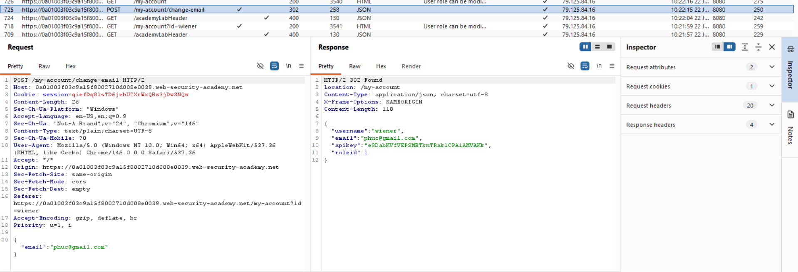

Quan sát đối tượng JSON được gửi trong phần body của request, thử can thiệp vào chức năng cập nhật profile bằng cách bổ sung thêm trường `"roleid": 2` để nâng quyền cho user `wiener` (thường role ID của admin là 2):

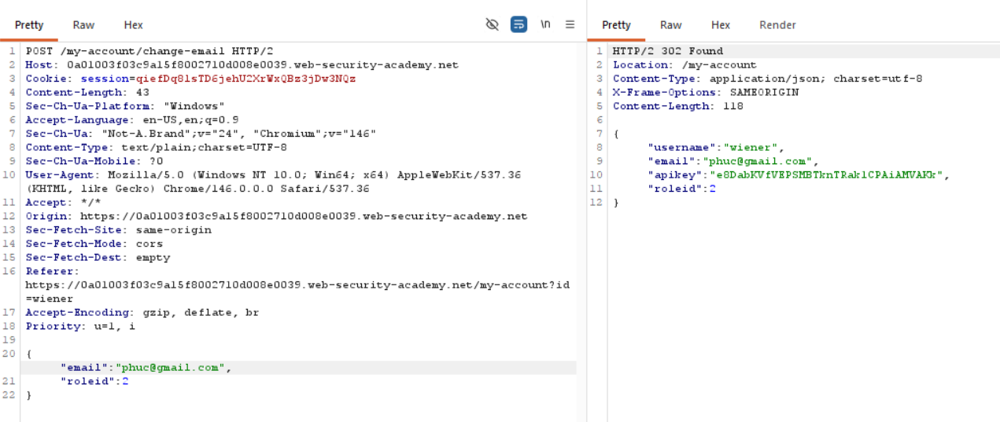

Sau khi response trả về cho thấy việc đổi quyền thành công, ta quay lại trình duyệt, truy cập trực tiếp vào bảng điều khiển qua endpoint `/admin` và tiến hành xóa người dùng `carlos` để hoàn thành bài lab:

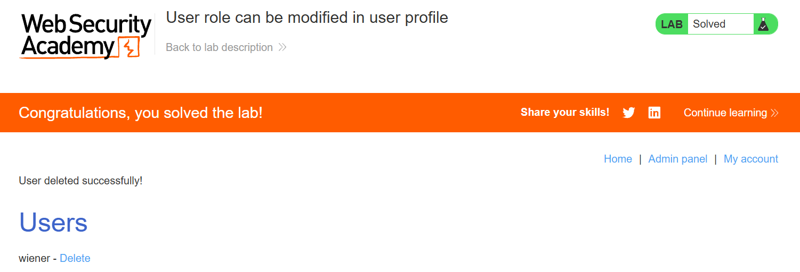

#### Lỗ hổng kiểm soát truy cập phát sinh từ việc cấu hình sai nền tảng

Một số ứng dụng thực thi các biện pháp kiểm soát truy cập ở tầng nền tảng. Chúng thực hiện điều này bằng cách hạn chế quyền truy cập vào các URL và các phương thức HTTP cụ thể dựa trên vai trò của người dùng.

Ví dụ: `DENY: POST, /admin/deleteUser, managers`
Quy tắc này từ chối quyền truy cập vào phương thức POST trên đường dẫn `/admin/deleteUser` đối với những người dùng thuộc nhóm quản lý (managers).

**Lab 5: URL-based access control can be circumvented**

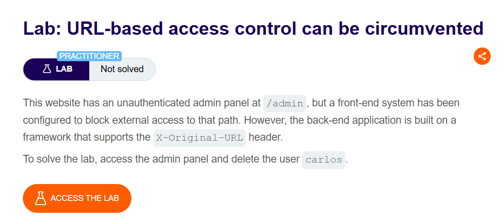

Sử dụng Burp Suite để bắt một gói tin bất kỳ (như request lên trang chủ) và gửi tới công cụ Repeater:

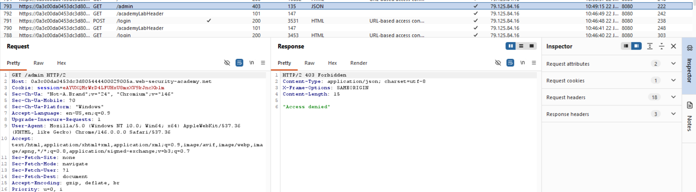

Một số backend framework cho phép ghi đè đường dẫn URL bằng các HTTP header không tiêu chuẩn. Ta thử bổ sung header `X-Original-URL: /admin` vào request và gửi đi để xem ứng dụng có chặn truy cập hay không:

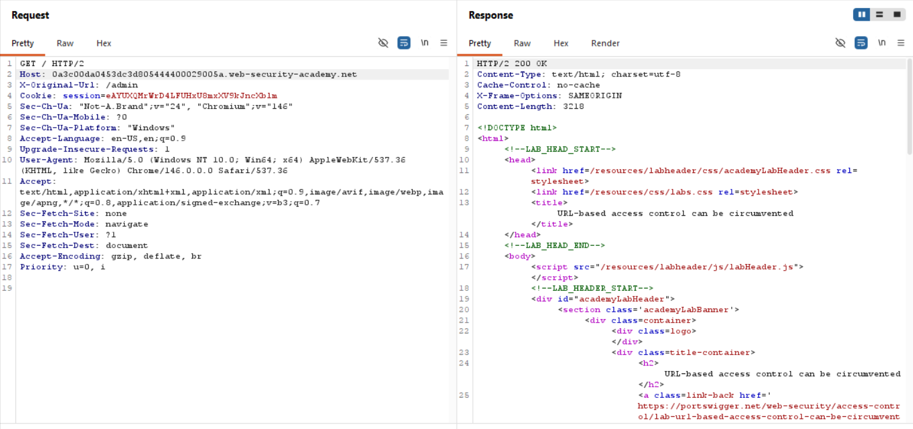

Ứng dụng phản hồi với mã `200 OK`. Ta hiển thị request ứng với response này trên trình duyệt (`Show response in browser`), giao diện trang quản trị sẽ hiển thị:

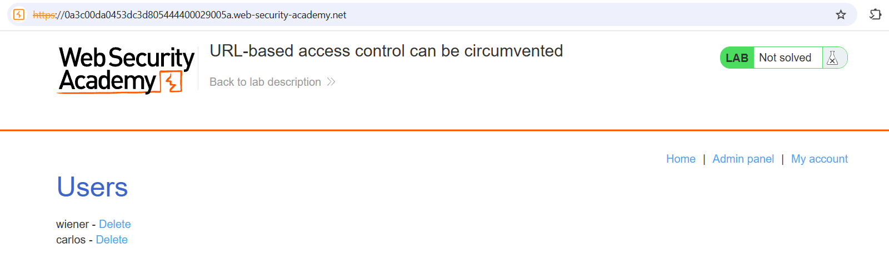

Kiểm tra chức năng xóa người dùng `carlos`, ta thấy đường dẫn là `/admin/delete?username=carlos`. Để thực hiện hành động này mà không bị chặn, ta cập nhật lại request trong Repeater. Đổi query trực tiếp trên request line thành `/?username=carlos` (hoặc tham số tương ứng trên URL chính) và sửa lại header thành `X-Original-URL: /admin/delete`:

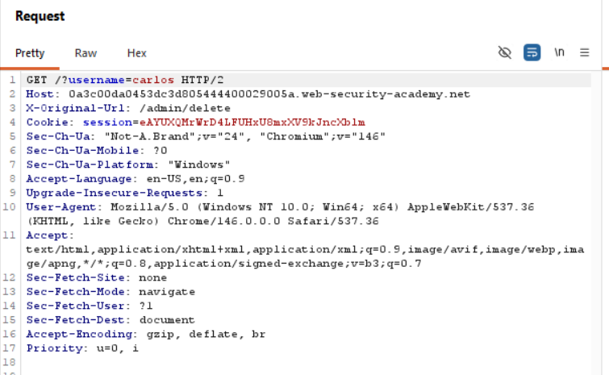

Sau khi gửi request, tài khoản `carlos` bị xóa thành công. Quay lại phiên duyệt web để kiểm tra, bài lab đã được solve:

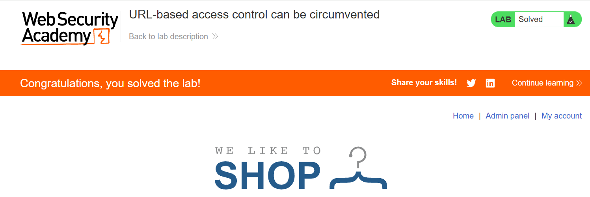

#### Tìm hiểu về header X-Original-URL

Trong các hệ thống web hiện đại, ứng dụng thường được chia thành nhiều lớp.

- **Mục đích:** Các header như `X-Original-URL` hoặc `X-Rewrite-URL` được thiết kế cho các hệ thống Proxy hoặc Load Balancer. Khi proxy viết lại một URL để gửi cho Back-end, nó dùng header này để "nhắc" Back-end nhớ rằng: "URL ban đầu mà người dùng thực sự gõ vào trình duyệt là gì".
- **Bản chất lỗ hổng:** Một số framework Back-end có tính năng tự động ưu tiên lấy giá trị trong `X-Original-URL` để làm căn cứ định tuyến thay vì lấy URL trên dòng yêu cầu (Request Line) thực tế.

**Cách bypass:**

- Cơ chế bảo mật (như Front-end/WAF) thường chỉ kiểm tra dòng Request Line. Thấy `/` là trang chủ, nó cho phép đi qua.
- Kẻ tấn công lén nhét thêm `X-Original-URL: /admin/delete` vào HTTP Header.
- Khi gói tin lọt được vào Back-end, framework Back-end đọc header `X-Original-URL` và tự động ghi đè đường dẫn, điều hướng luồng xử lý tới chức năng `/admin/delete` mà không hề kiểm tra lại quyền truy cập.
