# Authentication vulnerabilities

Authentication là quá trình kiểm tra và xác minh danh tính của người dùng hoặc máy khách

Có 3 loại yếu tố xác thực chính:

- Thứ bạn biết (VD: password, mã PIN,...): là yếu tố kiến thức
- Thứ bạn sở hữu (VD: mobile phone, thẻ bảo mật): là yếu tố sở hữu
- Thứ thuộc về bạn hoặc hành vi (VD: Vân tay, khuôn mặt,...): yếu tố sinh trắc học

## Sự khác biệt giữa Authentication và Authorization

Authentication: Kiểm tra xem người dùng có đúng là người họ khai báo hay không

Authorization: Kiểm tra xem người dùng đó được phép làm gì sau khi đã đăng nhập.

Ví dụ:

- Đăng nhập bằng tài khoản Carlos123 → Authentication
- Sau khi đăng nhập, được xem dữ liệu nào hoặc thực hiện hành động gì → Authorization

## Các lỗ hổng xác thực phát sinh như thế nào?

Lỗ hổng xác thực xuất hiện do:

- Xác thực yếu:
  - Dễ bị brute-force
  - Mật khẩu yếu
  - Không giới hạn đăng nhập sai
- Xác thực bị lỗi:
  - Lỗi logic
  - Lỗi code
  - Có thể bypass đằn nhập

## Tác động của các lỗ hổng xác thực là gì?

Nếu Authentication bị phá vỡ, kẻ tấn công có thể chiếm tài khoản người khác

Nếu chiếm tài khoản user:

- Xem dữ liệu riêng tư
- Truy cập các trang nội bộ
- Mở rộng phạm vi tấn công

Nếu chiếm tài khoản admin:

- Kiểm soát toàn bộ ứng dụng
- Thay đổi hoặc xóa dữ liệu
- Có thể truy cập hạ tầng nội bộ

## Lỗ hổng trong cơ chế đăng nhập bằng mật khẩu

Password-Based Login hoạt động dựa trên: Username + Password

Website tin rằng: Ai biết đúng mật khẩu thì chính là chủ tài khoản

Website sẽ bị compromise nếu attacker:

- Lấy được mật khẩu.
- Đoán được mật khẩu.

### Lab 1: Username enumeration via different responses

Bắt gói tin đăng nhập và gửi tới Burp Intruder thực hiện bruteforce để tìm tài khoản và mật khẩu

Chèn payload vào username

Tìm được username

Làm tương tự tìm mật khẩu

Đăng nhập và solve bài lab

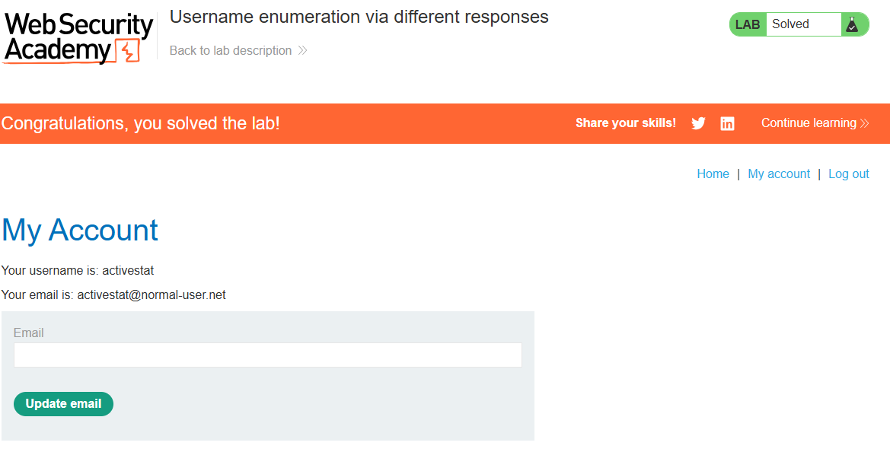

### Lab 2: Username enumeration via subtly different responses

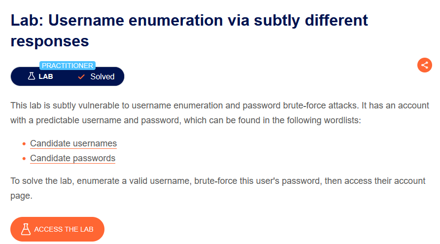

Bắt gói tin đăng nhập và chèn payload vào vị trí username

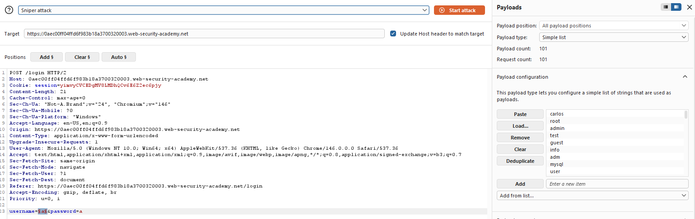

Thêm điều kiện grep-match

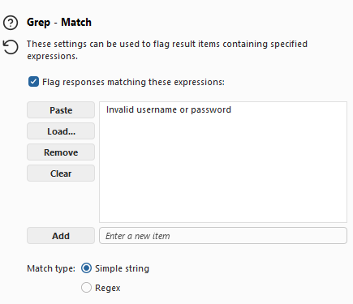

Ta tìm được username không bị lỗi `Invalid username or password.`

Làm tương tự với cách tìm mật khẩu, tìm được mật khẩu đúng với status code khác với các mật khẩu còn lại

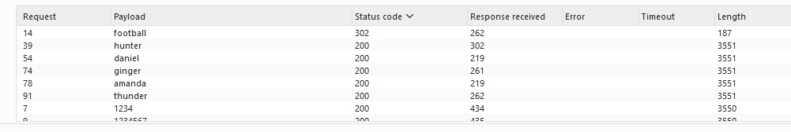

Tiến hành đăng nhập và solve bài lab

### Lab 3: Username enumeration via response timing

Vì bài lab này giới hạn nếu nhập sai tài khoản hoặc mật khẩu quá 5 lần sẽ phải chờ 30 phút để reset lại nên ta cần chèn `X-Forwarded-For: §IP§` vì mỗi request sẽ giả mạo 1 IP khác nhau nên Server tưởng là các IP khác nhau.

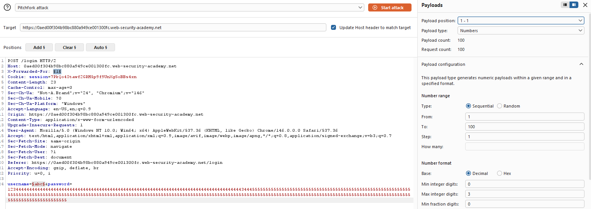

Chèn payload vào username, IP và bruteforce, ở đây ta để mật khẩu dài để khuếch đại sự khác biệt về thời gian phản hồi giữa username tồn tại và không tồn tại

Ta tìm được username, tương tự đặt payload vào password

Tiến hành đăng nhập bằng username và password vừa tìm, ta solve được bài lab

## Lỗ hổng trong cơ chế chống Brute Force

Hai biện pháp chống brute-force phổ biến:

- Nếu có quá nhiều lần đăng nhập sai -> Tài khoản sẽ bị khóa tạm thời hoặc vĩnh viễn
- Nếu một IP gửi quá nhiều yêu cầu đăng nhập trong thời gian ngắn -> IP đó sẽ bị chặn

Tuy nhiên cả hai cách đều có thể tồn tại lỗ hổng. Khi login thành công, reset lại số lần đăng nhập sai về 0

### Lab 4: Broken brute-force protection, IP block

Bắt gói tin đăng nhập và gửi tới Intruder

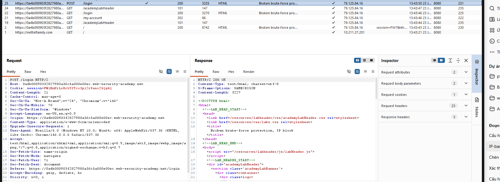

Vì trang web có cơ chế nếu đăng nhập sai quá 3 lần thì sẽ bị chặn, nhưng nếu sai 1 lần rồi đăng nhập đúng bằng 1 tài khoản khác thì sẽ reset lại. Nên tạo 1 danh sách username và password xen tài khoản wiener:peter để reset lại

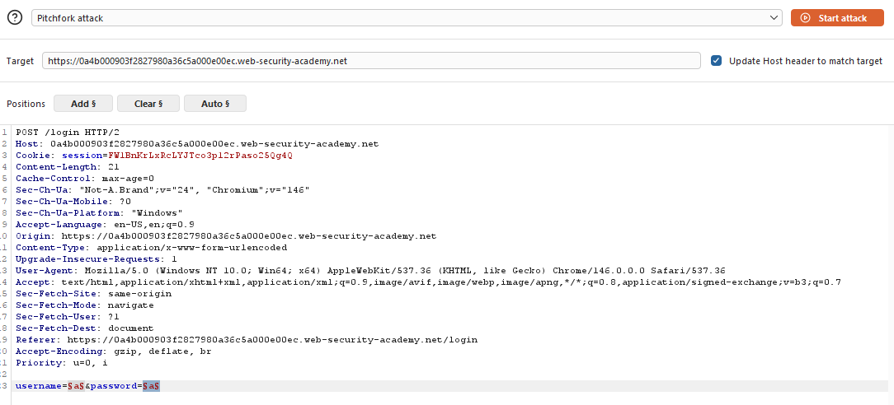

Cấu hình Resource pool: Maximum concurrent requests: 1. Mục đích đảm bảo các request được gửi theo đúng thứ tự.

Tiến hành bruteforce thì ta tìm ra mật khẩu người dùng carlos

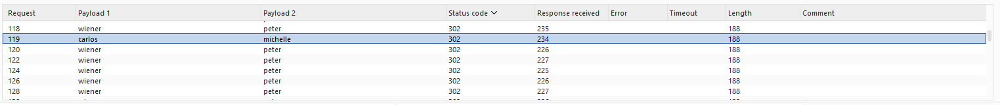

Tiến hành đăng nhập và solve bài lab

## Khóa tài khoản

Một trong những cách website sử dụng để ngăn chặn brute-force là khóa tài khoản khi phát hiện các dấu hiệu đáng ngờ, thường là khi có một số lượng nhất định các lần đăng nhập thất bại

Các phản hồi từ server cho biết tài khoản đã bị khóa cũng có thể giúp kẻ tấn công thực hiện Username Enumeration

### Lab 5: Username enumeration via account lock

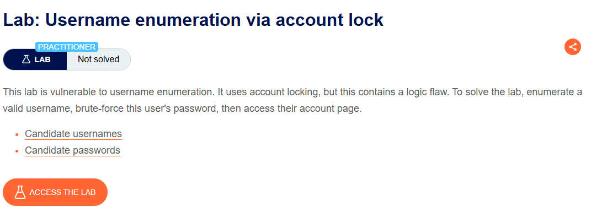

Đặt payload tại 2 vị trí username và cuối hàng. Mục đích đặt 1 payload cuối hàng để thử với mỗi username 5 lần

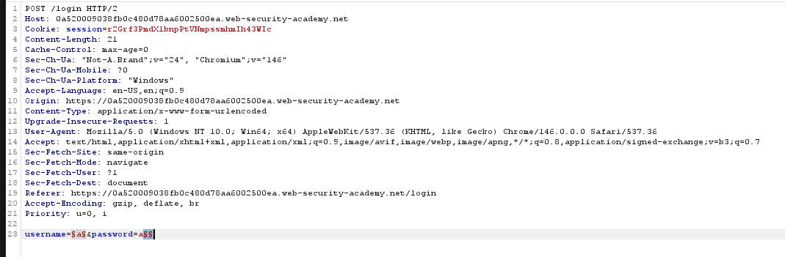

Ta tìm ra được username là adsl

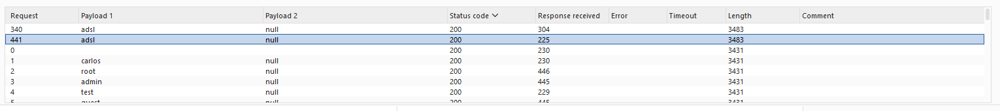

Thêm payload vào password, tại Settings/Grep-Match, ta bắt dòng lỗi You have made too many incorrect login attempts. nếu dòng nào không có hàng này thì khả năng đó là mật khẩu

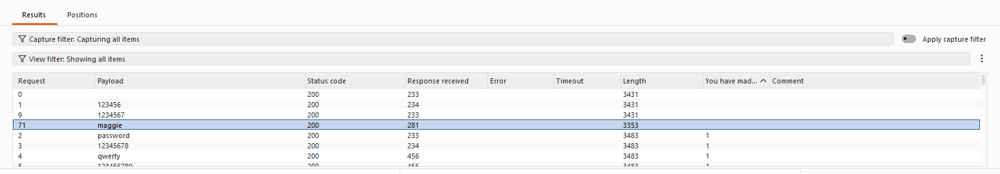

Ta thử lần lượt thì mật khẩu cho username adsl là maggie
từ đó đăng nhập và solve bài lab

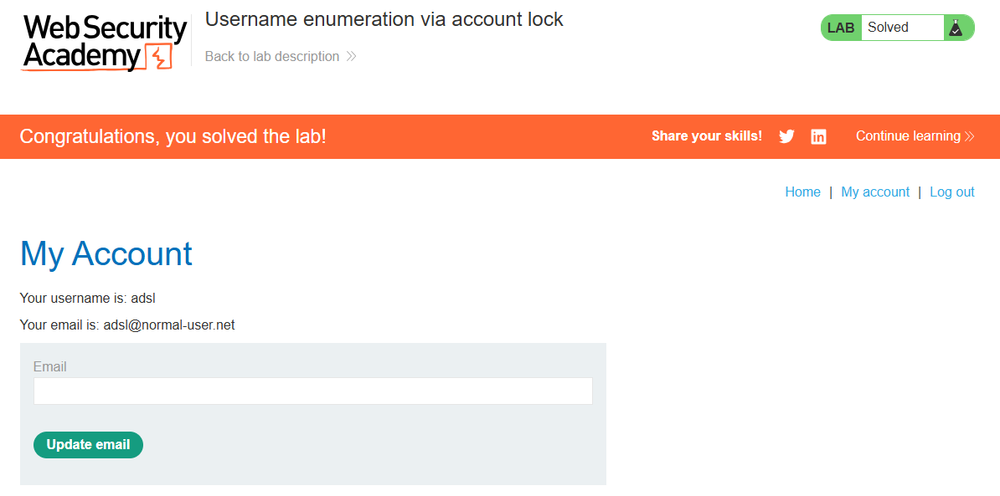

## Vulnerabilities in Multi-Factor Authentication (MFA)

Nhiều website chỉ dùng Single-Factor Authentication (SFA), thường là username + password.

Một số website dùng Multi-Factor Authentication (MFA), yêu cầu nhiều yếu tố xác thực khác nhau.

Các yếu tố xác thực phổ biến:

- Something you know: mật khẩu, PIN.
- Something you have: điện thoại, ứng dụng Authenticator, token.
- Something you are: sinh trắc học (vân tay, khuôn mặt).

Trên web, phổ biến nhất là 2FA:

- Nhập mật khẩu.
- Nhập mã OTP từ thiết bị khác.

2FA an toàn hơn đăng nhập chỉ bằng mật khẩu vì:

- Kẻ tấn công có thể lấy được mật khẩu.
- Nhưng khó lấy được đồng thời thiết bị sinh OTP.

Tuy nhiên, 2FA chỉ an toàn khi được triển khai đúng cách

Nếu triển khai sai:

- Có thể bypass bước OTP
- Có thể brute-force mã OTP
- Có thể chiếm phiên đăng nhập trước khi xác thực OTP
- Có thể vô hiệu hóa hoàn toàn lớp bảo vệ thứ hai

MFA chỉ thực sự hiệu quả khi xác thực nhiều yếu tố khác loại

Xác thực cùng một yếu tố theo hai cách khác nhau không phải MFA thực sự.

Ví dụ:

- Password + mã xác thực gửi qua email
- Cả hai đều phụ thuộc vào việc đăng nhập được email.
- Thực chất vẫn chỉ là xác thực bằng kiến thức hai lần.

## Two-factor authentication tokens

Cách hoạt động của mã xác thực 2FA:

- Người dùng lấy mã xác thực từ một thiết bị vật lý hoặc ứng dụng.
- Các hình thức phổ biến:
  - Thiết bị chuyên dụng (RSA Token, banking token)
  - Ứng dụng tạo OTP
- Thiết bị hoặc ứng dụng tự sinh mã OTP:
  - An toàn hơn.
  - Không cần truyền mã qua mạng.

## OTP qua SMS:

Một số website gửi mã OTP bằng SMS.

Vẫn thuộc yếu tố: Something you have

Tuy nhiên kém an toàn hơn vì:

- Mã OTP được truyền qua mạng viễn thông.
- Có thể bị chặn hoặc đánh cắp.

Nguy cơ SIM Swapping:

- Kẻ tấn công chiếm số điện thoại của nạn nhân.
- Nhận được mọi SMS của nạn nhân.
- Bao gồm cả mã OTP.

## Ý tưởng bypass: Nhiều website triển khai 2FA sai khiến có thể bỏ qua hoàn toàn bước OTP.

Quy trình thông thường: Username + Password -> Nhập OTP -> Truy cập tài khoản

Lỗi logic thường gặp: Username + Password -> Server tạo session rồi gửi đến trang OTP. Sai lầm là chỉ kiểm tra đã đăng nhập chưa thay vì đã hoàn thành bước OTP chưa?

### Lab 6: 2FA simple bypass

Đăng nhập và xác thực tài khoản wiener

Đăng nhập vào tài khoản carlos đến bước nhập mã OTP thì trên URL thay thành endpoint `/my-account?id=carlos` qua đó bypass được bước nhập mã xác thực

## Flawed two-factor verification logic

Ý tưởng chính:

- Lỗi xảy ra khi website không kiểm tra đúng user ở bước 2FA
- Sau bước đăng nhập đầu tiên, hệ thống lưu user bằng cookie/session nhưng có thể bị sửa

### Lab 7: 2FA broken logic

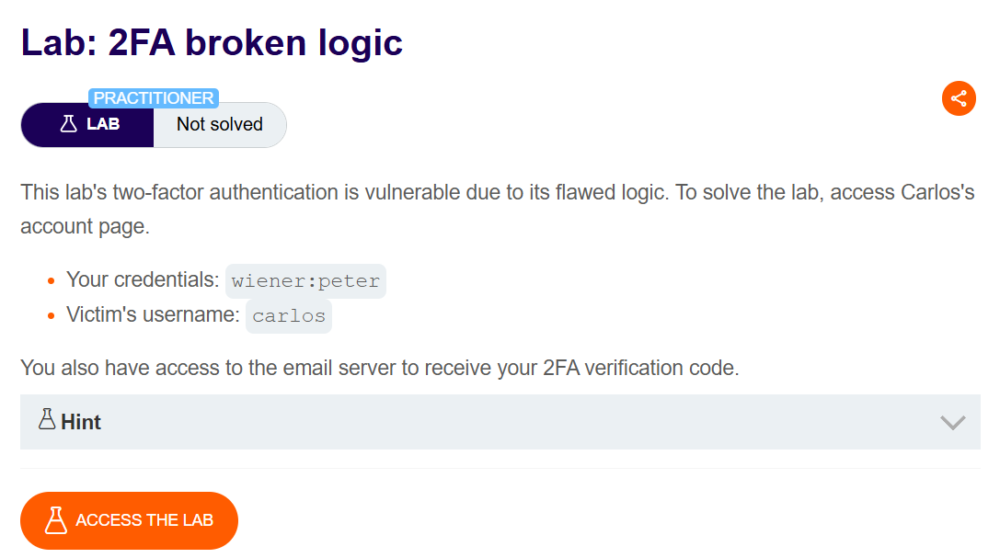

Tiến hành đăng nhập vào tài khoản wiener, đến bước xác thực thứ 2 bắt gói tin này và gửi tới Intruder

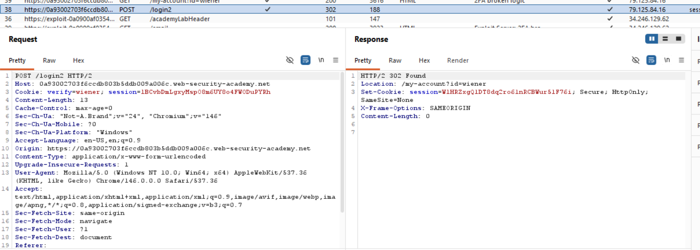

Tại Intruder sửa tham số verify thành carlos và thêm payload vào vị trí mfa-code nhằm bruteforce mã này

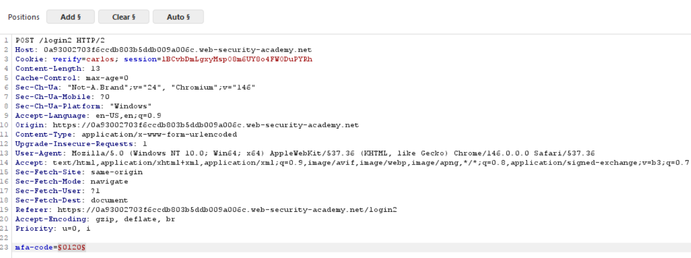

Tiến hành bruteforce ta tìm được mã mfa-code: 0754

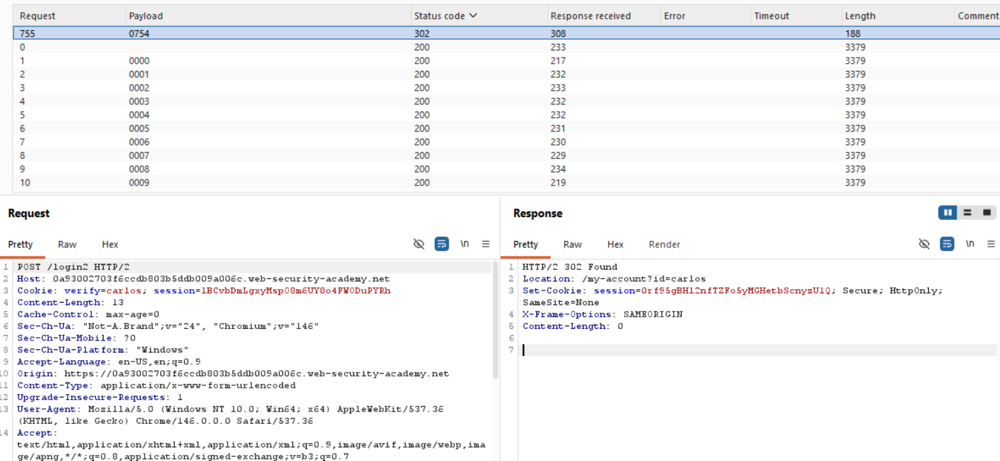

Tiến hành gửi lại gói tin này tới Repeater, sửa lại mã mfa-code vừa tìm được

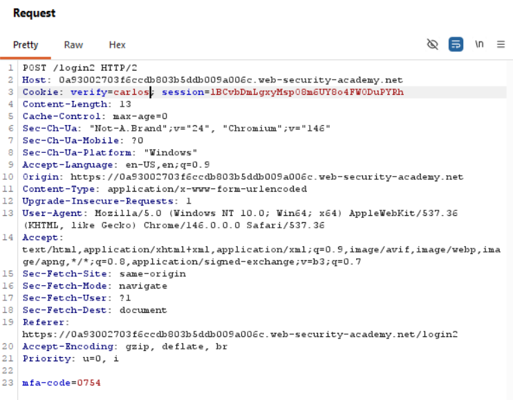

Mở request này trên trình duyệt, ta giải quyết được bài lab

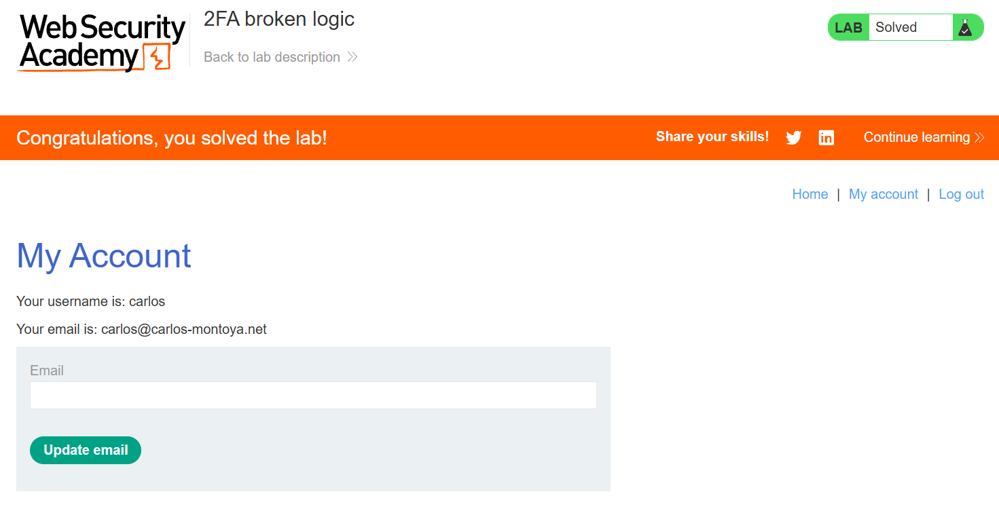

Brute-force mã xác thực 2FA

Tương tự như mật khẩu, các website cần có biện pháp ngăn chặn việc brute-force mã xác thực 2FA

Điều này đặc biệt quan trọng vì mã xác thực thường chỉ là một số gồm 4 hoặc 6 chữ số. Nếu không có cơ chế chống brute-force phù hợp, việc dò tìm đúng mã là tương đối dễ dàng.

Một số website cố gắng ngăn chặn điều này bằng cách tự động đăng xuất người dùng sau khi họ nhập sai một số lượng mã xác thực nhất định.

Tuy nhiên, trên thực tế biện pháp này không hiệu quả vì một kẻ tấn công có kinh nghiệm vẫn có thể tự động hóa toàn bộ quy trình nhiều bước này bằng cách sử dụng macro trong Burp Intruder.

Các lỗ hổng trong những cơ chế xác thực khác

Không chỉ trang đăng nhập mới có lỗ hổng.

Các chức năng liên quan đến xác thực cũng là mục tiêu tấn công:

- Đổi mật khẩu
- Quên mật khẩu
- Khôi phục tài khoản
- Xác minh email
- 2FA / MFA

Nhiều website bảo vệ trang login rất kỹ nhưng lại cấu hình sai ở các chức năng phụ

Hacker thường tạo một tài khoản bình thường để nghiên cứu các chức năng này rồi tìm cách:

- Reset mật khẩu người khác.
- Bỏ qua xác thực
- Chiếm quyền tài khoản
- Leo thang đặc quyền

Duy trì trạng thái đăng nhập

Nhiều ứng dụng web cung cấp chức năng "Remember Me" hoặc "Keep Me Logged In" nhằm duy trì trạng thái đăng nhập của người dùng sau khi đóng trình duyệt.

Cơ chế này thường hoạt động bằng cách tạo một token xác thực và lưu trữ trong cookie trên trình duyệt người dùng. Khi người dùng truy cập lại website, server sẽ sử dụng cookie này để xác thực mà không yêu cầu đăng nhập lại.

Nếu cookie được tạo từ các giá trị có thể dự đoán được như username, password hoặc timestamp, kẻ tấn công có thể phân tích cookie của chính mình để suy ra cơ chế sinh token.

Một số ứng dụng chỉ sử dụng Base64 để mã hóa dữ liệu trong cookie

Trong trường hợp cookie được tạo bằng hàm băm nhưng không sử dụng salt, kẻ tấn công có thể thực hiện brute-force hoặc dictionary attack để tìm ra giá trị gốc

Tác động:

- Bỏ qua quá trình đăng nhập.
- Chiếm quyền truy cập tài khoản người dùng khác.
- Duy trì truy cập trái phép trong thời gian dài.
- Vượt qua cơ chế giới hạn số lần đăng nhập nếu website không giới hạn số lần thử cookie.

Khuyến nghị:

- Sử dụng token ngẫu nhiên có độ dài đủ lớn.
- Không lưu username hoặc password trực tiếp trong cookie.
- Không sử dụng Base64 như một cơ chế bảo mật.
- Sử dụng cơ chế ký số hoặc mã hóa an toàn.
- Thiết lập thời gian hết hạn hợp lý cho token.
- Áp dụng giới hạn số lần thử đối với remember-me token tương tự như cơ chế đăng nhập.

Lab 8: Brute-forcing a stay-logged-in cookie

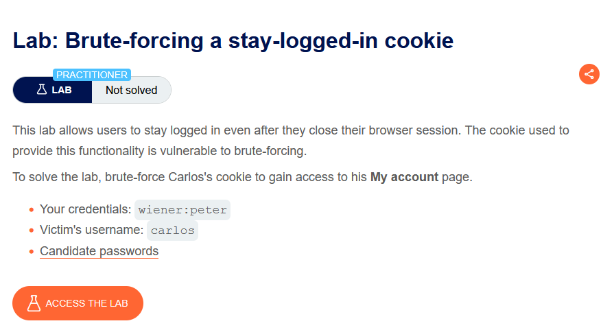

Đăng nhập vào tài khoản wiener và tick nhớ mật khẩu, ta được cookie `stay-logged-in=d2llbmVyOjUxZGMzMGRkYzQ3M2Q0M2E2MDExZTllYmJhNmNhNzcw` có dạng username:password. Bắt request đăng nhập thành công vào tài khoản wiener và gửi đến Intruder

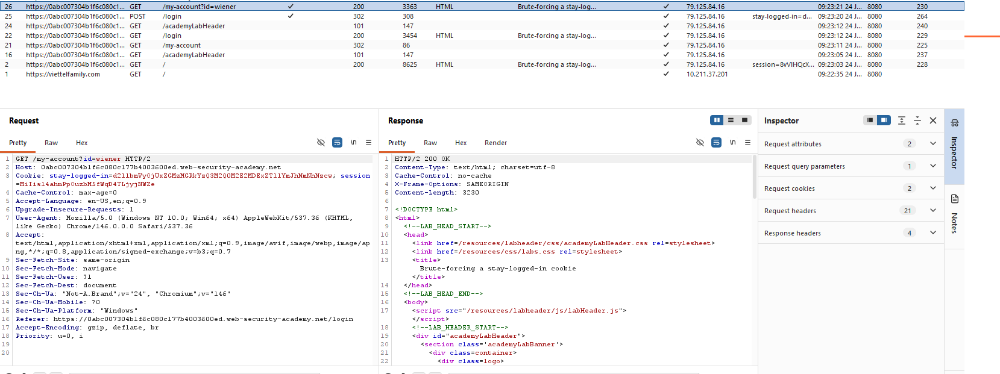

Setup payload như sau:

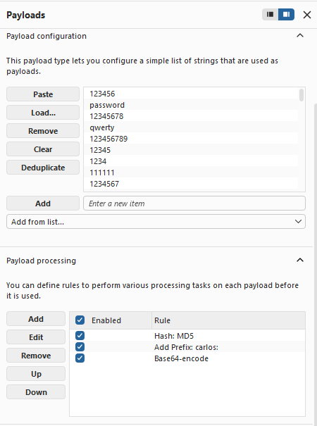

Grep - Match: Thêm Update email

Thêm payload vào stay-logged-in để bruteforce mật khẩu. Lưu ý: Cần logout để server tin vào cookie stay-logged-in

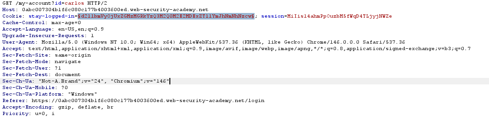

Kết quả:

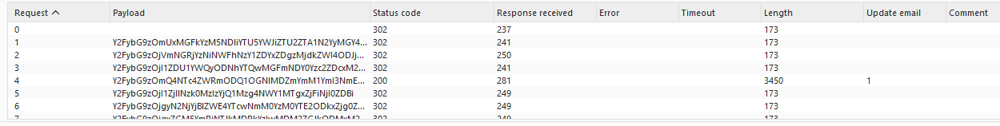

Bài lab được giải thành công:

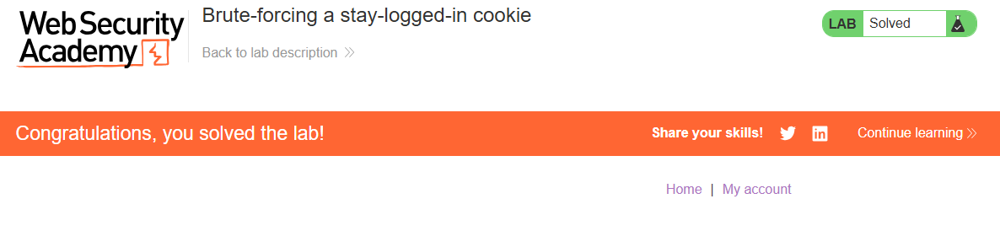

Kẻ tấn công không cần tạo tài khoản riêng vẫn có thể khai thác lỗ hổng.

Có thể đánh cắp Remember-Me Cookie thông qua các lỗ hổng như XSS.

Sau khi có cookie, kẻ tấn công có thể phân tích cấu trúc và cơ chế tạo token.

Nếu website sử dụng framework mã nguồn mở, cách tạo cookie có thể được công khai trong tài liệu hoặc mã nguồn.

Một số website lưu hash của mật khẩu trong cookie.

Nếu hash không sử dụng salt, kẻ tấn công có thể:

- Tra cứu hash trên các cơ sở dữ liệu công khai.
- Thực hiện dictionary attack.
- Thực hiện brute-force để tìm mật khẩu gốc.

Trong một số trường hợp, mật khẩu thực có thể bị khôi phục từ hash nếu người dùng sử dụng mật khẩu phổ biến.

Salt giúp chống tra cứu hash có sẵn và làm tăng độ khó của brute-force.

Việc lưu thông tin xác thực hoặc hash yếu trong cookie có thể dẫn đến:

- Chiếm quyền tài khoản.
- Bỏ qua cơ chế đăng nhập.
- Rò rỉ thông tin xác thực của người dùng.

Lab 9: Offline password cracking

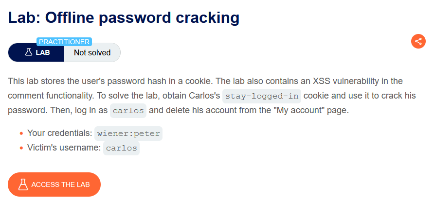

Tiến hành đăng nhập vào tài khoản wiener và thực hiện comment 1 alert cơ bản `` ta thấy alert này được thực thi

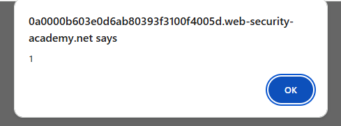

Tiến hành chèn payload nhằm lấy cookie của người dùng carlos trên trình duyệt

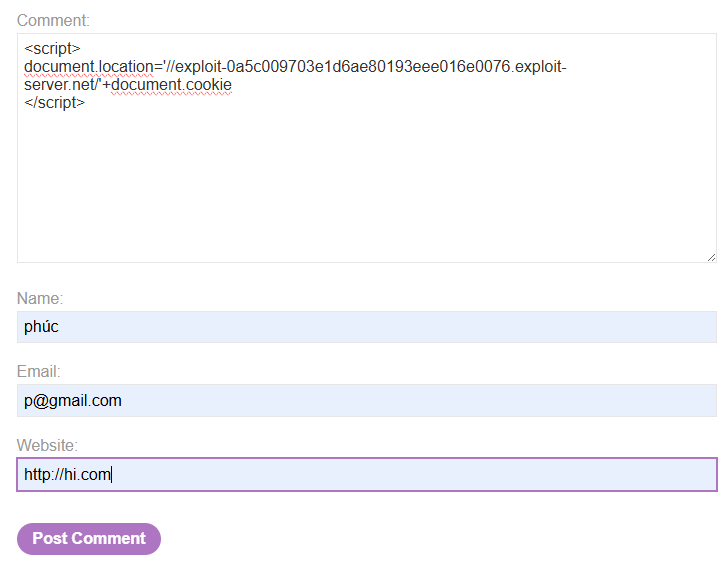

Truy cập vào Exploit server, vào mục access log

Thấy dòng log này khả nghi, kiểm tra bằng cách decode base64

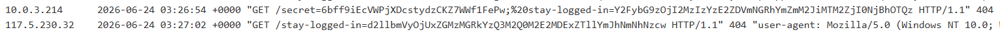

Kết quả:

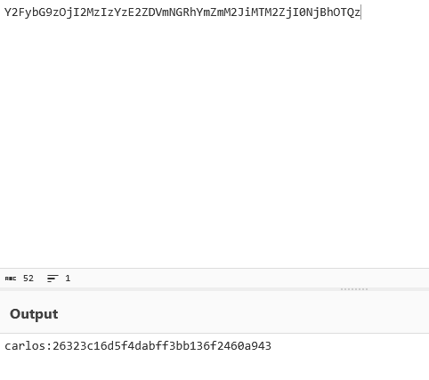

Crack mã hash MD5 thu được:

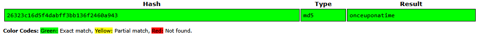

Đăng nhập vào carlos và xóa tài khoản:

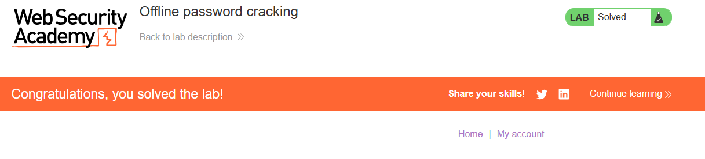

Đặt lại mật khẩu người dùng:

Reset password là chức năng bắt buộc nhưng rất rủi ro về bảo mật.

Không thể dùng xác thực mật khẩu thông thường khi user quên mật khẩu

Website phải dùng phương pháp xác thực thay thế để đảm bảo đúng chủ tài khoản

Có nhiều cách triển khai reset password, mức độ an toàn khác nhau.

Vấn đề việc gửi mật khẩu qua email:

- Không nên gửi lại mật khẩu cũ cho người dùng.
- Một số hệ thống tạo mật khẩu mới và gửi qua email.
- Rủi ro:
  - Nếu mật khẩu không hết hạn nhanh → dễ bị tấn công MITM
  - Nếu người dùng không đổi ngay → tăng nguy cơ bị lộ
- Email không an toàn tuyệt đối:
  - Lưu trữ lâu dài
  - Không thiết kế để chứa dữ liệu nhạy cảm.
  - Có thể bị đồng bộ qua nhiều thiết bị → tăng nguy cơ bị lộ.

Đặt lại mật khẩu qua URL:

- Website gửi cho user 1 link reset mật khẩu duy nhất
- Dùng tham số dễ đoán như: `?user=victim-user`
- Lỗ hổng: Attacker chỉ cần sửa user là có thể reset password của người khác
- Cách khắc phục: Dùng token ngẫu nhiên, khó đoán và token không chưa thông tin user, không thể đoán được
- Cơ chế đúng: Backend kiểm tra token tồn tại không, xác định token thuộc user nào, token có thời gian hết hạn ngắn và bị xóa ngay sau khi dùng
- Lỗi bảo mật: Không kiểm tra lại token khi submit form reset mật khẩu. Attacker có thể: dùng lại form reset, xóa token, reset password của user khác

Lab 10: Password reset broken logic

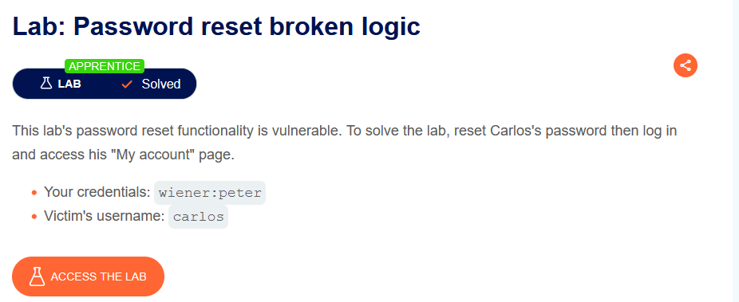

Gửi request đổi mật khẩu sang Repeater

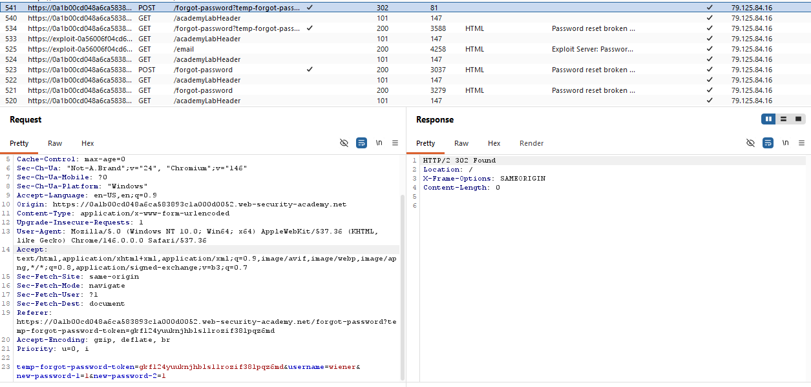

Thực hiện đổi tên username từ wiener sang carlos và gửi lại request

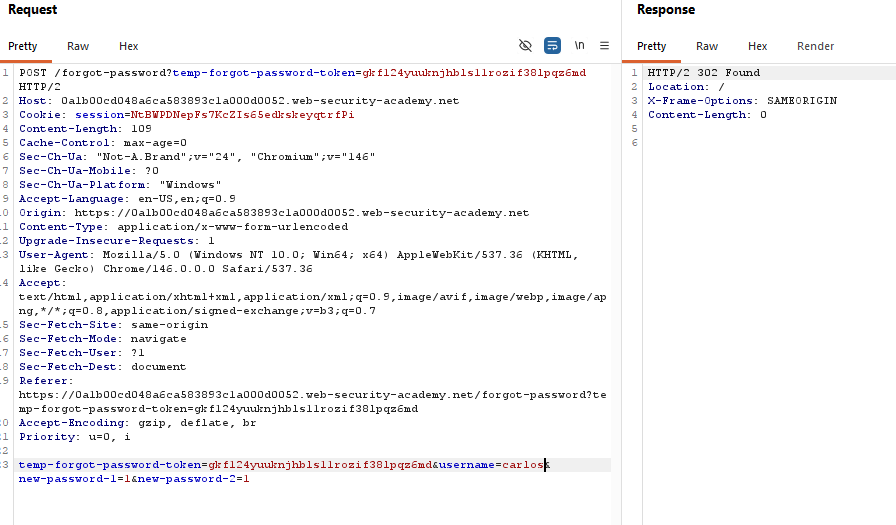

Tiến hành đăng nhập vào carlos với mật khẩu mới:

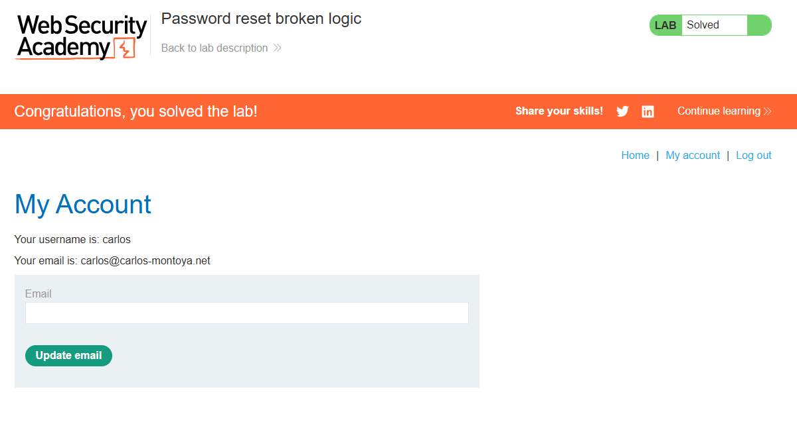

URL reset password được tạo động (dynamic) → có thể không an toàn.

Có thể xảy ra lỗ hổng password reset poisoning.

Attacker có thể:

- Đánh cắp token reset của user khác
- Chiếm quyền reset mật khẩu

Hậu quả: thay đổi mật khẩu tài khoản nạn nhân

Lab 11: Password reset poisoning via middleware

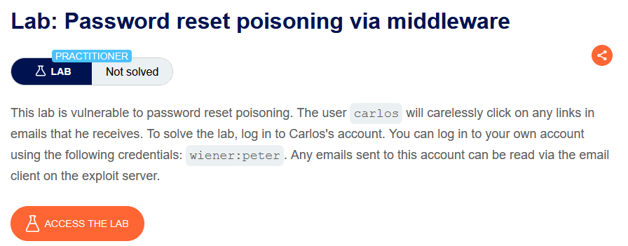
