Authentication vulnerabilities

Authentication là quá trình kiểm tra và xác minh danh tính của người dùng hoặc máy khách

Có 3 loại yếu tố xác thực chính:

- Thứ bạn biết (VD: password, mã PIN,...): là yếu tố kiến thức
- Thứ bạn sở hữu (VD: mobile phone, thẻ bảo mật): là yếu tố sở hữu
- Thứ thuộc về bạn hoặc hành vi (VD: Vân tay, khuôn mặt,...): yếu tố sinh trắc học

Sự khác biệt giữa Authentication và Authorization

Authentication: Kiểm tra xem người dùng có đúng là người họ khai báo hay không

Authorization: Kiểm tra xem người dùng đó được phép làm gì sau khi đã đăng nhập.

Ví dụ: 
- Đăng nhập bằng tài khoản Carlos123 → Authentication
- Sau khi đăng nhập, được xem dữ liệu nào hoặc thực hiện hành động gì → Authorization

Các lỗ hổng xác thực phát sinh như thế nào?

Lỗ hổng xác thực xuất hiện do:
- Xác thực yếu:
    - Dễ bị brute-force
    - Mật khẩu yếu
    - Không giới hạn đăng nhập sai
- Xác thực bị lỗi:
    - Lỗi logic
    - Lỗi code
    - Có thể bypass đằn nhập

Tác động của các lỗ hổng xác thực là gì?

Nếu Authentication bị phá vỡ, kẻ tấn công có thể chiếm tài khoản người khác

Nếu chiếm tài khoản user:
- Xem dữ liệu riêng tư
- Truy cập các trang nội bộ
- Mở rộng phạm vi tấn công

Nếu chiếm tài khoản admin:
- Kiểm soát toàn bộ ứng dụng
- Thay đổi hoặc xóa dữ liệu
- Có thể truy cập hạ tầng nội bộ

Lỗ hổng trong cơ chế đăng nhập bằng mật khẩu

Password-Based Login hoạt động dựa trên: Username + Password

Website tin rằng: Ai biết đúng mật khẩu thì chính là chủ tài khoản

Website sẽ bị compromise nếu attacker:
- Lấy được mật khẩu.
- Đoán được mật khẩu.

Lab 1: Username enumeration via different responses

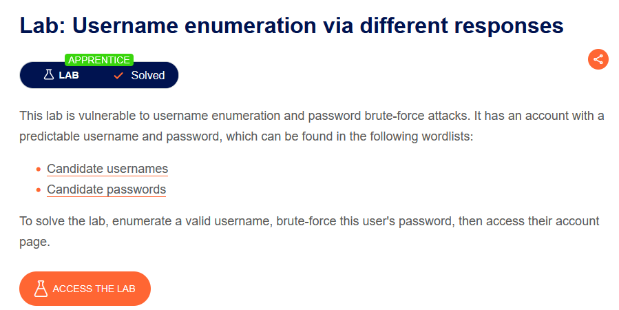

Bắt gói tin đăng nhập và gửi tới Burp Intruder thực hiện bruteforce để tìm tài khoản và mật khẩu

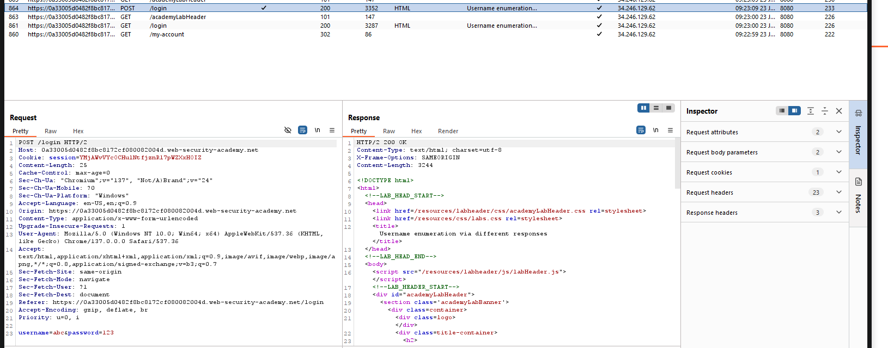

Chèn payload vào username

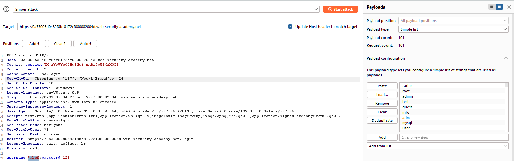

Tìm được username

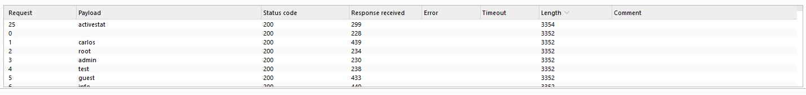

Làm tương tự tìm mật khẩu

Đăng nhập và solve bài lab

Lab 2: Username enumeration via subtly different responses

Bắt gói tin đăng nhập và chèn payload vào vị trí username

Thêm điều kiện grep-match

Ta tìm được username không bị lỗi `Invalid username or password.`

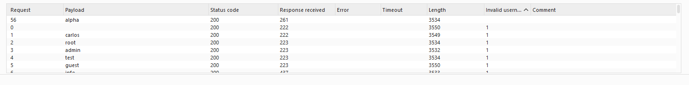

Làm tương tự với cách tìm mật khẩu, tìm được mật khẩu đúng với status code khác với các mật khẩu còn lại

Tiến hành đăng nhập và solve bài lab

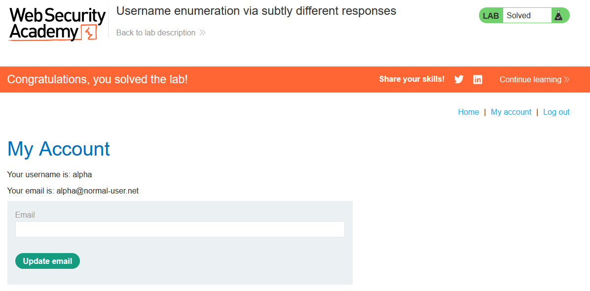

Lab 3: Username enumeration via response timing

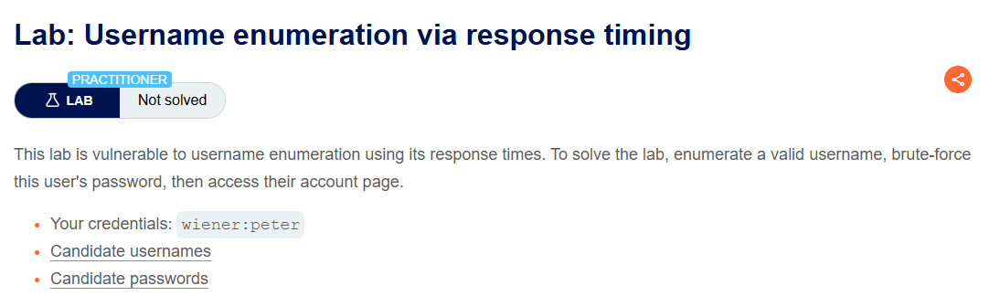

Vì bài lab này giới hạn nếu nhập sai tài khoản hoặc mật khẩu quá 5 lần sẽ phải chờ 30 phút để reset lại nên ta cần chèn `X-Forwarded-For: §IP§` vì mỗi request sẽ giả mạo 1 IP khác nhau nên Server tưởng là các IP khác nhau.

Chèn payload vào username, IP và bruteforce, ở đây ta để mật khẩu dài để khuếch đại sự khác biệt về thời gian phản hồi giữa username tồn tại và không tồn tại

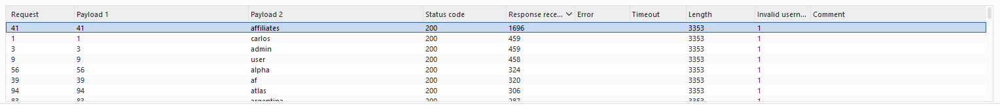

Ta tìm được username, tương tự đặt payload vào password

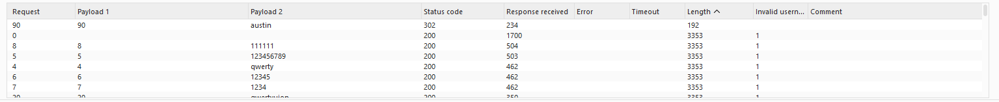

Tiến hành đăng nhập bằng username và password vừa tìm, ta solve được bài lab

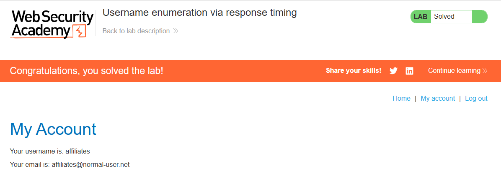

Lỗ hổng trong cơ chế chống Brute Force

Hai biện pháp chống brute-force phổ biến:
- Nếu có quá nhiều lần đăng nhập sai -> Tài khoản sẽ bị khóa tạm thời hoặc vĩnh viễn
- Nếu một IP gửi quá nhiều yêu cầu đăng nhập trong thời gian ngắn -> IP đó sẽ bị chặn

Tuy nhiên cả hai cách đều có thể tồn tại lỗ hổng. Khi login thành công, reset lại số lần đăng nhập sai về 0

Lab 4: Broken brute-force protection, IP block

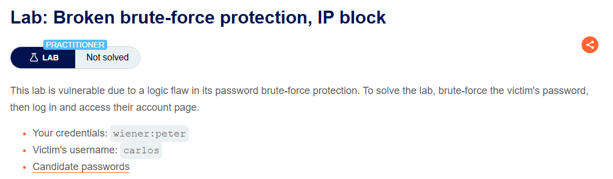

Bắt gói tin đăng nhập và gửi tới Intruder

Vì trang web có cơ chế nếu đăng nhập sai quá 3 lần thì sẽ bị chặn, nhưng nếu sai 1 lần rồi đăng nhập đúng bằng 1 tài khoản khác thì sẽ reset lại. Nên tạo 1 danh sách username và password xen tài khoản wiener:peter để reset lại

Cấu hình Resource pool: Maximum concurrent requests: 1. Mục đích đảm bảo các request được gửi theo đúng thứ tự.

Tiến hành bruteforce thì ta tìm ra mật khẩu người dùng carlos

Tiến hành đăng nhập và solve bài lab

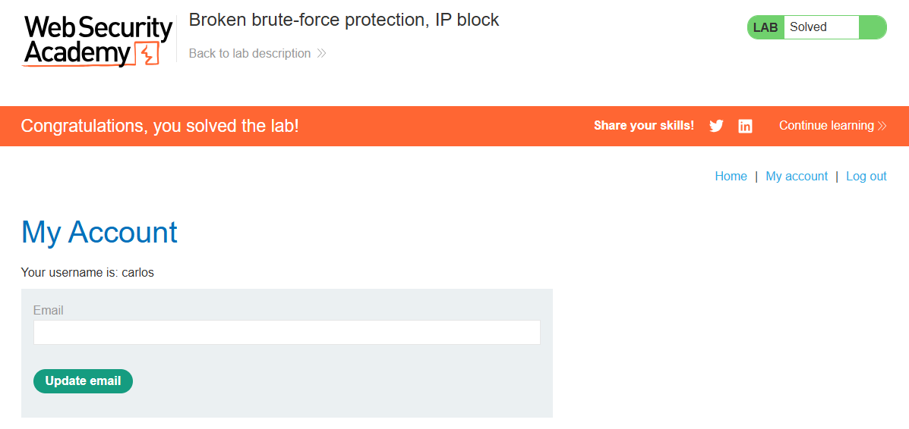

Khóa tài khoản

Một trong những cách website sử dụng để ngăn chặn brute-force là khóa tài khoản khi phát hiện các dấu hiệu đáng ngờ, thường là khi có một số lượng nhất định các lần đăng nhập thất bại

Các phản hồi từ server cho biết tài khoản đã bị khóa cũng có thể giúp kẻ tấn công thực hiện Username Enumeration

Lab 5: Username enumeration via account lock

Đặt payload tại 2 vị trí username và cuối hàng. Mục đích đặt 1 payload cuối hàng để thử với mỗi username 5 lần

Ta tìm ra được username là adsl

Thêm payload vào password, tại Settings/Grep-Match, ta bắt dòng lỗi You have made too many incorrect login attempts. nếu dòng nào không có hàng này thì khả năng đó là mật khẩu

Ta thử lần lượt thì mật khẩu cho username adsl là maggie
từ đó đăng nhập và solve bài lab

Vulnerabilities in Multi-Factor Authentication (MFA)

Nhiều website chỉ dùng Single-Factor Authentication (SFA), thường là username + password.

Một số website dùng Multi-Factor Authentication (MFA), yêu cầu nhiều yếu tố xác thực khác nhau.

Các yếu tố xác thực phổ biến:
- Something you know: mật khẩu, PIN.
- Something you have: điện thoại, ứng dụng Authenticator, token.
- Something you are: sinh trắc học (vân tay, khuôn mặt).

Trên web, phổ biến nhất là 2FA:
- Nhập mật khẩu.
- Nhập mã OTP từ thiết bị khác.

2FA an toàn hơn đăng nhập chỉ bằng mật khẩu vì:
- Kẻ tấn công có thể lấy được mật khẩu.
- Nhưng khó lấy được đồng thời thiết bị sinh OTP.

Tuy nhiên, 2FA chỉ an toàn khi được triển khai đúng cách

Nếu triển khai sai:
- Có thể bypass bước OTP
- Có thể brute-force mã OTP
- Có thể chiếm phiên đăng nhập trước khi xác thực OTP
- Có thể vô hiệu hóa hoàn toàn lớp bảo vệ thứ hai

MFA chỉ thực sự hiệu quả khi xác thực nhiều yếu tố khác loại

Xác thực cùng một yếu tố theo hai cách khác nhau không phải MFA thực sự.

Ví dụ:
- Password + mã xác thực gửi qua email
- Cả hai đều phụ thuộc vào việc đăng nhập được email.
- Thực chất vẫn chỉ là xác thực bằng kiến thức hai lần.

Two-factor authentication tokens

Cách hoạt động của mã xác thực 2FA:

- Người dùng lấy mã xác thực từ một thiết bị vật lý hoặc ứng dụng.
- Các hình thức phổ biến:
    - Thiết bị chuyên dụng (RSA Token, banking token)
    - Ứng dụng tạo OTP
- Thiết bị hoặc ứng dụng tự sinh mã OTP:
    - An toàn hơn.
    - Không cần truyền mã qua mạng.

OTP qua SMS:

Một số website gửi mã OTP bằng SMS.

Vẫn thuộc yếu tố: Something you have

Tuy nhiên kém an toàn hơn vì:
- Mã OTP được truyền qua mạng viễn thông.
- Có thể bị chặn hoặc đánh cắp.

Nguy cơ SIM Swapping:
- Kẻ tấn công chiếm số điện thoại của nạn nhân.
- Nhận được mọi SMS của nạn nhân.
- Bao gồm cả mã OTP.

Ý tưởng bypass: Nhiều website triển khai 2FA sai khiến có thể bỏ qua hoàn toàn bước OTP.

Quy trình thông thường: Username + Password -> Nhập OTP -> Truy cập tài khoản

Lỗi logic thường gặp: Username + Password -> Server tạo session rồi gửi đến trang OTP. Sai lầm là chỉ kiểm tra đã đăng nhập chưa thay vì đã hoàn thành bước OTP chưa?

Lab 6: 2FA simple bypass

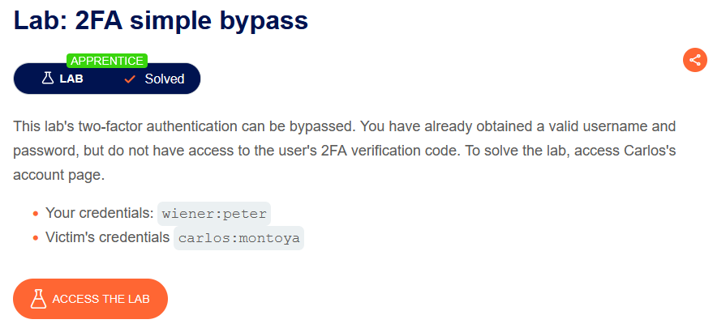

Đăng nhập và xác thực tài khoản wiener

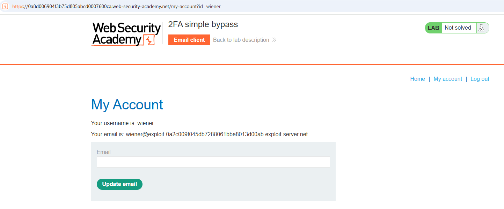

Đăng nhập vào tài khoản carlos đến bước nhập mã OTP thì trên URL thay thành endpoint `/my-account?id=carlos`  qua đó bypass được bước nhập mã xác thực

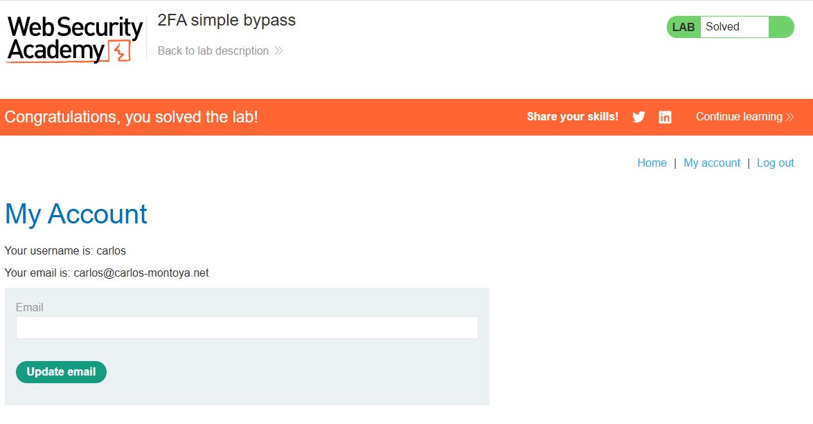

Flawed two-factor verification logic

Ý tưởng chính:
- Lỗi xảy ra khi website không kiểm tra đúng user ở bước 2FA
- Sau bước đăng nhập đầu tiên, hệ thống lưu user bằng cookie/session nhưng có thể bị sửa