# Business logic vulnerabilities

## Business logic vulnerabilities là gì

Là những điểm yếu trong thiết kế và triển khai, cho phép kẻ tấn công lợi dụng các chức năng hợp pháp của ứng dụng để đạt được mục đích xấu.

Do nhà phát triển không lường trước được và thất bại trong việc xử lý an toàn các trạng thái hoạt động bất thường của ứng dụng.

Lỗi thường không bộc lộ qua các thao tác sử dụng bình thường; chúng chỉ xuất hiện khi kẻ tấn công tương tác với ứng dụng theo những cách không được dự tính trước.

Kẻ tấn công lợi dụng lỗi để vượt qua các quy tắc và ràng buộc của hệ thống, ví dụ như hoàn tất giao dịch mà không qua bước thanh toán, sửa đổi các giá trị dữ liệu quan trọng, hoặc gửi dữ liệu vô lý để thao túng máy chủ.

Các lỗi logic rất đa dạng và thường là "độc bản", phụ thuộc hoàn toàn vào chức năng riêng của từng ứng dụng.

Chúng rất khó bị phát hiện bằng các phần mềm quét lỗ hổng tự động.

Việc phát hiện đòi hỏi tư duy con người, sự hiểu biết về lĩnh vực nghiệp vụ và khả năng phán đoán mục tiêu của kẻ tấn công, khiến đây trở thành "mỏ vàng" cho những người kiểm thử thủ công và săn tiền thưởng (bug bounty hunters).

## Nguyên nhân phát sinh lỗ hổng logic nghiệp vụ

- Đội ngũ thiết kế và phát triển thường có những giả định sai lầm về cách người dùng tương tác với ứng dụng, dẫn đến việc xác thực dữ liệu đầu vào không đầy đủ.
- Lập trình viên đôi khi mặc định người dùng chỉ thao tác qua trình duyệt web và sử dụng các biện pháp bảo vệ lỏng lẻo ở phía máy khách. Kẻ tấn công có thể dễ dàng qua mặt chốt chặn này bằng các công cụ proxy đánh chặn.
- Khi kẻ tấn công thực hiện các hành vi sai lệch so với luồng dự kiến, ứng dụng không có sẵn các biện pháp ngăn chặn và xử lý tình huống một cách an toàn.
- Lỗi logic cực kỳ phổ biến trong các hệ thống quá đồ sộ và phức tạp, nơi mà chính đội ngũ phát triển cũng không nắm được bức tranh toàn cảnh.
- Trong một mã nguồn lớn, lập trình viên làm việc ở module này có thể hiểu sai về cách hoạt động của module khác. Việc kết hợp các chức năng không lường trước được hậu quả sẽ vô tình tạo ra lỗ hổng logic nghiêm trọng.
- Nếu các giả định về hệ thống không được các nhà phát triển ghi chép và tài liệu hóa rõ ràng, những lỗ hổng dạng này sẽ rất dễ dàng len lỏi vào ứng dụng.

## Tác động của lỗ hổng logic nghiệp vụ

Hậu quả của lỗ hổng logic rất đa dạng, có thể từ không đáng kể cho đến các cuộc tấn công cực kỳ nghiêm trọng, tùy thuộc vào cách kẻ tấn công thao túng ứng dụng.

Cần khắc phục mọi điểm logic bất thường ngay cả khi bạn chưa biết cách khai thác chúng, vì luôn tiềm ẩn rủi ro người khác hoặc kẻ xấu có thể làm được.

Mức độ thiệt hại gắn liền với chức năng chứa lỗ hổng. Cụ thể:

- Gây ảnh hưởng nghiêm trọng đến bảo mật tổng thể. Kẻ tấn công có thể leo thang đặc quyền, vượt qua xác thực để truy cập dữ liệu hoặc chức năng nhạy cảm và mở rộng bề mặt tấn công.
- Trực tiếp dẫn đến tổn thất khổng lồ cho doanh nghiệp do bị đánh cắp tiền hoặc gian lận.

Ngay cả khi không mang lại lợi ích cá nhân trực tiếp cho kẻ tấn công, lỗ hổng logic vẫn có thể bị các thế lực thù địch lợi dụng để phá hoại doanh nghiệp bằng nhiều cách khác nhau.

## Ví dụ

### Quá tin tưởng vào kiểm soát phía máy khách

Tin rằng người dùng sẽ chỉ tương tác với ứng dụng thông qua giao diện web được cung cấp sẵn.

Giả định trên dẫn đến việc chủ quan, dựa dẫm hoàn toàn vào cơ chế xác thực phía máy khách để ngăn chặn các dữ liệu đầu vào độc hại.

Kẻ tấn công có thể sử dụng các công cụ đánh chặn để can thiệp và chỉnh sửa dữ liệu sau khi rời trình duyệt nhưng trước khi tiến vào máy chủ.

Nếu hệ thống chấp nhận dữ liệu mù quáng mà không có bước kiểm tra tính toàn vẹn và xác thực lại ở phía máy chủ, kẻ tấn công có thể gây ra đủ loại thiệt hại mà không tốn nhiều công sức.

Mức độ nghiêm trọng phụ thuộc vào việc chức năng đó làm gì với dữ liệu bị thao túng.

**Lab 1: Excessive trust in client-side controls**

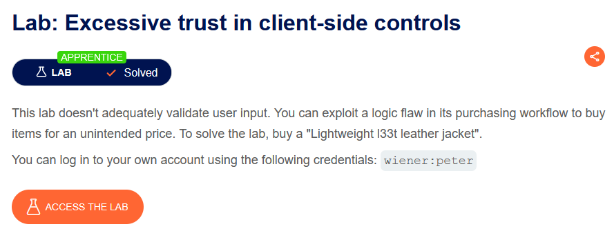

Đăng nhập vào wiener và đặt mua 1 sản phẩm. Bắt request mua sản phẩm đó.

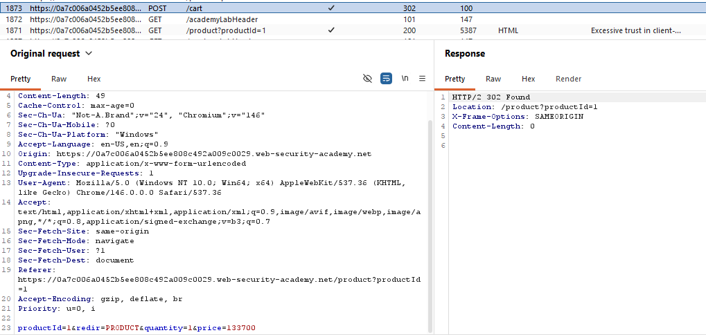

Gửi đến Repeater và thực hiện sửa đổi giá sản phẩm.

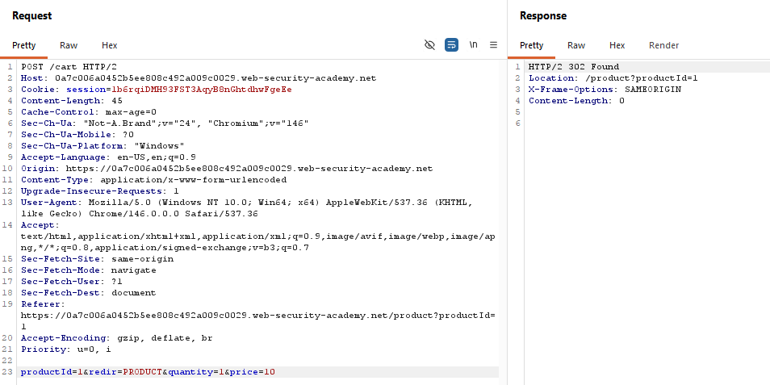

Load lại trang và đặt mua để solve bài lab.

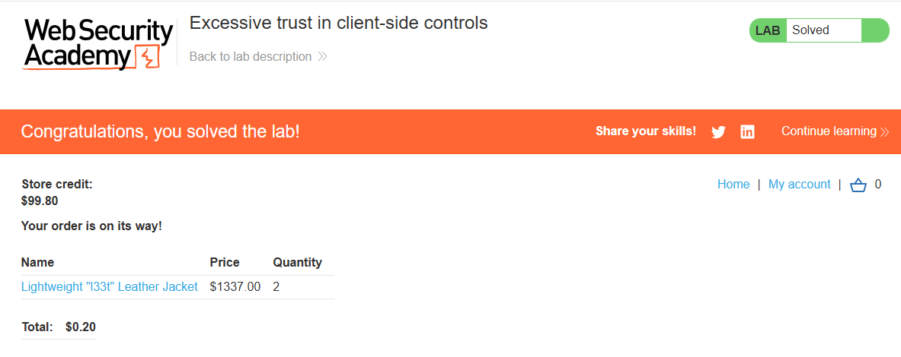

### Thất bại trong việc xử lý dữ liệu đầu vào bất thường

Giới hạn và kiểm soát dữ liệu đầu vào sao cho tuân thủ các quy tắc nghiệp vụ.

Lỗi phát sinh khi lập trình viên không lường trước được mọi kịch bản để lập trình cách xử lý. Việc thiếu các quy tắc xử lý rõ ràng cho những trường hợp nằm ngoài dự kiến sẽ dẫn đến những hành vi bất thường của hệ thống.

Kiểu dữ liệu số có thể cho phép nhập số âm. Nếu máy chủ không xác thực chặt chẽ để loại bỏ giá trị này, kẻ tấn công có thể lợi dụng để thao túng hệ thống.

Ví dụ: nếu một hàm chuyển tiền chỉ kiểm tra số_tiền_chuyển <= số_dư_hiện_tại, kẻ tấn công nhập số tiền là -1000$. Hệ thống đánh giá -1000 nhỏ hơn số dư nên duyệt giao dịch. Hậu quả: kẻ tấn công rút ngược 1000$ từ tài khoản nạn nhân thay vì chuyển đi.

3 câu hỏi trọng tâm khi đánh giá:

- Dữ liệu có bị áp đặt các giới hạn nào không?
- Điều gì sẽ xảy ra khi chạm đến các giới hạn đó?
- Dữ liệu đầu vào có bị hệ thống tự động biến đổi hay chuẩn hóa không?

**Lab 2: High-level logic vulnerability**

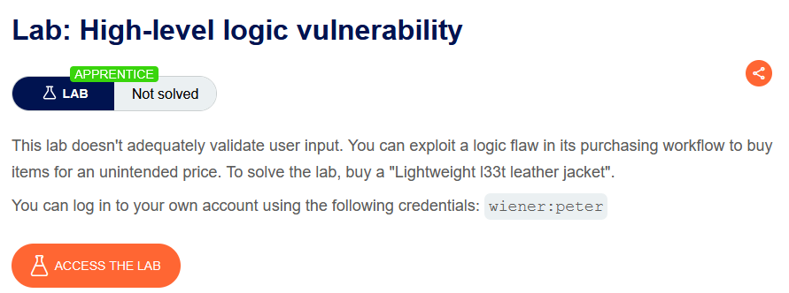

Bắt request thêm sản phẩm vào giỏ hàng.

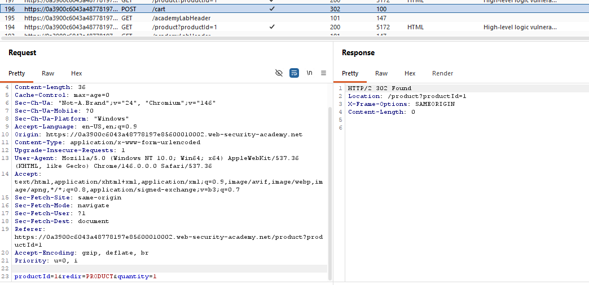

Khi thay đổi số lượng sản phẩm để thêm vào giỏ hàng thì số lượng thay đổi theo. Ta thao túng số lượng sản phẩm về âm để số tiền phải trả nhỏ hơn 0.

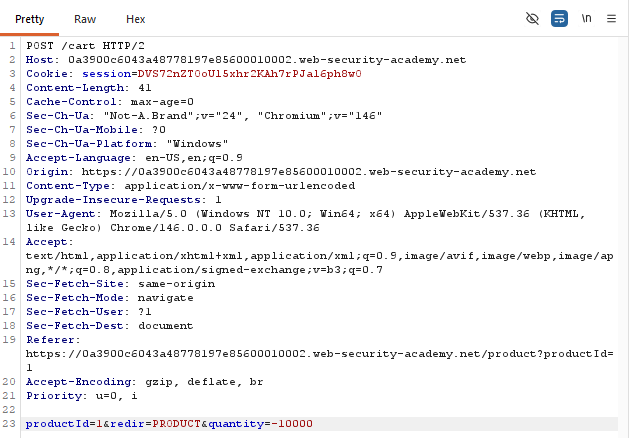
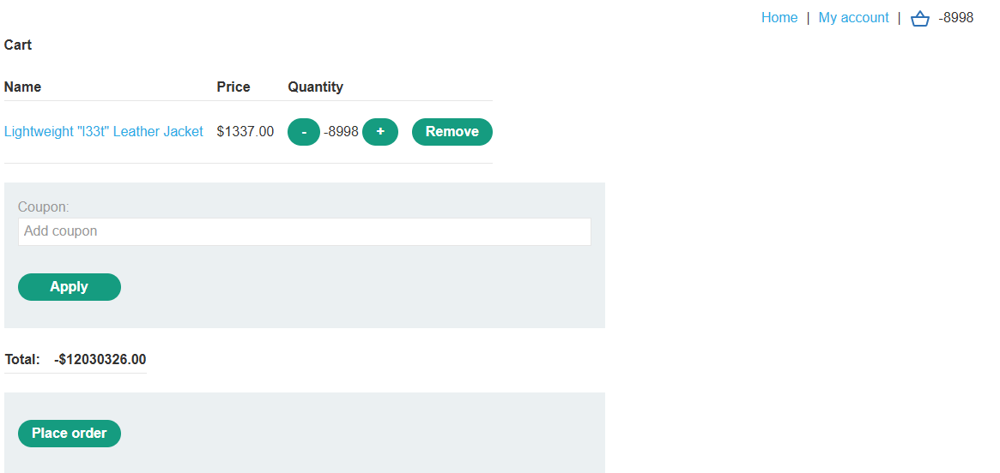

Thay đổi số lượng product `Lightweight "l33t" Leather Jacket` về 1 và thêm mặt hàng khác để số tiền thanh toán nhỏ hơn số tiền hiện tại. Thực hiện thanh toán để solve bài lab.

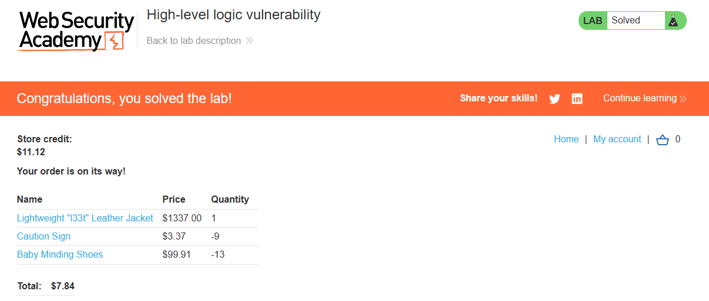

**Lab 3: Low-level logic flaw**

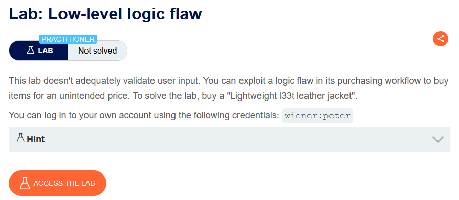

Đăng nhập vào tài khoản wiener, bắt request và gửi đến Repeater, kiểm tra nếu số lượng là 99 thì ok, 100 thì không ok.

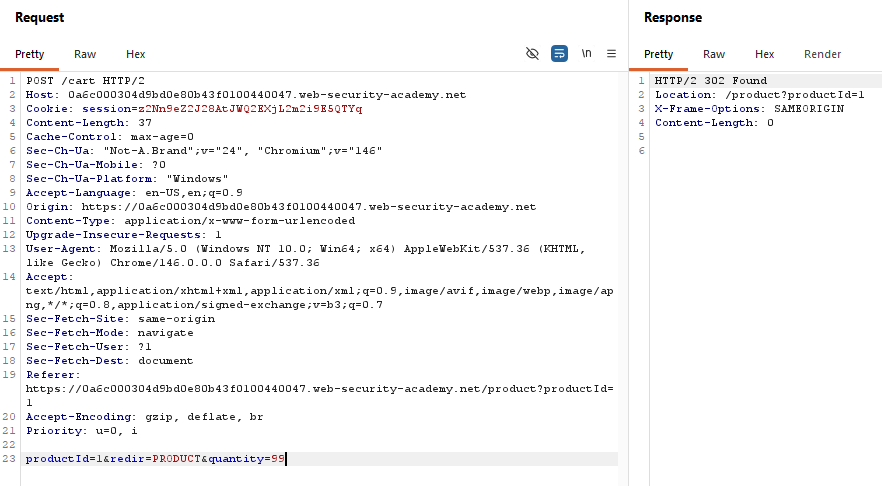

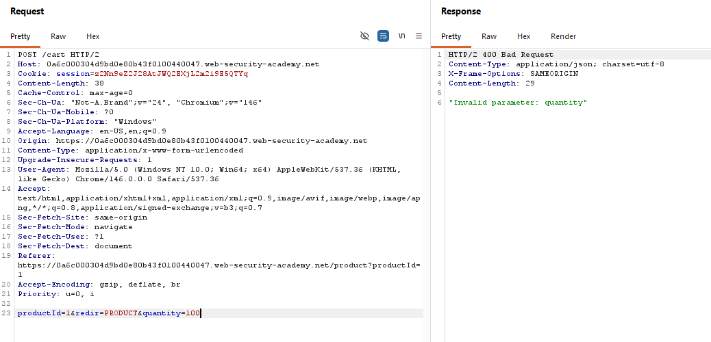

Nếu thay đổi số lượng là 1 giá trị âm nó sẽ thực thi giá trị âm đó.

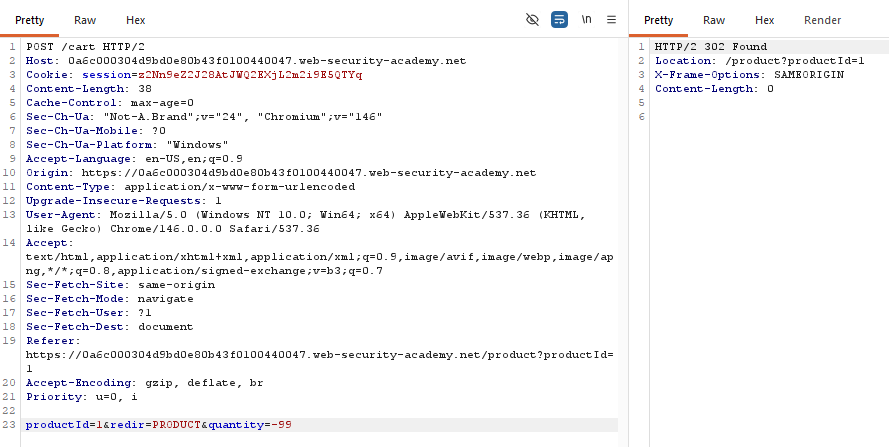

Tính toán số lượng thêm số lượng sản phẩm. Khi thêm nhiều số lượng `Lightweight "l33t" Leather Jacket` thì đến một mức độ nào đó sẽ vượt ngưỡng, tức là dùng kiểu `int`, nên số tiền vượt quá giá trị của int sẽ trả về giá trị âm. Vì vậy cần thêm số lượng sản phẩm để triệt tiêu. Sau đó thực hiện đặt hàng để solve bài lab.

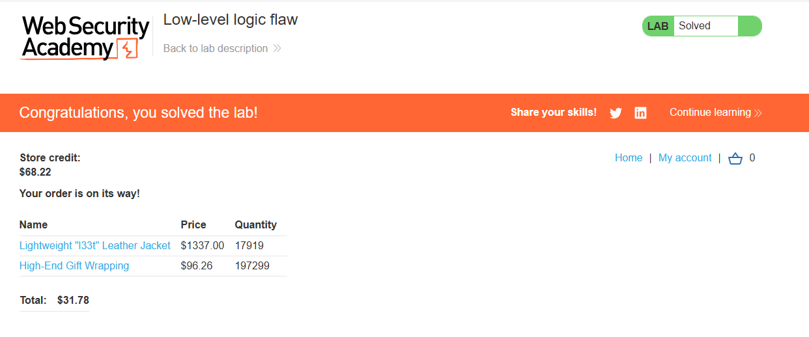

**Lab 4: Inconsistent handling of exceptional input**

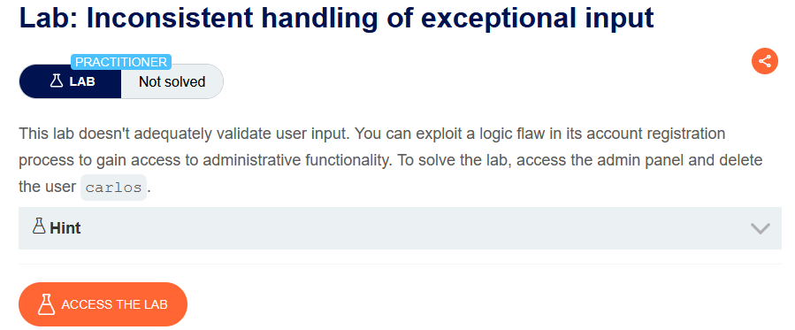

Sử dụng Discover Content phát hiện api `/admin`.

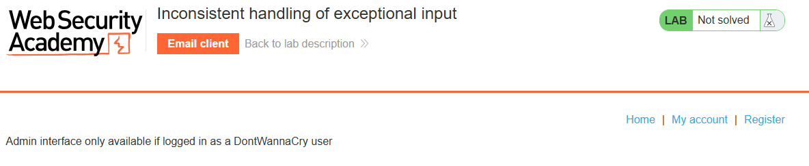

Thực hiện đăng ký bằng tên email rất dài nhưng khi đăng nhập thì đã thấy bị cắt bớt.

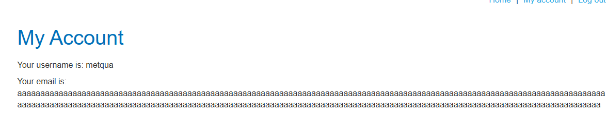

Sửa lại email sao cho đến `@dontwannacry.com` là 255 ký tự. Ta sẽ đăng nhập được vào mail `@dontwannacry.com` và sẽ có panel của admin.

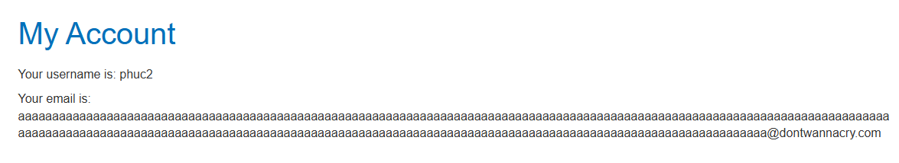

Thực hiện xóa carlos để solve lab.

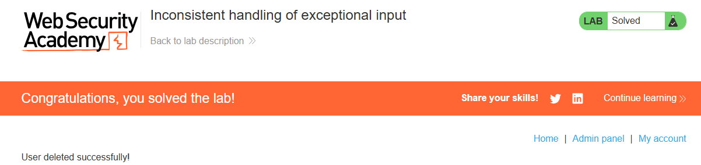

### Đưa ra những giả định sai lầm về hành vi của người dùng

- Giả định sai về hành vi người dùng.
- Root cause của nhiều logic vulnerabilities.
- Không lường trước dangerous scenarios.
- Người dùng có thể không hành động như mong đợi.

#### Người dùng đáng tin cậy không phải lúc nào cũng sẽ tiếp tục đáng tin cậy

- Không nên tin tưởng người dùng mãi mãi.
- Vượt qua kiểm tra ban đầu không đồng nghĩa với việc luôn đáng tin cậy.
- Security controls phải áp dụng nhất quán.
- Các quy tắc bảo mật được kiểm tra ở chỗ này nhưng lại không được kiểm tra ở chỗ khác, từ đó tạo ra kẽ hở.
- Attackers exploit các kẽ hở này.

**Lab 5: Inconsistent security controls**

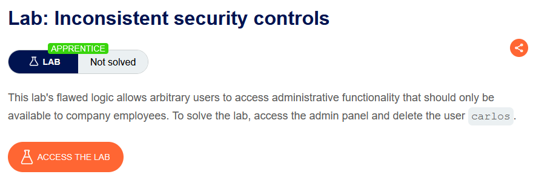

Tiến hành đăng ký tài khoản người dùng.

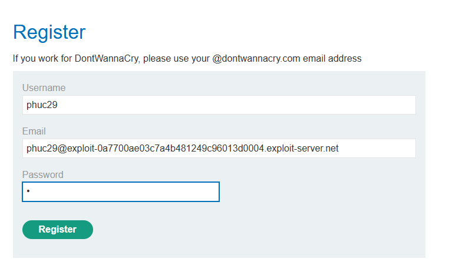

Truy cập vào email client để xác nhận đăng ký thành công. Sau đó update email thành `@dontwannacry.com` sẽ vào được api `admin`.

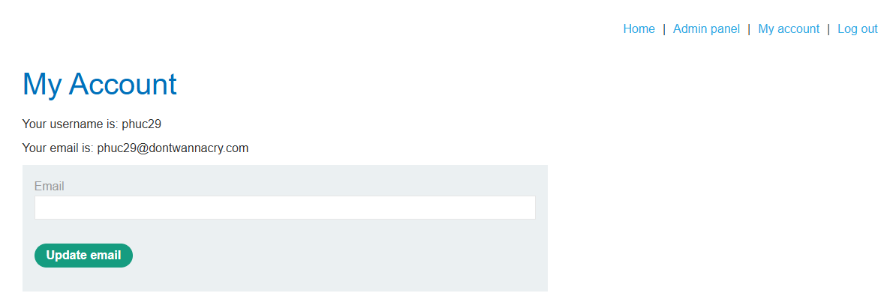

Tiến hành xóa người dùng carlos để solve bài lab.

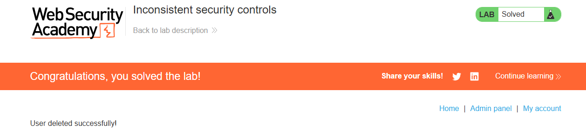

#### Người dùng sẽ không phải lúc nào cũng cung cấp dữ liệu đầu vào bắt buộc

- Không giả định user luôn nhập mandatory input.
- Browser chỉ chặn người dùng bình thường, không chặn attacker.
- Attacker có thể tamper request.
- Có thể xóa value hoặc xóa cả parameter.

Nguyên nhân gây lỗ hổng:

- Một server-side script xử lý nhiều chức năng.
- Parameter có hoặc không có quyết định code path.
- Xóa parameter dẫn đến truy cập code path không mong muốn.

**Lab 6: Weak isolation on dual-use endpoint**

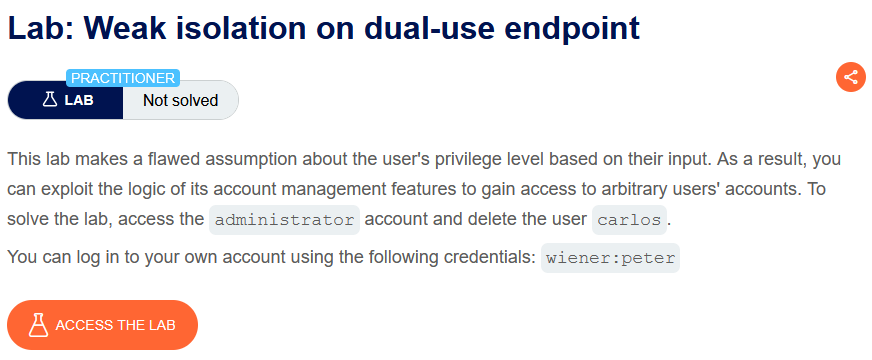

Tiến hành đăng nhập vào tài khoản wiener và thực hiện đổi mật khẩu, tiến hành bắt request đổi mật khẩu trên Burp Suite.

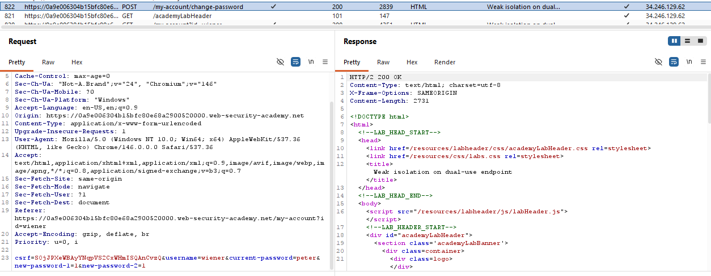

Gửi request này tới Repeater, thử xóa bớt một trường thông tin. Ta thấy nếu xóa current-password thì việc đổi mật khẩu vẫn diễn ra.

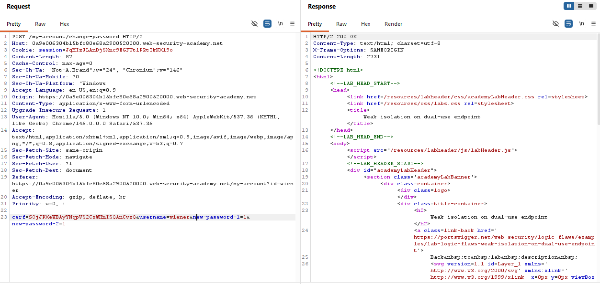

Thay đổi username thành `administrator`, thực hiện thành công sau đó đăng nhập vào tài khoản admin và xóa người dùng carlos.

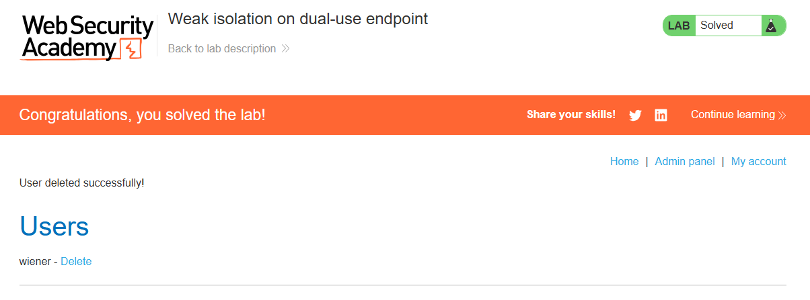

Không giả định user luôn thực hiện đúng thứ tự các bước. Đây là một nguyên nhân phổ biến dẫn đến logic vulnerabilities trong cùng một workflow hoặc chức năng.

Attacker có thể replay request và thay đổi thứ tự gửi request. Sau khi bắt được request bằng Burp Proxy hoặc Repeater, attacker có thể gửi lại request bất kỳ lúc nào và dùng forced browsing để thực hiện các bước theo thứ tự tùy ý, khiến ứng dụng rơi vào unexpected state.

Khi kiểm tra logic vulnerability, hãy thử thay đổi workflow. Có thể bỏ qua một bước, lặp lại một bước, quay lại bước trước hoặc thực hiện các bước sai thứ tự để xem ứng dụng xử lý như thế nào.

Chú ý cách từng bước được truy cập. Một bước có thể được truy cập bằng GET hoặc POST, thông qua URL khác nhau, hoặc cùng một URL nhưng sử dụng các parameter khác nhau.

Luôn xác định giả định của nhà phát triển. Hãy tìm xem ứng dụng đang giả định điều gì, attack surface nằm ở đâu và tìm cách vi phạm các giả định đó.

Việc thay đổi workflow có thể gây lỗi cho ứng dụng. Bạn có thể gặp các trường hợp như null values, uninitialized variables hoặc ứng dụng rơi vào inconsistent state. Đây là hiện tượng thường gặp khi kiểm thử logic.

Đừng bỏ qua các thông báo lỗi. Hãy chú ý error messages và debug information, vì chúng có thể gây information disclosure, giúp hiểu backend behavior và hỗ trợ fine-tune attack để khai thác hiệu quả hơn.

**Lab 7: Insufficient workflow validation**

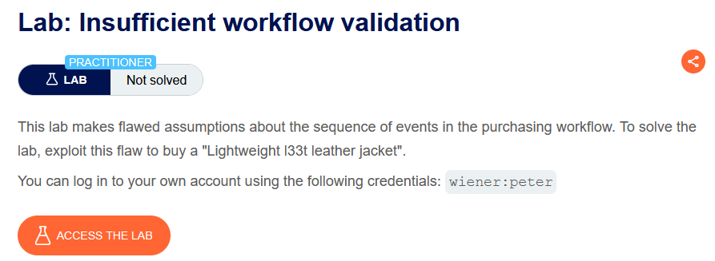

Tiến hành mua 1 sản phẩm thành công, ta bắt request xác nhận mua hàng và gửi tới Repeater.

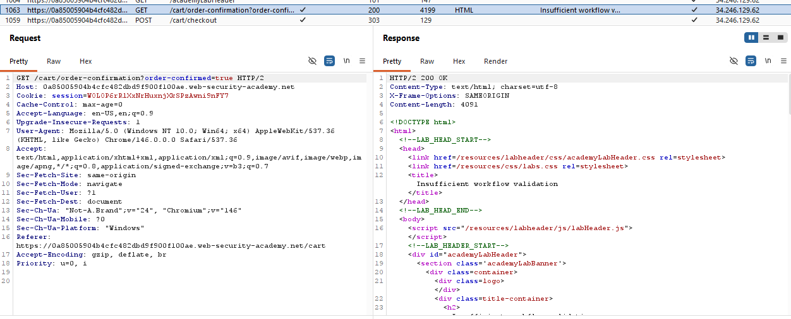

Thêm sản phẩm cần mua vào lại giỏ hàng và tiến hành gửi lại request này thì ta thành công solve được bài lab.

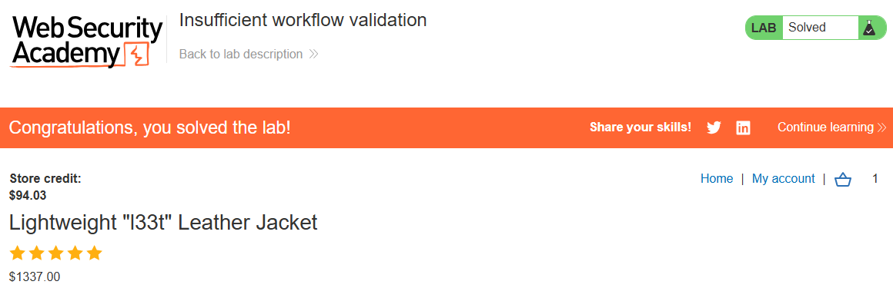

**Lab 8: Authentication bypass via flawed state machine**

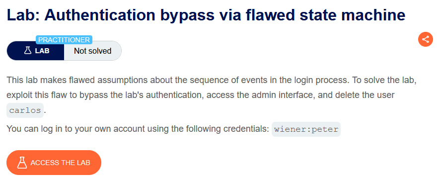

Ta thấy luồng đăng nhập là: nhập username, password -> chọn role -> đăng nhập thành công. Nhận thấy API `/admin` tồn tại.

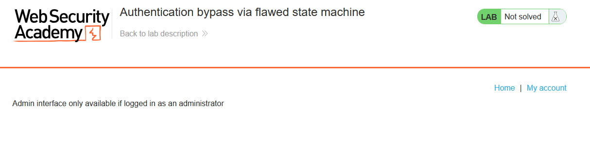

Ta thử bỏ qua bước chọn Role, sau đó nhập lại api `/admin` thì ta thấy đã login vào thành công trang admin, xóa user carlos để solve bài lab.

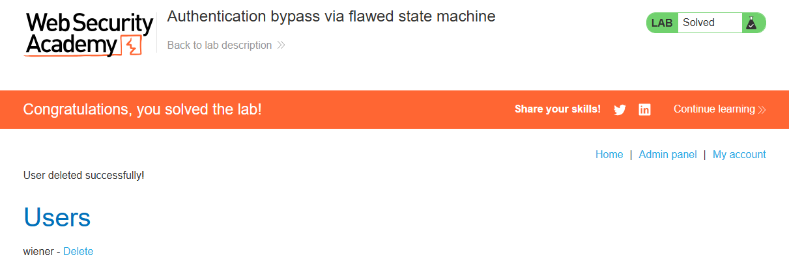

### Các lỗ hổng logic đặc thù theo từng domain

- Lỗ hổng logic thường phụ thuộc vào nghiệp vụ của ứng dụng, không có một mẫu chung cho mọi hệ thống.
- Các chức năng liên quan đến giảm giá, khuyến mãi, điểm thưởng, thanh toán... là những bề mặt tấn công phổ biến vì chúng chứa nhiều logic nghiệp vụ.
- Luôn kiểm tra xem ứng dụng có xác minh lại điều kiện sau khi dữ liệu thay đổi hay không.

Ví dụ:

- Thêm hàng để đủ điều kiện giảm giá.
- Hệ thống áp dụng giảm giá.
- Xóa bớt hàng.
- Nếu hệ thống không kiểm tra lại điều kiện thì vẫn được hưởng giảm giá.

Chú ý đến các giá trị nhạy cảm được thay đổi dựa trên hành động của người dùng.

Cần hiểu:

- Điều kiện để giá trị được thay đổi là gì.
- Thuật toán áp dụng thay đổi như thế nào.
- Thời điểm hệ thống thực hiện việc kiểm tra và cập nhật.

Một hướng khai thác phổ biến là đưa ứng dụng vào một trạng thái mà dữ liệu hiện tại không còn khớp với điều kiện ban đầu, nhưng hệ thống vẫn giữ kết quả đã tính trước đó.

**Lab 9: Flawed enforcement of business rules**

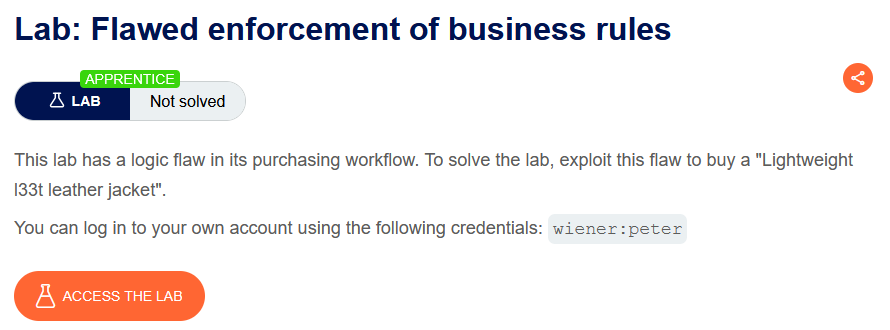

Đăng ký newsletter để nhận thêm voucher.

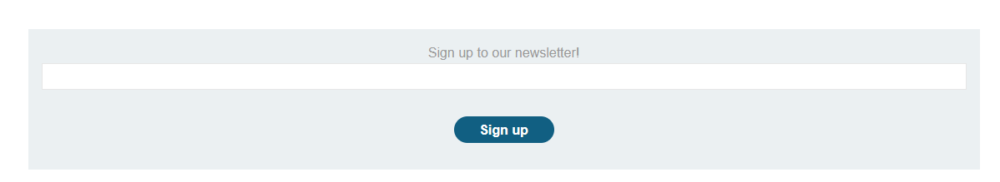

Áp dụng voucher này vào để được giảm giá. Nếu áp dụng cùng một voucher 2 lần liên tiếp thì không được, nhưng nếu áp dụng chúng xen kẽ thì vẫn áp dụng được.

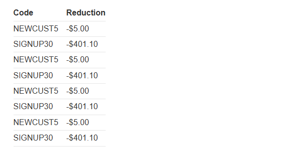

Áp dụng cho đến khi số tiền < 100 và đặt hàng để solve bài lab.

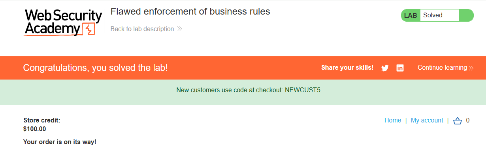

#### Cung cấp mã hóa Oracle

Encryption oracle xảy ra khi ứng dụng cho phép người dùng nhập dữ liệu, mã hóa dữ liệu đó và trả lại ciphertext cho người dùng.

Kẻ tấn công có thể lợi dụng encryption oracle để mã hóa dữ liệu tùy ý bằng đúng thuật toán và khóa mà ứng dụng sử dụng.

Lỗ hổng trở nên nguy hiểm nếu ứng dụng có các chức năng khác chấp nhận dữ liệu được mã hóa bằng cùng thuật toán và cùng khóa.

Attacker có thể tạo ra ciphertext hợp lệ thông qua encryption oracle rồi sử dụng ciphertext này để truy cập hoặc thao túng các chức năng nhạy cảm.

Nếu ứng dụng còn tồn tại decryption oracle, tức là cho phép giải mã dữ liệu do người dùng cung cấp, attacker có thể giải mã dữ liệu để xác định cấu trúc plaintext mà hệ thống mong đợi.

Decryption oracle giúp giảm công sức trong việc tạo payload độc hại nhưng không phải điều kiện bắt buộc để khai thác thành công.

Mức độ nghiêm trọng của encryption oracle phụ thuộc vào số lượng và mức độ nhạy cảm của các chức năng khác sử dụng cùng cơ chế mã hóa với oracle.
