File Upload Vulnerabilities là gì?

Xảy ra khi máy chủ web cho phép người dùng tải tệp lên nhưng không kiểm tra hoặc kiểm tra không đầy đủ.

Các yếu tố cần được kiểm tra:
- Tên tệp
- Loại tệp
- Nội dung tệp
- Kích thước tệp

Nguy cơ:
- Kẻ tấn công có thể tải lên bất kỳ tệp nào, kể cả tệp độc hại.
- Có thể tải lên server-side script (ví dụ: .php, .jsp, .aspx) để thực thi mã trên máy chủ (RCE)

Mức độ ảnh hưởng:
- Chỉ cần upload thành công cũng có thể gây hại (ví dụ: làm đầy dung lượng ổ đĩa)
- Hoặc cần gửi thêm một HTTP request để truy cập tệp đã upload, từ đó kích hoạt việc thực thi mã trên server.

Tác động của lỗ hổng File Upload

Mức độ ảnh hưởng phụ thuộc vào 2 yếu tố chính:
- Website kiểm tra những gì của tệp
- Các hạn chế được áp dụng sau khi tệp được upload thành công.

Trường hợp nghiêm trọng nhất:
- Server không kiểm tra loại tệp.
- Cho phép thực thi các file như .php, .jsp
- Kẻ tấn công upload web shell → RCE → chiếm toàn quyền máy chủ.

Nếu không kiểm tra tên tệp:
- Có thể ghi đè các tệp quan trọng bằng cách upload tệp cùng tên.
- Nếu kết hợp với Directory Traversal, có thể upload tệp vào những thư mục ngoài dự kiến.

Nếu không giới hạn kích thước tệp:
- Kẻ tấn công upload các tệp rất lớn hoặc nhiều tệp.
- Làm đầy dung lượng ổ đĩa → DoS.

Nguyên nhân phát sinh lỗ hổng File Upload

Thông thường, lập trình viên có triển khai cơ chế kiểm tra, nhưng thiết kế sai hoặc có thể bị bypass.

Blacklist không đầy đủ hoặc không an toàn.
- Chỉ chặn một số đuôi file nguy hiểm.
- Bỏ sót các đuôi file khác hoặc xử lý sai khi kiểm tra phần mở rộng

Kiểm tra dựa trên thông tin dễ giả mạo.
- Ví dụ: chỉ kiểm tra MIME Type hoặc các thuộc tính trong HTTP request.
- Kẻ tấn công có thể dễ dàng sửa các giá trị này bằng Burp Suite

Validation không nhất quán.
- Các máy chủ hoặc thư mục khác nhau áp dụng quy tắc kiểm tra khác nhau.
- Sự không đồng nhất này tạo ra các điểm yếu có thể bị khai thác.

Web server xử lý yêu cầu đối với file tĩnh như thế nào?

Trước đây, website chủ yếu gồm các file tĩnh (HTML, CSS, ảnh...), nên URL thường ánh xạ trực tiếp tới file trên hệ thống.

Ngày nay website chủ yếu là website động nên URL không nhất thiết tương ứng với một file thật, nhưng web server vẫn phải xử lý các file tĩnh như CSS, JS, hình ảnh,...

Quy trình xử lý file tĩnh

1. Server nhận HTTP Request.
2. Phân tích đường dẫn (URL).
3. Xác định phần mở rộng của file (extension).
4. So sánh extension với bảng ánh xạ Extension ↔ MIME Type.
5. Quyết định cách xử lý tùy theo loại file và cấu hình server.

TH1: File không thực thi (.jpg, .png, .gif, .css, .html)

Cách xử lý:
- Không thực thi mã.
- Đọc nội dung file.
- Trả nguyên nội dung về cho client trong HTTP Response.

TH2: File thực thi (.php, .jsp, .py, .asp)

Nếu server được cấu hình để chạy:
- Đọc Header.
- Đọc Cookie.
- Đọc GET/POST parameters.
- Gán vào các biến của chương trình.
- Thực thi script.
- Trả kết quả thực thi cho client.

TH3: File thực thi nhưng server không hỗ trợ

Nếu server không được cấu hình chạy loại file đó:
- Thường trả về lỗi (404, 500,...).
- Một số trường hợp cấu hình sai sẽ trả nguyên source code dưới dạng text.
- Có thể dẫn đến Information Disclosure (rò rỉ mã nguồn và thông tin nhạy cảm).

Content-Type Response Header
- Cho biết server cho rằng nó đang trả về loại dữ liệu gì.
- Nếu ứng dụng không tự đặt Content-Type, server sẽ tự xác định dựa trên Extension → MIME Type Mapping.
- Có thể giúp pentester đoán server đang xử lý file như thế nào.

Khai thác tải lên tệp không hạn chế để triển khai một web shell

Tình huống nguy hiểm nhất: 

Website: 
- Cho phép upload các file thực thi (PHP, Java, Python,...).
- Đồng thời server cũng được cấu hình để thực thi các file này.

-> Hacker có thể upload một Web Shell.

Web Shell là gì?
- Là một script độc hại chạy trên web server.
- Cho phép hacker thực thi lệnh từ xa chỉ bằng cách gửi HTTP Request đến file đó.

Sau khi upload Web Shell thành công, Hacker gần như kiểm soát toàn bộ server:
- Đọc file bất kỳ.
- Ghi/chỉnh sửa file.
- Đánh cắp dữ liệu nhạy cảm.
- Upload thêm mã độc.
- Thực thi lệnh hệ điều hành.
- Pivot tấn công sang các máy khác trong mạng nội bộ.
- Dùng server làm bàn đạp tấn công hệ thống khác.

Ví dụ web shell PHP
`<?php
echo file_get_contents('/path/to/target/file');
?>`

Ý nghĩa: 
- file_get_contents() đọc nội dung file trên server.
- echo trả nội dung đó về HTTP Response.
- Sau khi upload và truy cập file PHP này, hacker có thể đọc nội dung file mục tiêu.

Lab 1: Remote code execution via web shell upload

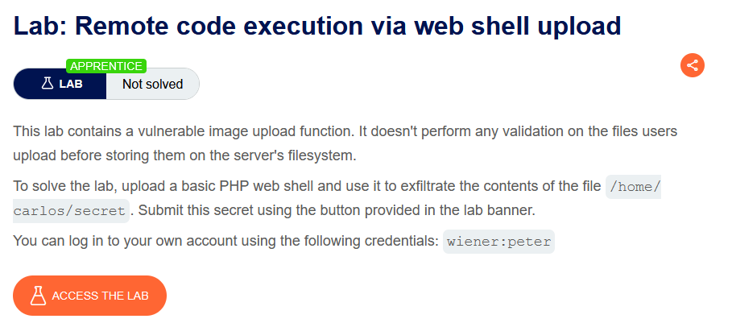

Upload file php có nội dung như sau:

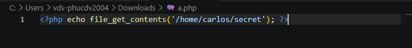

Bắt request upload thành công ta thấy thông điệp secret được phản hồi

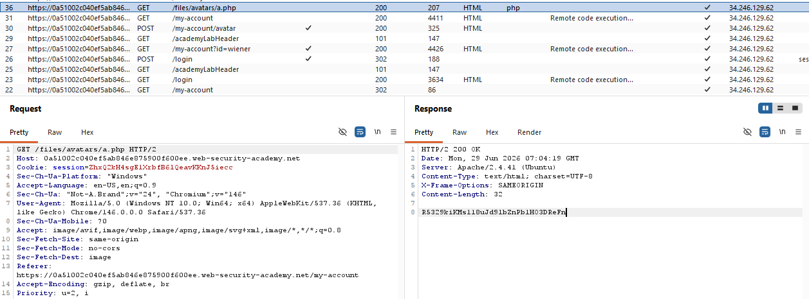

Nộp secret bài lab thành công

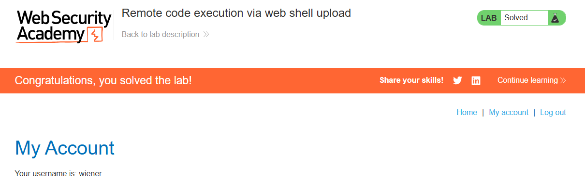

Một web shell linh hoạt hơn có thể như sau: `<?php echo system($_GET['command']); ?>`

Script này cho phép truyền bất kỳ lệnh hệ điều hành nào thông qua tham số command trên URL.

Ví dụ: `GET /example/exploit.php?command=id HTTP/1.1`

Khi đó, server sẽ thực thi lệnh `id` và trả kết quả trong HTTP Response.

Khai thác xác nhận thiếu sót của tập tin tải lên
- Ngoài thực tế, rất hiếm website không có cơ chế bảo vệ upload file.
- Tuy nhiên, có cơ chế bảo vệ không đồng nghĩa với an toàn.
- Nếu việc kiểm tra được triển khai sai, hacker vẫn có thể:
    - Bypass cơ chế kiểm tra.
    - Upload web shell.
    - Thực hiện Remote Code Execution (RCE).

Flawed file type validation

Khi submit form thông thường, trình duyệt thường gửi dữ liệu bằng: `Content-Type: application/x-www-form-urlencoded`

Phù hợp với dữ liệu nhỏ như: username, password, email, địa chỉ

Khi upload file, đối với dữ liệu nhị phân như: ảnh, pdf, video, file word

Trình duyệt sử dụng `Content-Type: multipart/form-data`

multipart/form-data hoạt động như thế nào?

Body của HTTP Request được chia thành nhiều phần, mỗi input trong form sẽ là một part riêng. VD: Image -> Description -> Username

Ví dụ request: `POST /images HTTP/1.1
Content-Type: multipart/form-data` gồm:

Part 1: `Content-Disposition:
name="image"
filename="example.jpg"
Content-Type: image/jpeg`
-> Chứa nội dung file ảnh

Part 2: `Content-Disposition:
name="description"` -> Chứa mô tả

Part 3: `Content-Disposition:
name="username"` -> Chứa username.

Content-Disposition

Header này cho server biết:
- Đây là field nào.
- Tên file upload.
- Thuộc input nào.

Cách website thường kiểm tra file upload

Một số website chỉ kiểm tra `Content-Type:` nếu thấy `image/jpeg` -> Cho phép upload.

Nếu thấy `application/php` -> Từ chối

Lỗ hổng nằm ở đâu?

Nhiều server tin tưởng hoàn toàn giá trị Content-Type do client gửi lên. Trong khi: 
- Browser gửi giá trị này.
- Burp Suite có thể sửa giá trị này.
- Hacker có toàn quyền chỉnh sửa.

Server cần làm:
- Kiểm tra phần mở rộng file (extension).
- Kiểm tra MIME Type thực tế.
- Kiểm tra magic bytes / file signature.
- Kiểm tra nội dung file có đúng là ảnh hay không.
- Đổi tên file khi lưu.
- Không cho thực thi file upload.

Lab 2: Web shell upload via Content-Type restriction bypass

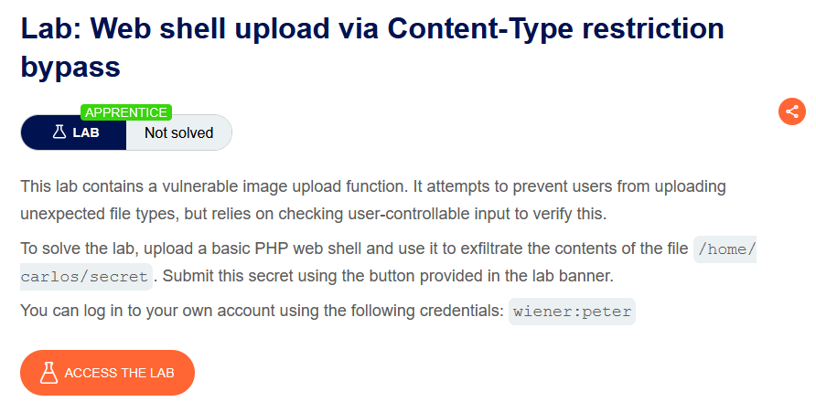

Upload lại file php với nội dung:

Thông báo `Sorry, file type application/octet-stream is not allowed Only image/jpeg and image/png are allowed Sorry, there was an error uploading your file.`

Bắt request upload ảnh và gửi đến Repeater

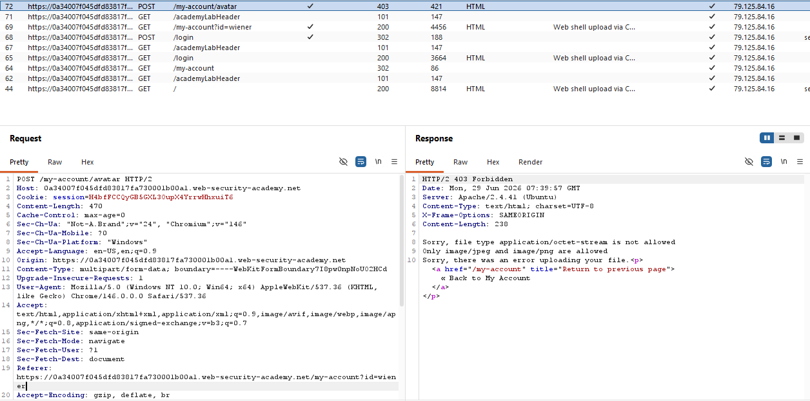

Sửa lại Content-Type thành image/png

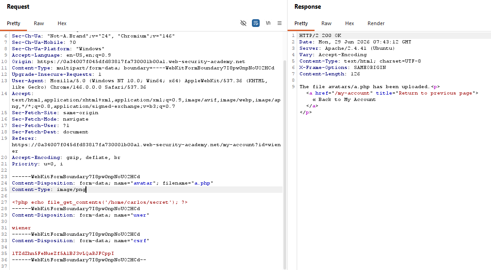

Quay lại Proxy/HTTP history và bắt request upload thành công file web shell và đọc được nội dung file `/home/carlos/secret`

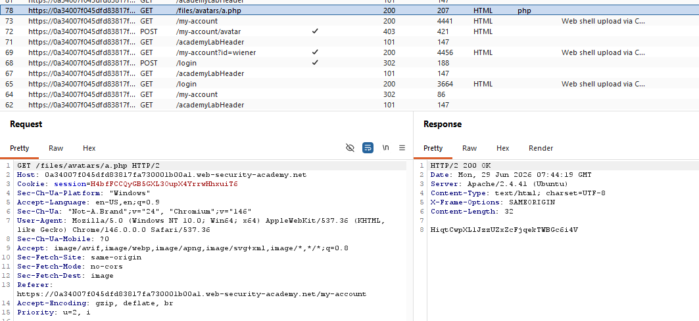

Submit secret thu được và thành công giải được bài lab

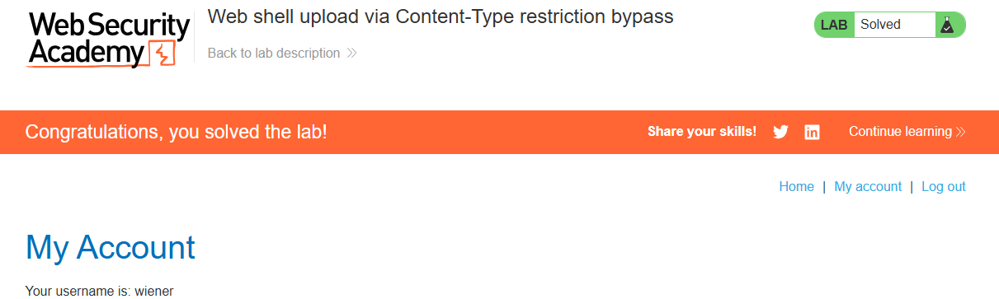

Ngăn chặn việc thực thi tệp trong các thư mục có thể truy cập của người dùng

Ngoài việc ngăn upload các file nguy hiểm, một lớp bảo vệ quan trọng khác là không cho phép server thực thi các file do người dùng upload. 

Mục tiêu: Dù hacker upload được file .php, .jsp,... thì file đó cũng không được chạy. 

Thông thường server chỉ thực thi các loại script đã được cấu hình rõ ràng.

Nếu một loại file không được phép thực thi, server sẽ:
- Trả lỗi.
- Hoặc trả nguyên nội dung file dưới dạng plain text.

Cấu hình thực thi có thể khác nhau giữa các thư mục

Không phải mọi thư mục đều có cấu hình giống nhau. Ví dụ thư mục upload thường:
- Không cho chạy PHP.
- Không cho chạy JSP.
- Chỉ dùng để lưu file người dùng upload.

Thư mục ứng dụng: `/var/www/html/
/admin/
/cgi-bin/` thường:
- Cho phép thực thi script.
- Chứa mã nguồn của website.

Khả năng khai thác

Nếu hacker tìm được cách upload file vào một thư mục khác, nơi server được phép thực thi script, thì:
- Web Shell vẫn có thể chạy.
- Dẫn đến Remote Code Execution.

Tip: Trong request multipart/form-data, trường `filename=` không chỉ là tên file hiển thị.

Nhiều web server sử dụng giá trị này để xác định:
- Tên file sẽ được lưu.
- Vị trí lưu file trên server.

Reverse Proxy và Backend Server
- Người dùng thường chỉ gửi request đến một domain.
- Domain này có thể trỏ đến Reverse Proxy.
- Reverse Proxy sẽ chuyển request đến các backend server phía sau.
- Mỗi backend server có thể có cấu hình khác nhau.

Ý nghĩa khi pentest:
- Cùng một request nhưng các backend khác nhau có thể phản hồi khác nhau.
- Có thể khai thác sự khác biệt về cấu hình giữa các server.

Lab 3*: Web shell upload via path traversal

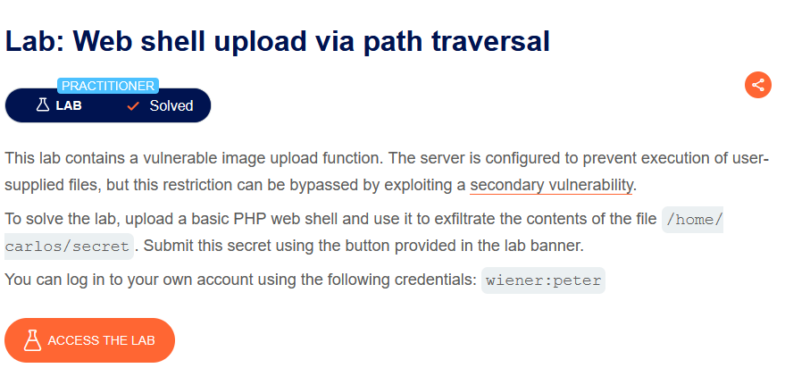

Đăng nhập vào tài khoản wiener, upload file php như 2 bài trên. Bấm `Back to My Account` và bắt request sau khi đã upload file ảnh thành công

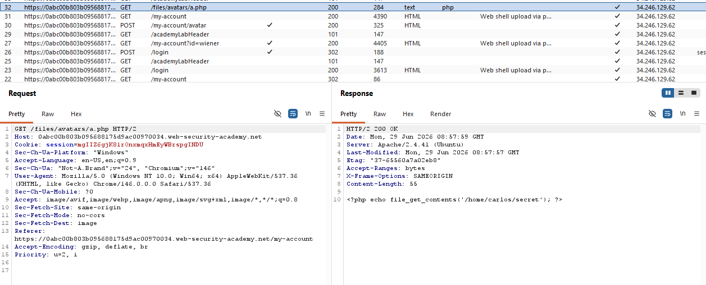

Gửi đến Repeater, đưa về file /files/a.php

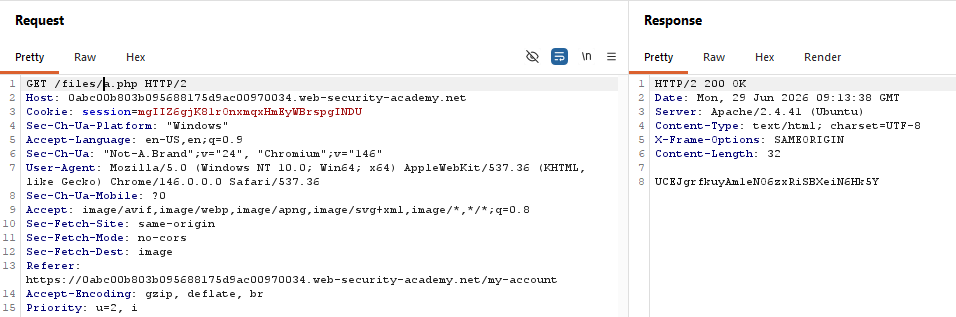

Nộp secret này để giải quyết bài lab

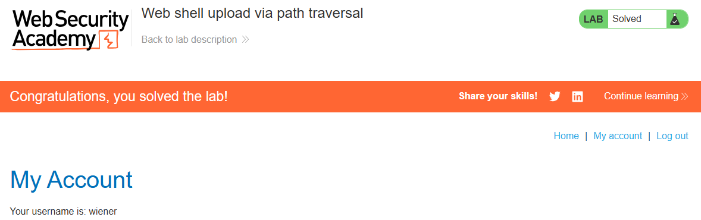

Insufficient blacklisting of dangerous file types

Website chặn upload các phần mở rộng nguy hiểm bằng danh sách cấm. Ví dụ: .php, .jsp, .asp, .py

Vì sao Blacklist không an toàn?
- Rất khó liệt kê hết tất cả phần mở rộng có thể thực thi mã.
- Hacker có thể dùng các đuôi thay thế mà server vẫn thực thi.

Ví dụ blacklist chặn .php thì upload .php5 thì vẫn chạy trên một số server

Ngoài cấu hình toàn cục, nhiều web server cho phép ghi đè cấu hình theo từng thư mục.

Lỗ hổng có thể xảy ra

Thông thường:
- Không thể truy cập các file cấu hình này qua HTTP
- Người dùng cũng không được phép upload chúng

Tuy nhiên, nếu website cho phép upload:
- .htaccess
- web.config

thì hacker có thể thay đổi cách server xử lý file.

VD: Website blacklist: .php -> Không upload được. Nhưng hacker upload `.htaccess` với nội dung `AddType application/x-httpd-php .abc`

Sau đó upload: shell.abc

Server sẽ hiểu: .abc = PHP và thực thi shell.abc như 1 file php

Lab 4: Web shell upload via extension blacklist bypass

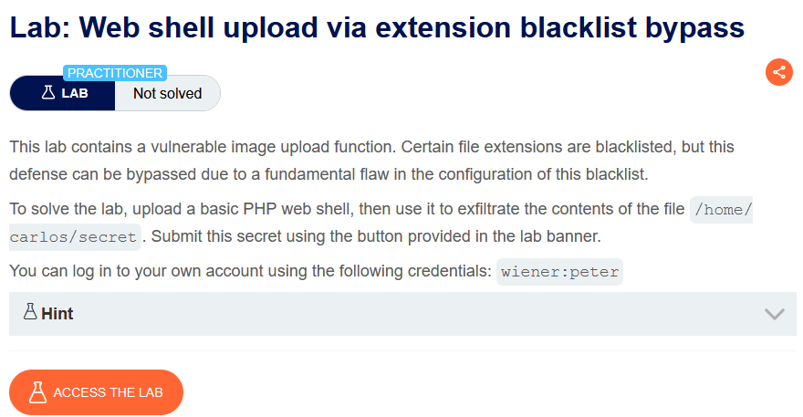

Upload file text và xem response ta thấy upload thành công

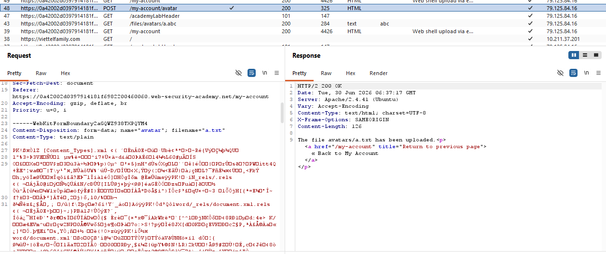

Tiến hành sửa nội dung với tên file là `.htaccess` và nội dung file `AddType application/x-httpd-php .abc`, ý là Hãy xử lý tất cả các file có đuôi .abc như file PHP.

Apache có một cơ chế đặc biệt: mỗi khi xử lý một thư mục, nó sẽ tự động tìm một file cấu hình có tên chính xác là .htaccess. Nếu tìm thấy file này, Apache sẽ đọc các cấu hình bên trong và áp dụng chúng cho thư mục đó.

Khi người dùng truy cập a.abc, Apache sẽ đọc .htaccess trước, sau đó áp dụng các cấu hình trong file này.

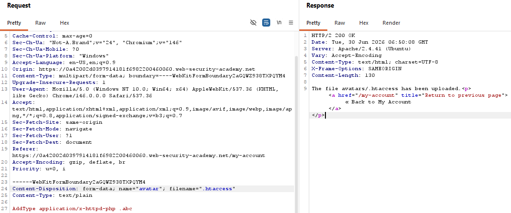

Thực hiện upload file a.php, thực hiện đổi đuôi .php thành .abc

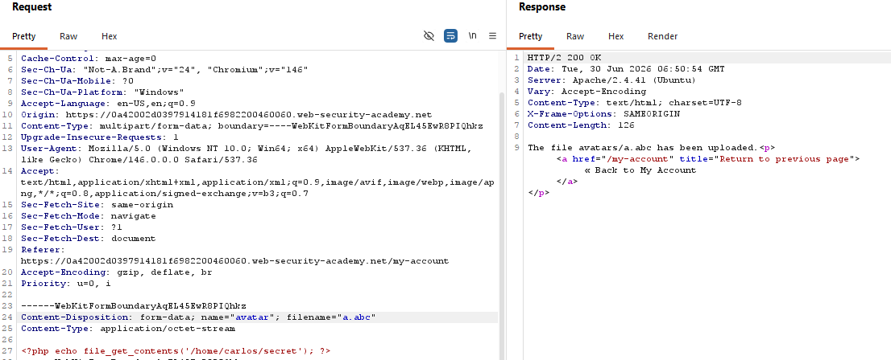

Mở request này trên trình duyệt sau đó bắt gói tin  upload thành công file `a.abc` thì sexthu được secret

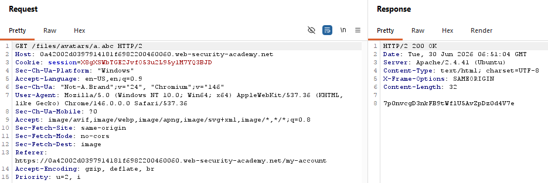

Submit bài lab sẽ được hoàn thành

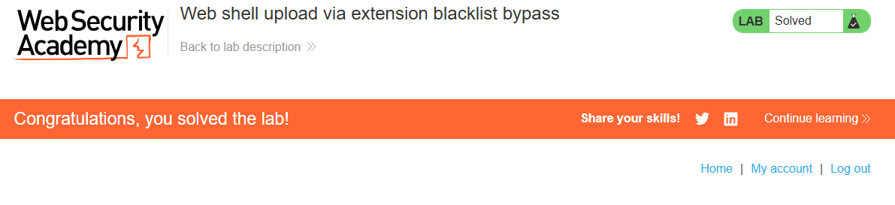

Làm rối phần mở rộng của tệp

Thay đổi chữ hoa/chữ thường
- Nếu bộ lọc phân biệt hoa/thường:
- exploit.pHp → vẫn có thể được server xử lý là .php.

Dùng nhiều phần mở rộng
- Thêm nhiều đuôi file để đánh lừa bộ lọc.
- Ví dụ: exploit.php.jpg

Thêm ký tự ở cuối
- Một số server tự bỏ dấu chấm hoặc khoảng trắng cuối tên file.
- Ví dụ: exploit.php.

URL encode hoặc double URL encode
- Mã hóa dấu . hoặc / để bộ lọc không nhận ra, nhưng server sẽ giải mã khi xử lý.
- Ví dụ: exploit%2Ephp

Chèn dấu ; hoặc Null Byte (%00)
- Khai thác sự khác nhau giữa cách ứng dụng và server xử lý tên file.
- VD:
    - exploit.asp;.jpg
    - exploit.asp%00.jpg

Dùng Unicode đa byte
- Một số ký tự Unicode sau khi chuyển đổi có thể trở thành dấu . hoặc NULL, giúp vượt qua bộ lọc.

Bypass cơ chế xóa đuôi file
- Nếu hệ thống chỉ xóa .php một lần (không đệ quy), có thể chèn đuôi để sau khi xóa vẫn còn .php.
- VD: exploit.p.phphp -> xóa ".php" -> exploit.p.php

Lab 5*: Web shell upload via obfuscated file extension

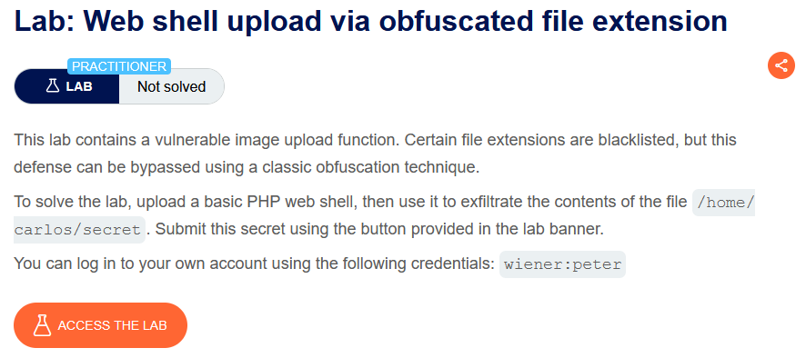

Ta thấy thông báo chỉ nhận file có đuôi là jpg hoặc png khi thực hiện upload file php

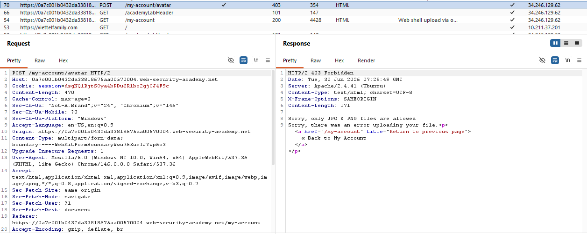

Tiến hành sửa đuôi .php thành %00.jpg

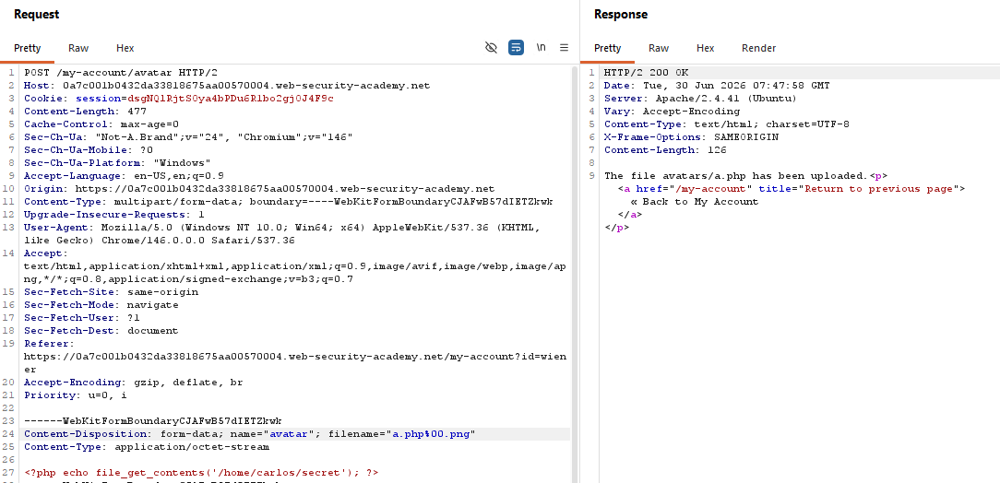

Upload file thành công tiến hành xem secret

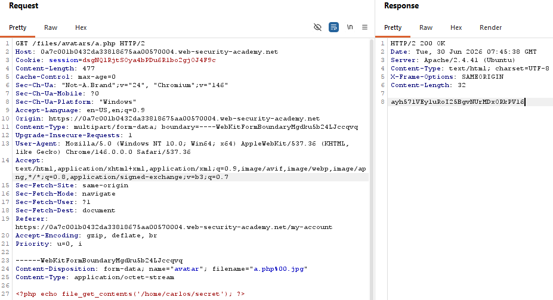

Tiến hành nộp secret để solve bài lab

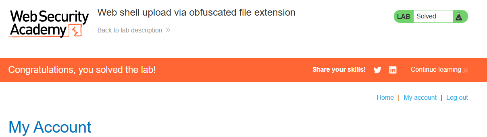

Kiểm tra nội dung file

Không tin Content-Type trong request.
- Server sẽ kiểm tra nội dung thực tế của file để xác định đúng loại file.

Kiểm tra thuộc tính đặc trưng của file
- Ví dụ với ảnh: kiểm tra kích thước
- Nếu upload file PHP → không có kích thước ảnh → từ chối.

Kiểm tra "magic bytes"
- Mỗi định dạng file thường có chuỗi byte đặc trưng ở đầu hoặc cuối file.
- VD: JPEG luôn bắt đầu bằng: FF D8 FF
- Nếu chữ ký không đúng → từ chối upload.

Vẫn có thể bị bypass
- Dùng công cụ như ExifTool để tạo polyglot file (một file vừa là ảnh hợp lệ, vừa chứa mã độc trong metadata).
- File vẫn vượt qua kiểm tra nhưng có thể thực thi mã độc nếu server xử lý không an toàn.

Lab 6: Remote code execution via polyglot web shell upload

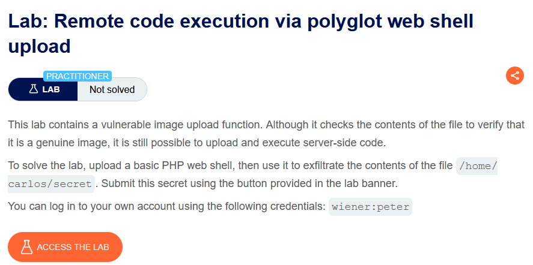

Thực hiện upload 1 file thay vì ảnh, sẽ bị kiểm tra và từ chối

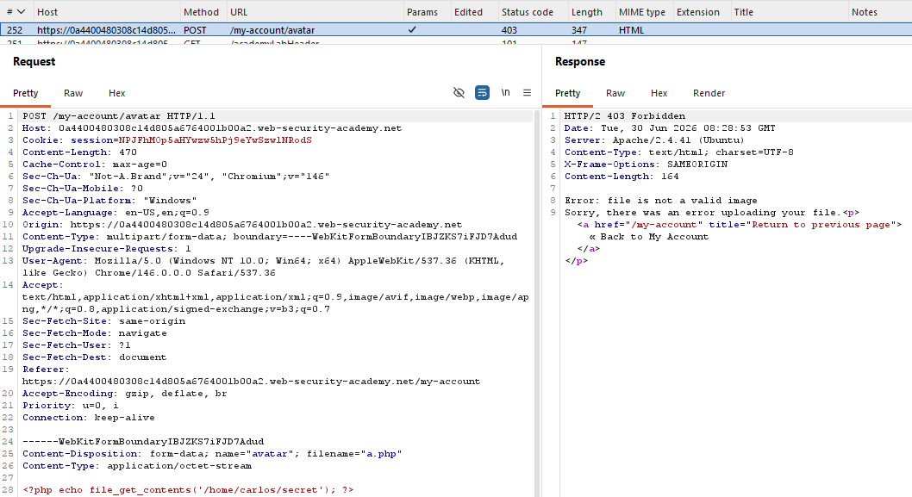

Tiến hành sử dụng ảnh .jpg, sử dụng exiftool để tạo polyglot file mục đích tạo file gồm hình ảnh và thêm vào trường comment đoạn mã PHP: `<?php echo 'START ' . file_get_contents('/home/carlos/secret') . ' END'; ?>`

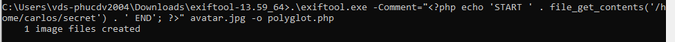

Thực hiện upload file polyglot.php thành công 

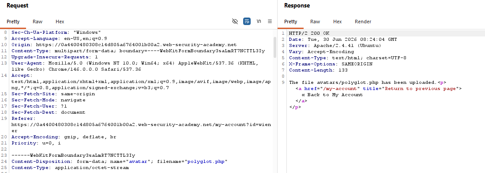

Tiến hành tìm secret và submit để solve bài lab

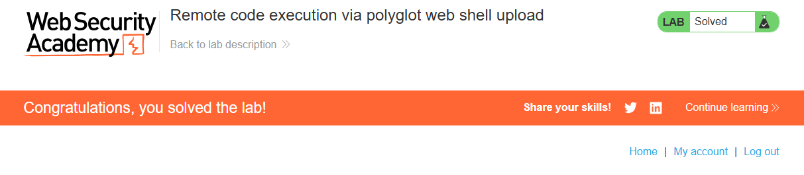

Khai thác Race Condition trong upload file

Framework hiện đại an toàn hơn
- Upload file vào thư mục tạm (sandbox).
- Đổi tên ngẫu nhiên.
- Kiểm tra hợp lệ rồi mới chuyển sang thư mục chính.

Lỗi do lập trình viên tự xử lý upload
- Tự viết cơ chế upload dễ tạo race condition (lỗi tranh chấp thời gian).
- Có thể bypass cả các cơ chế kiểm tra mạnh.

Ví dụ điển hình
- File được lưu ngay vào thư mục chính.
- Sau đó mới quét virus hoặc kiểm tra.
- Nếu không hợp lệ mới xóa.

⇒ Trong khoảng thời gian rất ngắn (vài ms), file vẫn tồn tại và có thể bị truy cập/thực thi.

Khó phát hiện
- Race condition thường rất tinh vi.
- Khó tìm bằng black-box testing, trừ khi có thể xem hoặc rò rỉ mã nguồn.

