Information Disclosure là gì?

Information Disclosure là lỗ hổng khiến website vô tình tiết lộ thông tin nhạy cảm cho người dùng.

Website có thể làm lộ những gì?

Thông tin người dùng (username, thông tin tài chính, dữ liệu cá nhân)

Thông tin doanh nghiệp (Dữ liệu nội bộ, bí mật kinh doanh)

Thông tin kỹ thuật (phiên bản server, framework, hđh, đường dẫn file, cấu trúc thư mục, API, endpoint, stack trace)

Lộ thông tin kỹ thuật rất nguy hiểm vì hacker có thể:
- Hiểu hệ thống đang dùng gì.
- Mở rộng bề mặt tấn công (Attack Surface).
- Kết hợp với các lỗ hổng khác để tạo thành cuộc tấn công nghiêm trọng.

Có hai trường hợp Information Disclosure xảy ra:
1. Lộ ngay khi dùng bình thường
2. Phải chủ động khai thác

Ví dụ về Information Disclosure
- Lộ thư mục ẩn (robots.txt, directory listing)
- Lộ mã nguồn qua file backup
- Lộ thông tin database qua lỗi
- Lộ dữ liệu nhạy cảm
- Hard-code thông tin bí mật trong source code
- Lộ thông tin qua hành vi của ứng dụng

Cách kiểm tra Information Disclosure

Khi pentest đừng chỉ tập trung vào một lỗ hổng. Trong lúc kiểm tra XSS, SQLi, Path Traversal,...có thể vô tình phát hiện Information Disclosure. Luôn quan sát mọi thông tin mà website trả về.

Các kỹ thuật phát hiện Information Disclosure
- Fuzzing
- Burp Scanner
- Burp Engagement Tools
- Engineering Informative Responses

Error Messages
- Verbose Error Messages là nguyên nhân phổ biến gây Information Disclosure.
- Luôn quan sát kỹ mọi thông báo lỗi

Thông tin có thể bị lộ
- Kiểu dữ liệu mà tham số mong đợi.
- Giá trị đầu vào hợp lệ/không hợp lệ.
- Tên tham số có thể khai thác.

Tiết lộ công nghệ
- Tên Template Engine.
- Loại Database.
- Web Server.
- Framework.
- Phiên bản (Version) của các công nghệ.

Lab 1: Information disclosure in error messages

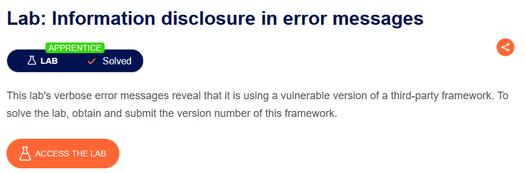

Bắt request xem 1 sản phẩm rồi gửi đến Repeater và sửa lại tham số `productId` mục đích để báo lỗi

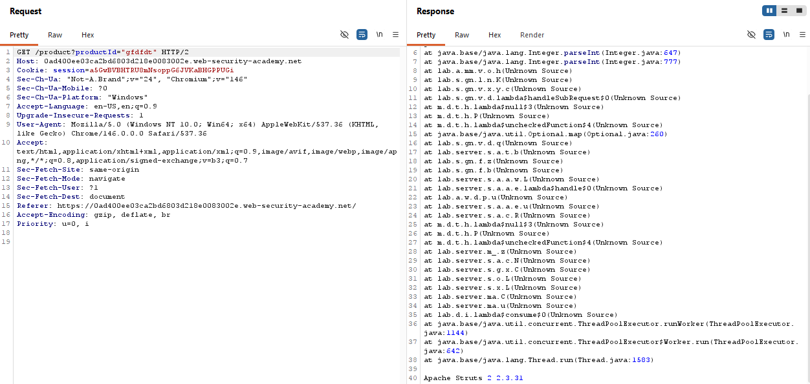

Thấy phiên bản của apache submit để solve bài lab

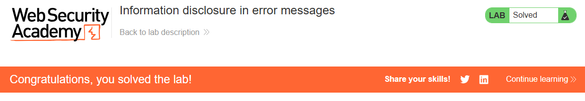

Lab 2: Information disclosure on debug page

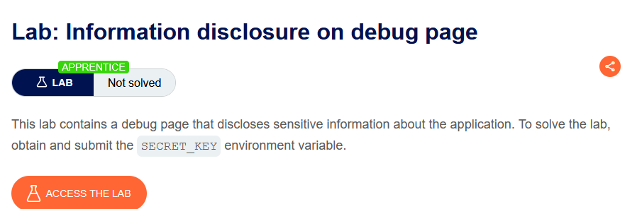

Kiểm tra response

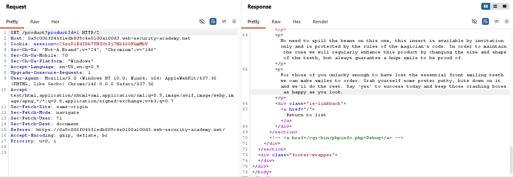

Truy cập vào url debug

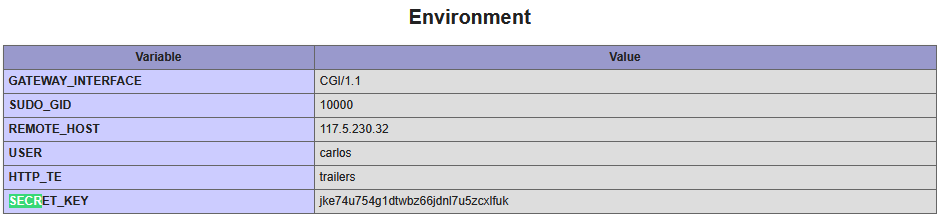

Submit secret_key

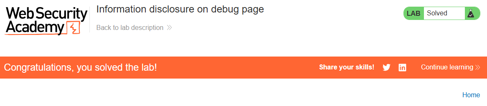

Lab 3: Source code disclosure via backup files

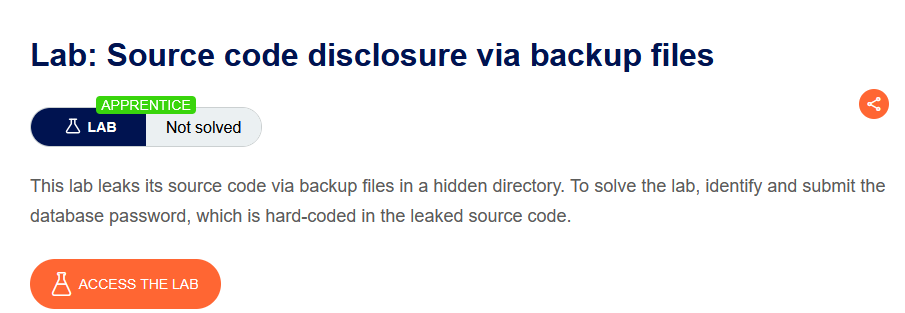

Truy cập vào file robots.txt lấy được endpoint `/backup`, truy cập vào trang backup

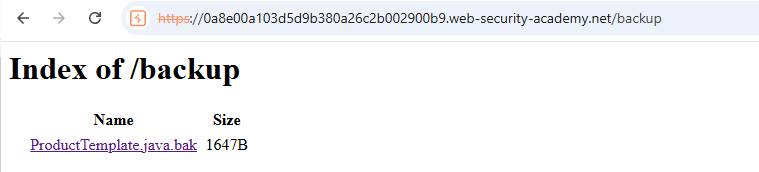

Truy cập vào file và tìm mật khẩu:

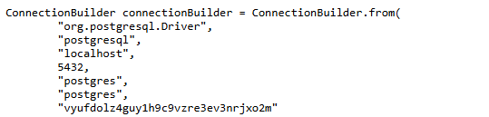

Submit mật khẩu để solve bài lab

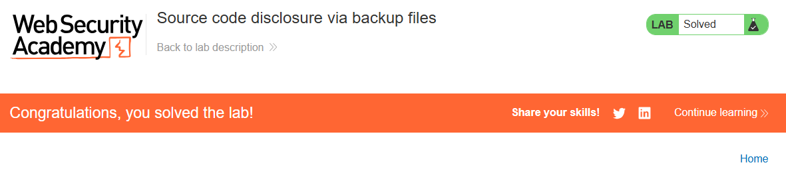

Information Disclosure do cấu hình không an toàn
- Cấu hình sai là nguyên nhân phổ biến gây Information Disclosure.
- Thường xảy ra khi sử dụng các công nghệ/framework bên thứ ba với nhiều tùy chọn cấu hình phức tạp.
- Nhà phát triển có thể quên tắt các tính năng Debug khi đưa ứng dụng lên môi trường Production

VD: HTTP TRACE
- HTTP TRACE là phương thức HTTP dùng để chẩn đoán.
- Nếu được bật, server sẽ trả lại nguyên vẹn HTTP Request mà nó nhận được.

Lab 4: Authentication bypass via information disclosure

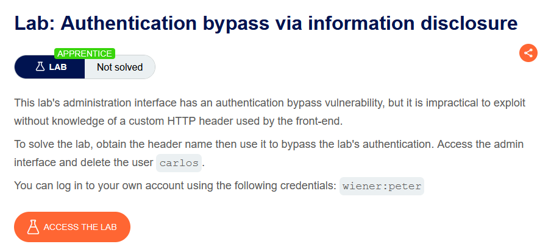

Thực hiện truy cập vào api `/admin`

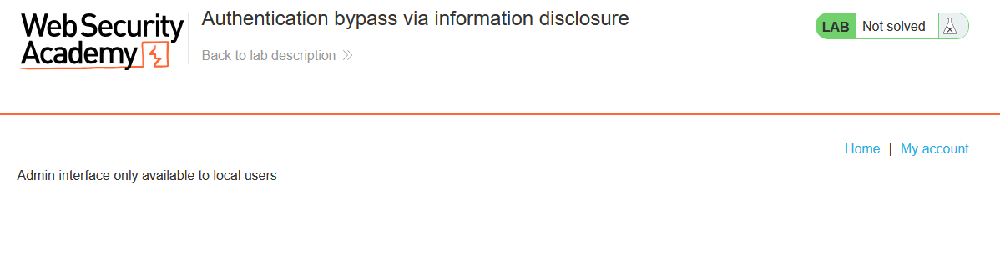

Đổi phương thức GET thành TRACE để chẩn đoán và gỡ lỗi. Nó yêu cầu server phản hồi lại chính xác request mà client đã gửi, giúp kiểm tra request đã bị thay đổi như thế nào trên đường đi.

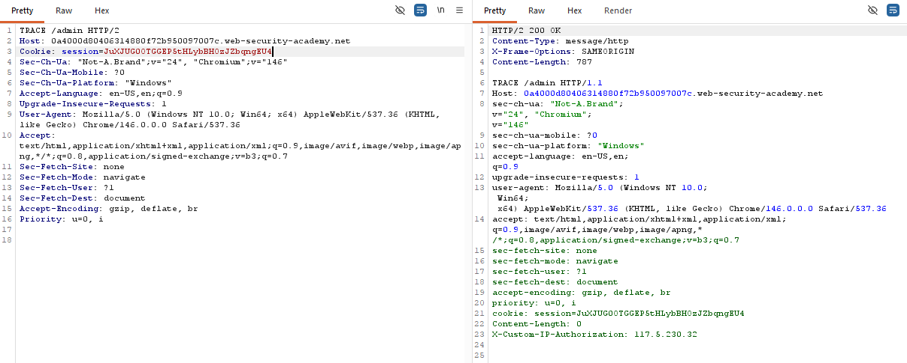

Sửa lại request

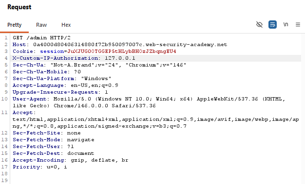

Lỗi Backend không kiểm tra header này do ai gửi, nó chỉ đọc request.headers["X-Custom-IP-Authorization"]

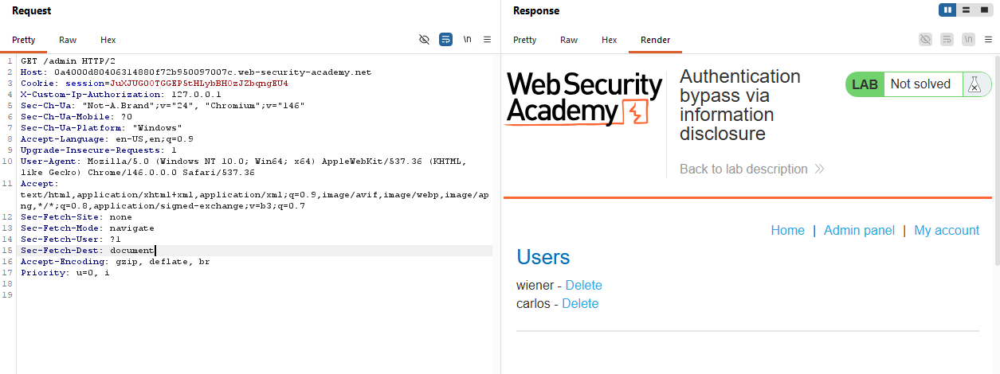

Thực hiện xóa carlos để solve được bài lab, thêm header `X-Custom-Ip-Authorization: 127.0.0.1` vào request xóa carlos, sau đó bài lab được hoàn thành

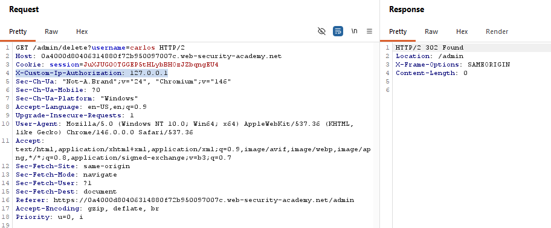
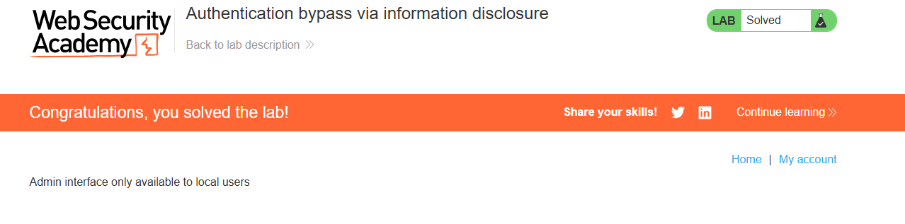

Lab 5: Information disclosure in version control history

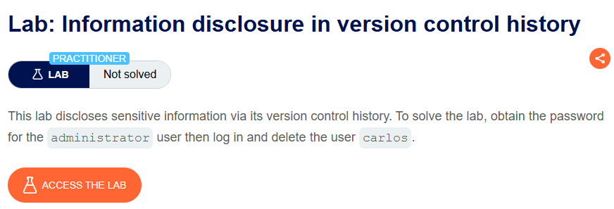

Truy cập vào thư mu7jc `/.git` sau đó tải về

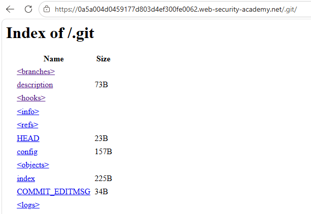

Truy cập vào thư mục `logs` sau đó kiểm tra thấy có log gỡ mật khẩu

Thực hiện show lần commit này, ta tìm được mật khẩu admin

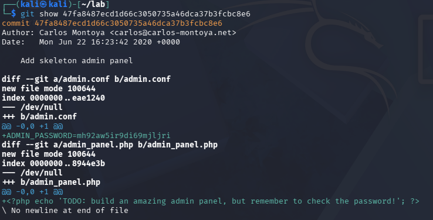

Vào trang admin, xóa carlos để solve bài lab

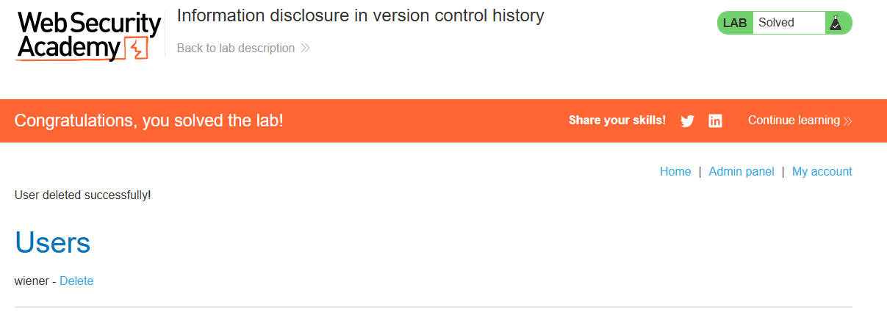

