## NoSQL injection
NoSQL injection là một lỗ hổng bảo mật mà tại đó kẻ tấn công có thể can thiệp vào các truy vấn mà ứng dụng gửi tới cơ sở dữ liệu NoSQL. Lỗ hổng NoSQL injection có thể cho phép kẻ tấn công:
- Vượt qua các cơ chế xác thực hoặc các cơ chế bảo vệ.
- Trích xuất hoặc chỉnh sửa dữ liệu
- Gây ra tình trạng từ chối dịch vụ (DoS)
- Thực thi mã trên máy chủ.

Cơ sở dữ liệu NoSQL lưu trữ và truy xuất dữ liệu theo định dạng khác với các bảng quan hệ truyền thống của SQL. Thay vì sử dụng một chuẩn truy vấn thống nhất như SQL, NoSQL sử dụng nhiều ngôn ngữ truy vấn khác nhau và có ít ràng buộc về quan hệ dữ liệu hơn.

## Các loại NoSQL Injection
Nhìn chung, NoSQL Injection có thể được chia thành các dạng chính sau:
- NoSQL injection trong cú pháp truy vấn: Kẻ tấn công chèn dữ liệu đầu vào độc hại để thay đổi cấu trúc của truy vấn NoSQL.
- NoSQL injection bằng toán tử: Kẻ tấn công lợi dụng các toán tử đặc biệt của NoSQL (chẳng hạn như $ne, $gt, $regex, $where,...) để thay đổi logic của truy vấn mà không cần phá vỡ cú pháp.
- Blind NoSQL injection: Ứng dụng không trả về lỗi hoặc dữ liệu trực tiếp, nhưng kẻ tấn công vẫn có thể suy luận thông tin từ phản hồi của ứng dụng hoặc sự khác biệt về thời gian xử lý.

Tương tự như SQL Injection, mỗi loại NoSQL Injection có kỹ thuật khai thác và mức độ ảnh hưởng khác nhau, nhưng đều xuất phát từ việc ứng dụng không kiểm soát đúng dữ liệu đầu vào trước khi đưa vào truy vấn cơ sở dữ liệu.

## Chèn mã vào cú pháp NoSQL

Có thể phát hiện các lỗ hổng NoSQL Injection bằng cách thử làm hỏng cú pháp của truy vấn cơ sở dữ liệu.

Kiểm tra một cách có hệ thống từng đầu vào bằng cách gửi các fuzz string và ký tự đặc biệt. Nếu ứng dụng không làm sạch hoặc không lọc dữ liệu đầu vào một cách đầy đủ, các chuỗi này có thể khiến cơ sở dữ liệu:
- Phát sinh lỗi
- Có một hành vi khác có thể quan sát được

Nếu biết ngôn ngữ API mà cơ sở dữ liệu mục tiêu sử dụng, hãy dùng các ký tự đặc biệt và fuzz string phù hợp với ngôn ngữ đó.

Ngược lại, nếu không biết cơ sở dữ liệu đang sử dụng API nào, hãy sử dụng nhiều loại fuzz string khác nhau để kiểm tra đồng thời nhiều ngôn ngữ API.

### Phát hiện Syntax Injection trong MongoDB

Khi người dùng chọn danh mục Fizzy drinks, trình duyệt sẽ gửi yêu cầu sau: `https://insecure-website.com/product/lookup?category=fizzy`

Điều này khiến ứng dụng gửi một truy vấn đến cơ sở dữ liệu MongoDB để lấy các sản phẩm phù hợp từ collection product: `this.category == 'fizzy'`

Để kiểm tra liệu tham số đầu vào có thể bị NoSQL Injection hay không, hãy gửi một fuzz string trong giá trị của tham số category. Một ví dụ về fuzz string dành cho MongoDB là:
```
'"`{
;$Foo}
$Foo \xYZ
```

Sử dụng fuzz string này để tạo payload tấn công sau: `https://insecure-website.com/product/lookup?category='%22%60%7b%0d%0a%3b%24Foo%7d%0d%0a%24Foo%20%5cxYZ%00`

Nếu payload trên làm cho phản hồi của ứng dụng khác với phản hồi ban đầu, điều đó có thể cho thấy rằng:
- Dữ liệu do người dùng nhập không được lọc (filter) đúng cách.
- Hoặc không được làm sạch (sanitize) trước khi đưa vào truy vấn MongoDB.

#### Xác định ký tự nào được ứng dụng xử lý như cú pháp

Để xác định ký tự nào được ứng dụng diễn giải như một phần của cú pháp truy vấn, có thể thử chèn từng ký tự riêng lẻ vào đầu vào. Ví dụ `'` khi đó, truy vấn MongoDB có thể trở thành: `this.category == '''`

Nếu việc gửi ký tự `'` làm cho phản hồi của ứng dụng khác với phản hồi ban đầu, điều này có thể cho thấy:
- Ký tự `'` đã làm hỏng cú pháp của truy vấn
- MongoDB đã gặp lỗi cú pháp khi phân tích truy vấn.

Để xác nhận rằng chính ký tự `'` đã gây ra lỗi cú pháp, hãy gửi một chuỗi hợp lệ bằng cách escape dấu nháy đơn. VD: `this.category == '\''` trong đó `\'` nghĩa là dấu `'` được coi là một ký tự dữ liệu, chứ không phải ký tự kết thúc chuỗi

Nếu sau khi escape dấu nháy mà không còn xảy ra lỗi cú pháp, điều đó có thể cho thấy:
- Ứng dụng đang chèn trực tiếp dữ liệu người dùng vào truy vấn MongoDB.
- Dấu `'` thực sự được trình phân tích cú pháp của MongoDB hiểu là ký tự cú pháp.
- Vì vậy, ứng dụng có thể dễ bị tấn công NoSQL Injection.

#### Xác nhận khả năng tác động đến điều kiện logic

Sau khi phát hiện ra lỗ hổng, bước tiếp theo là xác định xem có thể tác động đến các điều kiện logic của truy vấn bằng cú pháp NoSQL hay không.

Để kiểm tra điều này, hãy gửi hai yêu cầu:
- Một yêu cầu chứa điều kiện sai
- Một yêu cầu chứa điều kiện đúng

Ví dụ, có thể sử dụng các biểu thức điều kiện: `' && 0 && 'x` và `' && 1 && 'x` để tạo thành các yêu cầu `https://insecure-website.com/product/lookup?category=fizzy'+%26%26+0+%26%26+'x` và `https://insecure-website.com/product/lookup?category=fizzy'+%26%26+1+%26%26+'x`

Trong đó:
- && là toán tử AND.
- 0 được đánh giá là false.
- 1 được đánh giá là true.

Nếu ứng dụng phản hồi khác nhau đối với hai yêu cầu trên, điều đó cho thấy:
- Điều kiện false (0) đã ảnh hưởng đến logic của truy vấn
- Trong khi điều kiện true (1) thì không làm thay đổi kết quả.

#### Ghi đè các điều kiện hiện có

Có thể chèn một điều kiện JavaScript luôn được đánh giá là đúng (true), chẳng hạn như: `'||'1'=='1` để tạo yêu cầu sau: `https://insecure-website.com/product/lookup?category=fizzy%27%7c%7c%27%31%27%3d%3d%27%31`. Điều này tạo ra truy vấn MongoDB sau: `this.category == 'fizzy'||'1'=='1'`

Vì điều kiện được chèn vào luôn có giá trị true, truy vấn đã được sửa đổi sẽ trả về tất cả các mục.

Điều này cho phép xem tất cả các sản phẩm thuộc mọi danh mục, bao gồm cả các danh mục bị ẩn hoặc chưa được biết đến.

Lab 1: Detecting NoSQL injection

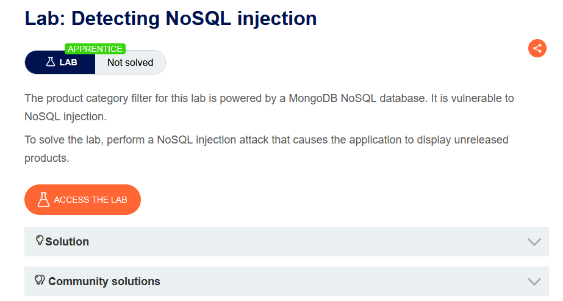

Chèn điều kiện JS luôn đúng là `'||'1'=='1`. Lý do payload này được thực thi vì ứng dụng ghép chuỗi trực tiếp parser JS hiểu là `(this.category == 'fizzy') || ('1' == '1')`

Backend có thể thực thi:

```
db.products.find({
    $where: "this.category == 'fizzy'||'1'=='1'"
});
```

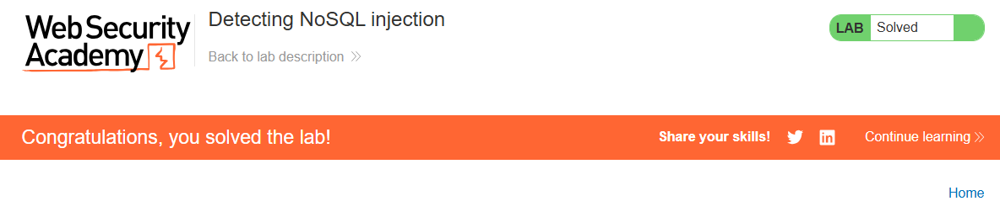

Có thể thêm một ký tự null sau giá trị của category. MongoDB có thể bỏ qua tất cả các ký tự đứng sau ký tự null. Điều này có nghĩa là mọi điều kiện bổ sung trong truy vấn MongoDB sẽ bị bỏ qua.

Ví dụ, truy vấn có thể có thêm một điều kiện this.released: `this.category == 'fizzy' && this.released == 1` 

Điều kiện this.released == 1 được sử dụng để chỉ hiển thị các sản phẩm đã được phát hành. Đối với các sản phẩm chưa được phát hành, giả sử this.released == 0.

Trong trường hợp này, kẻ tấn công có thể tạo một yêu cầu tấn công như sau: `https://insecure-website.com/product/lookup?category=fizzy'%00`

Điều này tạo ra truy vấn NoSQL sau: `this.category == 'fizzy'\u0000' && this.released == 1`

Nếu MongoDB bỏ qua tất cả các ký tự sau ký tự null, thì điều này sẽ loại bỏ yêu cầu trường released phải có giá trị bằng 1

Kết quả là tất cả các sản phẩm trong danh mục fizzy đều được hiển thị, bao gồm cả các sản phẩm chưa được phát hành.

## Chèn toán tử NoSQL

Các cơ sở dữ liệu NoSQL thường sử dụng các toán tử truy vấn, cung cấp các cách để chỉ định những điều kiện mà dữ liệu phải thỏa mãn để được đưa vào kết quả truy vấn. Một số ví dụ về các toán tử truy vấn trong MongoDB bao gồm:
- $where - Khớp với các document thỏa mãn một biểu thức JavaScript.
- $ne - Khớp với tất cả các giá trị không bằng một giá trị được chỉ định.
- $in - Khớp với tất cả các giá trị được chỉ định trong một mảng.
- $regex - Chọn các document có giá trị khớp với một biểu thức chính quy được chỉ định.

Có thể chèn các toán tử truy vấn để thao túng các truy vấn NoSQL.

### Gửi các toán tử truy vấn

Trong các thông điệp JSON, bạn có thể chèn các toán tử truy vấn dưới dạng các đối tượng lồng nhau. VD: `{"username":"wiener"}` trở thành: `{"username":{"$ne":"invalid"}}`

Đối với các đầu vào dựa trên URL, có thể chèn các toán tử truy vấn thông qua các tham số URL. VD: `username=wiener` trở thành: `username[$ne]=invalid`

Nếu cách này không hoạt động, có thể thử các cách sau:
- Chuyển phương thức của yêu cầu từ GET sang POST
- Thay đổi header Content-Type thành application/json
- Thêm dữ liệu JSON vào phần thân của thông điệp.
- Chèn các toán tử truy vấn vào dữ liệu JSON.

### Phát hiện Operator Injection trong MongoDB

Xem xét một ứng dụng có lỗ hổng, chấp nhận tên người dùng và mật khẩu trong phần thân của một yêu cầu POST: `{"username":"wiener","password":"peter"}`

Kiểm tra từng đầu vào với nhiều toán tử khác nhau. Ví dụ, để kiểm tra xem đầu vào username có xử lý toán tử truy vấn hay không, có thể thử payload sau: `{"username":{"$ne":"invalid"},"password":"peter"}`

Nếu toán tử $ne được áp dụng, truy vấn này sẽ tìm tất cả người dùng có username không bằng invalid

Nếu cả đầu vào username và password đều xử lý toán tử, thì có thể bỏ qua cơ chế xác thực bằng payload sau: `{"username":{"$ne":"invalid"},"password":{"$ne":"invalid"}}`

Truy vấn này sẽ trả về tất cả thông tin đăng nhập mà cả username và password đều không bằng invalid. Kết quả là bạn sẽ được đăng nhập vào ứng dụng với người dùng đầu tiên trong collection.

Để nhắm đến một tài khoản cụ thể, có thể tạo một payload chứa một tên người dùng đã biết hoặc một tên người dùng mà bạn đoán được. Ví dụ: `{"username":{"$in":["admin","administrator","superadmin"]},"password":{"$ne":""}}`

Lab 2: Exploiting NoSQL operator injection to bypass authentication

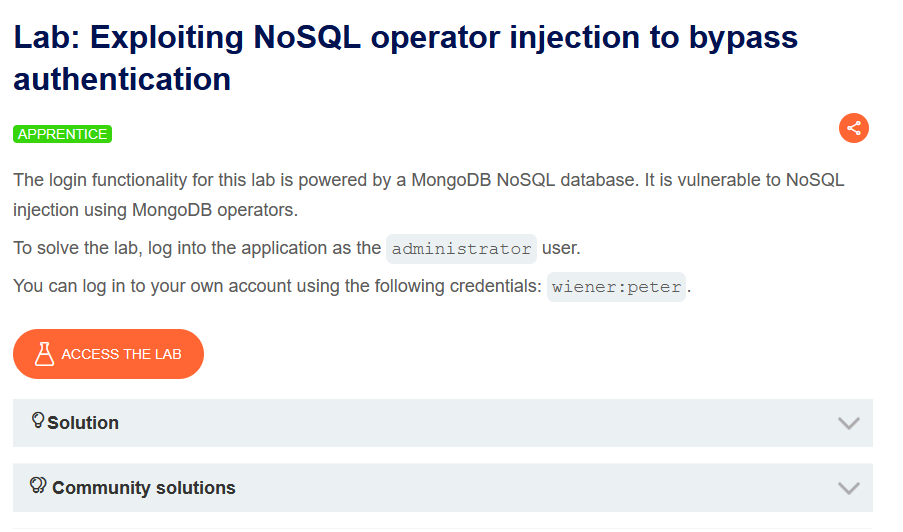

Bắt request đăng nhập bằng user wiener, sau đó kiểm tra xem có bị chèn toán tử không

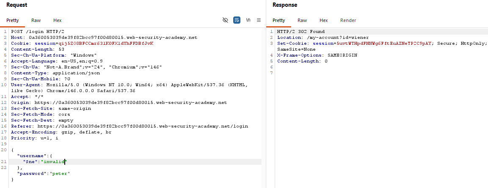

Thay đổi nội dung json

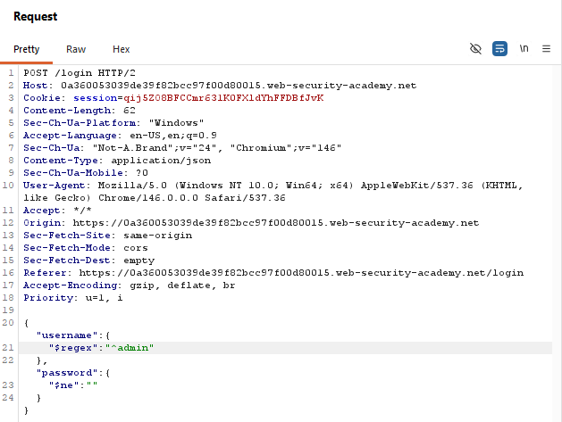

Kết quả trả về 302, mở response này ta sẽ được đưa về trang admin

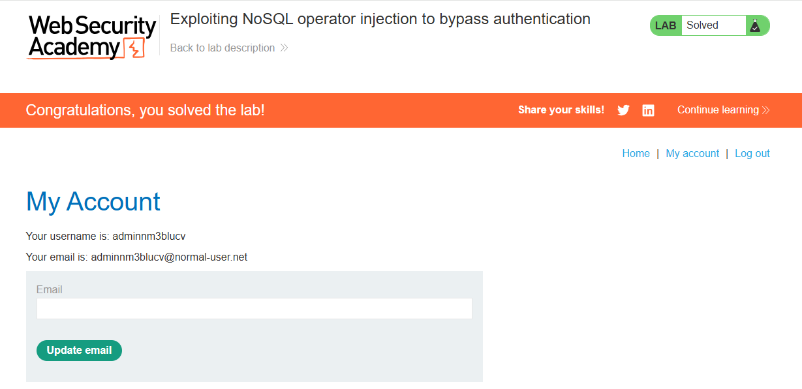

## Khai thác Syntax Injection để trích xuất dữ liệu

Trong nhiều cơ sở dữ liệu NoSQL, một số toán tử truy vấn hoặc hàm có thể thực thi một lượng mã JavaScript giới hạn, chẳng hạn như toán tử $where và hàm mapReduce() của MongoDB.

Điều này có nghĩa là, nếu một ứng dụng có lỗ hổng sử dụng các toán tử hoặc hàm này, thì cơ sở dữ liệu có thể đánh giá mã JS như một phần của truy vấn. Do đó, có thể sử dụng các hàm JavaScript để trích xuất dữ liệu từ cơ sở dữ liệu.

### Trích xuất dữ liệu trong MongoDB

Hãy xem xét một ứng dụng có lỗ hổng, cho phép người dùng tra cứu tên người dùng đã đăng ký của những người khác và hiển thị vai trò của họ. Điều này sẽ kích hoạt một yêu cầu đến URL: `https://insecure-website.com/user/lookup?username=admin`

Điều này tạo ra truy vấn NoSQL sau trên collection users: `{"$where":"this.username == 'admin'"}`

Vì truy vấn sử dụng toán tử $where, có thể thử chèn các hàm JS vào truy vấn này để nó trả về dữ liệu nhạy cảm.

Ví dụ, có thể gửi payload sau: `admin' && this.password[0] == 'a' || 'a'=='b`

Payload này sẽ trả về ký tự đầu tiên của chuỗi mật khẩu của người dùng, cho phép trích xuất mật khẩu từng ký tự một. Cũng có thể sử dụng hàm JavaScript match() để trích xuất thông tin.

Ví dụ, payload sau cho phép xác định liệu mật khẩu có chứa các chữ số hay không: `admin' && this.password.match(/\d/) || 'a'=='b`

Lab 3: Exploiting NoSQL injection to extract data

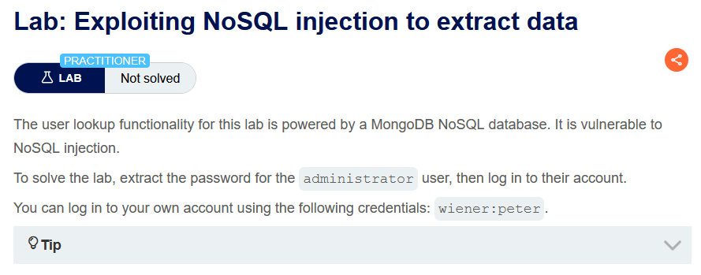

Với payload `' && '1'=='1` sau khi encode, ta thấy request trả về thông tin người dùng administrator, còn payload `' && '1'=='2` thì trả về thông báo không tìm thấy user

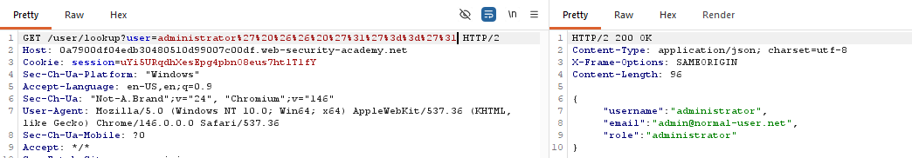
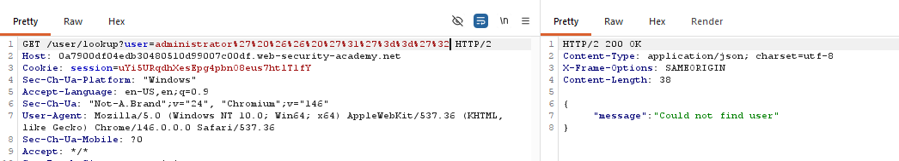

Ta xác định vị trí này bị injection, sau đó kiểm tra độ dài mật khẩu, nhận thấy mật khẩu có độ dài bằng 8

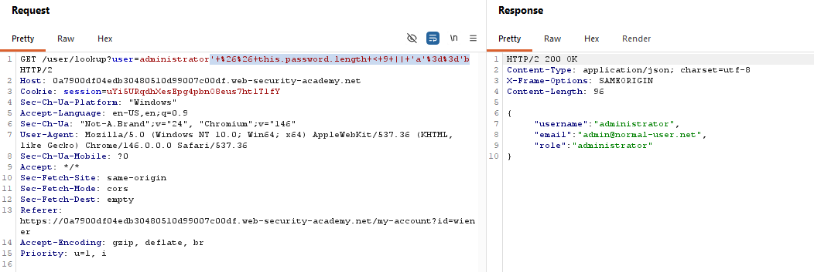

Chèn payload `' && this.password[§0§]=='§a§' || 'a'=='b` sau đó giữ nguyê các phần payload còn lại encode sau đó bấm cluster bomb

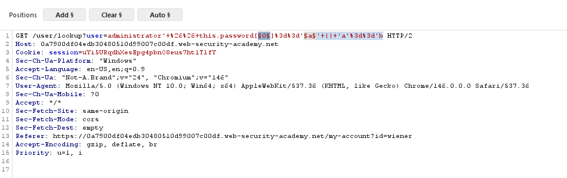
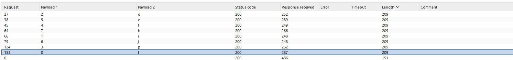

Đăng nhập vào administrator để solve bài lab

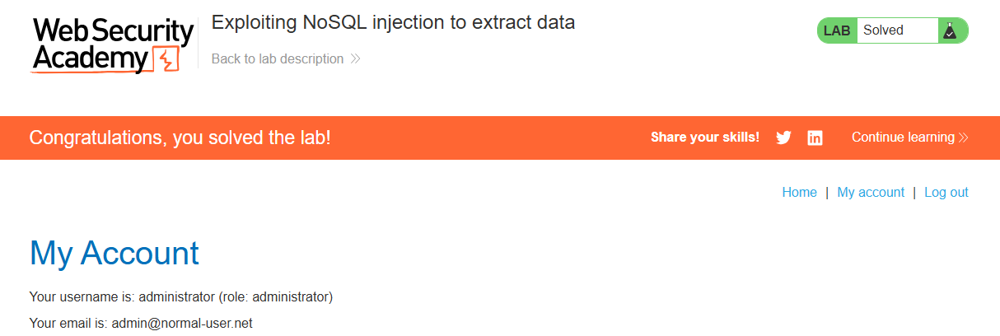

#### Xác định tên các trường

Do MongoDB xử lý dữ liệu bán cấu trúc và không yêu cầu một schema cố định, có thể cần xác định các trường hợp lệ trong collection trước khi có thể trích xuất dữ liệu bằng cách sử dụng JavaScript injection.

Ví dụ, để xác định liệu cơ sở dữ liệu MongoDB có chứa trường password hay không, có thể gửi payload sau: `https://insecure-website.com/user/lookup?username=admin'+%26%26+this.password!%3d'`

Gửi lại payload cho một trường tồn tại và cho một trường không tồn tại. Trong ví dụ này, biết rằng trường username tồn tại, vì vậy có thể gửi các payload sau: `admin' && this.username!='`, `admin' && this.foo!='`

Nếu trường password tồn tại, phản hồi giống hệt phản hồi đối với trường đã tồn tại (username), nhưng khác phản hồi đối với trường không tồn tại (foo)

## Khai thác NoSQL operator injection để trích xuất dữ liệu

Ngay cả khi truy vấn ban đầu không sử dụng bất kỳ toán tử nào cho phép thực thi mã JS tùy ý, có thể tự chèn một trong các toán tử này. Sau đó, ử dụng các điều kiện boolean để xác định xem ứng dụng có thực thi bất kỳ đoạn JS nào mà đã chèn thông qua toán tử đó hay không.

### Chèn toán tử trong MongoDB

Một ứng dụng có lỗ hổng chấp nhận username và password trong phần body của một yêu cầu POST: `{"username":"wiener","password":"peter"}`

Để kiểm tra xem có thể chèn toán tử hay không, có thể thử thêm toán tử $where dưới dạng một tham số bổ sung, sau đó gửi một yêu cầu mà điều kiện đánh giá là false, và một yêu cầu khác mà điều kiện đánh giá là true. Ví dụ: `{"username":"wiener","password":"peter", "$where":"0"}`, `{"username":"wiener","password":"peter", "$where":"1"}`

Nếu có sự khác biệt giữa các phản hồi, điều này có thể cho thấy rằng biểu thức JavaScript trong mệnh đề $where đang được đánh giá.

#### Trích xuất tên các trường

Nếu đã chèn được một toán tử cho phép thực thi JS, có thể sử dụng phương thức keys() để trích xuất tên của các trường dữ liệu. VD payload sau `"$where":"Object.keys(this)[0].match('^.{0}a.*')"`

Payload này kiểm tra trường dữ liệu đầu tiên trong đối tượng người dùng và trả về ký tự đầu tiên của tên trường. Điều này cho phép trích xuất tên trường từng ký tự một.

Lab 4: Exploiting NoSQL operator injection to extract unknown fields

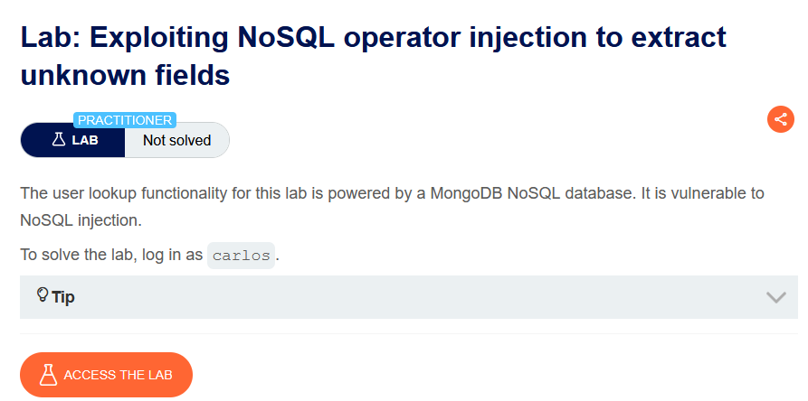

