# SQL Injection

## SQL injection vulnerability in WHERE clause allowing retrieval of hidden data

### Mục tiêu

Khai thác lỗi SQL Injection tại mệnh đề `WHERE` để hiển thị cả dữ liệu ẩn (hidden data) và hoàn thành lab.

### Các bước thực hiện

**Bước 1:** Truy cập trang web lab và chọn một danh mục sản phẩm bất kỳ để quan sát nội dung hiển thị.
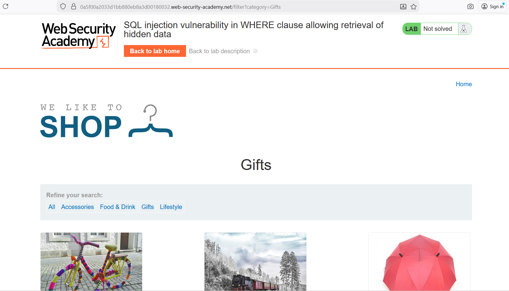

**Bước 2:** Kiểm tra URL, nhận thấy ứng dụng sử dụng tham số `category` để lọc dữ liệu theo danh mục.
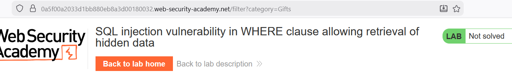

**Bước 3:** Thử chèn ký tự `'` vào giá trị `category` để kiểm tra phản hồi, từ đó xác định truy vấn SQL phía sau có thể bị phá vỡ.


**Bước 4:** Chèn payload SQL Injection để bỏ qua điều kiện lọc:

```text
' OR 1=1--
```

Khi gửi payload trên, ứng dụng trả về toàn bộ danh sách sản phẩm (bao gồm dữ liệu ẩn), và lab được hoàn thành.
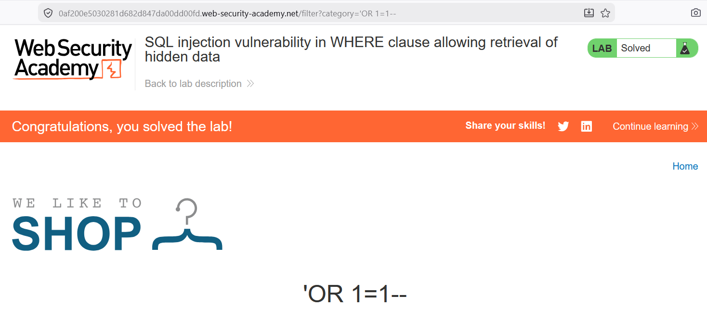

## SQL injection attack, querying the database type and version on Oracle

### Mục tiêu

Xác định loại cơ sở dữ liệu đang dùng là Oracle và truy vấn thông tin phiên bản database thông qua lỗi SQL Injection.

### Các bước thực hiện

**Bước 1:** Truy cập trang lab, chọn một danh mục sản phẩm để quan sát tham số `category` trên URL.
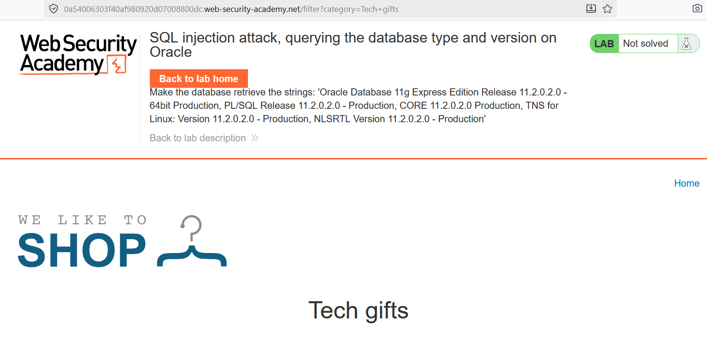

**Bước 2:** Dùng kỹ thuật `UNION` để xác định số cột của câu truy vấn gốc, từ đó tìm được vị trí có thể hiển thị dữ liệu trả về.


**Bước 3:** Sau khi xác định được số cột phù hợp, chèn payload để đọc phiên bản Oracle từ bảng hệ thống:

```sql
' UNION SELECT banner, NULL FROM v$version--
```

Kết quả trả về hiển thị thông tin `banner`, xác nhận DBMS là Oracle và lab được hoàn thành.
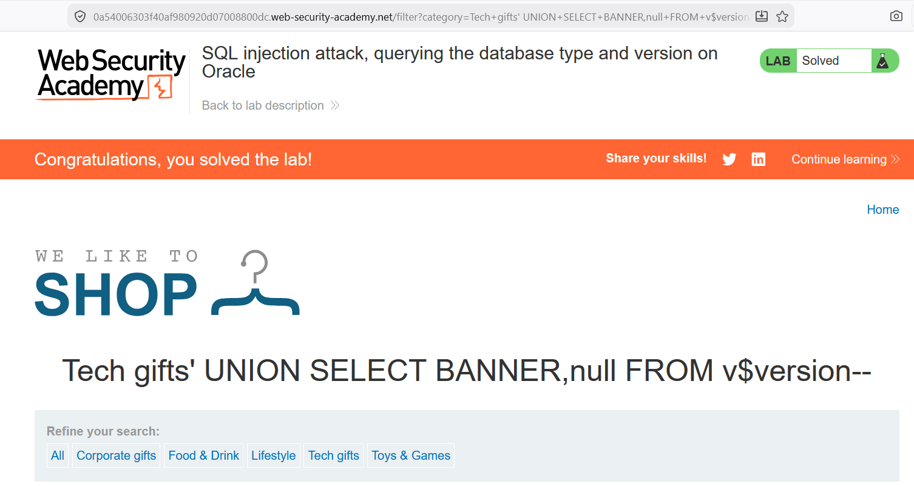

## SQL injection attack, listing the database contents on non-Oracle databases

### Mục tiêu

Liệt kê cấu trúc database trên hệ quản trị non-Oracle, tìm bảng chứa thông tin người dùng, trích xuất username/password và đăng nhập bằng tài khoản `administrator`.

### Các bước thực hiện

**Bước 1:** Truy cập lab và chọn một danh mục sản phẩm để xác định điểm chèn SQL Injection tại tham số `category`.
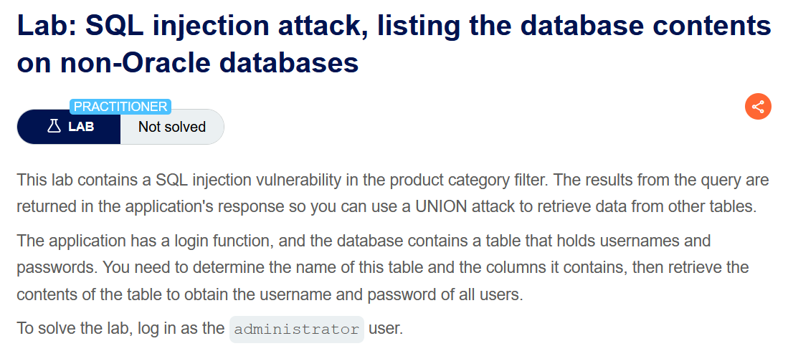
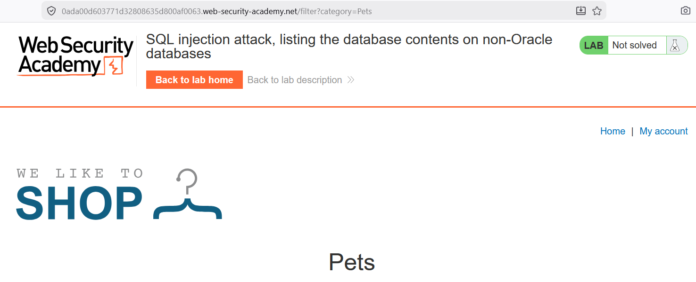

**Bước 2:** Dùng `UNION SELECT` để xác định số cột của truy vấn gốc. Kết quả cho thấy truy vấn có **2 cột**.
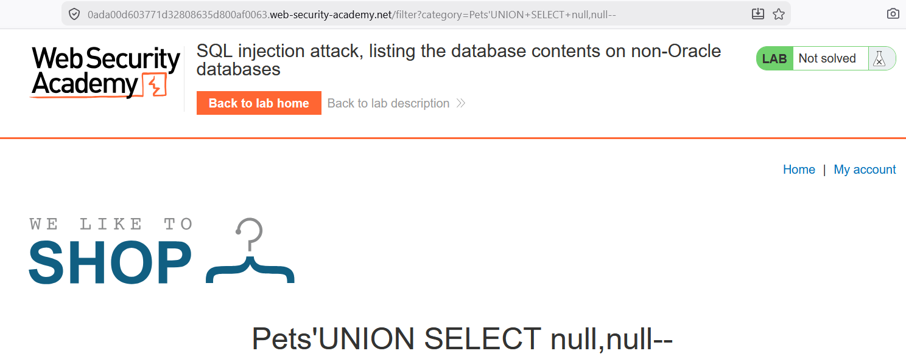

**Bước 3:** Liệt kê danh sách bảng bằng `information_schema.tables` để tìm bảng chứa dữ liệu người dùng.

```sql
' UNION SELECT table_name, NULL FROM information_schema.tables--
```

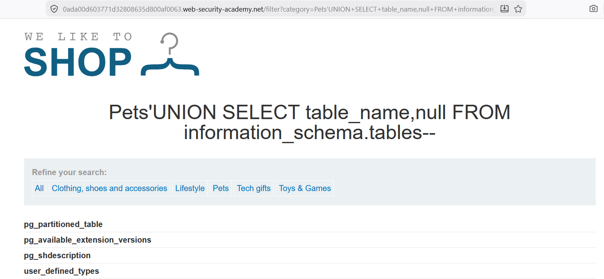

**Bước 4:** Từ danh sách bảng, xác định bảng liên quan đến người dùng (ví dụ bảng `users_xxxxx`).
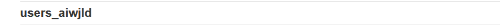

**Bước 5:** Liệt kê tên cột của bảng users bằng `information_schema.columns` để tìm cột username và password.

```sql
' UNION SELECT column_name, NULL FROM information_schema.columns WHERE table_name='users_xxxxx'--
```

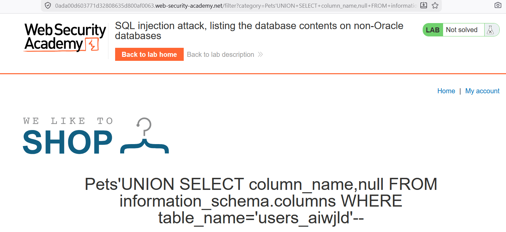
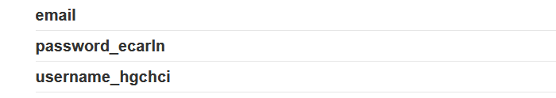

**Bước 6:** Trích xuất dữ liệu tài khoản từ bảng users, lấy thông tin đăng nhập của `administrator`.

```sql
' UNION SELECT username_xxxxx, password_xxxxx FROM users_xxxxx--
```

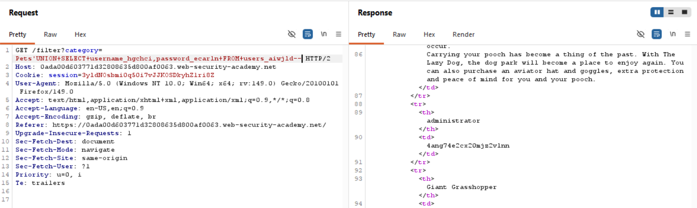

**Bước 7:** Dùng thông tin vừa thu được để đăng nhập tài khoản `administrator` và hoàn thành lab.
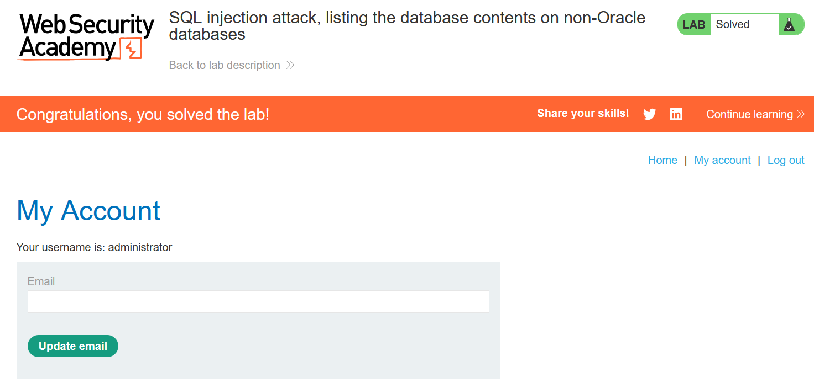

## SQL injection UNION attack, determining the number of columns returned by the query

### Mục tiêu

Xác định chính xác số lượng cột mà truy vấn gốc trả về để chuẩn bị cho các bước khai thác `UNION` tiếp theo.

### Các bước thực hiện

**Bước 1:** Truy cập lab và chọn một danh mục sản phẩm để xác định điểm chèn SQL Injection tại tham số `category`.
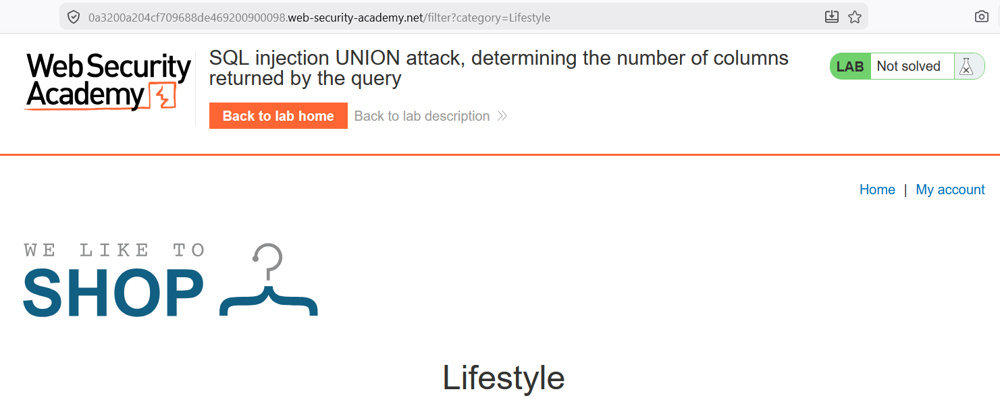

**Bước 2:** Thử `UNION SELECT` với số lượng `NULL` tăng dần cho đến khi truy vấn chạy thành công (không báo lỗi).

Payload xác định đúng trong bài này là:

```sql
' UNION SELECT NULL, NULL, NULL--
```

Khi payload trên hoạt động, có thể kết luận truy vấn gốc trả về **3 cột**, và lab được hoàn thành.
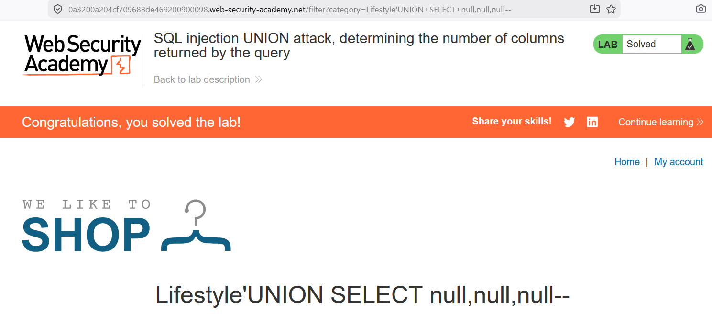

## SQL injection UNION attack, retrieving data from other tables

### Mục tiêu

Khai thác `UNION SQL Injection` để truy xuất dữ liệu từ bảng khác (bảng `users`), lấy thông tin đăng nhập của `administrator` và hoàn thành lab.

### Các bước thực hiện

**Bước 1:** Kiểm tra và xác nhận truy vấn gốc trả về **2 cột** để xây dựng payload `UNION` đúng cấu trúc.


**Bước 2:** Chèn payload để lấy dữ liệu từ bảng `users`, hiển thị trực tiếp `username` và `password` trên trang.

```sql
' UNION SELECT username, password FROM users--
```

Kết quả trả về chứa thông tin tài khoản, bao gồm tài khoản `administrator`.
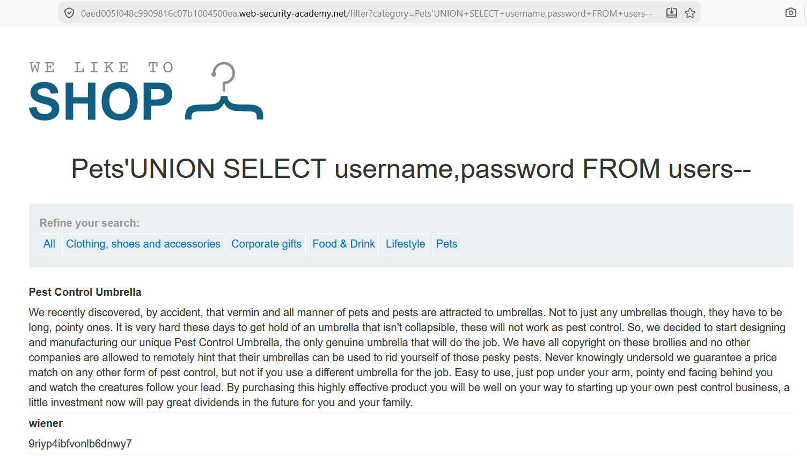

**Bước 3:** Sử dụng thông tin vừa thu được để đăng nhập bằng tài khoản `administrator`.
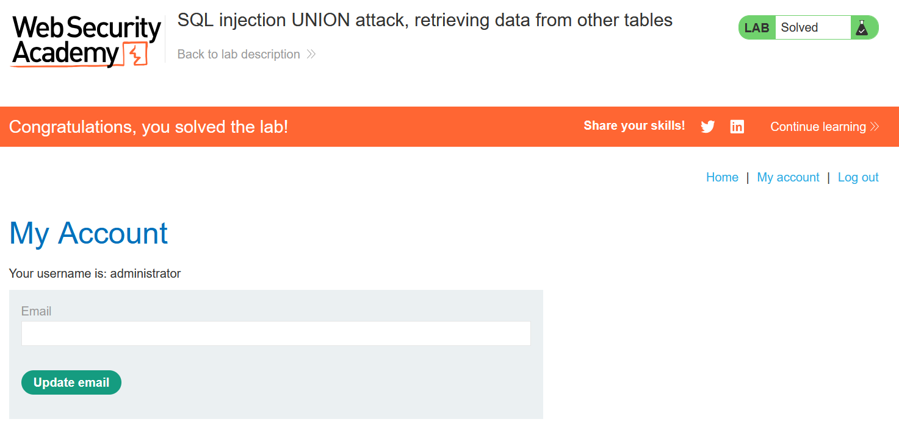

## Blind SQL injection with conditional responses

### Mục tiêu

Khai thác Blind SQL Injection tại cookie `TrackingId` bằng phản hồi điều kiện (xuất hiện/không xuất hiện chuỗi `Welcome back`) để dò mật khẩu của người dùng `administrator` và hoàn thành lab.

### Các bước thực hiện

**Bước 1:** Truy cập một danh mục sản phẩm bất kỳ, bắt request và gửi sang Burp Repeater để kiểm tra tham số có thể chèn payload.
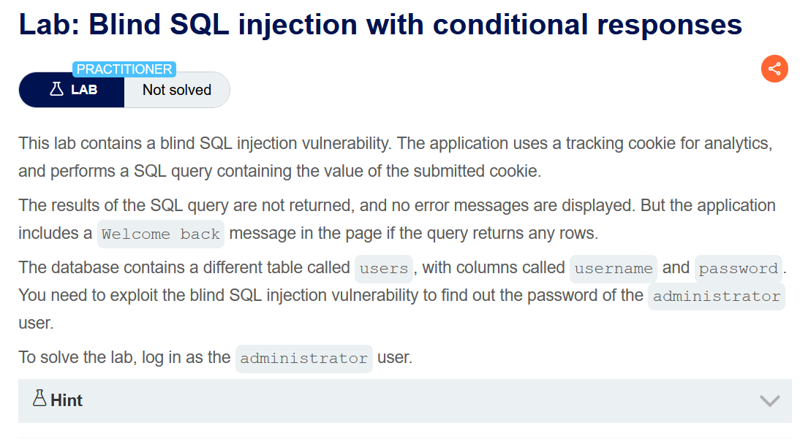
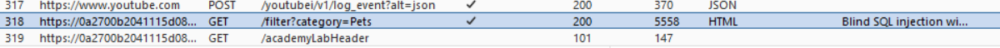

Ứng dụng sử dụng cookie `TrackingId` trong truy vấn SQL, nên đây là vị trí khai thác chính.

**Bước 2:** Chèn điều kiện đúng/sai vào `TrackingId` để xác nhận lỗ hổng Blind SQLi.

```sql
' AND 1=1--
' AND 1=2--
```

Khi điều kiện đúng, trang hiển thị `Welcome back`; khi điều kiện sai, chuỗi này biến mất.
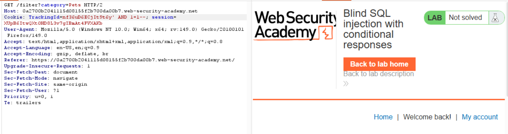
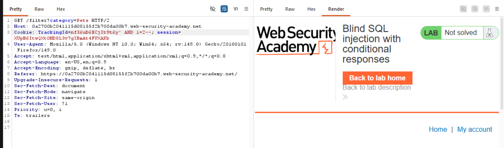

**Bước 3:** Kiểm tra sự tồn tại của bảng `users`.

```sql
' AND (SELECT 'a' FROM users LIMIT 1)='a'--
```

Phản hồi đúng cho thấy bảng `users` tồn tại.
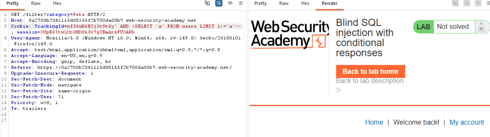

**Bước 4:** Kiểm tra tài khoản `administrator` có tồn tại trong bảng người dùng.

```sql
' AND (SELECT username FROM users WHERE username='administrator')='administrator'--
```

Phản hồi đúng xác nhận có user `administrator`.
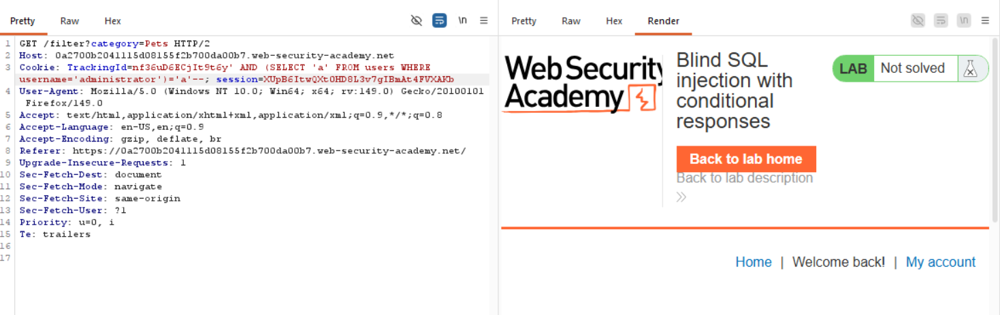

**Bước 5:** Xác định độ dài mật khẩu của `administrator`.

```sql
' AND (SELECT LENGTH(password) FROM users WHERE username='administrator')>19--
' AND (SELECT LENGTH(password) FROM users WHERE username='administrator')>20--
```

Điều kiện `>19` đúng nhưng `>20` sai, suy ra mật khẩu dài **20 ký tự**.
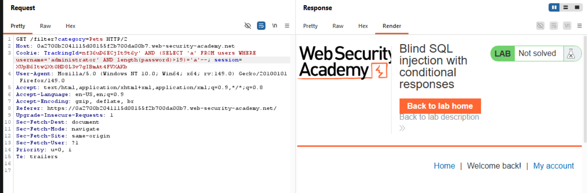

**Bước 6:** Gửi request sang Burp Intruder để brute-force từng vị trí ký tự của mật khẩu bằng tập ký tự chữ và số.
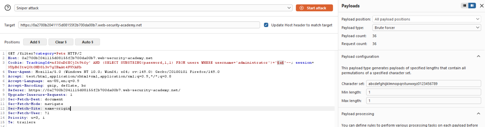

Ví dụ payload cho vị trí thứ 1:

```sql
' AND SUBSTRING((SELECT password FROM users WHERE username='administrator'),1,1)='a'--
```

**Bước 7:** Lặp lại cho từng vị trí từ 1 đến 20, ghi nhận ký tự khi phản hồi trả về `Welcome back`.


**Bước 8:** Sau khi ghép đủ 20 ký tự, đăng nhập tài khoản `administrator` bằng mật khẩu tìm được để hoàn thành lab.
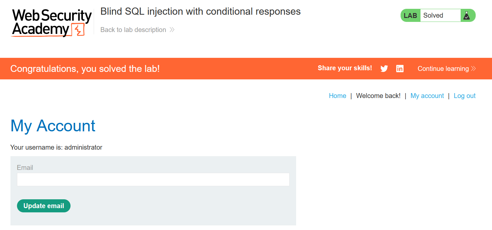

## Blind SQL injection with conditional errors

### Mục tiêu

Khai thác Blind SQL Injection dựa trên lỗi điều kiện (conditional errors) tại cookie `TrackingId` để suy ra mật khẩu của người dùng `administrator` và hoàn thành lab.

### Các bước thực hiện

**Bước 1:** Truy cập một danh mục sản phẩm bất kỳ, bắt request và gửi sang Burp Repeater để kiểm tra tham số có thể chèn payload.
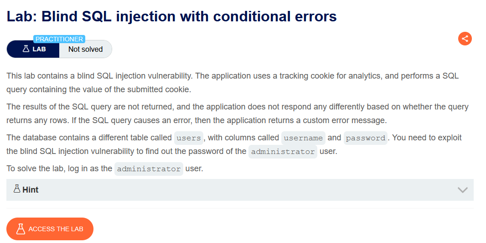

**Bước 2:** Chèn ký tự `'` để kiểm tra phản hồi. Khi thêm 1 ký tự `'`, ứng dụng trả về lỗi; khi thêm 2 ký tự `''`, trang hoạt động bình thường. Từ đó xác định dấu `'` có thể làm phát sinh lỗi SQL.
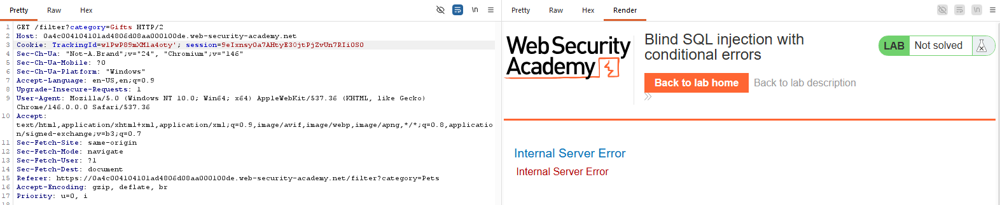


**Bước 3:** Thử thêm một payload nối chuỗi để xác minh cơ chế lỗi và nhận diện DBMS. Khi thêm `FROM dual`, phản hồi trở lại bình thường, suy ra hệ quản trị cơ sở dữ liệu là Oracle.
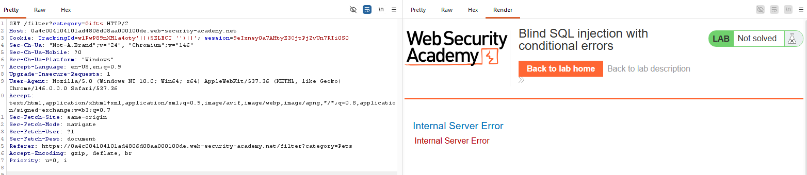
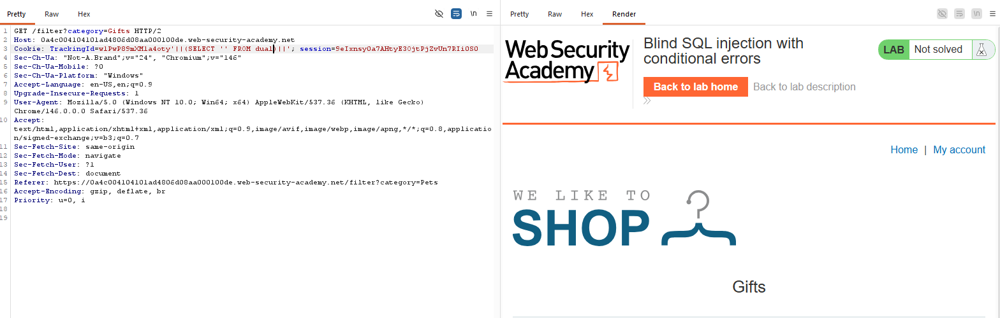

**Bước 4:** Dùng payload điều kiện đúng/sai để quan sát khác biệt phản hồi:

- Với điều kiện đúng, thực hiện phép chia `1/0` để gây lỗi có chủ đích.
- Với điều kiện sai, trang trả về bình thường.
  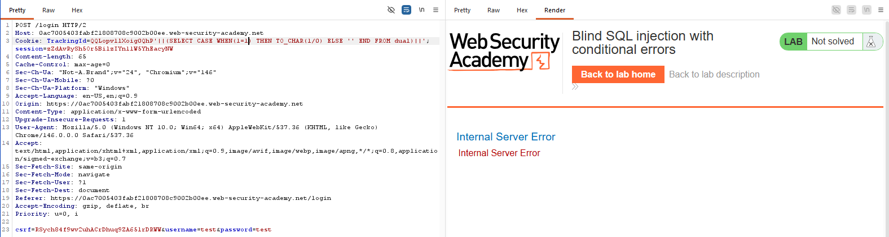
  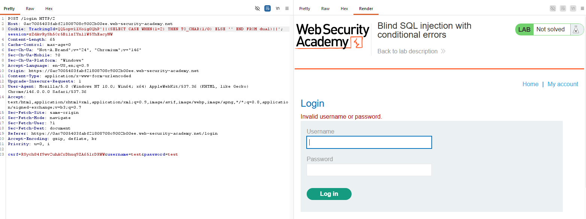

**Bước 5:** Xác định sự tồn tại của username `administrator` bằng payload điều kiện.
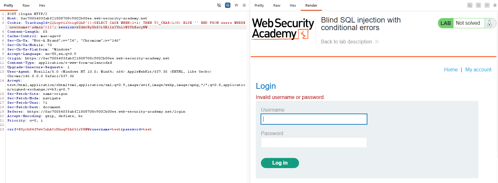
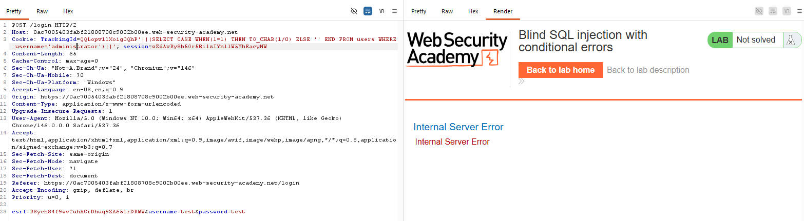

**Bước 6:** Xác định độ dài mật khẩu của `administrator`, kết luận mật khẩu có **20 ký tự**.
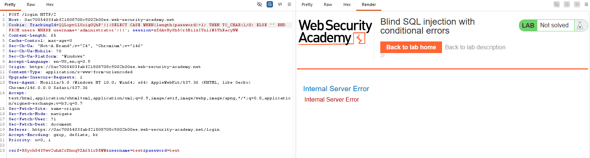
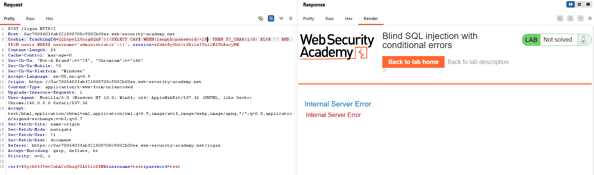
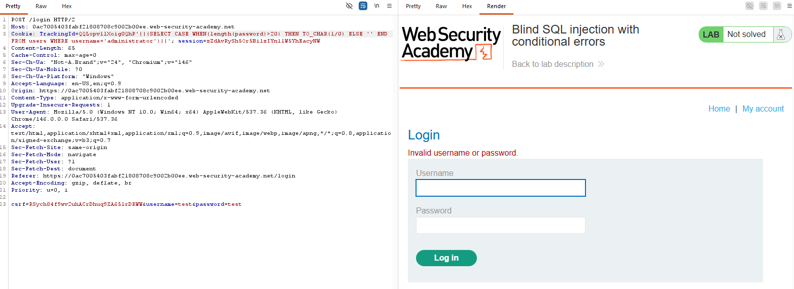

**Bước 7:** Gửi request sang Burp Intruder để brute-force từng ký tự mật khẩu:

- Thiết lập payload theo kiểu Sniper.
- Đặt vị trí ký tự cần kiểm tra.
- Chạy attack và lấy ký tự hợp lệ cho từng vị trí.
  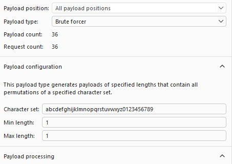
  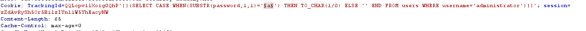
  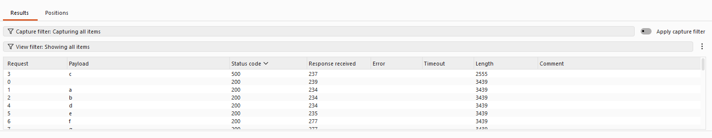

Lặp lại đến hết 20 vị trí để thu được toàn bộ mật khẩu.

**Bước 8:** Đăng nhập thành công vào tài khoản `administrator` và hoàn thành lab.


## Visible error-based SQL injection

### Mục tiêu

Khai thác lỗi SQL Injection dạng hiển thị lỗi (visible error-based) để trích xuất mật khẩu của người dùng `administrator` và hoàn thành lab.

### Các bước thực hiện

**Bước 1:** Chèn ký tự `'` vào sau `TrackingId`, xác nhận ứng dụng trả về thông báo lỗi SQL.
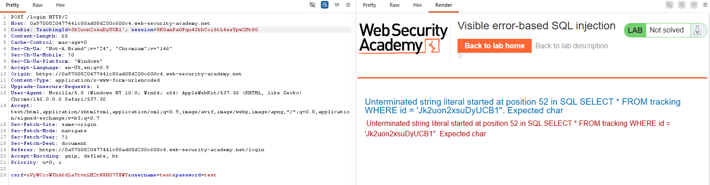

**Bước 2:** Dùng `CAST` để ép kiểu giá trị `password` sang `int`, từ đó tạo lỗi có kiểm soát và buộc DB lộ dữ liệu trong thông báo lỗi.
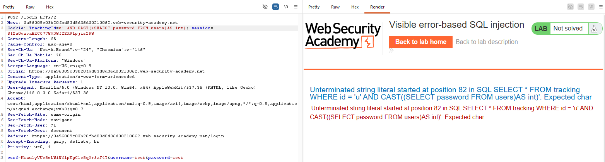

**Bước 3:** Comment phần còn lại của câu truy vấn để payload được thực thi đúng ý.
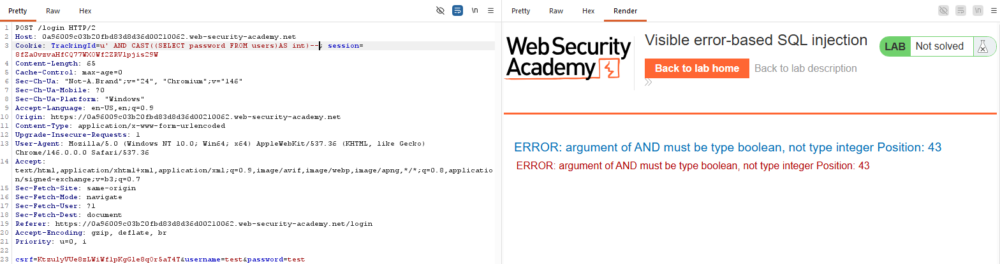

**Bước 4:** Điều chỉnh payload để biểu thức trong `CASE WHEN` trả về điều kiện boolean hợp lệ (ví dụ dùng `1=1`).


**Bước 5:** Khi lỗi báo có nhiều hơn một dòng trả về, bổ sung điều kiện để truy vấn chỉ trả về đúng 1 dòng cần kiểm tra.
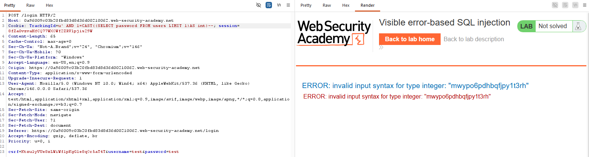

**Bước 6:** Nhận được mật khẩu của user `administrator`, đăng nhập vào tài khoản này để hoàn thành lab.
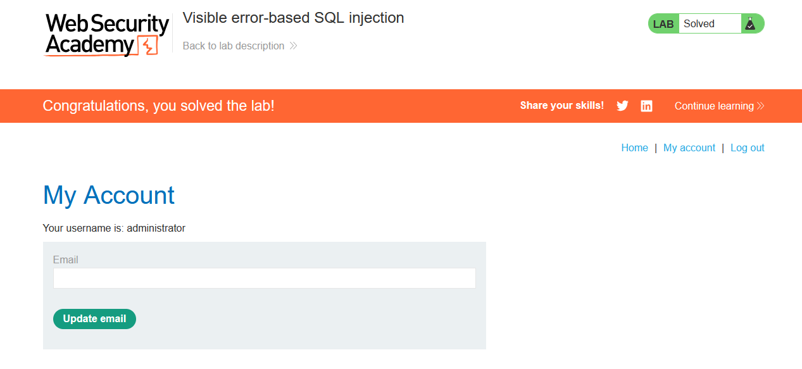

## Blind SQL injection with time delays

### Mục tiêu

Xác định khả năng khai thác Blind SQL Injection dựa trên độ trễ phản hồi (time delay) và nhận diện DBMS đang sử dụng.

### Các bước thực hiện

**Bước 1:** Kiểm tra payload delay tương ứng với từng hệ quản trị cơ sở dữ liệu. Kết quả cho thấy ứng dụng phản hồi trễ với cú pháp delay của PostgreSQL, từ đó xác định DBMS là Postgres.
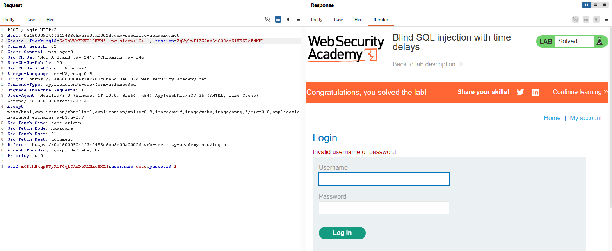

## Blind SQL injection with time delays and information retrieval

### Mục tiêu

Khai thác Blind SQL Injection theo cơ chế time delay để trích xuất mật khẩu của user `administrator` và hoàn thành lab.

### Các bước thực hiện

**Bước 1:** Dùng payload delay để nhận diện DBMS, xác định server sử dụng PostgreSQL.
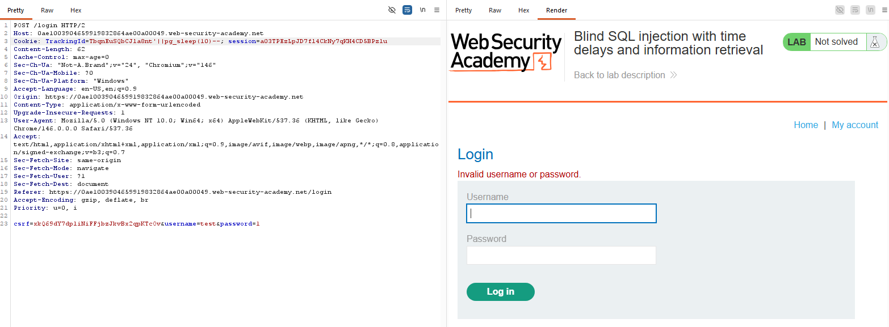

**Bước 2:** Kiểm tra điều kiện nền tảng với `1=1`; khi điều kiện đúng, phản hồi bị delay.
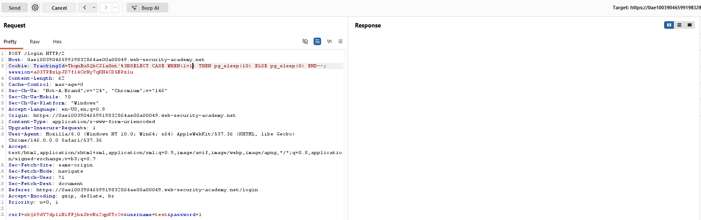

**Bước 3:** Thay điều kiện nền tảng bằng điều kiện kiểm tra độ dài mật khẩu của `administrator`.

Ví dụ:

- `length(password) > 1` gây delay.
- `length(password) > 20` không còn đúng.

Suy ra mật khẩu có độ dài **20 ký tự**.
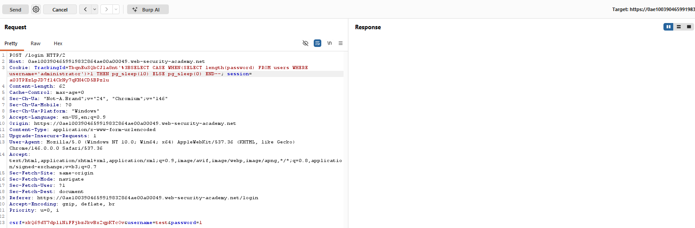

**Bước 4:** Gửi request sang Burp Intruder, chèn payload tại vị trí ký tự cần dò, cấu hình brute-force tập ký tự `a-z` và `0-9`, sau đó chạy Sniper attack.
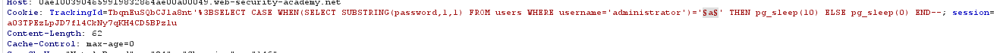

**Bước 5:** Dựa vào cột `Response received`, chọn ký tự có thời gian phản hồi lớn nhất cho từng vị trí. Lặp lại đến khi đủ 20 ký tự.
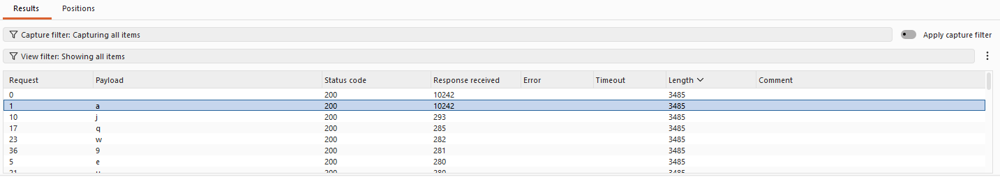

**Bước 6:** Đăng nhập vào tài khoản `administrator` bằng mật khẩu đã tìm được và hoàn thành lab.
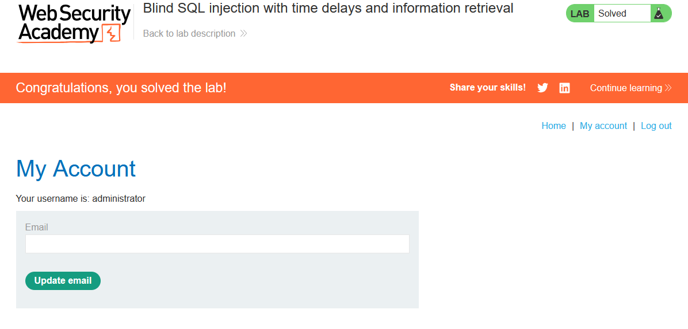

# Authentication

## 2FA simple bypass

### Mục tiêu

Khai thác lỗi xác thực 2FA chưa chặt chẽ để đăng nhập vào tài khoản `carlos` mà không cần hoàn tất bước nhập mã 2FA.

### Các bước thực hiện

**Bước 1:** Đăng nhập vào tài khoản `carlos` được cung cấp trong đề bài.
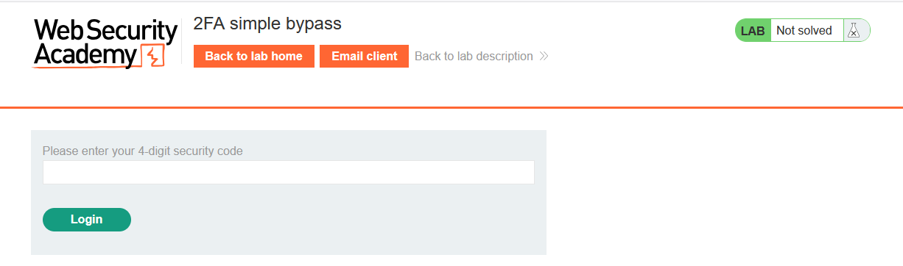

Sau khi đăng nhập, hệ thống yêu cầu nhập mã xác nhận 2FA.

**Bước 2:** Truy cập mục Email client để lấy mã xác nhận đăng nhập.


**Bước 3:** Quay lại luồng đăng nhập, hoàn tất xác thực và xác nhận lab đã được giải.
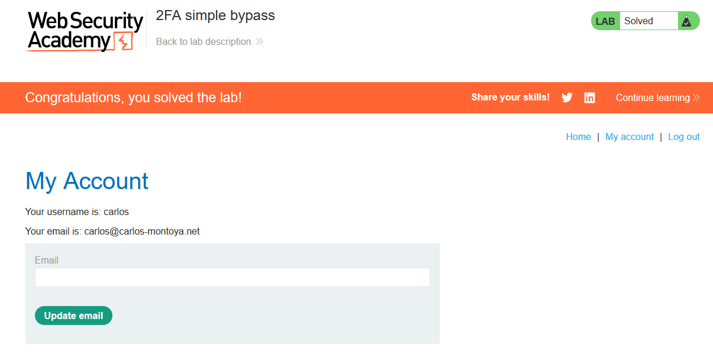

## Password reset broken logic

### Mục tiêu

Khai thác lỗi logic trong chức năng đặt lại mật khẩu để thay đổi mật khẩu của tài khoản `carlos`, sau đó đăng nhập và hoàn thành lab.

### Các bước thực hiện

Yêu cầu bài lab:
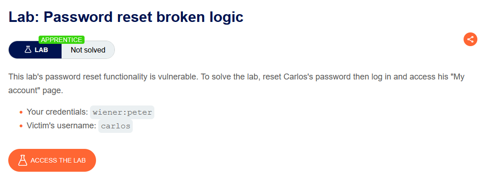

**Bước 1:** Thực hiện thao tác đặt lại mật khẩu cho người dùng `wiener`.
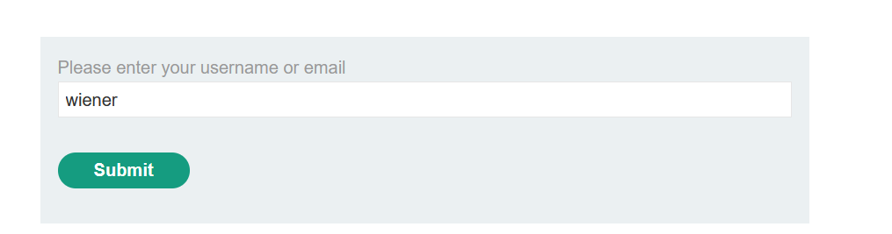

**Bước 2:** Truy cập Email client để lấy liên kết reset mật khẩu.
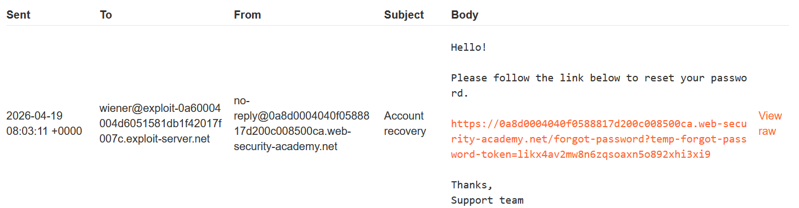

**Bước 3:** Tiến hành tạo mật khẩu mới và chặn request bằng Burp Suite.
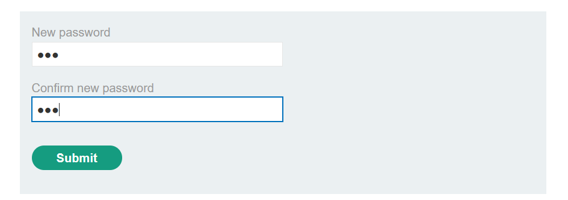
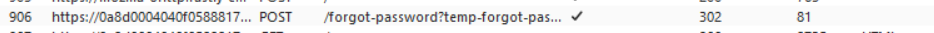

**Bước 4:** Chỉnh sửa request đổi mật khẩu, thay giá trị `username` từ `wiener` thành `carlos`.
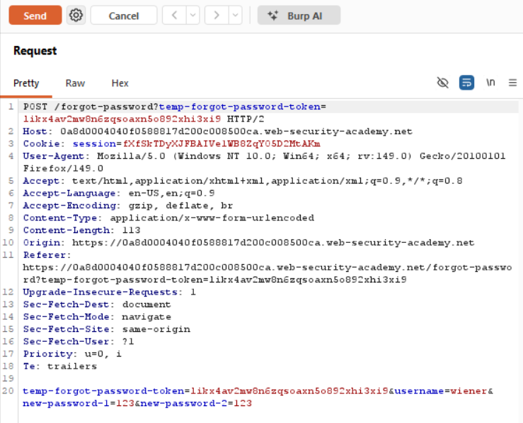

**Bước 5:** Gửi request đã chỉnh sửa thành công.
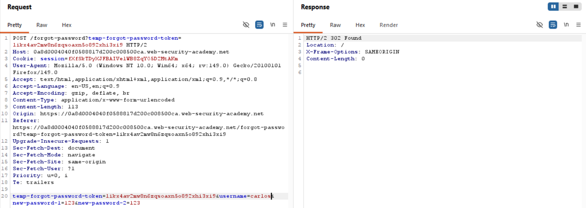

**Bước 6:** Đăng nhập vào tài khoản `carlos` với mật khẩu mới để hoàn thành lab.
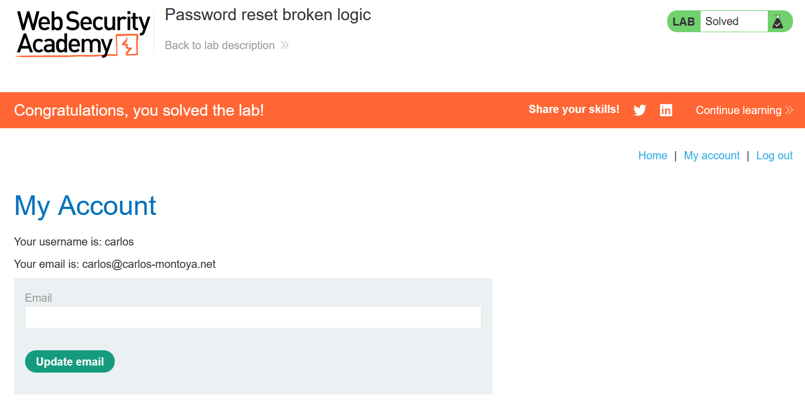
