## SQL injection vulnerability in WHERE clause allowing retrieval of hidden data

### Mục tiêu

Khai thác lỗi SQL Injection tại mệnh đề `WHERE` để hiển thị cả dữ liệu ẩn (hidden data) và hoàn thành lab.

### Các bước thực hiện

**Bước 1:** Truy cập trang web lab và chọn một danh mục sản phẩm bất kỳ để quan sát nội dung hiển thị.
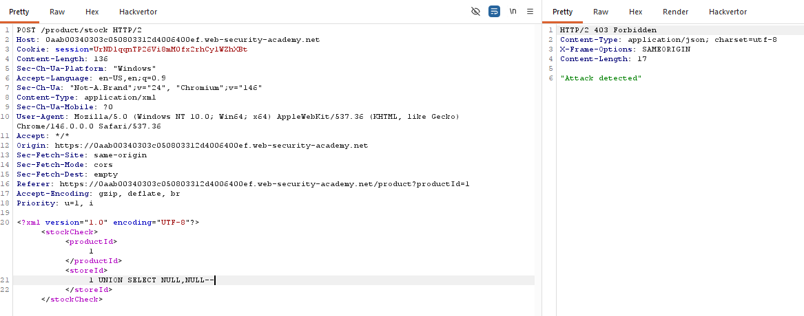

**Bước 2:** Kiểm tra URL, nhận thấy ứng dụng sử dụng tham số `category` để lọc dữ liệu theo danh mục.
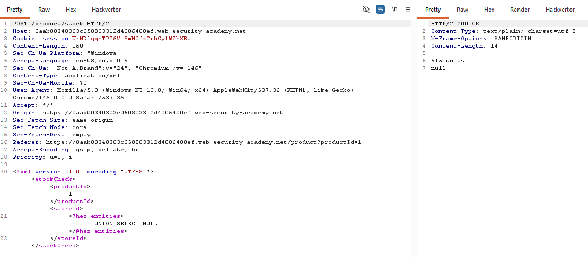

**Bước 3:** Thử chèn ký tự `'` vào giá trị `category` để kiểm tra phản hồi, từ đó xác định truy vấn SQL phía sau có thể bị phá vỡ.
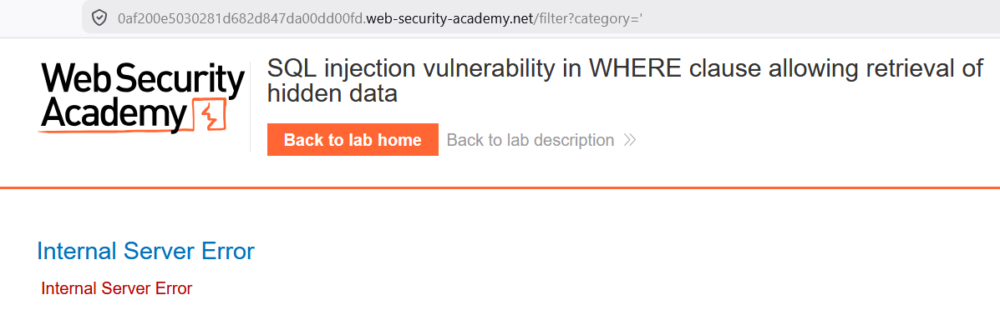

**Bước 4:** Chèn payload SQL Injection để bỏ qua điều kiện lọc:

```text
' OR 1=1--
```

Khi gửi payload trên, ứng dụng trả về toàn bộ danh sách sản phẩm (bao gồm dữ liệu ẩn), và lab được hoàn thành.


## SQL injection attack, querying the database type and version on Oracle

### Mục tiêu

Xác định loại cơ sở dữ liệu đang dùng là Oracle và truy vấn thông tin phiên bản database thông qua lỗi SQL Injection.

### Các bước thực hiện

**Bước 1:** Truy cập trang lab, chọn một danh mục sản phẩm để quan sát tham số `category` trên URL.
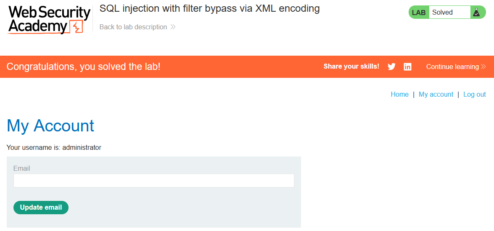

**Bước 2:** Dùng kỹ thuật `UNION` để xác định số cột của câu truy vấn gốc, từ đó tìm được vị trí có thể hiển thị dữ liệu trả về.
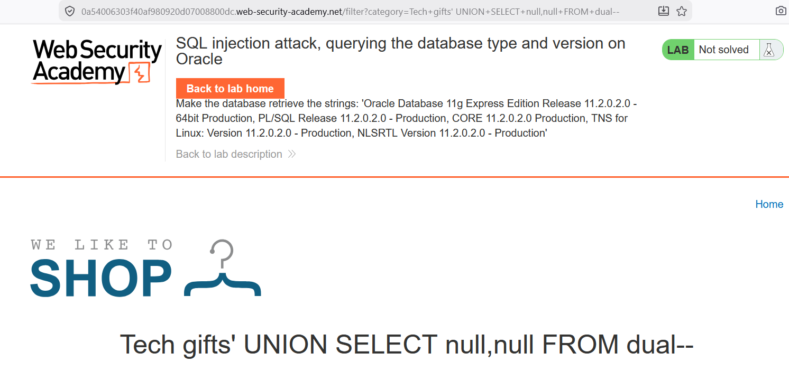

**Bước 3:** Sau khi xác định được số cột phù hợp, chèn payload để đọc phiên bản Oracle từ bảng hệ thống:

```sql
' UNION SELECT banner, NULL FROM v$version--
```

Kết quả trả về hiển thị thông tin `banner`, xác nhận DBMS là Oracle và lab được hoàn thành.


## SQL injection attack, listing the database contents on non-Oracle databases

### Mục tiêu

Liệt kê cấu trúc database trên hệ quản trị non-Oracle, tìm bảng chứa thông tin người dùng, trích xuất username/password và đăng nhập bằng tài khoản `administrator`.

### Các bước thực hiện

**Bước 1:** Truy cập lab và chọn một danh mục sản phẩm để xác định điểm chèn SQL Injection tại tham số `category`.
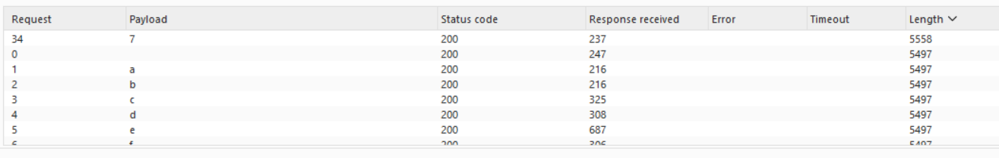
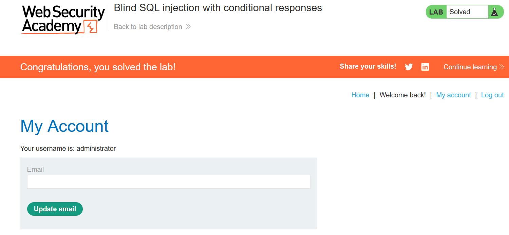

**Bước 2:** Dùng `UNION SELECT` để xác định số cột của truy vấn gốc. Kết quả cho thấy truy vấn có **2 cột**.
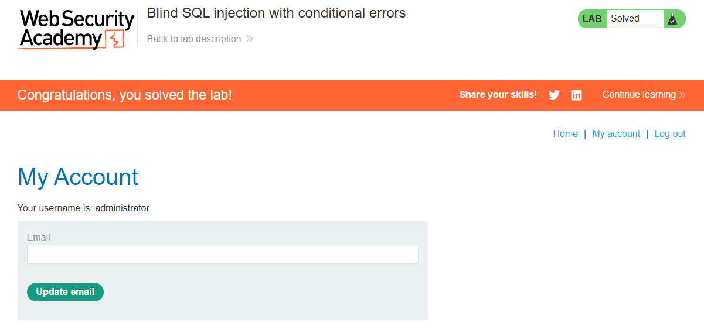

**Bước 3:** Liệt kê danh sách bảng bằng `information_schema.tables` để tìm bảng chứa dữ liệu người dùng.

```sql
' UNION SELECT table_name, NULL FROM information_schema.tables--
```


**Bước 4:** Từ danh sách bảng, xác định bảng liên quan đến người dùng (ví dụ bảng `users_xxxxx`).


**Bước 5:** Liệt kê tên cột của bảng users bằng `information_schema.columns` để tìm cột username và password.

```sql
' UNION SELECT column_name, NULL FROM information_schema.columns WHERE table_name='users_xxxxx'--
```


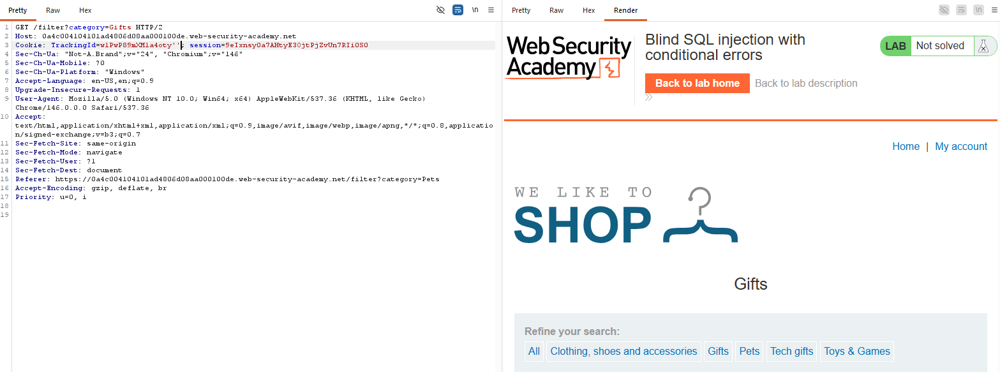

**Bước 6:** Trích xuất dữ liệu tài khoản từ bảng users, lấy thông tin đăng nhập của `administrator`.

```sql
' UNION SELECT username_xxxxx, password_xxxxx FROM users_xxxxx--
```


**Bước 7:** Dùng thông tin vừa thu được để đăng nhập tài khoản `administrator` và hoàn thành lab.


## SQL injection UNION attack, determining the number of columns returned by the query

### Mục tiêu

Xác định chính xác số lượng cột mà truy vấn gốc trả về để chuẩn bị cho các bước khai thác `UNION` tiếp theo.

### Các bước thực hiện

**Bước 1:** Truy cập lab và chọn một danh mục sản phẩm để xác định điểm chèn SQL Injection tại tham số `category`.


**Bước 2:** Thử `UNION SELECT` với số lượng `NULL` tăng dần cho đến khi truy vấn chạy thành công (không báo lỗi).

Payload xác định đúng trong bài này là:

```sql
' UNION SELECT NULL, NULL, NULL--
```

Khi payload trên hoạt động, có thể kết luận truy vấn gốc trả về **3 cột**, và lab được hoàn thành.


## SQL injection UNION attack, retrieving data from other tables

### Mục tiêu

Khai thác `UNION SQL Injection` để truy xuất dữ liệu từ bảng khác (bảng `users`), lấy thông tin đăng nhập của `administrator` và hoàn thành lab.

### Các bước thực hiện

**Bước 1:** Kiểm tra và xác nhận truy vấn gốc trả về **2 cột** để xây dựng payload `UNION` đúng cấu trúc.
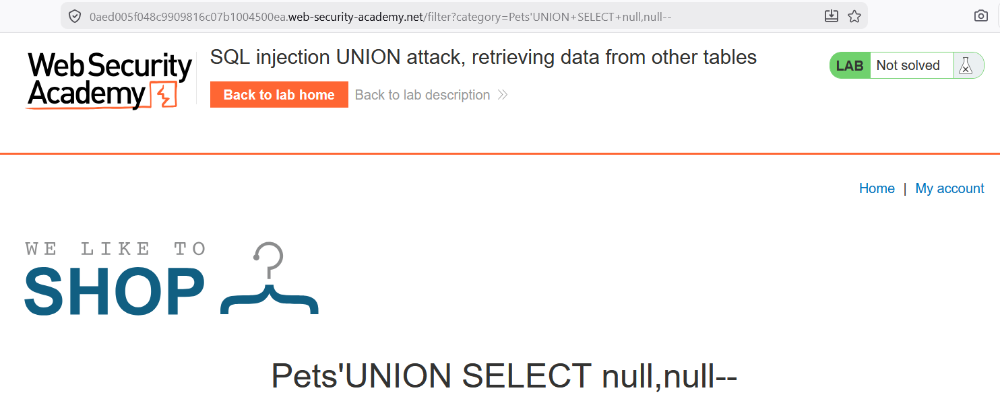

**Bước 2:** Chèn payload để lấy dữ liệu từ bảng `users`, hiển thị trực tiếp `username` và `password` trên trang.

```sql
' UNION SELECT username, password FROM users--
```

Kết quả trả về chứa thông tin tài khoản, bao gồm tài khoản `administrator`.
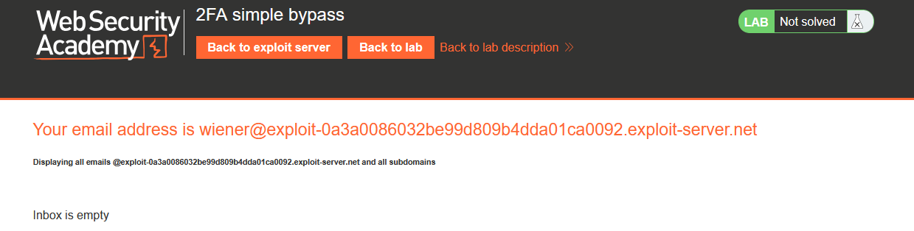

**Bước 3:** Sử dụng thông tin vừa thu được để đăng nhập bằng tài khoản `administrator`.

