## Race Condition

Race condition là một loại lỗ hổng bảo mật phổ biến, có liên quan chặt chẽ đến business logic flaws

Xảy ra khi một website xử lý nhiều request đồng thời nhưng không có các cơ chế bảo vệ thích hợp để đảm bảo dữ liệu được xử lý an toàn.

Khi đó, nhiều luồng thực thi khác nhau có thể cùng lúc tương tác với cùng một dữ liệu, dẫn đến hiện tượng va chạm. Sự va chạm này khiến ứng dụng hoạt động không đúng như mong đợi và tạo ra các hành vi ngoài ý muốn

Một cuộc tấn công Race Condition là việc kẻ tấn công gửi các request được canh thời gian rất chính xác nhằm cố tình tạo ra những va chạm này, từ đó khai thác hành vi bất thường

Khoảng thời gian mà trong đó hiện tượng va chạm có thể xảy ra được gọi là "race window"

Ví dụ, race window có thể chỉ kéo dài một phần nghìn hoặc một phần triệu giây, chẳng hạn như khoảng thời gian giữa hai lần ứng dụng tương tác với cơ sở dữ liệu. Trong khoảng thời gian rất ngắn này, nếu nhiều request cùng truy cập hoặc thay đổi dữ liệu, race condition có thể xảy ra.

### Race Condition kiểu vượt quá giới hạn

Cho phép kẻ tấn công vượt qua một giới hạn nào đó được áp đặt bởi logic nghiệp vụ của ứng dụng

Nói cách khác, ứng dụng đặt ra một quy tắc như:
- Chỉ được dùng mã giảm giá 1 lần.
- Chỉ được đổi quà 1 lần.
- Chỉ được rút tiền tối đa 100 triệu/ngày.
- Chỉ được đăng ký 1 tài khoản bằng một email.

Tuy nhiên, bằng cách gửi nhiều request cùng lúc, kẻ tấn công có thể khiến ứng dụng không kịp cập nhật trạng thái, từ đó vượt qua giới hạn này.

Có rất nhiều biến thể của kiểu tấn công này, bao gồm:
- Đổi cùng một thẻ quà tặng nhiều lần.
- Đánh giá cùng một sản phẩm nhiều lần, mặc dù mỗi tài khoản chỉ được đánh giá một lần.
- Rút hoặc chuyển tiền vượt quá số dư thực tế trong tài khoản.
- Tái sử dụng một mã CAPTCHA duy nhất nhiều lần, mặc dù CAPTCHA chỉ nên có hiệu lực cho một request.
- Vượt qua cơ chế giới hạn tốc độ được thiết kế để chống tấn công brute-force.

Limit overrun là một dạng con của nhóm lỗ hổng được gọi là Time-of-Check to Time-of-Use (TOCTOU).

### Phát hiện và khai thác Limit Overrun Race Condition bằng Burp Repeater

Quá trình phát hiện và khai thác các Limit Overrun Race Condition tương đối đơn giản.

Ở mức tổng quát, chỉ cần thực hiện hai bước:
1. Xác định một endpoint chỉ được phép sử dụng một lần hoặc bị giới hạn số lần thực hiện, đồng thời endpoint này phải có ý nghĩa về mặt bảo mật hoặc mang lại một lợi ích nào đó nếu khai thác thành công.
2. Gửi nhiều request đến endpoint đó trong khoảng thời gian cực ngắn, để kiểm tra xem liệu bạn có thể vượt qua giới hạn mà ứng dụng đặt ra hay không

Thách thức

Khó khăn lớn nhất nằm ở việc canh thời gian của các request.

Mục tiêu là làm sao để ít nhất hai race window trùng lên nhau, từ đó tạo ra một va chạm trong quá trình xử lý của máy chủ

Ngay cả khi bạn cố gắng gửi tất cả các request cùng một thời điểm, trên thực tế vẫn tồn tại rất nhiều yếu tố bên ngoài mà bạn không thể kiểm soát hoặc dự đoán được.

Do đó, dù các request được gửi gần như đồng thời từ phía client, chúng không nhất thiết sẽ được server nhận và xử lý cùng lúc.

Burp sẽ tự động lựa chọn kỹ thuật phù hợp dựa trên phiên bản HTTP mà máy chủ hỗ trợ:
- Đối với HTTP/1, Burp sử dụng kỹ thuật truyền thống gọi là last-byte synchronization.
- Đối với HTTP/2, Burp sử dụng kỹ thuật single-packet attack

Kỹ thuật single-packet attack cho phép loại bỏ gần như hoàn toàn ảnh hưởng của network jitter bằng cách sử dụng một gói tin TCP duy nhất để hoàn thành 20–30 request gần như đồng thời.

Lab 1: Limit overrun race conditions


Đăng nhập vào tài khoản wiener, sau đó thực hiện thêm gift code ta thấy api áp gift code là `/cart/coupon`, đoán race condition diễn ra ở đây. Gửi nhiều request này tới Repeater


Sử dụng Custom actions để gửi nhiều request đi cùng lúc. Sử dụng trigger race condition

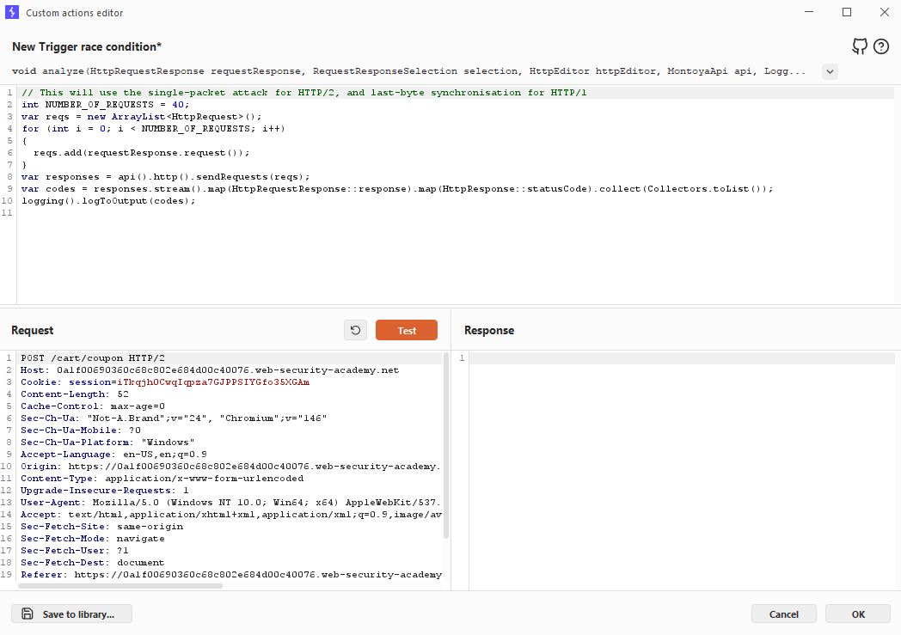

Sau đó play và ta thành công sử dụng nhiều mã giảm giá


Tiến hành play trigger race condition rồi lại gỡ mã giảm giá cho đến khi mã giảm giá giảm số lượng tiền xuống mức mua được


### Phát hiện và khai thác các race condition vượt quá giới hạn bằng Turbo Intruder


Turbo Intruder yêu cầu người dùng có một số kiến thức về Python, nhưng lại rất phù hợp để thực hiện các cuộc tấn công phức tạp hơn, chẳng hạn như:
- Cần thử lại nhiều lần.
- Cần gửi các request với thời điểm lệch nhau
- Cần gửi một số lượng request cực lớn

Để sử dụng kỹ thuật single-packet attack trong Turbo Intruder:
1. Đảm bảo máy chủ mục tiêu hỗ trợ HTTP/2, kỹ thuật single-packet attack không tương thích với HTTP/1.
2. Thiết lập các tùy chọn cấu hình cho Request Engine như sau:
    - engine = Engine.BURP2
    - concurrentConnections = 1
3. Khi đưa các request vào hàng đợi, hãy nhóm chúng lại bằng cách gán cùng một "gate" thông qua tham số gate của phương thức engine.queue()
4. Để gửi đồng thời tất cả các request trong một nhóm, hãy mở gate tương ứng bằng phương thức engine.openGate()

```
def queueRequests(target, wordlists):
    # Khởi tạo Request Engine
    engine = RequestEngine(
        endpoint=target.endpoint,
        concurrentConnections=1,   # Chỉ sử dụng một kết nối HTTP/2
        # Sử dụng engine BURP2 để hỗ trợ single-packet attack
        engine=Engine.BURP2        
    )

    # Đưa 20 request vào hàng đợi thuộc gate có tên '1'
    for i in range(20):
        engine.queue(target.req, gate='1')

    # Mở gate '1' để gửi đồng thời toàn bộ 20 request
    engine.openGate('1')
```

Lab 2: Bypassing rate limits via race conditions

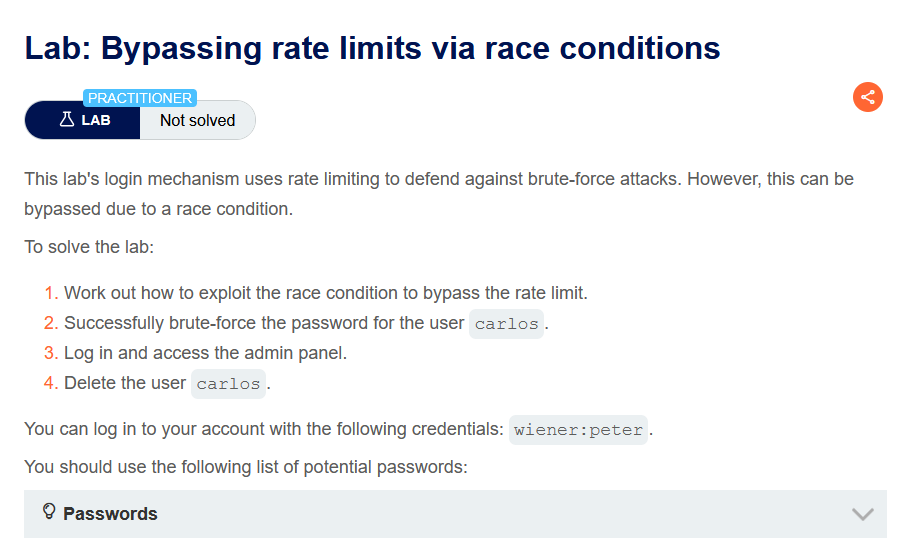

Từ đề bài ta đoán lỗ hổng nằm ở mật khẩu. Đăng nhập bằng carlos với mật khẩu sai và gửi tới Burp Turbo Intruder

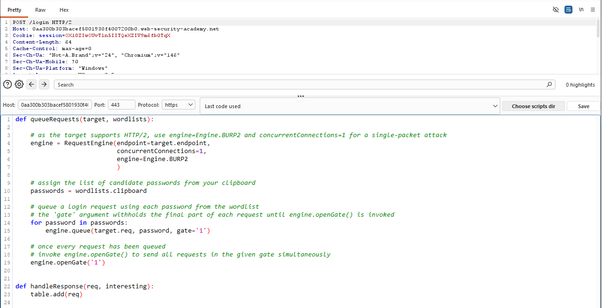

Đổi nội dung payload và copy list mật khẩu sau đó bấm attack


Ta thấy có payload `mustang` với status là 302 ta đoán đây là mật khẩu. Thử đăng nhập để kiểm tra.

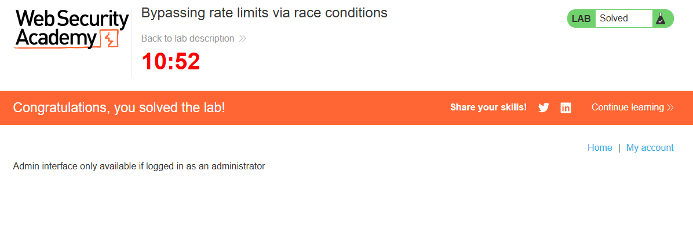

### Phương pháp

Để phát hiện và khai thác các chuỗi nhiều bước bị ẩn, khuyến nghị sử dụng phương pháp dưới đây

`Dự đoán -> Thăm dò -> Chứng minh`

#### Dự đoán các va chạm tiềm năng

Việc kiểm thử mọi endpoint là không thực tế. Sau khi đã lập bản đồ website mục tiêu như bình thường, bạn có thể giảm số lượng endpoint cần kiểm thử bằng cách tự đặt ra các câu hỏi sau:
- Endpoint này có quan trọng về mặt bảo mật không?
- Endpoint này có khả năng xảy ra va chạm không? Để xảy ra một va chạm thành công, thông thường bạn cần hai hoặc nhiều request cùng kích hoạt các thao tác trên cùng một bản ghi.

#### Thăm dò để tìm manh mối

Để nhận ra các dấu hiệu bất thường, trước tiên cần xác định cách endpoint hoạt động trong điều kiện bình thường.

Có thể thực hiện việc này trong Burp Repeater bằng cách nhóm tất cả các request lại và sử dụng tùy chọn: `Send group in sequence`

Tiếp theo, hãy gửi chính nhóm request đó đồng thời bằng kỹ thuật single-packet attack (hoặc last-byte sync nếu máy chủ không hỗ trợ HTTP/2) nhằm giảm thiểu ảnh hưởng của network jitter (độ trễ dao động trên mạng).

Trong Burp Repeater, bạn có thể thực hiện bằng cách chọn: `Send group in parallel`

Ngoài ra, cũng có thể sử dụng tiện ích mở rộng Turbo Intruder

Bất kỳ điều gì cũng có thể là một manh mối. Điều này bao gồm:
- sự thay đổi ở một hoặc nhiều response,
- nhưng đừng quên các second-order effects (tác động gián tiếp xuất hiện sau đó), chẳng hạn như:
    - nội dung email được gửi đi khác bình thường,
    - hành vi của ứng dụng thay đổi rõ rệt sau khi các request được xử lý.

#### Chứng minh ý tưởng

Hãy cố gắng hiểu chính xác những gì đang xảy ra. Sau đó:
- Loại bỏ những request không cần thiết
- Kiểm tra xem bạn vẫn có thể tái tạo được hiệu ứng đó hay không.

Các race condition nâng cao có thể tạo ra những primitive (khả năng khai thác cơ bản) rất đặc biệt và khác thường. Vì vậy, con đường để đạt được mức ảnh hưởng lớn nhất thường không phải lúc nào cũng rõ ràng ngay từ đầu.

### Race condition giữa nhiều endpoint

Có lẽ dạng race condition dễ hình dung nhất là những race condition xảy ra khi gửi đồng thời các request tới nhiều endpoint khác nhau. Hãy nghĩ đến lỗi logic kinh điển trên các cửa hàng trực tuyến: Bạn thêm một món hàng vào giỏ hàng, thanh toán cho món hàng đó, sau đó thêm nhiều món khác vào giỏ trước khi truy cập trực tiếp đến trang xác nhận đơn hàng.

Một biến thể của lỗ hổng này có thể xảy ra khi việc xác thực thanh toán và xác nhận đơn hàng đều được thực hiện trong quá trình xử lý của cùng một request.

Trong trường hợp này, bạn có thể thêm nhiều sản phẩm hơn vào giỏ hàng trong khoảng thời gian race window — tức là khoảng thời gian sau khi hệ thống đã xác thực việc thanh toán nhưng trước khi đơn hàng được xác nhận hoàn toàn.

#### Căn chỉnh các race window giữa nhiều endpoint

Khi kiểm thử điều kiện race condition giữa nhiều endpoint, có thể gặp khó khăn trong việc căn chỉnh các "cửa sổ race" của từng request, ngay cả khi gửi tất cả chúng đúng cùng một thời điểm bằng kỹ thuật single-packet.

Vấn đề phổ biến này chủ yếu xuất phát từ hai nguyên nhân sau:
- Độ trễ do kiến trúc mạng gây ra – Ví dụ, có thể xuất hiện độ trễ mỗi khi máy chủ front-end thiết lập một kết nối mới đến máy chủ back-end. Giao thức được sử dụng cũng có thể ảnh hưởng rất lớn đến độ trễ này.
- Độ trễ do quá trình xử lý riêng của từng endpoint gây ra – Mỗi endpoint vốn có thời gian xử lý khác nhau, đôi khi chênh lệch đáng kể, tùy thuộc vào các thao tác mà endpoint đó kích hoạt.

##### Làm nóng kết nối

Độ trễ khi thiết lập kết nối tới back-end thường không gây ảnh hưởng đến các cuộc tấn công race condition, vì chúng thường làm chậm tất cả các request song song một cách như nhau, nên các request vẫn được đồng bộ với nhau.

Điều quan trọng là phải phân biệt những độ trễ này với các độ trễ do quá trình xử lý riêng của từng endpoint gây ra.

Một cách để làm điều đó là "làm nóng" kết nối bằng cách gửi một hoặc nhiều request không quan trọng, rồi quan sát xem liệu điều này có làm cho thời gian xử lý của các request còn lại trở nên ổn định hơn hay không.

Trong Burp Repeater, có thể thử:
- Thêm một request GET đến trang chủ vào đầu tab group.
- Sau đó sử dụng tùy chọn Send group in sequence (single connection) để gửi toàn bộ nhóm request theo thứ tự trên cùng một kết nối.

Nếu request đầu tiên vẫn có thời gian xử lý lâu hơn, nhưng các request còn lại đều được xử lý trong một khoảng thời gian rất ngắn, thì có thể bỏ qua độ trễ có vẻ như tồn tại đó, vì nó chỉ là chi phí ban đầu của việc thiết lập kết nối, và tiếp tục kiểm thử như bình thường.

Lab 3*: Multi-endpoint race conditions

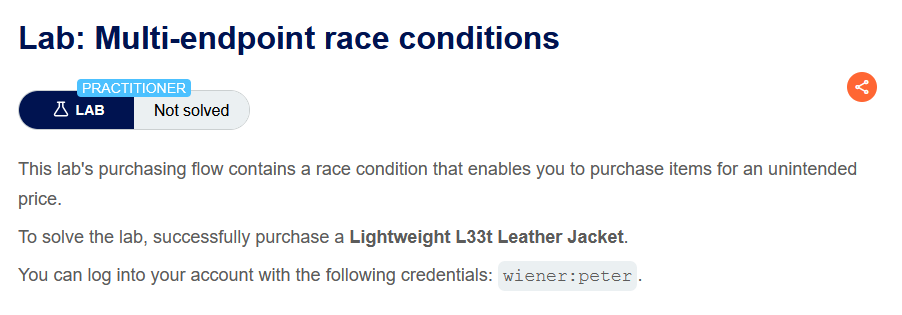

Thực hiện luồng mua gift card, ta bắt 2 request thêm sản phẩm vào giỏ và thực hiện check out.

Sửa request thêm gift card thành id của jacket

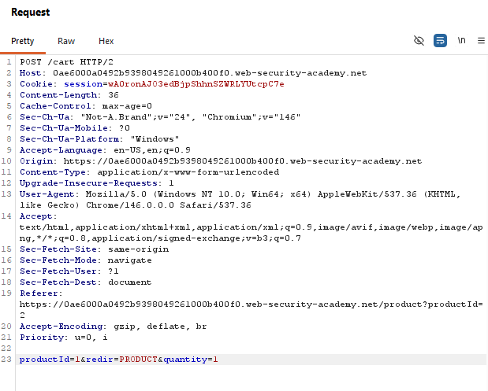

Gửi request check out tới Repeater, đồng thời gửi request thêm gift card đến Repeater. Nhóm 3 request này thành 1 nhóm rồi chọn `Send group in parellel (single-packet attack)`. Mục đích là để hai request đến server gần như cùng lúc nhất có thể.

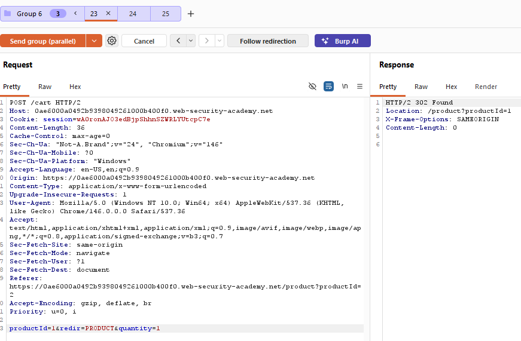

Lúc này bài lab được hoàn thành

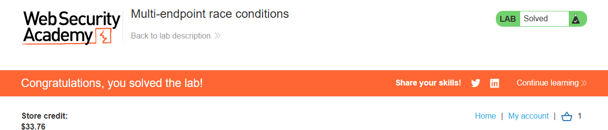

### Race condition trên một endpoint

Việc gửi nhiều request song song với các giá trị khác nhau đến cùng một endpoint đôi khi có thể kích hoạt những lỗ hổng race condition rất nghiêm trọng.

Hãy xem xét một cơ chế đặt lại mật khẩu, trong đó ID người dùng và mã token đặt lại mật khẩu được lưu trong session của người dùng.

Trong trường hợp này, nếu gửi hai request đặt lại mật khẩu đồng thời từ cùng một session, nhưng với hai username khác nhau, thì có thể xảy ra va chạm

Sau khi tất cả các thao tác hoàn tất, trạng thái cuối cùng có thể là:
- session['reset-user'] = victim
- session['reset-token'] = 1234

Lúc này, session đang chứa ID của nạn nhân, nhưng token đặt lại mật khẩu hợp lệ lại được gửi đến kẻ tấn công

Các chức năng xác nhận địa chỉ email, hoặc nói chung là mọi thao tác dựa trên email, thường là mục tiêu rất phù hợp để khai thác single-endpoint race condition.

Nguyên nhân là do email thường được gửi trong một luồng nền sau khi server đã trả HTTP response cho client, khiến khả năng xảy ra race condition cao hơn.

Lab 4: Single-endpoint race conditions

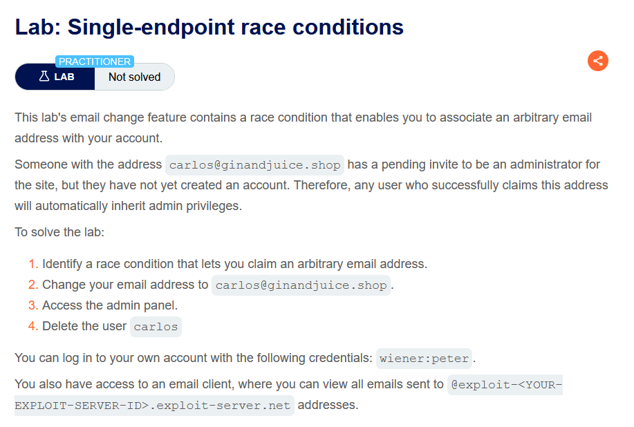

Đăng nhập vào tài khoản wiener, thực hiện luồng update email. Sau đó bắt các request `POST /my-account/change-email` gửi đến Repeater. Tạo 2 tab với request trên trong Repeater. Với tab 1 nội dung email đổi thành `carlos@ginandjuice.shop` và tab 2 email giữ nguyên. Chọn gửi 2 request cùng lúc

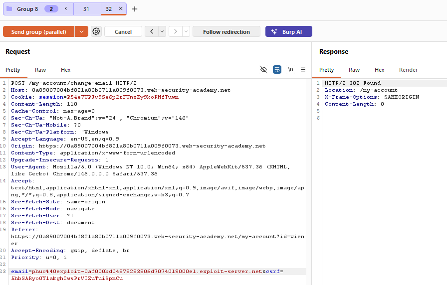

Truy cập vào email clinet ta thấy đường link cập nhật email carlos đã hiện, bấm xác nhận

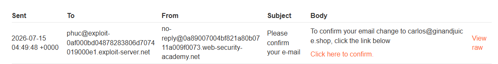

Sau khi xác nhận, tài khoản wiener đã truy cập thành công vào trang admin, tiến hành xóa carlos để solve bài lab

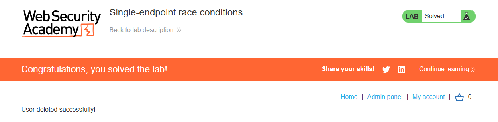

### Cơ chế khóa dựa trên session

Một số framework cố gắng ngăn chặn việc dữ liệu vô tình bị hỏng bằng cách sử dụng một dạng khóa request. Ví dụ, module xử lý session gốc của PHP chỉ xử lý một request cho mỗi session tại một thời điểm.

Điều cực kỳ quan trọng là phải nhận ra loại hành vi này, vì nếu không, nó có thể che giấu những lỗ hổng vốn rất dễ khai thác.

Nếu nhận thấy rằng tất cả các request của mình đều đang được xử lý tuần tự, hãy thử gửi mỗi request bằng một session token khác nhau.

### Race condition do đối tượng được tạo chưa hoàn chỉnh

Nhiều ứng dụng tạo đối tượng qua nhiều bước, điều này có thể tạo ra một trạng thái trung gian tạm thời, trong đó đối tượng có thể bị khai thác.

Ví dụ, khi đăng ký một người dùng mới, ứng dụng có thể tạo người dùng trong cơ sở dữ liệu và thiết lập API key của họ bằng hai câu lệnh SQL riêng biệt. Điều này tạo ra một khoảng thời gian rất ngắn mà trong đó người dùng đã tồn tại, nhưng API key của họ vẫn chưa được khởi tạo.

Kiểu hành vi này tạo điều kiện cho các cuộc tấn công, trong đó chèn một giá trị đầu vào trả về một giá trị khớp với giá trị chưa được khởi tạo trong cơ sở dữ liệu, chẳng hạn như chuỗi rỗng ("") hoặc null trong JSON, và giá trị này được đem ra so sánh như một phần của cơ chế kiểm soát bảo mật.

Các framework thường cho phép bạn truyền mảng và các cấu trúc dữ liệu không phải chuỗi khác bằng cú pháp không chuẩn. Ví dụ, trong PHP:
- param[]=foo tương đương với param = ['foo']
- param[]=foo&param[]=bar tương đương với param = ['foo', 'bar']
- param[] tương đương với param = []

Ruby on Rails cũng cho phép làm điều tương tự bằng cách cung cấp một query parameter hoặc POST parameter có key nhưng không có value. Nói cách khác, param[key] sẽ tạo ra đối tượng phía server như sau:
- params = {"param"=>{"key"=>nil}}

Trong ví dụ ở trên, điều này có nghĩa là trong khoảng thời gian race window, bạn có khả năng thực hiện các request API đã được xác thực như sau:
```
GET /api/user/info?user=victim&api-key[]= HTTP/2
Host: vulnerable-website.com
```

Lưu ý: Cũng có thể tạo ra các partial construction collision tương tự với mật khẩu thay vì API key. Tuy nhiên, vì mật khẩu được băm, nên cần chèn một giá trị khiến giá trị băm khớp với giá trị chưa được khởi tạo.

### Các cuộc tấn công nhạy cảm với thời gian

Đôi khi bạn không tìm thấy race condition, nhưng các kỹ thuật gửi request với thời điểm chính xác vẫn có thể giúp phát hiện sự tồn tại của những lỗ hổng khác.

Một ví dụ điển hình là khi dấu thời gian có độ phân giải cao được sử dụng thay cho các chuỗi ngẫu nhiên an toàn về mặt mật mã để tạo security token.

Hãy xem xét một token đặt lại mật khẩu chỉ được tạo ngẫu nhiên dựa trên timestamp. Trong trường hợp này, có thể sẽ kích hoạt hai yêu cầu đặt lại mật khẩu cho hai người dùng khác nhau, và cả hai đều nhận được cùng một token.

Tất cả những gì cần làm là căn thời điểm gửi các request sao cho chúng tạo ra cùng một timestamp.

Lab 5: Exploiting time-sensitive vulnerabilities

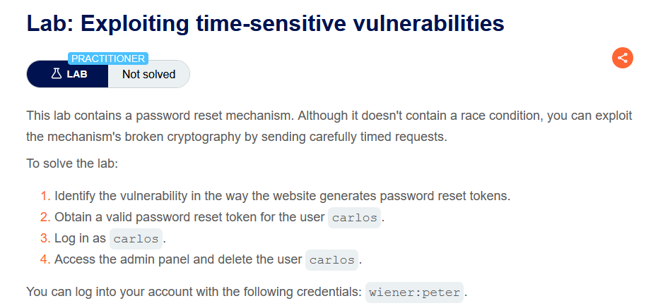

Thực hiện chức năng đổi mật khẩu cho account wiener, gửi các request `GET /forgot-password`, `POST /forgot-password` và request đổi mật `GET /forgot-password?user=wiener&token=8b8085014537b1f0fe6517f48289eba79f38e686` đến Repeater. 

Gửi request `GET /forgot-password` lấy csrf và phpsessionid

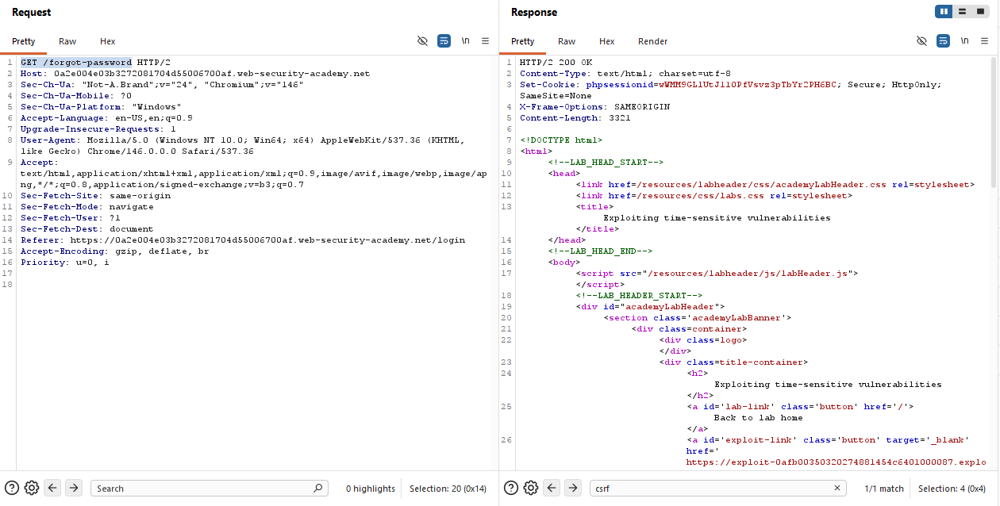

Tạo thêm 1 tab trong Repeater của request `POST /forgot-password` sau đó nhóm 2 tab với nhau, ta thấy đồng thời 2 request yêu cầu đổi mật khẩu được gửi đến cùng lúc

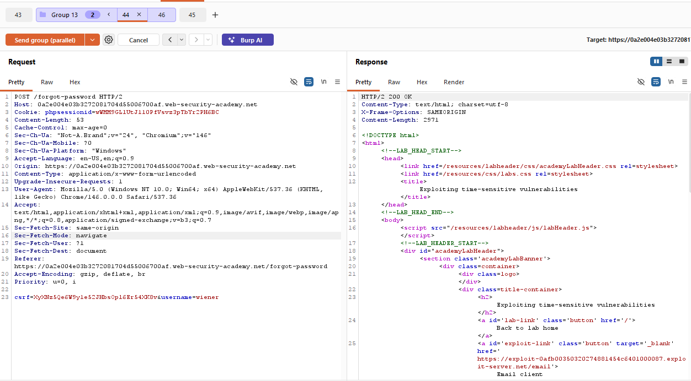
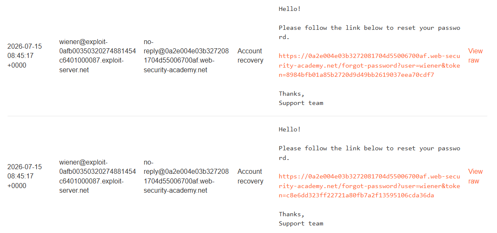

Trên 1 tab trong group đó sửa thành carlos và gửi 

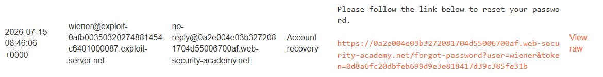

Lấy token ở phần cuối URL và thay vào vị trí tại request `POST /forgot-password?user=carlos&token=8b8085014537b1f0fe6517f48289eba79f38e686`. CSRF và phpsessionid lấy trong request `POST /forgot-password` với username là carlos , username thay thành carlos

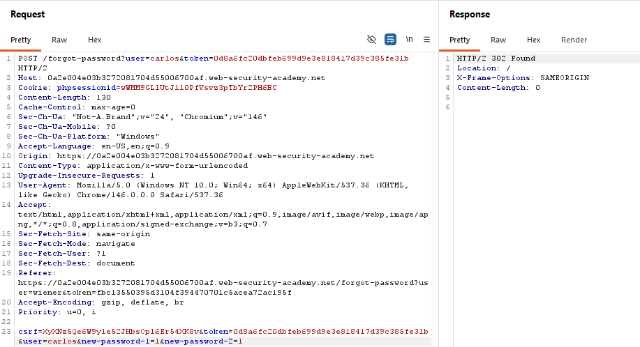

Tức là ta đã đổi thành công mật khẩu của carlos, đăng nhập và tiến hành xóa carlos

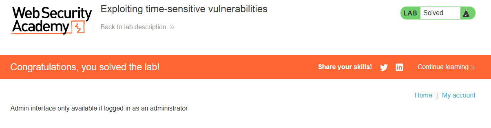